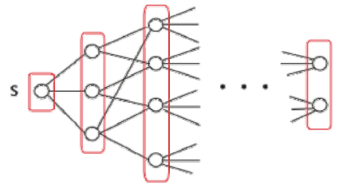

# 广度优先搜索

## 1 概述

### 特点
广度优先搜索（BFS：Breadth-First Search）是一种图搜索策略，其将搜索限制到 2 种操作：
* 访问图中的一个节点；
* 访问该节点的邻居节点；

### 过程

广度优先搜索（BFS）由 Edward F. Moore 在 1950 年发表，起初被用于在迷宫中寻找最短路径。在 Prim 最小生成树算法和 Dijkstra 单源最短路径算法中，都采用了与广度优先搜索类似的思想。

对图的广度优先搜索与对树（Tree）的广度优先遍历（Breadth First Traversal）是类似的，区别在于图中可能存在环，所以可能会遍历到已经遍历的节点。BFD 算法首先会发现和源顶点 s 距离边数为 k 的所有顶点，然后才会发现和 s 距离边数为 k+1 的其他顶点。



### 例子
例如，下面的图中，从顶点 2 开始遍历，当遍历到顶点 0 时，邻接的顶点为 1 和 2，而顶点 2 已经遍历过，如果不做标记，遍历过程将陷入死循环。所以，在 BFS 的算法实现中需要对顶点是否访问过做标记。


上图的 BFS 遍历结果为 [ 2, 0, 3, 1 ]。

### 实现
BFS 算法的实现通常使用队列（Queue）数据结构来存储遍历图中节点的中间状态，过程如下：
1. 将 root 节点 Enqueue；
2. Dequeue 一个节点，并检查该节点：
    * 如果该节点就是要找的目标节点，则结束遍历，返回结果 "Found"；
    * 否则，Enqueue 所有直接后继子节点（如果节点未被访问过）；
3. 如果 Queue 为空，并且图中的所有节点都被检查过，仍未找到目标节点，则结束搜索，返回结果 "Not Found"；
4. 如果 Queue 不为空，重复步骤 2；


如果需要记录搜索的轨迹，可以为顶点着色。起初所有顶点为白色，随着搜索的进行变为灰色，然后变成黑色。灰色和黑色顶点都是已发现的顶点。
### 时间复杂度
广度优先搜索（BFS）的时间复杂度为 O(V+E)，V 即 Vertex 顶点数量，E 即 Edge 边数量。
### BFS算法伪码
```
 1 procedure BFS(G,v) is
 2     create a queue Q
 3     create a set V
 4     add v to V
 5     enqueue v onto Q
 6     while Q is not empty loop
 7        t = Q.dequeue()
 8        if t is what we are looking for then
 9           return t
10        end if
11        for all edges e in G.adjacentEdges(t) loop
12           u = G.adjacentVertex(t,e)
13           if u is not in V then
14               add u to V
15               enqueue u onto Q
16           end if
17        end loop
18     end loop
19     return none
20 end BFS
```


### BFS算法代码
```
  1 using System;
  2 using System.Collections.Generic;
  3 
  4 namespace GraphAlgorithmTesting
  5 {
  6   class Program
  7   {
  8     static void Main(string[] args)
  9     {
 10       Graph g = new Graph(4);
 11       g.AddEdge(0, 1);
 12       g.AddEdge(0, 2);
 13       g.AddEdge(1, 2);
 14       g.AddEdge(2, 0);
 15       g.AddEdge(2, 3);
 16       g.AddEdge(3, 3);
 17 
 18       List<int> traversal = g.BFS(2);
 19       foreach (var vertex in traversal)
 20       {
 21         Console.WriteLine(vertex);
 22       }
 23 
 24       Console.ReadKey();
 25     }
 26 
 27     class Edge
 28     {
 29       public Edge(int begin, int end)
 30       {
 31         this.Begin = begin;
 32         this.End = end;
 33       }
 34 
 35       public int Begin { get; private set; }
 36       public int End { get; private set; }
 37     }
 38 
 39     class Graph
 40     {
 41       private Dictionary<int, List<Edge>> _adjacentEdges
 42         = new Dictionary<int, List<Edge>>();
 43 
 44       public Graph(int vertexCount)
 45       {
 46         this.VertexCount = vertexCount;
 47       }
 48 
 49       public int VertexCount { get; private set; }
 50 
 51       public void AddEdge(int begin, int end)
 52       {
 53         if (!_adjacentEdges.ContainsKey(begin))
 54         {
 55           var edges = new List<Edge>();
 56           _adjacentEdges.Add(begin, edges);
 57         }
 58 
 59         _adjacentEdges[begin].Add(new Edge(begin, end));
 60       }
 61 
 62       public List<int> BFS(int start)
 63       {
 64         List<int> traversal = new List<int>();
 65         int current = start;
 66 
 67         // mark all the vertices as not visited
 68         bool[] visited = new bool[VertexCount];
 69         for (int i = 0; i < VertexCount; i++)
 70         {
 71           visited[i] = false;
 72         }
 73 
 74         // create a queue for BFS
 75         Queue<int> queue = new Queue<int>();
 76 
 77         // mark the current node as visited and enqueue it
 78         visited[current] = true;
 79         queue.Enqueue(current);
 80 
 81         while (queue.Count > 0)
 82         {
 83           current = queue.Dequeue();
 84 
 85           // if this is what we are looking for
 86           traversal.Add(current);
 87 
 88           // get all adjacent vertices of the dequeued vertex,
 89           // if a adjacent has not been visited, 
 90           // then mark it visited and enqueue it
 91           if (_adjacentEdges.ContainsKey(current))
 92           {
 93             foreach (var edge in _adjacentEdges[current])
 94             {
 95               if (!visited[edge.End])
 96               {
 97                 visited[edge.End] = true;
 98                 queue.Enqueue(edge.End);
 99               }
100             }
101           }
102         }
103 
104         return traversal;
105       }
106     }
107   }
108 }
```