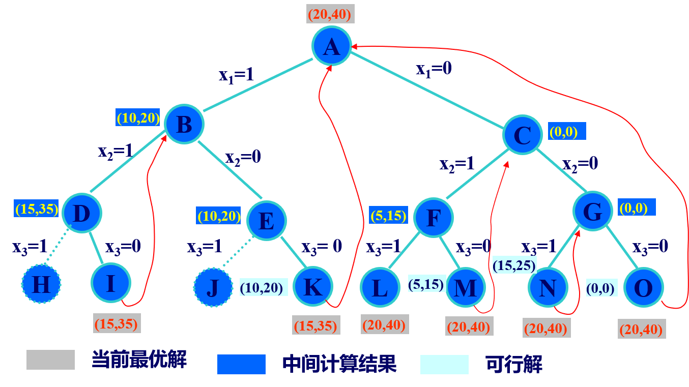

# 01背包问题

## 1 01背包问题-回溯法

### 问题描述
将物品放到背包中。 
* n件物品
* 每件物品的重量为w[i]
* 价值为v[i]
* m个背包
* 每个背包的容量为c[j]

求背包装载的最大价值。或者是否能装下所有。

具体问题n=3，C=20，(v1,v2,v3)=(20,15,25)， (w1,w2,w3)=(10,5,15)，求X=(x1,x2,x3)使背包价值最大？
### 问题分析

* 解空间是子集树
* 可行性约束函数（剪枝函数）$\sum w_ix_i\leq c_i$

### 算法原理

### 算法实现
```
template<class Typew, class Typep>
Typep Knap<Typew, Typep>::Bound(int i)
{// 计算上界
   Typew cleft = c - cw;  // 剩余容量
   Typep b = cp;
   // 以物品单位重量价值递减序装入物品
   while (i <= n && w[i] <= cleft) {
      cleft -= w[i];
      b += p[i];
      i++;
      }
   // 装满背包
   if (i <= n) b += p[i]/w[i] * cleft;
   return b;
}
```

## 2 01背包问题-分支限界

### 问题描述
0-1背包问题： （分析队列式与优先队列式过程）
n=3, C=30, w={16, 15, 15}, v={45, 25, 25}

### 问题分析

### 算法原理

### 算法实现