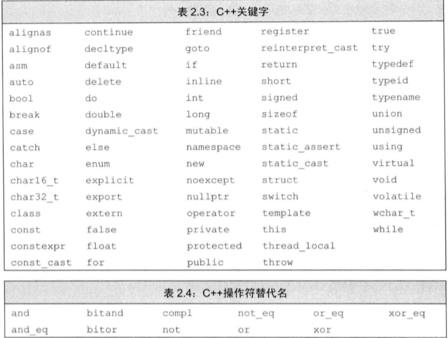

# 变量和基本类型

## 1基本内置类型

### 算术类型

* 布尔型
bool 1  

* 字符型  
char 1  
wchar_t 2  
char16_t  
char32_t  

* 整型  
short 2  
int 4  
long 4  
long long 8  

* 浮点型  
float 4  
double 8  
long double 16  

### 类型修饰符-signed与unsigned
> 常见的类型修饰符：signed、unsigned、long、short、const、static、extern、auto、register、mutable、thread_local、volatile、restrict

* signed 有符号
* unsigned 无符号


### 类型转换
* 强制类型转换  
  可能会丢失精度。
* 隐式类型转换  
  默认情况下会向上转换，即向位数更多的位置转换。
* 避免无符号和有符号的混用。带符号的数会自动转换成无符号的数。

### 字面值常量

* 整型字面常量
  不同进制指的是字面格式，其转化为存储格式时，都会变成二进制存储。不必担心十进制与二进制之间的运算。字面常量只是一种数字的表示方法。24，,024，,0x24。会自动选用尺寸最小的整型进行存储；负号是对字面值取相反数，不是字面值的一部分。
* 浮点型字面值常量
  默认情况下使用double存储。3.14,3.14E0,10e4
* 字符和字符串的字面常量
  'a'"adbd"字符串的字面值是由字符数组构成的。编译器会在每个字符串常量的末尾添加一个'\0'
* 转义序列
  \n\t\a\v\\\b\"\?\'\r\f  
  \7\0\12\115
* 可以指定字面值常量的类型。字面值会有默认的常量类型。
  常见前缀u（Unicode 16）U（unicode32） L（宽字符） u8（utf-8）
  常见后缀u/U（unsigned）,l/L（long）,ll/LL（longlong）,f/F（float）,

* bool字面值：false，true
* 指针字面值：nullptr

## 2 变量

> 关于C++中常见的描述总结：对象object，存储数据并具有某种类型的内存空间。已经命名的对象叫变量。变量和对象通常通用。值表示只读的数据。变量和对象是可变的数据。

### 变量定义
* 类型说明符+名称+初始化。
* 初始值：可以直接初始化、复制初始化。不等同于赋值。
* 直接初始化：使用=进行初始化。
* 列表初始化：使用{}进行初始化。
* 默认初始化：变量没有被显示初始化。

### 初始化和赋值
* 初始化和赋值是两个不同点操作。使用等号能够表示赋值，也能够实现初始化。
```
    int d = 1;//直接初始化
    int e = {2};//直接初始化
    int f{3};//花括号列表初始化
    int g(4);//括号列表，列表初始化
```

### 变量的声明和定义。
* 分离式编译机制：声明和定义可以分离。声明使得程序可以被程序所知道，定义负责创建与名字关联的实体（变量空间）。多个文件可以独立编译。声明并没有申请对象空间（变量空间）。
* extern可以声明，而不进行定义。变量可以被声明很多次，但只能被定义一次。不能再函数体中对extern声明的变量进行修改，extern声明的变量只能是外部变量。
* 多次声明必须兼容，类型一致。
```
extern int i;//声明，但没有申请对象空间。
int j;//声明并定义了，申请了兑现该控件
```

### 静态类型语言
* 编译阶段，进行类型检查。

### 标识符与关键字。


### 作用域
* 名字在所有花括号之外，则成为全局作用域。
* 名字在其他作用与内，则成为块作用域。
* 内层作用域，外层作用域。

## 3 复合类型

### 引用

* int &ref=a.表示对a的引用。引用本身并非对象，只是已经存在的对象的别名
* 引用必须在定义的时候被初始化。
* 引用是变量的别名，具有同一个变量地址（变量空间）。
* 允许多个连续的引用
  int &r=i,r2=i2.表示r是i的引用，但r2是int
* 连续定义必须都加引用符号。
  int &r=i,&r2=i2;
> 编译过程解释：一般初始化的时候（变量定义），编译器会将一个值拷贝到新建的变量空间中，然后与变量绑定。引用变量在初始化的时候，不进行拷贝，而是将原来的变量空间与新的对象绑定在一起。


### 指针
* 实现了间接访问。本身是一个对象。与引用不同，指针有自己的变量空间。
* 允许对指针进行复制和copy。
* int* dp,dp1.其中dp是int指针，dp1是int类型。
* 不能定义指向引用的指针，因为引用不是对象，没有内存空间。
* 连续定义，必须都加*号
### 指针值的四种状态
* 指向一个对象；
* 指向紧邻对象所占空间的下一个位置；
* 空指针意味着指针没有指向任何对象；
* 无效指针，指针指向的位置被释放。

### 指针访问
* 利用指针运算符访问指针指向的对象（*p）
* 空指针的生成方法
```
int *p1 = nullptr;
```
### void*
* 可以存放任意对象的地址。

### 复合类型的声明

int *p1,p2;
p1是指向int的指针，p2是int类型的。

### 指向指针的指针

int i=0;
int *p1=&i;
int **p2 = &p1

