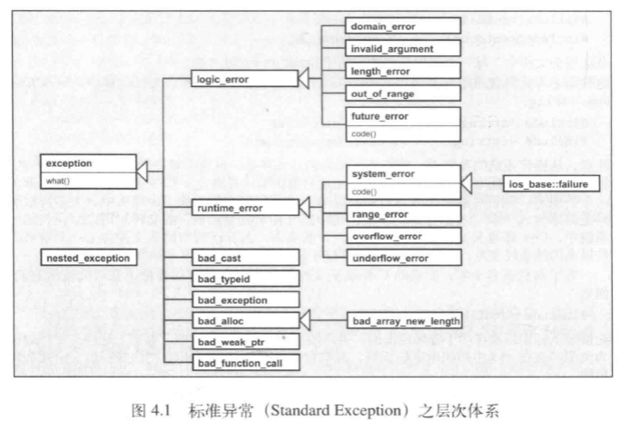

> 参考文献
> * 《C++标准库》
> * 《C++Primer》
> * 《C++ STL使用例子大全》

## 1 C++ 语言新特性

### nullptr

* 取代NULL。用于防止0指针出现的歧义

### auto自动完成类型推导

### 一致性初始化与初值列表

* 可以使用大括号，完成所有的初始化。

### 范围for循环

### constexpr常量表达式

### Template特性

### Lambda表达式

* 没有参数和返回值的lambda表达式
```C++
auto l=[]{
    cout<<"hello world"<<endl;
}
```
* lambda表达式的定义完成后直接调用
```C++
[]{ cout<<"helloworld"<<endl;}();
```
* 有参数的lambda表达式
```
auto l = [](int a,int b){cout<<a+b<<endl;};
```
* 有返回值的lambda表达式

```
auto l = [](int m,int n)->int{cout<<m+n<<endl;return m+n;};
```

### decltype关键字

* 让编译器找出表达式的类型。

```
decltype(x+y)
```
### 新的函数声明方法

* 使用参数列表后的箭头声明返回值的类型。与lambda表达式一致。
```
template<typename T1,typename T2>
decltype(x+y) add(T1 x,T2 y);

template<typename T1,typename T2>
auto add(T1 x,T2 y)->decltype(x+y);
```

### 新的基础类型

* char16_t,char32_t
* long long usigned long long 
* std::nullptr_t

## 2 一般概念

### 2.1 命名空间

使用方法

* 直接指定标识符

```
std::cout<<10<<endl;
```
* 使用using declaration声明

```
using std::cout;
using std::endl;
cout<<10<<endl;
```
* 使用using directive。复杂的代码中容易导致冲突

```
using namespace std;
cout<<hex<<3.4<<endl;
```

### 2.2 头文件

```
#include<iostream>
#include<string>
```
### 2.3 错误和异常处理

* 标准错误和异常如下：



### 2.4 可被调用的对象

callable object。后边可以使用调用运算符()。
* 一个函数。接受额外传入的args作为实参argument
* 一个指向成员函数的指针。
* 一个函数对象。（function object，重载了调用运算符operator()）
* 一个lambda表达式

### 2.5 并发与多线程

### 2.6 分配器Allocator