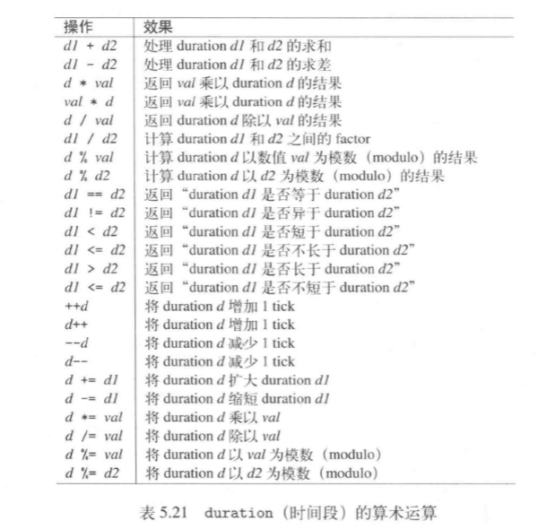
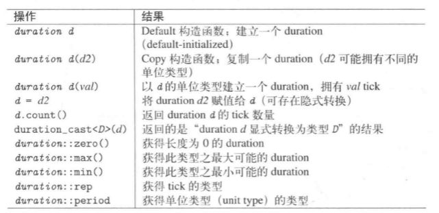

# 通用工具

> 目录
> * pair和tuple
> * 智能指针
> * 数值极值
> * type trait 和type utility
> * 辅助函数
> * clock和timer
> * bitset
> * 随机数


## 1 pair和Tuple

## 1.1 pair
### 头文件
```
#include<utility>
```
### pair定义


### pair操作


## 1.2 tuple
### 头文件
```
#include<tuple>
```
### 定义
* 扩展pair的概念，拥有任意数量的元素。是一个异质的元素序列。


### 操作


```
tuple<int,float,string> t1{2,3.4,"yin"};
get<1>(t1);//获取t1的第一个元素
make_tuple(22,44,"helo");//元素类型自动推导
```


## 2 smart pointer 智能指针
## 3 极值

### 头文件
```
#include<limits>
```


### 使用

```
#include<limits>

using namespace std;

int main(){
    cout<<numeric_limits<short>::max()<<endl;//输出short类型最大值
}
```

## 4 type trait和type utility

## 5 辅助函数

### 最大最小值
```
#include<algorithm>
```


### 交换
```
#include<utility>
```


## 6 class ratio编译期分数

## 7 Clock和Timer

## 7.1 Chrono概览
> 相关术语：duration,timepoint,tick,epoch,lock,timer,date,time。chrono目标处理timer和clock在不同系统中更可能不同的问题。强化实践的精准度。

### 头文件

```
#include<chrono>//额外的是艰苦
```

### 术语
* epoch表示世界的起始点
* duration时间段，某个时间单位上，tick数。
* timepoint时间点，duration和epoch（起始点）的组合。
* clock时钟，每个时钟都有自己的epoch、duration和timepoint（起始点——）

## 7.2 Duration时间段

### duration定义的时间单位
* duraton由一个数值和ratio（时间比例）共同组成。

```
// 时间单位*计数数量=持续时间
ratio * tick =duration
```
```
//自定义时间单位
std::chrono::duration<double,std::ratio<60>>

//定义好的时间单位
nanoseconds;
microseconds;
milliseconds;
seconds;
minutes;
hours;
//这些都是可以使用的duration常量

hours aDay(24);//表示一天的duration
```

### 算数运算
* 赋值初始化可以使得它在不同的时间单位之间，快速转换。


### 其他操作




## 7.3 Clock和Timepoint

### 定义
* Clock定义了一个epoch和一个tick周期。用来表示时间的起点和时间的计数方式。一个利用duration、epoch、timepoint计时的工具。

* Timepoint某个特定的时间点。

### Clock时钟


### 系统提供了三个clock

1. system_clock。timepoint关联值现行的系统的及时时钟。包含函数to_time_t(),from_time_t()。可以与C的time_t进行转换
2. steady_clock。稳定前进
3. high_resolution_clock 带有最短tick周期的clock。

<!-- 过于复杂，不学了，干 -->
## 7.4 C、POSIX

### 头文件
```
#include<ctime>
```
### 概述

* 有四个与时间相关的类型：clock_t、time_t、size_t 和 tm。类型 clock_t、size_t 和 time_t 能够把系统时间和日期表示为某种整数。

* 结构类型 tm 把日期和时间以 C 结构的形式保存，tm 结构的定义如下：
```
struct tm {
  int tm_sec;   // 秒，正常范围从 0 到 59，但允许至 61
  int tm_min;   // 分，范围从 0 到 59
  int tm_hour;  // 小时，范围从 0 到 23
  int tm_mday;  // 一月中的第几天，范围从 1 到 31
  int tm_mon;   // 月，范围从 0 到 11
  int tm_year;  // 自 1900 年起的年数
  int tm_wday;  // 一周中的第几天，范围从 0 到 6，从星期日算起
  int tm_yday;  // 一年中的第几天，范围从 0 到 365，从 1 月 1 日算起
  int tm_isdst; // 夏令时
};
```
### 常用操作


### 常用函数
| 生成时间 | 函数 & 描述 |
|---|---|
| `clock_t clock(void)`| ;该函数返回程序执行起（一般为程序的开头），处理器时钟所使用的时间。如果时间不可用，则返回 -1。 |
| `time_t time(time_t *time)` | ;该函数返回系统的当前日历时间，自 1970 年 1 月 1 日以来经过的秒数。如果系统没有时间，则返回 -1。 |

| 格式转换 | 函数 & 描述 |
|---|---|
| `char *ctime(const time_t *time)` | ;该返回一个表示当地时间的字符串指针，字符串形式 day month year hours:minutes:seconds year\n\0。 |
| `struct tm *localtime(const time_t *time)**` | ;该函数返回一个指向表示本地时间的 tm 结构的指针。 |
| `char * asctime ( const struct tm * time )` | ;该函数返回一个指向字符串的指针，字符串包含了 time 所指向结构中存储的信息，返回形式为：day month date hours:minutes:seconds year\n\0。 |
| `struct tm *gmtime(const time_t *time)` | ;该函数返回一个指向 time 的指针，time 为 tm 结构，用协调世界时（UTC）也被称为格林尼治标准时间（GMT）表示。 |
| `time_t mktime(struct tm *time)` | ;该函数返回日历时间，相当于 time 所指向结构中存储的时间。 |
| `double difftime ( time_t time2, time_t time1 )` | ;该函数返回 time1 和 time2 之间相差的秒数。 |
| `size_t strftime()` | ;该函数可用于格式化日期和时间为指定的格式。 |

### 获取当前时间

```C++
#include <iostream>
#include <ctime>
 
using namespace std;
 
int main( )
{
   // 基于当前系统的当前日期/时间
   time_t now = time(0);
   
   // 把 now 转换为字符串形式
   char* dt = ctime(&now);
 
   cout << "本地日期和时间：" << dt << endl;
 
   // 把 now 转换为 tm 结构
   tm *gmtm = gmtime(&now);
   dt = asctime(gmtm);
   cout << "UTC 日期和时间："<< dt << endl;
}
```
### 使用tm格式化当前时间

```C++
#include <iostream>
#include <ctime>
 
using namespace std;
 
int main( )
{
   // 基于当前系统的当前日期/时间
   time_t now = time(0);
 
   cout << "1970 到目前经过秒数:" << now << endl;
 
   tm *ltm = localtime(&now);
 
   // 输出 tm 结构的各个组成部分
   cout << "年: "<< 1900 + ltm->tm_year << endl;
   cout << "月: "<< 1 + ltm->tm_mon<< endl;
   cout << "日: "<<  ltm->tm_mday << endl;
   cout << "时间: "<< ltm->tm_hour << ":";
   cout << ltm->tm_min << ":";
   cout << ltm->tm_sec << endl;
}
```
## 8  C++的C兼容

### cstddef


### cstdlib


### csting

