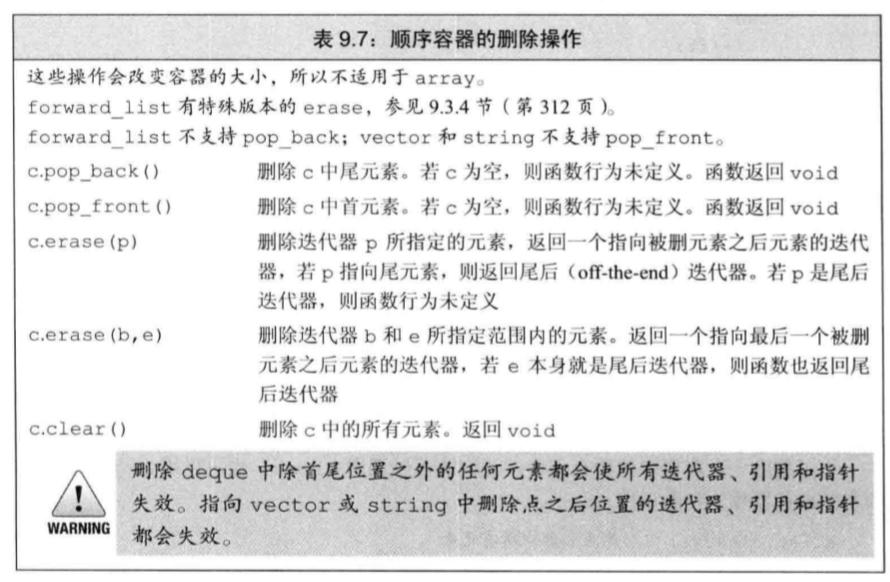

# 顺序容器

> 目录
> * array
> * vector
> * deque双端队列
> * list
> * forward_list
> * string//专门用于字符串访问的容器
> * vector/deque/list拥有容器所有的操作。首尾相关的操作。

> 参考文献
> * [vector/deque/list详解](https://blog.csdn.net/gogokongyin/article/details/51178378)

## 0 顺序容器的通用操作

> * 对迭代器的理解：迭代器就是指向元素的指针。通过指针的移动来访问元素。效率更快。
> * C++ 标准库提供了一系列范围相关的方法。例如
>   * 范围创建constructor{},constructor(beg,end) constructor(n,t)
>   * 范围替换assign({}),assign(beg,end),assign(n,t)
>   * 范围插入insert(p,{}),insert(p,beg,end),insert(p,n,t)
>   * 范围删除erase(beg,end)
>   * 范围重构resize(n),resize(n,t)


### 0.1 访问元素

<!--  -->

* 也可以使用**迭代器**访问元素。
* **at**会进行安全检查抛出异常。
* **[]下标运算符**不会进行检查。
* **back(),front()**

方法 | 说明
|----|-----|
back() | 尾部元素访问。空容器函数行为未定义。触发异常。
front() | 首部元素访问。空容器函数未定义。触发异常。
c[] | 随机元素访问。索引外函数未定义。触发异常。
at(n) | 随机元素访问。索引外抛出out_of_range异常
*iterator | 迭代器元素访问。指针元素访问。


### 0.2 添加元素

<!--  -->


* 总共有6+3=9种插入方法。insert有额外的两种范围插入方法。
* 在尾部添加元素**push_back(),emplace_back()**
* 在头部添加元素**push_front(),emplace_front()**
* 在中间添加元素insert(),emplace()
* insert方法提供了范围插入的方法。中间插入一个元素。在给定的一个迭代器之前插入一个值。中间插入多个元素。在给定的迭代器之前插入范围迭代器内的元素。

方法| 说明
|-----|-----|
void push_back(T t)|容器尾部添加元素。
void emplace_back(args) | 使用args初始化化一个元素。添加到容器尾部。
void push_front(T t) | 容器头部添加元素。
void emplace_front(args) |使用args初始化一个元素。添加到容器头部。
iterator emplace(iterator p,args)|在迭代器指向的元素之前。创建一个args初始化的元素。返回指向新元素的迭代器。
iterator insert(iterator p,T t) |在迭代器指向的元素之前。创建一个值为t的元素。返回指向新元素的迭代器。
iterator insert(iterator p,iterator begin,iterator end)|在给定的迭代器之前。插入范围迭代器内的元素。返回指向第一个新元素迭代器。
iterator insert(iterator p,n,t)|在给定的元素之前。插入指定数量的相同元素。返回指向第一个新元素的迭代器。
iterator insert(iterator p,{a,b,c,}) |在给定的元素之前，插入元素值列表中的元素。返回指向第一个新元素的迭代器。


### 0.3 删除元素

<!--  -->

* **back、front、push_back、push_front、pop_back、pop_front、emplace_front、emplace_back**。是一组首尾相关的插入操作。
* **insert、emplace、at、erase**。是一组随机的操作。

方法| 说明
|----|----|
void pop_back(void )|删除末尾的元素
void pop_front(void)|删除开头的元素。
iterator erease(iterator p) |删除迭代器指向的元素。返回被删除元素之后第一个元素的元素的迭代器。
iterator erase(b,e)| 删除范围内的元素。返回被删除范围后的第一个元素的迭代器。
void clear()|删除c中所有的元素。

### 0.4 重构容器

* 并非该表容器内存的大小。而是改变容器范围的大小。

<!--  -->

方法 | 说明
|----|----|
resize(n) | 调整容器大小为n个元素。多出的元素被丢球。新添加的位置进行值初始化。
resize(n,t) | 调整容器的大小为n个元素。任何添加的新元素初始化为t。

## 1 array


### 特殊构造方法
* 是静态的连续数组，只有默认初始化。
* 元素类型和容量。是类型的一部分。
```
array<Type, Size> a;
array<int,5> arr= {1, 2, 3, 4, 5};
```
### 特殊使用方法

* 值不能改变。不支持插入、删除操作。push/insert/emplace/erase/pop
* 与数组完全一致，只是定义方式不同。数组不能copy赋值，但是array可以copy赋值。

## 2 vector
### 特殊原理说明

* **连续存储结构**，每个元素在内存上是连续的；支持 **高效的随机访问和在尾端插入/删除操作**，但其他位置的插入/删除操作效率低下； 相当于一个数组，但是**与数组的区别为：内存空间的扩展**。vector支持不指定vector大小的存储，但是数组的扩展需要程序员自己写。
* vector的内存分配实现原理：STL内部实现时，首先分配一个非常大的内存空间预备进行存储，即capacity（）函数返回的大小，当超过此分配的空间时再整体重新放分配一块内存存储（ VS6.0是两倍，VS2005是1.5倍），所以 这给人以vector可以不指定vector即一个连续内存的大小的感觉。通常此默认的内存分配能完成大部分情况下的存储。扩充空间（不论多大）都应该这样做：
  1. 配置一块新空间
  2. 将旧元素一一搬往新址
  3. 把原来的空间释放还给系统
* vector 的数据安排以及操作方式，与array 非常相似。两者的唯一差别在于空间的利用的灵活性。Array 的扩充空间要程序员自己来写。


### 特殊使用方法

* 最普通的容器。
* 不支持front头部的修改操作（pop_front(),push_front(),emplace_front())。只支持尾部back的操作。

## 3 deque
### 特殊原理说明

* **连续存储结构**，即其每个元素在内存上也是连续的，类似于vector，不同之处在于， **deque提供了两级数组结构**， 第一级完全类似于vector，代表实际容器；另一级维护容器的首位地址。这样，deque除了具有vector的所有功能外， 还支持高效的首/尾端插入/删除操作。
* deque双端队列 double-end queue。deque是在功能上合并了vector和list。
* 优点
  * 随机访问方便，即支持[ ]操作符和vector.at()
  * 在内部方便的进行插入和删除操作
  * 可在两端进行push、pop
* 缺点
  * 占用内存多
* 使用区别：
  * 如果你需要高效的随即存取，而不在乎插入和删除的效率，使用vector
  * 如果你需要大量的插入和删除，而不关心随机存取，则应使用list
  * 如果你需要随机存取，而且关心两端数据的插入和删除，则应使用deque
### 特殊使用方法
* 最全面的容器操作
* 支持front头部操作和back尾部操作。

## 4 list

### 特殊原理说明
* 非连续存储结构，具有双链表结构，每个元素维护一对前向和后向指针，因此支持前向/后向遍历。 支持高效的随机插入/删除操作，但随机访问效率低下，且由于需要额外维护指针 ，开销也比较大。每一个结点都包括一个信息快Info、一个前驱指针Pre、一个后驱指针Post。可以不分配必须的内存大小方便的进行添加和删除操作。使用的是非连续的内存空间进行存储。
* 优点：
  * 不使用连续内存完成动态操作。
  * 在内部方便的进行插入和删除操作
  * 可在两端进行push、pop
* 缺点：
  * 不能进行内部的随机访问，即不支持[ ]操作符和vector.at()
  * 相对于verctor占用内存多
* 使用区别：
  * 如果你需要高效的随即存取，而不在乎插入和删除的效率，使用vector
  * 如果你需要大量的插入和删除，而不关心随机存取，则应使用list
  * 如果你需要随机存取，而且关心两端数据的插入和删除，则应使用deque

### 特殊使用方法
* 最全面的容器操作。不支持随机容器访问at和[]运算符。
* list的迭代器只能进行++/--。不能进行算数运算。
* 支持front、back的操作。
* 支持的额外操作如下（这些操作大部分在泛型算法中实现过了）

方法|说明
|----|----|
|void remove( T val)|删除所有和val相等的元素。
|void splice(iterator,list)|将整个链表插入到指定位置。原来的链表删除。
|void splice(iterator,list,iterator)|将链表中指定位置的元素插入到list的list的位置。原来链表的指定元素删除。
|void splice(iterator,list,iterator begin,iterator end|将链表begin和end之间的元素插入到指定位置。|
|void merge(list)|两个链表必须是有序链表。按照默认的顺序进行归并操作。归并排序使用。原来的链表删除。|
|void merge(list,cmp)|两个链表必须是有序链表。按照cmp中定义的大小关系进行归并操作。归并排序使用。
|void reverse(void)|反转容器
|sort()|对链表进行排序。
|sort(cmp)|使用比较函数对链表进行排序。
|unique()|移除连续且相同的元素


## 5 forward_list
### 特殊使用方法
* 因为forward_list是单向链表。所以提供了很多特殊操作。因为它无法访问到之前的元素。所以必须在前一个元素对下一个元素操作。
* 提供了一系列before、after
* 其他的操作是list操作的子集。
* 支持front的操作。但不支持back端的操作。

方法|说明
|----|----|
|iterator before_begin()|首元素之前不存在的元素。|
|iterator cbefore_begin()|const的首迭代器。|
|emplace_after(p,args)|指定位置插入|
|insert_after(iterator p,T val)|在指定位置之后，单个元素插入。forward_list的特殊版本。在元素之后插入。|
|insert_after(iterator p,int n,T val)|在指定位置之后，n个val值的插入。forward_list 的特殊版本。在元素之后范围插入。|
|insert_after(iterator p,iterator begin,iterator end)|在指定位置之后。forward_list的特殊版本。插入begin,end范围内的元素。|
|insert_after(iterator p,{a,b,c,})|在指定位置之后。forward_list的特殊版本。插入列表范围内的元素。|
|erase_after(iterator p)|删除指定位置的元素|
|erase_after(iterator b,iterator e)|删除指定范围的元素|


<!--  -->

## 6 容器常见的问题

### 6.1 list和vector的区别：
1. vector为存储的对象分配一块连续的地址空间 ，随机访问效率很高。但是 插入和删除需要移动大量的数据，效率较低。尤其当vector中存储的对象较大，或者构造函数复杂，则在对现有的元素进行拷贝的时候会执行拷贝构造函数。
2. list中的对象是离散的，随机访问需要遍历整个链表， 访问效率比vector低。但是在list中插入元素，尤其在首尾 插入，效率很高，只需要改变元素的指针。
3. vector是单向的，而list是双向的；
4. 向量中的iterator在使用后就释放了，但是链表list不同，它的迭代器在使用后还可以继续用；链表特有的；

5. 使用原则：
   1. 如果需要高效的随机存取，而不在乎插入和删除的效率，使用vector；
   2. 如果需要大量高效的删除插入，而不在乎存取时间，则使用list；
   3. 如果需要搞笑的随机存取，还要大量的首尾的插入删除则建议使用deque，它是list和vector的折中；

### 6.2 常量容器const
* const vector<int> vec(10);//这个容器里 capacity和size和值都是不能改变的， const修饰的是vector；
* 迭代器：const vector<int>::const_iterrator ite; //常量迭代器；

### 6.3 capacity与size
* capacity是容器需要增长之前，能够盛的元素总数； 只有连续存储的容器才有capacity的概念（例如vector，deque，string），list不需要capacity。
* size是容器当前存储的元素的数目。
* vector默认的容量初始值，以及增长规则是依赖于编译器的。

### 6.4 用vector存储自定义类对象时，自定义类对象须满足：
* 有可供调用的无参构造函数（默认的或自定义的）；
* 有可用的拷贝赋值函数（默认的或自定义的）

### 6.5迭代器iterator   

* vector与deque的迭代器支持算术运算，**list的迭代器只能进行++/--**操作，不支持普通的算术运算。
* 向量中的iterator在使用后就释放了，但是链表list不同，它的迭代器在使用后还可以继续用；链表特有的；