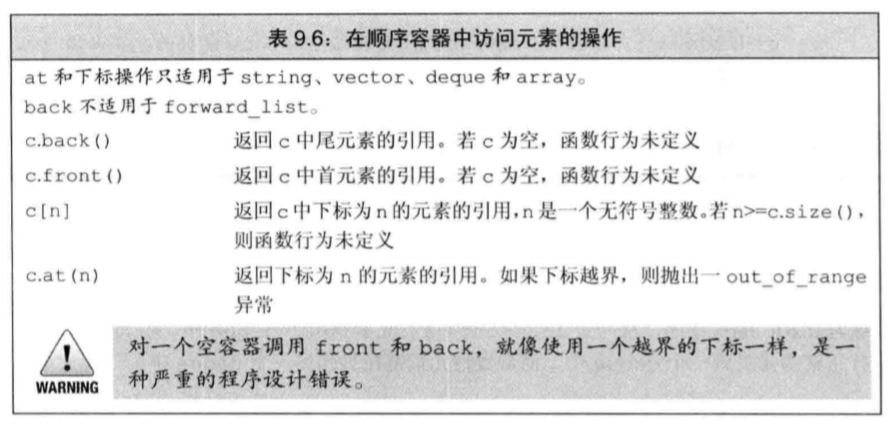
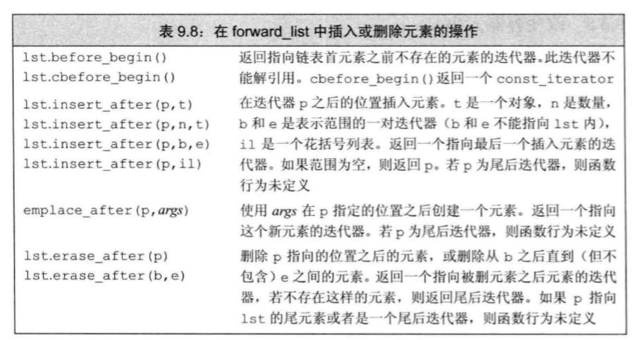

# 顺序容器

> 目录
> * array
> * vector
> * deque双端队列
> * list
> * forward_list
> * string//专门用于字符串访问的容器
> * vector/deque/list拥有容器所有的操作。首尾相关的操作。
## 0 顺序容器的基础操作

### 向顺序容器中添加元素


* 在尾部添加元素**push_back(),emplace_back()**
* 在头部添加元素**push_front(),emplace_front()**
* 在中间添加元素insert(),emplace()


### 在顺序容器中访问元素



* 也可以使用**迭代器**访问元素。
* **at**会进行安全检查抛出异常。
* **[]下标运算符**不会进行检查。
* **back(),front()**

### 在顺序容器中删除元素


* pop_back(),pop_front();
* erease(p),erase(b,e);
* clear();

> 操作记忆
> * **back、front、push_back、push_front、pop_back、pop_front、emplace_front、emplace_back**。是一组首尾相关的插入操作。
> * **insert、at、erase**。是一组随机的操作。


### 改变容器的大小


## 1 array
> 与数组完全一致，只是定义方式不同。
> 数组不能copy赋值，但是array可以copy赋值。

### 定义
是静态的连续数组，只有默认初始化。
```
array<int, 5> arr = {1, 2, 3, 4, 5};
```

## 2 vector

## 3 deque

## 4 foward_list
### foward_list的特殊操作


## 5 list
