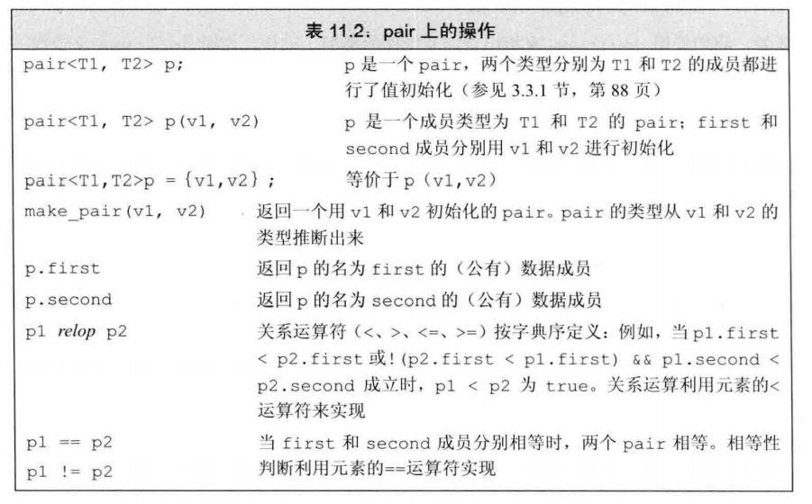
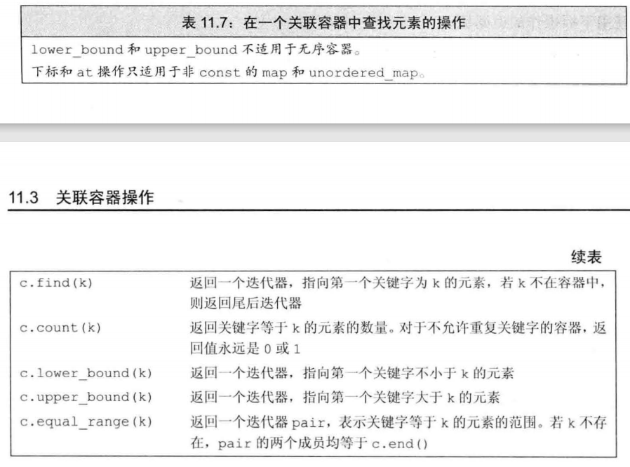

# 关联容器


## 1 关联容器概述

### 关联容器与顺序容器的区别

关联容器和顺序容器有着根本不同。关联容器中的元素是按关键字来把偶才能和访问的。书序容器中的元素是按他们在容器中的位置来顺序保存和访问的。

### 两个基础类型

* map:键值对key-value。关键字是索引，值表示与索引相关的数据。
* set:每个元素只包含一个关键字。支持高校的关键字查询操作。


### 关联容器之间的区别
* 是一个set或者map
* 要求不重复的关键字，允许重复的关键字。
* 按顺序保存元素。无序保存。


### 关联容器的头文件

* `<map>`:map,multimap
* `<set>`:set,multiset
* `<unorder_map>`:unorder_map,unorder_multimap
* `<unorder_set>`:unorder_set,unorder_multiset

### map和set的使用

```
#include<iostream>
#include<map>
#include<set>

using namespace std;

int main(){

    map<string,int> word_count;
    string word="hello";
    word_count[word]=10;
    word_count["world"]=35;
    //遍历map
    for(auto &w:word_count){
        cout<<"w.first"<<w.second<<endl;
    }


    //set
    set<string> ss{"yin","kang","long","hello","world"};
    for (auto s : ss)
    {
        cout<<s<<endl;
    }
    
    return 0;
    
}
```

### 定义关联容器

* map、set的定义和初始化
```
    map<string,int> word_count;//空容器
    set<string> ex{"the","to"};//初始化set
    map<string,int> wc{
        {"jo",10},
        {"yin",13},
        {"kang",53},
        {"long",3}
    };//初始化map
```
* multimap、multiset的定义和初始化。允许关键字的重复。

```
    //可以使用顺序容器初始化关联容器multiset初始化
    vector<int> vec{1,2,3,4,5,5,4,3,2,1};
    set<int> iset(vec.begin(),vec.end());
    multiset<int> mset(vec.begin(),vec.end());
    cout<<iset.size()<<endl;
    cout<<mset.size()<<endl;
```

### pair类型

* 类似容器，pair是用来生成特定类型的模板。
* 定义pair

```
pair<string,string> author{'James","joyce"};
```

* pair上的操作




## 2 关联容器的基础操作

### 关联容器额外的类型名


### 关联容器的迭代器和元素遍历

```
    //使用迭代器遍历关联容器

    auto map_it = word_count.cbegin();
    while(map_it != word_count.cend()){
        cout<<map_it->first<<map_it->second<<endl;
        map_it++;
    }
```

### 关联容器的算法

* 我们通常不对关联容器使用泛型算法

### 添加元素


### 删除元素


### map下标操作


### 访问元素




## 3 无序关联容器的基础操作

### 说明

* 不适用比较运算符来组织元素，使用哈希函数和关键字类型的==运算符。
* 使用无序容器通常更简单，具有更好的效果。

### 基础操作

* 与有序容器一样，包括find、insert

### 管理桶
* 无序关联容器相对于普通关联容器的特殊操作。


