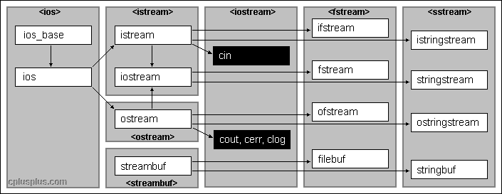
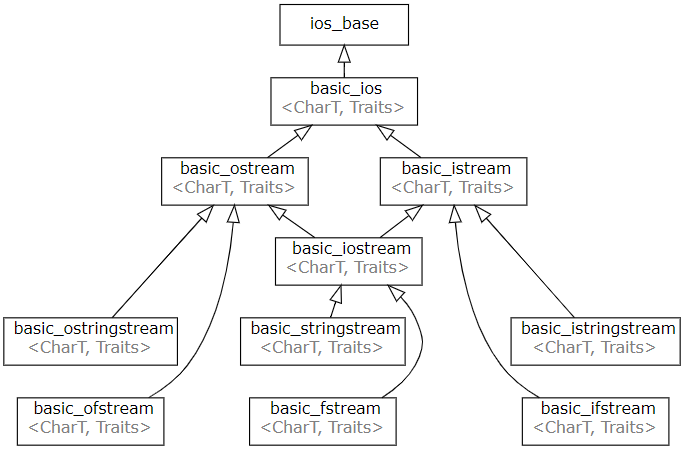

# IO 

> IO关系图





> 目录
> * 输入输出流iostream
> * 文件输入输出流fstream
> * 字符串输入输出流sstream

## 0 stream基础知识

### IO对象没有拷贝或赋值

### 管理IO的状态

* 用来记录stream可能出现的状态。


* 使用iostate对象来记录和管理io的状态
* `>> <<`流运算符（流函数）会返回io的运行状态，如果成功，则会返回true，否则返回false
```
#include<iostream>
using namespace std;

int main(){

    //IO state test
    int a{3};
    cin>>a;
    auto old_state = cin.rdstate();//返回s当前的状态
    cout<<old_state<<endl;//输出状态
    cout<<cin.eof()<<endl;//是否终止符
    cout<<cin.fail()<<endl;//是否IO过程错误，但未崩溃
    cout<<cin.bad()<<endl;//是否崩溃
    cout<<cin.good()<<endl;//是否正产
    cin.clear();//充值最初的状态
    cin.setstate(old_state);//设置流的状态

    int word =0;
    while(cin>>word){//>>函数返回流的状态。如果成功则返回true

    }
    return 0;
}
```

### 管理输出缓冲区

导致缓冲区刷新的方法

* 程序正常结束，main函数return之后，缓冲区刷新
* 缓冲区满时，缓冲区刷新。
* 流操纵符endl、flush、ends，刷新缓冲区
* 每个输出操作后，使用流操纵符unitbuf设置流的内部状态，来清空缓冲区。unitbuf是流的属性。
* 一个输出流可能被关联到另一个流。关联到流的缓冲区会被刷新。cin、cerr、cout相互关联。

```
cout<<""<<endl;
cout<<""<<flush;
cout<<""<<ends;

cout<<unitbuf;//所有的输出操作后立即刷新缓冲区
cout<<nounitbuf;//回到正常的刷新方式
```

## 1 iostream


## 2 fstream


### 文件流的方法

### 文件模式

### 实例


## 3 sstream

### string流
```
    //string stream
    struct Person{
        string name;
        string phone;
    };
    vector<Person> p;
    string line;
    if(getline(cin,line)){
        Person pp;
        stringstream record(line);
        record>>pp.name;
        record>>pp.phone;
        p.push_back(pp);
    }
    cout<<p[0].name<<endl;
    cout<<p[0].phone<<endl;
```


## 4 格式化输入输出

> 使用流操纵符完成格式化输入输出

| **流操纵算子** | **作  用** |
|---|---|
| dec | 以十进制形式输出整数 |
| hex | 以十六进制形式输出整数 |
| oct | 以八进制形式输出整数 |
| fixed | 以普通小数形式输出浮点数 |
| scientific | 以科学计数法形式输出浮点数 |
| left | 左对齐，即在宽度不足时将填充字符添加到右边 |
| right | 右对齐，即在宽度不足时将填充字符添加到左边 |
| setbase(b) | 设置输出整数时的进制，b=8、10 或 16 |
| setw(w) | 指定输出宽度为 w 个字符，或输人字符串时读入 w 个字符 |
| setfill(c) | 在指定输出宽度的情况下，输出的宽度不足时用字符 c 填充（默认情况是用空格填充） |
| setprecision(n) | 设置输出浮点数的精度为 n。在使用非 fixed 且非 scientific 方式输出的情况下，n 即为有效数字最多的位数，如果有效数字位数超过 n，则小数部分四舍五人，或自动变为科学计 数法输出并保留一共 n 位有效数字。在使用 fixed 方式和 scientific 方式输出的情况下，n 是小数点后面应保留的位数。 |
| setiosflags(flag) | 将某个输出格式标志置为 1 |
| resetiosflags(flag) | 将某个输出格式标志置为 0 |
| boolapha | 把 true 和 false 输出为字符串 |
| noboolalpha | 把 true 和 false 输出为 0、1 |
| showbase | 输出表示数值的进制的前缀 |
| noshowbase | 不输出表示数值的进制.的前缀 |
| showpoint | 总是输出小数点 |
| noshowpoint | 只有当小数部分存在时才显示小数点 |
| showpos | 在非负数值中显示 + |
| noshowpos | 在非负数值中不显示 + |
| skipws | 输入时跳过空白字符 |
| noskipws | 输入时不跳过空白字符 |
| uppercase | 十六进制数中使用 A~E。若输出前缀，则前缀输出 0X，科学计数法中输出 E |
| *nouppercase | 十六进制数中使用 a~e。若输出前缀，则前缀输出 0x，科学计数法中输出 e。 |
| internal | 数值的符号（正负号）在指定宽度内左对齐，数值右对 齐，中间由填充字符填充。 |
