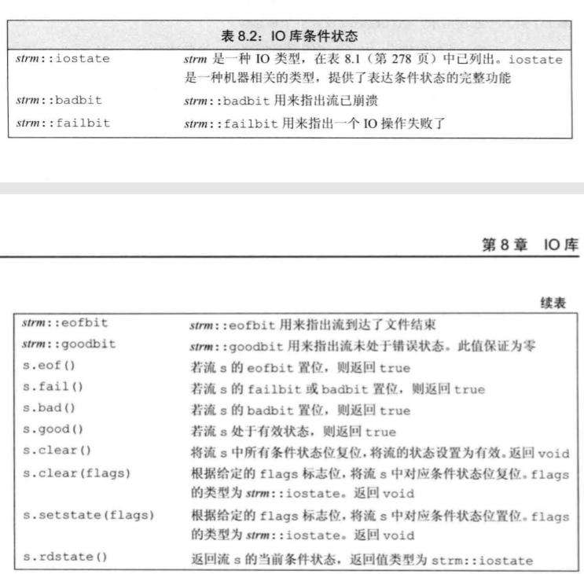

# IO 

> IO关系图


> IO 类的继承关系图


> 目录
> * 输入输出流iostream
> * 文件输入输出流fstream
> * 字符串输入输出流sstream

## 0 stream基础知识

> IO对象没有拷贝或赋值

### 管理IO的状态

> 继承自`basic_ios`和`basic_ios_base`基类
* 用来记录stream可能出现的状态。



* 使用iostate对象来记录和管理io的状态
* `>> <<`流运算符（流函数）会返回io的运行状态，如果成功，则会返回true，否则返回false
```
#include<iostream>
using namespace std;

int main(){

    //IO state test
    int a{3};
    cin>>a;
    auto old_state = cin.rdstate();//返回s当前的状态
    cout<<old_state<<endl;//输出状态
    cout<<cin.eof()<<endl;//是否终止符
    cout<<cin.fail()<<endl;//是否IO过程错误，但未崩溃
    cout<<cin.bad()<<endl;//是否崩溃
    cout<<cin.good()<<endl;//是否正产
    cin.clear();//充值最初的状态
    cin.setstate(old_state);//设置流的状态

    int word =0;
    while(cin>>word){//>>函数返回流的状态。如果成功则返回true

    }
    return 0;
}
```

### 管理输出缓冲区

导致缓冲区刷新的方法

* 程序正常结束，main函数return之后，缓冲区刷新
* 缓冲区满时，缓冲区刷新。
* 流操纵符endl、flush、ends，刷新缓冲区
* 每个输出操作后，使用流操纵符unitbuf设置流的内部状态，来清空缓冲区。unitbuf是流的属性。
* 一个输出流可能被关联到另一个流。关联到流的缓冲区会被刷新。cin、cerr、cout相互关联。

```
cout<<""<<endl;
cout<<""<<flush;
cout<<""<<ends;

cout<<unitbuf;//所有的输出操作后立即刷新缓冲区
cout<<nounitbuf;//回到正常的刷新方式
```

### 字符类型的IO预定义

* IO 类本质上都是模板。可以针对任何类型IO。

```
steam<type,traits>
```
* 针对常用的字符提供了以下IO方式。也可以自己根据定义实现二进制IO的过程。
```
typedef basic_ios<char>                ios;
typedef basic_ios<wchar_t>            wios;
 
typedef basic_streambuf<char>     streambuf;
typedef basic_streambuf<wchar_t> wstreambuf;
typedef basic_filebuf<char>         filebuf;
typedef basic_filebuf<wchar_t>     wfilebuf;
typedef basic_stringbuf<char>     stringbuf;
typedef basic_stringbuf<wchar_t> wstringbuf;
typedef basic_syncbuf<char>         syncbuf;
typedef basic_syncbuf<wchar_t>     wsyncbuf;
 
typedef basic_istream<char>         istream;
typedef basic_istream<wchar_t>     wistream;
typedef basic_ostream<char>         ostream;
typedef basic_ostream<wchar_t>     wostream;
typedef basic_iostream<char>       iostream;
typedef basic_iostream<wchar_t>   wiostream;
 
typedef basic_ifstream<char>       ifstream;
typedef basic_ifstream<wchar_t>   wifstream;
typedef basic_ofstream<char>       ofstream;
typedef basic_ofstream<wchar_t>   wofstream;
typedef basic_fstream<char>         fstream;
typedef basic_fstream<wchar_t>     wfstream;
 
typedef basic_istringstream<char>     istringstream;
typedef basic_istringstream<wchar_t> wistringstream;
typedef basic_ostringstream<char>     ostringstream;
typedef basic_ostringstream<wchar_t> wostringstream;
typedef basic_stringstream<char>       stringstream;
typedef basic_stringstream<wchar_t>   wstringstream;
 
typedef basic_osyncstream<char>     osyncstream;
typedef basic_osyncstream<wchar_t> wosyncstream;
```

### 预定义标准流对象

定义于头文件 `<iostream>`

* cin\wcin从标准 C 输入流 stdin 中读取(全局对象)
* cout\wcout写入到标准 C 输出流 stdout(全局对象)
* cerr\wcerr写入到标准 C 错误流 stderr， 无缓冲(全局对象)
* clog\wclog写入到标准 C 错误流 stderr

### 常用的istream方法

| 有格式输入 ||
|---|---|
| operator>> | 提取带格式数据  (std::basic_istream<CharT,Traits> 的公开成员函数) [编辑] |
| 无格式输入 |
| get | 从流中读并取走（移除类似指针向下一个元素移动）一个字符  (std::basic_istream<CharT,Traits> 的公开成员函数) [编辑] |
| peek | 仅读出但不取走（不移除类似指针并未移动）一个字符  (std::basic_istream<CharT,Traits> 的公开成员函数) [编辑] |
| unget | 撤销流中刚取走（移除，类似指针向后退回一个位置）的字符  (std::basic_istream<CharT,Traits> 的公开成员函数) [编辑] |
| putback | 往输入流中退回一个字符  (std::basic_istream<CharT,Traits> 的公开成员函数) [编辑] |
| getline | 一直读并取走字符，直至找到给定字符  (std::basic_istream<CharT,Traits> 的公开成员函数) [编辑] |
| ignore | 读且取走并舍弃字符，直至发现给定字符  (std::basic_istream<CharT,Traits> 的公开成员函数) [编辑] |
| read | 读并取走一块字符  (std::basic_istream<CharT,Traits> 的公开成员函数) [编辑] |
| readsome | 读并取走已经可用的字符块  (std::basic_istream<CharT,Traits> 的公开成员函数) [编辑] |
| gcount | 返回上次无格式输出操作所取走的字符数量  (std::basic_istream<CharT,Traits> 的公开成员函数) [编辑] |
| 寻位 |
| tellg | 返回输入位置指示器  (std::basic_istream<CharT,Traits> 的公开成员函数) [编辑] |
| seekg | 设置输入位置指示器   (std::basic_istream<CharT,Traits> 的公开成员函数) [编辑] |
| 杂项 |
| sync | 与底层存储设备同步  (std::basic_istream<CharT,Traits> 的公开成员函数) [编辑] |


### 常用的ostream方法

| 有格式输出 ||
|---|---|
| operator<< | 插入带格式数据  (std::basic_ostream<CharT,Traits> 的公开成员函数) [编辑] |
| 无格式输出 |
| put | 插入字符  (std::basic_ostream<CharT,Traits> 的公开成员函数) [编辑] |
| write | 插入字符块  (std::basic_ostream<CharT,Traits> 的公开成员函数) [编辑] |
| 寻位 |
| tellp | 返回输出位置指示器  (std::basic_ostream<CharT,Traits> 的公开成员函数) [编辑] |
| seekp | 设置输出位置指示器  (std::basic_ostream<CharT,Traits> 的公开成员函数) [编辑] |
| 杂项 |
| flush | 与底层存储设备同步  (std::basic_ostream<CharT,Traits> 的公开成员函数) [编辑] |


### 输入方法
* 绑定istream对象的输入方法
  * istream>> 
  * istream.get
  * istream.getline
* 非对象绑定的输入方法
  * getline
  * gets
  * getchar
```
getline(cin,str);

char m[20];
gets(m); //不能写成m=gets();

char ch;
ch=getchar(); //不能写成getchar(ch);
```

## 1 iostream

### 头文件
```
#include<iostream>
```
### iostream特有的方法

> 全部继承自ios ios_base istream ostream

## 2 fstream
```
#include<fstream>
```

### fstream特有方法

文件操作
* is_open检查流是否有关联文件
* open打开文件，并将它与流关联
* close关闭关联文件

### 文件模式

### 实例

```C++
//2. 创建流
ofstream output;

//3. 打开文件，将流与文件相关联，这里使用相对路径
output.open("number.txt");

//4. 向文件写入数据
output << 1 << " " << 2 << " " << 3 << endl;

//5. 关闭流
output.close();
```


## 3 stringstream

### 头文件
```
#include<sstream>

stringstream	basic_stringstream<char>
wstringstream	basic_stringstream<wchar_t>
```
### stringstream的操作

```
str获取或设置底层字符串设备对象的内容
```
### string输入流
```
    //string stream。字符串初始化输入流，通过输入流读取字符串
    struct Person{
        string name;
        string phone;
    };
    vector<Person> p;
    string line;
    if(getline(cin,line)){
        Person pp;
        stringstream record(line);
        record>>pp.name;
        record>>pp.phone;
        p.push_back(pp);
    }
    cout<<p[0].name<<endl;
    cout<<p[0].phone<<endl;
```
### string输入输出流格式化字符

```C++
//string stream 对字符串进行格式化
double value = 4.55667;
string format_string;
stringstream sstream;
// 将int类型的值放入输入流中
sstream<<setw(10)<<setfill('0')<<fixed<<setprecision(3)<<value;
// 从sstream中抽取前面插入的int类型的值，赋给string类型
sstream >> format_string;
cout<<format_string;
```

## 4 格式化输入输出

### 头文件

```
#include<iomanip>
```
> 使用流操纵符完成格式化输入输出

| **流操纵算子** | **作  用** |
|---|---|
| dec | 以十进制形式输出整数 |
| hex | 以十六进制形式输出整数 |
| oct | 以八进制形式输出整数 |
| fixed | 以普通小数形式输出浮点数 |
| scientific | 以科学计数法形式输出浮点数 |
| left | 左对齐，即在宽度不足时将填充字符添加到右边 |
| right | 右对齐，即在宽度不足时将填充字符添加到左边 |
| setbase(b) | 设置输出整数时的进制，b=8、10 或 16 |
| setw(w) | 指定输出宽度为 w 个字符，或输人字符串时读入 w 个字符 |
| setfill(c) | 在指定输出宽度的情况下，输出的宽度不足时用字符 c 填充（默认情况是用空格填充） |
| setprecision(n) | 设置输出浮点数的精度为 n。在使用非 fixed 且非 scientific 方式输出的情况下，n 即为有效数字最多的位数，如果有效数字位数超过 n，则小数部分四舍五人，或自动变为科学计 数法输出并保留一共 n 位有效数字。在使用 fixed 方式和 scientific 方式输出的情况下，n 是小数点后面应保留的位数。 |
| setiosflags(flag) | 将某个输出格式标志置为 1 |
| resetiosflags(flag) | 将某个输出格式标志置为 0 |
| boolapha | 把 true 和 false 输出为字符串 |
| noboolalpha | 把 true 和 false 输出为 0、1 |
| showbase | 输出表示数值的进制的前缀 |
| noshowbase | 不输出表示数值的进制.的前缀 |
| showpoint | 总是输出小数点 |
| noshowpoint | 只有当小数部分存在时才显示小数点 |
| showpos | 在非负数值中显示 + |
| noshowpos | 在非负数值中不显示 + |
| skipws | 输入时跳过空白字符 |
| noskipws | 输入时不跳过空白字符 |
| uppercase | 十六进制数中使用 A~E。若输出前缀，则前缀输出 0X，科学计数法中输出 E |
| *nouppercase | 十六进制数中使用 a~e。若输出前缀，则前缀输出 0x，科学计数法中输出 e。 |
| internal | 数值的符号（正负号）在指定宽度内左对齐，数值右对 齐，中间由填充字符填充。 |
