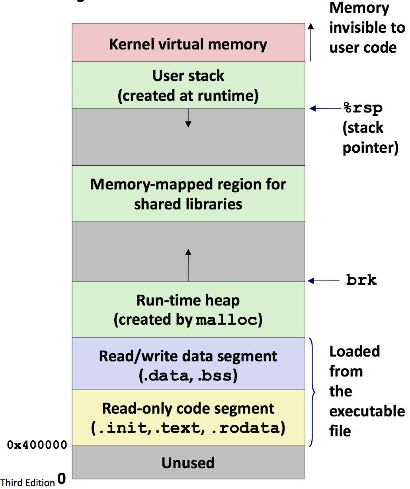

## 内存分配


### 内存分配示意图


* Unused Memory：用于程序代码块对齐
Read-only code segment：只读，存代码和一些其他的东西
* Read/Write data segment:
  * .data：存初始化的全局变量和static变量，另外还有文字常量区，常量字符串就是放在这里，程序结束后有系统释放
  * .bss：存未初始化的全局变量和static变量
* Heap：通过new和malloc由低到高分配，由delete或free手动释放或者程序结束自动释放
* Shared libraries：调用的库文件，位于堆和栈之间
* Stack：由高向低增长，和堆的增长方式相对，对不同的OS来说，栈的初始大小有规定，可以修改，目前默认一般为2M，由编译器自动分配释放
* Kernel virtual memory：用户不可见不能访问

### 内存分配说明
C/C++编译的程序所占用内存区域一般分为以下5个部分：

* 栈区（stack）：由编译器自动分配和释放，用来存放函数的参数、局部变量等。其操作方式类似于数据结构中的栈。
* 堆区（heap）：一般由程序员分配和释放（通过malloc/free、new/delete），若程序员没有释放，则程序结束时由操作系统回收。它与数据结构中的堆是两回事，分配方式类似于链表。
* 全局/静态区：全局变量和静态变量的存储是放在一块的，初始化的全局变量和初始化的静态变量在一块区域，未初始化的全局变量和未初始化的静态变量在相邻的另一块区域，程序结束后由操作系统回收。
* 文字常量区：存放常量值，如常量字符串等，不允许修改，程序结束后由操作系统回收。
* 程序代码区：存放函数体的二进制代码。


### 例子

```
#include <stdlib.h>
#include <string.h>
int a = 0; // 全局初始化区
char* p1;  // 全局未初始化区
int main() {
    int a;            // 栈区
    char s[] = "abc"; // 栈区
    char* p2;         // 栈区
    char* p3 = "123456";    // 123456\0在常量区，p3在栈区
    static int c = 0;      // 全局/静态初始化区
    p1 = (char*) malloc(10);
    p2 = (char*) malloc(20); // 分配得来的10和20字节在堆区
    strcpy(p1, "123456"); // 123456\0放在常量区，编译器可能将它与p3所指向的"123456"优化成一个地方
    return 0;
}
```