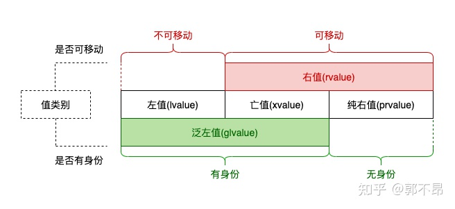

# 左值右值

> 参考文献
> * [cnblogs.com/sunchaothu/p/11343517.html](cnblogs.com/sunchaothu/p/11343517.html)
> * [https://www.zhihu.com/question/363686723/answer/1976488046](https://www.zhihu.com/question/363686723/answer/1976488046)


> 为了导入右值和移动语义，首先复习了以下临时对象在函数返回值和传参数时构造了几次；然后对比介绍了左值和右值，以及右值引用的形式和含义。为移动语义和完美转发的介绍做铺垫。
## 1 问题导入——参数与返回值的角度

C++11 引入了 std::move 语义、右值引用、移动构造和完美转发这些特性。


* 函数返回值是传值的时候发生几次对象构造、几次拷贝？
* 函数的形参是值传递的时候发生几次对象构造？

### 函数返回值原理
```
// main.cpp
#include <iostream>
using namespace  std;

class A{
public:
   A(){
      cout<<"class A construct!"<<endl;
   } 
   A(const A&){
      cout<<"class A copy!"<<endl;
   }
   A& operator=(const A&){
      cout<<"assignment called!"<<endl;
   }
   ~A(){
      cout<<"class A destruct!"<<endl;
   }
};

A get_A_value(){
    return A();
}
int main(){
    A a = get_A_value();
    return 0;
}
```
使用 g++ 编译；注意使用 -fno-elide-constructors关闭省略构造优化

```
g++ main.cpp -fno-elide-constructors
```
可以得到以下输出
```
class A construct!
class A copy!
class A destruct!
class A copy!
class A destruct!
class A destruct!
```


可以看到A a=get_A_value(); 一行代码居然产生1次对象构造和2次对象的拷贝构造！具体为

1. 在 get_A_value() 里 A() 构造了临时对象，发生了一次默认构造；
2. 函数返回的时候会把临时对象拷贝后作为返回值，发生一次拷贝构造；
3. A a = 函数返回值发生了拷贝构造。

如果使用编译器优化（默认）, 则会把临时对象拷贝的那次 和 用返回值构造最终对象的拷贝的给省略了；也即，只有一次构造和析构。
```
class A construct!
class A destruct!
```

### 函数参数原理

```
// ... A

void pass_A_by_value(A a){

}
int main(){
    A a;
    pass_A_by_value(a);
    return 0;
}
```
在去掉优化 g++ main.cpp -fno-elide-constructors时输出为
```
class A construct!
class A copy!
class A destruct!
class A destruct!
```

* 1次构造加上1次拷贝。


### 总结拷贝构造函数

事实上，在未经优化的情况下，以下时候拷贝构造函数会被调用：

1. 函数内的局部对象做为返回值返回(不是引用)的时候会发生拷贝（拷贝为临时对象返回）
2. 函数形参为传值的时候，会发生拷贝构造
3. 一个对象以另外一个对象进行初始化的时候

对象的频繁构造是程序的开销，特别是当对象内部有堆上内存（比如有 new 出来的成员）的时候，每次拷贝构造的时候都需要用 new 申请一块内存，造成性能的降低。对于情况2，好习惯是如果函数参数是只读的（也即不会在程序内进行修改），传引用作为参数，也即 pass_A_by_refrence(const A &a); 对于情况1，编译器会为我们进行优化; 对于情况3，C++11 引入了一种移动构造函数的概念，它将获取**右值引用*,右值的“资源” move 到新对象中，这个过程中不会申请新的内存，从而达到提高了效率和性能。

所以，要理解些关键词 “移动构造”、“移动语义” ，首先要理解右值和右值引用。

## 2 左值(lvalue)和右值(rvalue)

### 概念

左值的英文简写为“lvalue”，右值的英文简写为“rvalue”。很多人认为它们分别是"left value"、"right value" 的缩写，其实不然。lvalue 是“loactor value”的缩写，可意为存储在内存中、有明确存储地址（可寻址）的数据，而 rvalue 译为 "read value"，指的是那些可以提供数据值的数据（不一定可以寻址，例如存储于寄存器中的数据）。

```C++
A a = foo(); // foo() 为右值
int a = 5; //5字面量为右值
char *x = "thu"; // “thu”为字面值也为右值
a = b + c; // b + c这个结果也是一个右值
return a //临时对象，也即函数返回值的时候只会“临时”存在的对象（运行超过那一行就会结束它的生存期），这个临时返回值就是一个右值；
```

* 位于赋值运算符 = 右边的值，为右值；在左边的则为左值

* 左值可以取得地址、有名字； 不可以取得地址、没有名字的为右值。所以 A a = foo()可以用 &a取得a的地址，a 是左值，然是不能取得 foo()的地址，（&foo()）无法通过编译， foo()返回的临时对象也是没有名字的，所以是右值。

* 在C++11中，右值包括两种，一中是将亡值(xvalue, eXpiring Value)，一种是纯右值(prvalue,Pure Rvalue)[1]。函数非引用返回的临时对象、运算表达式的结果、1, 3.14,'c'这样的字面值等都属于纯右值。而xvalue则是由 C++11引入的 如返回值为 A&& 的函数返回值或者std::move()的返回值等。


## 3 左值引用和右值引用

### 左值引用

左值引用就是一般的引用，一般用一个&表示，例如

```
const A &a_ref = a; // 取得对象 a 的引用
```

左值引用相当于别名，指向一个具体的对象。


### 右值引用


右值引用顾名思义，就是右值的引用， 用 &&表示；
```
A &&r_ref = getRvalue(); // r_ref 是一个右值引用
```
右值引用也相当于别名，与左值的区别为右值引用是无名变量的别名。

getRvalue() 是一个返回右值的函数，右值在这一句执行完就该结束他的生存期了，如果是对象就该调用析构函数了；但是右值引用让它强行续命；使用右值引用指向右值，右值的生存期和右值引用一样长了，这也就少一次对象的析构和构造了。

C++的右值引用主要有两个用处，
* 一个是移动语义
* 一个是完美转发。

### 性质补充


* 虽然 C++98/03 标准不支持为右值建立非常量左值引用，但允许使用常量左值引用操作右值。也就是说，常量左值引用既可以操作左值，也可以操作右值，例如：
```
int num = 10;
const int &b = num;
const int &c = 10;
```
* 和声明左值引用一样，右值引用也必须立即进行初始化操作，且只能使用右值进行初始化
```
int num = 10;
//int && a = num;  //右值引用不能初始化为左值
int && a = 10;
```

* 和常量左值引用不同的是，右值引用还可以对右值进行修改。例如：

```
int && a = 10;
a = 100;
cout << a << endl;
```


## 1 问题引入——函数重载的角度

右值引用(Rvalue Reference)，与传统的左值引用(Lvalue Reference)相对，是绑定到右值的引用。int n;
```
int &  lref = n;
int && rref = 1;
```
右值引用是 C++ 11 标准引入的语言特性，理解右值引用，对理解现代 C++ 语义至关重要。而这一概念又经常让人困惑，例如在下面的例子 “overload foo” 中，函数 foo 的调用会匹配哪一个重载？void 
```
foo(int &)  { std::cout << "lvalue" << std::endl; }
void foo(int &&) { std::cout << "rvalue" << std::endl; }

int main() {
  int &&rref = 1;
  foo(rref);    // which overload will be seleted?
}
```
答案是匹配 foo(int&)，是不是和想象中的不太一样？

## 2 值类型和值类别

### 值类型和值类别
C++ 中的表达式有两个维度的属性：类型（type）和值类别（value category）。

* 类型这个概念就是我们熟知的类型，int, int *, int &, int && 都是类型;其中 int 称为基础类型(fundamental type)，后三者称为复合类型(compound type)。
* 值类别分为：左值(lvalue)、亡值(xvalue) 和 纯右值(prvalue)，任一个表达式都可以唯一地归类到这三种值类别中的一个，这三种类别称为基础类别(primary category)。除了这三种基础类别外，还有两种混合类别(mixed category)：泛左值(glvalue)和右值(rvalue)，泛左值包括左值和亡值，右值包括亡值和纯右值。

* 纯右值
   * 字面量，
   * this指针，
   * lambda表达式所有内建数值运算表达式：a + b, a % b, a & b, a << b&a, 取址表达式...
* 亡值
  * 返回类型为对象的右值引用的函数调用或重载运算符表达式，如 std::move(x)
  * 转换为对象的右值引用类型的转型表达式，如 static_cast(x)...
* 左值
  * 变量、函数、模板形参对象或数据成员的名字，如 std::cin
  * 返回类型为左值引用的函数调用或重载运算符表达式，如 std::cout << 1
  * ++a/--a*ptr...
* 泛左值
  * 包括左值和亡值
  * 右值包括亡值和纯右值


### 拥有身份与可以移动

概念
* 拥有身份 (identity)：可以确定表达式是否与另一表达式指代同一实体，例如通过比较它们所标识的对象或函数的（直接或间接获得的）地址； 
* 可被移动：移动构造函数、移动赋值运算符或实现了移动语义的其他函数重载能够绑定于这个表达式。

对应
* 拥有身份且不可被移动的表达式被称作左值 (lvalue)表达式；
* 拥有身份且可被移动的表达式被称作亡值 (xvalue)表达式；
* 不拥有身份且可被移动的表达式被称作纯右值 (prvalue)表达式； 
* 不拥有身份且不可被移动的表达式无法使用。 
* 拥有身份的表达式被称作“泛左值 (glvalue) 表达式”。左值和亡值都是泛左值表达式。 
* 可被移动的表达式被称作“右值 (rvalue) 表达式”。纯右值和亡值都是右值表达式。




## 3 规则

### 右值引用的规则

* 右值引用同样引入了一条规则：**右值引用类型的变量**只能绑定到**右值表达式**。但奇怪的事情出现了，和左值引用表达式只能是左值不同，**右值引用类型的表达式**既可以是左值，也可以是右值（纯右值或亡值）。

```
void foo(int &)  { std::cout << "lvalue" << std::endl; }
void foo(int &&) { std::cout << "rvalue" << std::endl; }

int main() {
  int &&rref = 1;
  foo(rref);    // output: lvalue
}
```
> More importantly, when a function has both rvalue reference and lvalue reference overloads,  the rvalue reference overload binds to rvalues (including both prvalues and xvalues),  while the lvalue reference overload binds to lvalues.

变量 rref 其实是一个左值，它的类型是 int 的右值引用 (int&&)，它绑定到一个右值（字面量1），但它本身是一个左值。一方面因为右值没有名字。另一方面，因为右值引用（值类型）是左值（值类别）并不冲突。


