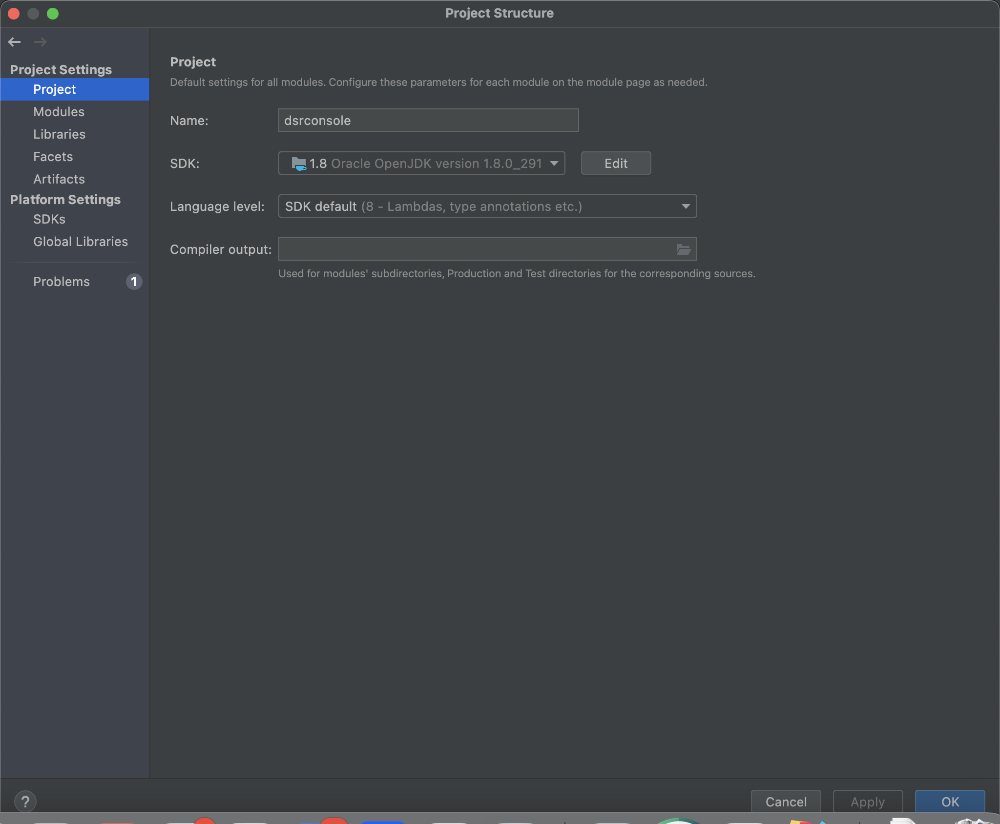
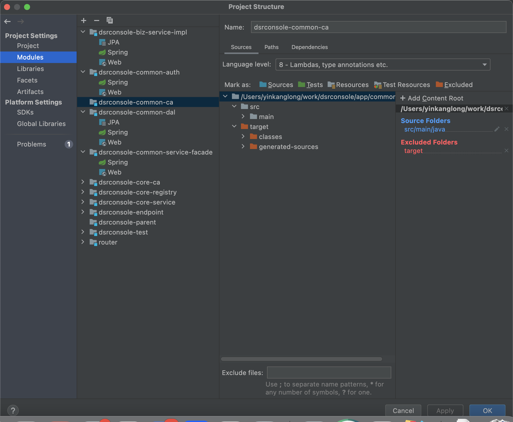
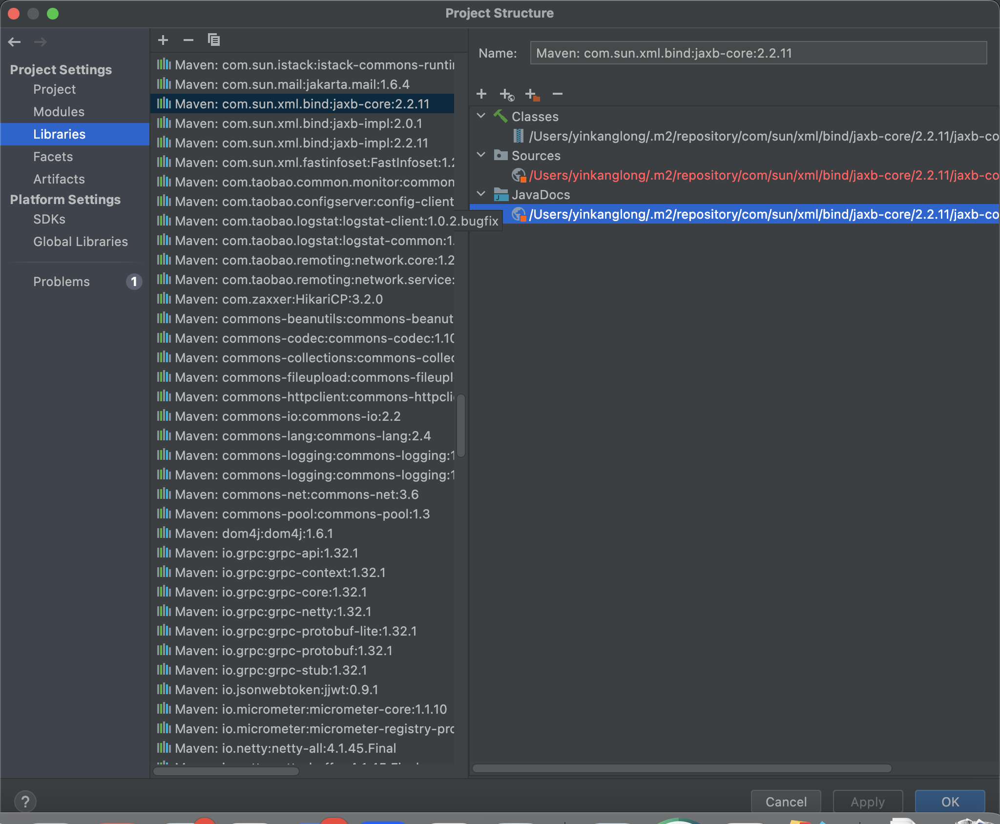
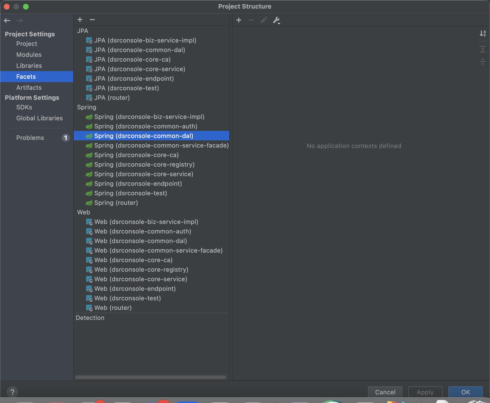
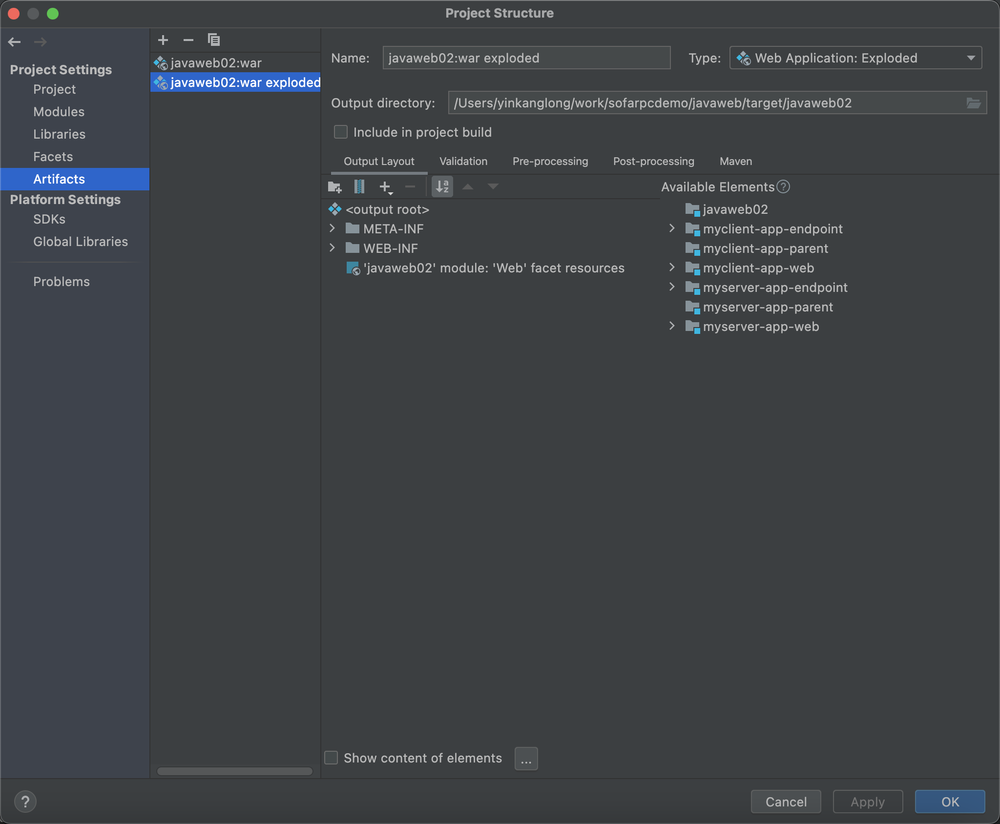

# IDEA 使用教程

## 1 安装与设置

### 安装目录
* vmoptions配置信息，包含启动参数，使得idea更快更好运行
  * 最大内存
  * 运行内存
* Users/config用户的配置目录
  * 快捷键
* Users/system
  * cache缓存

### 工程目录

* src 存放代码的文件
* .idea目录 Idea的配置文件
* project.iml 工程结构的配置文件

> 删掉config和system就相当于删除用户数据。还原默认设置。

### 工程组织
> file-project structure。command+;
* Project整个工程，可以直接添加代码，也可以创建模块后，添加代码。能够配置sdk的版本。

* Module大型项目可以分为很多模块，相互间彼此依赖。先删除模块，再删除模块中的文件。与Facets对应

* Libraries 项目以来的jar包或者第三方库。

* Facets 英文翻译为：方面，（事务的）面。表述了在Module中使用的各种各样的框架、技术和语言。这些Facets让IDEA知道怎么对待module内容，并保证与相应的框架和语言保持一致。

* Artifacts 英文翻译为：人工产品。是一个项目资源的组合体。例如，一个已编译的java类的集合，一个已打包的java应用。这里可以理解为Maven中的artifactId，成果产物ID，他可以是一个jar或是一个war。

### preference设置
* 外观和行为
  * 主题

## 2 快捷键

### 键位说明

Mac键盘符号和修饰键说明

⌘ Command

⇧ Shift

⌥ Option

⌃ Control

↩︎ Return/Enter

⌫ Delete

⌦ 向前删除键（Fn+Delete）

↑ 上箭头

↓ 下箭头

← 左箭头

→ 右箭头

⇞ Page Up（Fn+↑）

⇟ Page Down（Fn+↓）

Home Fn + ←

End Fn + →

⇥ 右制表符（Tab键）

⇤ 左制表符（Shift+Tab）

### Editing（编辑）

⌃Space 基本的代码补全（补全任何类、方法、变量）

⌃⇧Space 智能代码补全（过滤器方法列表和变量的预期类型）

⌘⇧↩ 自动结束代码，行末自动添加分号

⌘P 显示方法的参数信息

⌃J, Mid. button click 快速查看文档

⇧F1 查看外部文档（在某些代码上会触发打开浏览器显示相关文档）

⌘+鼠标放在代码上 显示代码简要信息

⌘F1 在错误或警告处显示具体描述信息

⌘N, ⌃↩, ⌃N 生成代码（getter、setter、构造函数、

hashCode/equals,toString）

⌃O 覆盖方法（重写父类方法）

⌃I 实现方法（实现接口中的方法）

⌘⌥T 包围代码（使用if..else, try..catch, for, synchronized等包围 选中的代码）

⌘/ 注释/取消注释与行注释

⌘⌥/ 注释/取消注释与块注释

⌥↑ 连续选中代码块

⌥↓ 减少当前选中的代码块

⌃⇧Q 显示上下文信息

⌥↩ 显示意向动作和快速修复代码

⌘⌥L 格式化代码

⌃⌥O 优化import

⌃⌥I 自动缩进线

⇥ / ⇧⇥ 缩进代码 / 反缩进代码

⌘X 剪切当前行或选定的块到剪贴板

⌘C 复制当前行或选定的块到剪贴板

⌘V 从剪贴板粘贴

⌘⇧V 从最近的缓冲区粘贴

⌘D 复制当前行或选定的块

⌘⌫ 删除当前行或选定的块的行

⌃⇧J 智能的将代码拼接成一行

⌘↩ 智能的拆分拼接的行

⇧↩ 开始新的一行

⌘⇧U 大小写切换

⌘⇧] / ⌘⇧ 选择直到代码块结束/开始

⌥⌦ 删除到单词的末尾（⌦键为Fn+Delete）

⌥⌫ 删除到单词的开头

⌘+ / ⌘- 展开 / 折叠代码块

⌘⇧+ 展开所以代码块

⌘⇧- 折叠所有代码块

⌘W 关闭活动的编辑器选项卡

### Search/Replace（查询/替换）

Double ⇧ 查询任何东西

⌘F 文件内查找

⌘G 查找模式下，向下查找

⌘⇧G 查找模式下，向上查找

⌘R 文件内替换

⌘⇧F 全局查找（根据路径）

⌘⇧R 全局替换（根据路径）

⌘⇧S 查询结构（Ultimate Edition 版专用，需要在Keymap中设置）

⌘⇧M 替换结构（Ultimate Edition 版专用，需要在Keymap中设置）

### Usage Search（使用查询）

⌥F7 / ⌘F7 在文件中查找用法 / 在类中查找用法

⌘⇧F7 在文件中突出显示的用法

⌘⌥F7 显示用法

### Compile and Run（编译和运行）

⌘F9 编译Project

⌘⇧F9 编译选择的文件、包或模块

⌃⌥R 弹出 Run 的可选择菜单

⌃⌥D 弹出 Debug 的可选择菜单

⌃R 运行

⌃D 调试

⌃⇧R, ⌃⇧D 从编辑器运行上下文环境配置

### Debugging（调试）

F8 进入下一步，如果当前行断点是一个方法，则不进入当前方法体内

F7 进入下一步，如果当前行断点是一个方法，则进入当前方法体内，如果该

方法体还有方法，则不会进入该内嵌的方法中

⇧F7 智能步入，断点所在行上有多个方法调用，会弹出进入哪个方法

⇧F8 跳出

⌥F9 运行到光标处，如果光标前有其他断点会进入到该断点

⌥F8 计算表达式（可以更改变量值使其生效）

⌘⌥R 恢复程序运行，如果该断点下面代码还有断点则停在下一个断点上

⌘F8 切换断点（若光标当前行有断点则取消断点，没有则加上断点）

⌘⇧F8 查看断点信息

### Navigation（导航）

⌘O 查找类文件

⌘⇧O 查找所有类型文件、打开文件、打开目录，打开目录需要在输入的内容前面或后面加一个反斜杠/

⌘⌥O 前往指定的变量 / 方法

⌃← / ⌃→ 左右切换打开的编辑tab页

F12 返回到前一个工具窗口

⎋ 从工具窗口进入代码文件窗口

⇧⎋ 隐藏当前或最后一个活动的窗口，且光标进入代码文件窗口

⌘⇧F4 关闭活动run/messages/find/… tab

⌘L 在当前文件跳转到某一行的指定处

⌘E 显示最近打开的文件记录列表

⌘⌥← / ⌘⌥→ 退回 / 前进到上一个操作的地方

⌘⇧⌫ 跳转到最后一个编辑的地方

⌥F1 显示当前文件选择目标弹出层，弹出层中有很多目标可以进行选择(如在 代码编辑窗口可以选择显示该文件的Finder)

⌘B / ⌘ 鼠标点击 进入光标所在的方法/变量的接口或是定义处

⌘⌥B 跳转到实现处，在某个调用的方法名上使用会跳到具体的实现处，可以跳过接口

⌥ Space, ⌘Y 快速打开光标所在方法、类的定义

⌃⇧B 跳转到类型声明处

⌘U 前往当前光标所在方法的父类的方法 / 接口定义

⌃↓ / ⌃↑ 当前光标跳转到当前文件的前一个/后一个方法名位置

⌘] / ⌘ 移动光标到当前所在代码的花括号开始/结束位置

⌘F12 弹出当前文件结构层，可以在弹出的层上直接输入进行筛选（可用于搜索类中的方法）

⌃H 显示当前类的层次结构

⌘⇧H 显示方法层次结构

⌃⌥H 显示调用层次结构

F2 / ⇧F2 跳转到下一个/上一个突出错误或警告的位置

F4 / ⌘↓ 编辑/查看代码源

⌥ Home 显示到当前文件的导航条

F3选中文件/文件夹/代码行，添加/取消书签

⌥F3 选中文件/文件夹/代码行，使用助记符添加/取消书签

⌃0…⌃9 定位到对应数值的书签位置

⌘F3 显示所有书签

### Refactoring（重构）

F5 复制文件到指定目录

F6 移动文件到指定目录

⌘⌫ 在文件上为安全删除文件，弹出确认框

⇧F6 重命名文件

⌘F6 更改签名

⌘⌥N 一致性

⌘⌥M 将选中的代码提取为方法

⌘⌥V 提取变量

⌘⌥F 提取字段

⌘⌥C 提取常量

⌘⌥P 提取参数

八、VCS/Local History（版本控制/本地历史记录）

⌘K 提交代码到版本控制器

⌘T 从版本控制器更新代码

⌥⇧C 查看最近的变更记录

⌃C 快速弹出版本控制器操作面板

九、Live Templates（动态代码模板）

⌘⌥J 弹出模板选择窗口，将选定的代码使用动态模板包住

⌘J 插入自定义动态代码模板

十、General（通用）

⌘1…⌘9 打开相应编号的工具窗口

⌘S 保存所有

⌘⌥Y 同步、刷新

⌃⌘F 切换全屏模式

⌘⇧F12 切换最大化编辑器

⌥⇧F 添加到收藏夹

⌥⇧I 检查当前文件与当前的配置文件

§⌃, ⌃` 快速切换当前的scheme（切换主题、代码样式等）

⌘, 打开IDEA系统设置

⌘; 打开项目结构对话框

⇧⌘A 查找动作（可设置相关选项）

⌃⇥ 编辑窗口标签和工具窗口之间切换（如果在切换的过程加按上delete，则是关闭对应选中的窗口）

十一、Other（一些官方文档上没有体现的快捷键）

⌘⇧8 竖编辑模式

## 3 核心功能
### 导航

⌘O 查找类文件 Ctrl + N

⌘⌥O 前往指定的变量 / 方法 Ctrl + Shift + Alt + N

⌃← / ⌃→ 左右切换打开的编辑tab页 Alt← / Alt→

⎋ 从工具窗口进入代码文件窗口 ESC

⌘L 在当前文件跳转到某一行的指定处 Ctrl + G

⌘E 显示最近打开的文件记录列表 Ctrl + E

⌘⌥← / ⌘⌥→ 退回 / 前进到上一个操作的地方 Ctrl + Alt + ← Ctrl + Alt + →

⌘⇧⌫ 跳转到最后一个编辑的地方

⌃H 显示当前类的层次结构 Ctrl + H

⌘⇧H 显示方法层次结构

⌃⌥H 显示调用层次结构

F4 / ⌘↓ 编辑/查看代码源

⌘⌥U 显示类UML图

⌃J 查看注释

### 编辑

⌥⌦ 删除到单词的末尾（⌦键为Fn+Delete）

⌥⌫ 删除到单词的开头

⌘+ / ⌘- 展开 / 折叠代码块

⌘F1 在错误或警告处显示具体描述信息

⌘⌥L 格式化代码

⌃⌥O 优化import

⇧↩ 开始新的一行

⌘⇧↩ 自动结束代码，行末自动添加分号

⌃I 实现方法（实现接口中的方法）

⇧F6 重命名文件或者变量

⌘N, ⌃↩, ⌃N 生成代码（getter、setter、构造函数、hashCode/equals,toString）

⌘P 显示方法的参数信息

### 查找

Double⇧ 查找任何东西

⌘⇧F 全局查找（根据路径）

⌘F 文件内查找

⌘G 查找模式下，向下查找

⌘⇧G 查找模式下，向上查找

⌘⌥B 跳转到接口的实现

⌘U 查看接口定义

⌘⌥← / ⌘⌥→ 退回 / 前进到上一个操作的地方

⌘B / ⌘ 鼠标点击 进入光标所在的方法/变量的接口或是定义处

⌃⇧B 跳转到类型声明处

⌥ Space, ⌘Y 快速打开光标所在方法、类的定义

⌘O 查找类文件

⌘⇧O 查找所有类型文件、打开文件、打开目录，打开目录需要在输入的内容前面或后面加一个反斜杠/

F12 返回到前一个工具窗口

⎋ 从工具窗口进入代码文件窗口

⇧⎋ 隐藏当前或最后一个活动的窗口，且光标进入代码文件窗口

F3选中文件/文件夹/代码行，添加/取消书签

⌥F3 选中文件/文件夹/代码行，使用助记符添加/取消书签

⌃0…⌃9 定位到对应数值的书签位置

⌘F3 显示所有书签

⌥F1 显示当前文件选择目标弹出层，弹出层中有很多目标可以进行选择(如在代码编辑窗口可以选择显示该文件的Finder)

⌘F12 弹出当前文件结构层，可以在弹出的层上直接输入进行筛选（可用于搜索类中的方法）

通用 ⌃⌘F 切换全屏模式 

## 3 模板

* psvm主函数
* sout输出。soutp参数,soutm方法,soutv变量,xxx.out
* fori遍历。iter增强for循环。itar普通for循环。
* list.for增强for循环。list.fori正向，list.forr反向
* ifn判断空。inn不为空。xxxx.nn。xxx.null
* prsf=private static final。psf=public static final。psfi整形变量,psfs字符串变量

## 4 导航栏

### File文件操作

> 文件增删查改相关的操作。

* 新建new
  * 工程project。还能从已有文件中导入
  * 模块module
  * 文件class/xml/properties
* 打开open
* 关闭close
* 文件结构、项目结构project structure;fileproperties
* 历史记录local history.不依赖git
* 保存save

### Edit编辑操作
> 编辑区编辑器相关的操作。从纯文本操作的角度进行操作和搜索。

* 基本操作
  * 回退undo/redo
  * 复制copy
  * 剪切cut
  * 黏贴paste
  * 删除delete
* 查找操作
  * 查找find，下一个cmd+G，选择ctrl+G
  * 替换replace
  * 文件查找，shift+cmd+F
  * 文件替换,shift +cmd+R
  * 查找使用
* 选择操作
  * 选择所有 cmd+A
  * 矩形选择 cmd+shift+8
  * 扩选 opt+uparrow
  * 缩选 opt+downarrow
* 特殊编辑
  * 大小写转换 shift+cmd+U
  * 复制行 cmd+D
  * 连接行 
  * 反转行
* 快速缩进
  * 缩进 tap
  * 推缩进 shift tap

### Navigate浏览操作
> 用于阅读代码，实现快速的跳转和导航。
> edit中的find是基于文本内容的搜索。
> navigate中的浏览功能是基于java语义的分析。例如可以检索class、method这种需要语义翻译的东西。

* 移动操作
  * 前进 cmd+[
  * 后退 cmd+]
  * 上个方法ctrl+shift+up
  * 下个方法ctrl+shift+down
  * 上个结果 opt+cmd+up
  * 下个结果 opt+cmd+down
* 查找操作
  * 查找所有
  * 查找类 cmd+O
  * 查找文件
  * 查找行 cmd+L
* 逻辑跳转
  * 声明和使用cmd+B 相互跳转，包括变量的声明，和类型的声明。
  * 实现 opt+cmd+B
  * 类型声明 shift+cmd+B
  * 父类 cmd+U
  * 测试类 shift+cmd+T
* 结构查看
  * 文件结构cmd+F12
  * 类型结构ctrl+H
  * 方法结构shift+cmd+H
  * 调用结构ctrl+otp+H

### code编码操作
> 对java代码的编辑操作
> edit是纯文本的编辑操作。
> code基于java语义对代码的编辑操作。

* 继承实现
  * 实现接口implement ctrl+O
  * 复写方法overide ctrl+I
* 代码补全
  * 基本代码补全 ctrl+space
  * 类型代码补全 shift+Ctrl+space
* 展开缩小
  * 展开cmd++
  * 全部展开shift+cmd++
  * 缩小cmd+-
  * 全部缩小shift+cmd+-
* 包围surround with
  * 包围opt+cmd+T
  * 包围移除
* 注释
  * 单行 cmd+/
  * 多行 opt+cmd+/
* 格式化
  * 格式化代码opt+cmd+L
  * 格式化文件shift+opt+cmd+L
* 移动语句
  * 移动 shift+cmd+arrow
  * 一定 shift+opt+arrow

### refactor重构

### build构建

### run&Debug运行

## 4 三大辅助功能

### Git工具的使用

### Maven工具的使用

### DataSrouce工具的使用

