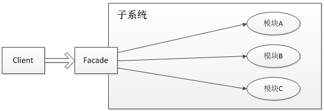

## 原理说明

slf4j是门面模式的典型应用，因此在讲slf4j前，我们先简单回顾一下门面模式，

门面模式，其核心为外部与一个子系统的通信必须通过一个统一的外观对象进行，使得子系统更易于使用。用一张图来表示门面模式的结构为：




门面模式的核心为Facade即门面对象，门面对象核心为几个点：

* 知道所有子角色的功能和责任
* 将客户端发来的请求委派到子系统中，没有实际业务逻辑
* 不参与子系统内业务逻辑的实现


解决这个问题的方式就是引入一个适配层，由适配层决定使用哪一种日志系统，而调用端只需要做的事情就是打印日志而不需要关心如何打印日志，slf4j或者commons-logging就是这种适配层，slf4j是本文研究的对象。


从上面的描述，我们必须清楚地知道一点：slf4j只是一个日志标准，并不是日志系统的具体实现。理解这句话非常重要，slf4j只做两件事情：

* 提供日志接口
* 提供获取具体日志对象的方法


slf4j的直接/间接实现有slf4j-simple、logback、slf4j-log4j12。slf4j-simple、logback都是slf4j的具体实现，log4j并不直接实现slf4j，但是有专门的一层桥接slf4j-log4j12来实现slf4j。


> log4j本身并不提供slf4j的实现，自己可以独立使用。但是logback不行。


### LoggerFactory源码分析

> 自己阅读了源码

在编译的时候，绑定具体的日志试下类。并且当前环境应该只有一个具体的日志实现类。

* slf4j-api作为slf4j的接口类，使用在程序代码中，这个包提供了一个Logger类和LoggerFactory类，Logger类用来打日志，LoggerFactory类用来获取Logger；slf4j-log4j是连接slf4j和log4j的桥梁，怎么连接的呢？我们看看slf4j的LoggerFactory类的getLogger函数的源码 


```
/**
   * Return a logger named corresponding to the class passed as parameter, using
   * the statically bound {@link ILoggerFactory} instance.
   *
   * @param clazz the returned logger will be named after clazz
   * @return logger
   */
  public static Logger getLogger(Class clazz) {
    return getLogger(clazz.getName());
  }
  /**
   * Return a logger named according to the name parameter using the statically
   * bound {@link ILoggerFactory} instance.
   *
   * @param name The name of the logger.
   * @return logger
   */
  public static Logger getLogger(String name) {
    ILoggerFactory iLoggerFactory = getILoggerFactory();
    return iLoggerFactory.getLogger(name);
  }
 
    public static ILoggerFactory getILoggerFactory() {
    if (INITIALIZATION_STATE == UNINITIALIZED) {
      INITIALIZATION_STATE = ONGOING_INITIALIZATION;
      performInitialization();
    }
    switch (INITIALIZATION_STATE) {
      case SUCCESSFUL_INITIALIZATION:
        return StaticLoggerBinder.getSingleton().getLoggerFactory();
      case NOP_FALLBACK_INITIALIZATION:
        return NOP_FALLBACK_FACTORY;
      case FAILED_INITIALIZATION:
        throw new IllegalStateException(UNSUCCESSFUL_INIT_MSG);
      case ONGOING_INITIALIZATION:
        // support re-entrant behavior.
        // See also http://bugzilla.slf4j.org/show_bug.cgi?id=106
        return TEMP_FACTORY;
    }
    throw new IllegalStateException("Unreachable code");
  }
```

* LoggerFactory.getLogger()首先获取一个ILoggerFactory接口，然后使用该接口获取具体的Logger。获取ILoggerFactory的时候用到了一个StaticLoggerBinder类，仔细研究我们会发现StaticLoggerBinder这个类并不是slf4j-api这个包中的类，而是slf4j-log4j包中的类，这个类就是一个中间类，它用来将抽象的slf4j变成具体的log4j，也就是说具体要使用什么样的日志实现方案，就得靠这个StaticLoggerBinder类。再看看slf4j-log4j包种的这个StaticLoggerBinder类创建ILoggerFactory长什么样子


```java
private final ILoggerFactory loggerFactory;
 
  private StaticLoggerBinder() {
    loggerFactory = new Log4jLoggerFactory();
    try {
      Level level = Level.TRACE;
    } catch (NoSuchFieldError nsfe) {
      Util
          .report("This version of SLF4J requires log4j version 1.2.12 or later. See also http://www.slf4j.org/codes.html#log4j_version");
    }
  }
 
  public ILoggerFactory getLoggerFactory() {
    return loggerFactory;
  }
```

* 可以看到slf4j-log4j中的StaticLoggerBinder类创建的ILoggerFactory其实是一个org.slf4j.impl.Log4jLoggerFactory，这个类的getLogger函数是这样的
  
  
```

  public Logger getLogger(String name) {
    Logger slf4jLogger = loggerMap.get(name);
    if (slf4jLogger != null) {
      return slf4jLogger;
    } else {
      org.apache.log4j.Logger log4jLogger;
      if(name.equalsIgnoreCase(Logger.ROOT_LOGGER_NAME))
        log4jLogger = LogManager.getRootLogger();
      else
        log4jLogger = LogManager.getLogger(name);
 
      Logger newInstance = new Log4jLoggerAdapter(log4jLogger);
      Logger oldInstance = loggerMap.putIfAbsent(name, newInstance);
      return oldInstance == null ? newInstance : oldInstance;
    }
```