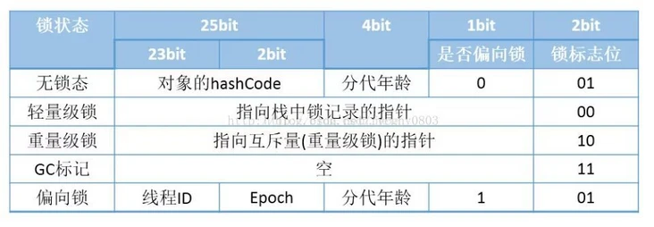

# java并发机制与底层实现原理
## 1 volatile
volatile是轻量级的synchronize,它在多处理器开发中保证了共享变量的“可见性”，因为它不会引起线程上下文的切换和调度，所以比synchronize的使用和执行成本更底。
为了提高处理速度,处理器不直接和内存进行通信,而是先将系统内存的数据读到内部缓存(L1,L2或其他)后再进行操作,但操作完不知道何时会写到内存。使用volatile变量，在操作后，JVM会发出lock指令

将当前处理器缓存行的数据写回到系统内存
这个写回内存的操作会使在其他cpu里缓存了该内存地址的数据无效

## 2 synchronize
### 同步基础
synchronize实现同步的基础，具体表现为三种形式

* 对于普通同步方法，锁是当前实例对象
* 对于静态同步方法，锁是当前类的class对象
* 对于同步方法块，锁是Synchronize括号里配置的对象
* 当一个线程试图访问同步代码块时，它首先必须得到锁，退出或抛出异常时必须释放锁。那么锁到底存在那里，锁里会存储什么信息。

### java对象头
synchonize用的锁是存在java对象头里的。如果对象是数组类型，则JVM用三个字宽存储对象头，如果对象为非数组类型，则用二个字宽存储对象头。32位中，一字宽等于四字节(32bit)

<table>
<tbody><tr>
<td>长度</td>
<td>内容</td>
<td>说明</td>
</tr>
<tr>
<td>32/64bit</td>
<td>Mark Word</td>
<td>存储对象的hashCode或锁信息等。</td>
</tr>
<tr>
<td>32/64bit</td>
<td>Class Metadata Address</td>
<td>存储到对象类型数据的指针</td>
</tr>
<tr>
<td>32/64bit</td>
<td>Array length</td>
<td>数组的长度（如果当前对象是数组)</td>
</tr>
</tbody></table>

在运行期间Mark Word里存存储的数据会随着锁标志位的变化而变化。会成为下面的一种

## 3 锁类型
为了减少获得锁与释放锁所带来的性能消耗，引入“偏向锁”和“轻量级锁'.所以在java中存在四种状态

* 无锁状态
* 偏向锁状态
* 轻量级锁状态
* 自旋锁
* 重量级锁状态

它会随着竞争情况逐渐升级。锁可以升级但不能降级，意味着偏向锁升级成轻量级锁后不能降级成偏向锁

### 偏向锁
Hotspot的作者经过以往的研究发现大多数情况下锁不仅不存在多线程竞争，而且总是由同一线程多次获得，为了让线程获得锁的代价更低而引入了偏向锁。当一个线程访问同步块并获取锁时，会在对象头和栈帧中的锁记录里存储锁偏向的线程ID，以后该线程在进入和退出同步块时不需要花费CAS操作来加锁和解锁。

流程图中展示偏向锁的获取释放以及升级至轻量锁

### 轻量级锁
1. 轻量级锁加锁:
线程在执行同步块之前，JVM会先在当前线程的栈桢中创建用于存储锁记录的空间，并将对象头中的Mark Word复制到锁记录中，官方称为Displaced Mark Word。然后线程尝试使用CAS将对象头中的Mark Word替换为指向锁记录的指针。如果成功，当前线程获得锁，如果失败，表示其他线程竞争锁，当前线程便尝试使用自旋来获取锁。

2. 轻量级锁解锁
轻量级解锁时，会使用原子的CAS操作来将Displaced Mark Word替换回到对象头，如果成功，则表示没有竞争发生。如果失败，表示当前锁存在竞争，锁就会膨胀成重量级锁。下图是两个线程同时争夺锁，导致锁膨胀的流程图。

借用网上流程图如下:

### 自旋锁
当竟争存在时，如果线程可以很快获得锁，那么可以不在OS层挂起线程（线程切换平均消耗8K个时钟周期），让线程多做几个空操作（自旋）

1. 如果同步块过长，自旋失败，会降低系统性能
2. 如果同步块很短，自旋成功，节省线程挂起切换时间，担升系统性能

## 4 锁对比

<table>
<tbody><tr>
<td>锁</td>
<td align="center">优点</td>
<td align="center">缺点</td>
<td align="center">适用场景</td>
</tr>
<tr>
<td>偏向锁</td>
<td>加锁和解锁不需要额外的消耗，和执行非同步方法比仅存在纳秒级的差距。</td>
<td>如果线程间存在锁竞争，会带来额外的锁撤销的消耗。</td>
<td>适用于只有一个线程访问同步块场景。&lt;/td</td>
</tr>
<tr>
<td>轻量级锁</td>
<td>竞争的线程不会阻塞，提高了程序的响应速度。</td>
<td>如果始终得不到锁竞争的线程使用自旋会消耗CPU</td>
<td>追求响应时间。同步块执行速度非常快。</td>
</tr>
<tr>
<td>重量级锁</td>
<td>线程竞争不使用自旋，不会消耗CPU。</td>
<td>线程阻塞，响应时间缓慢。</td>
<td>追求吞吐量。同步块执行速度较长。</td>
</tr>
</tbody></table>

总结
* 偏向锁，轻量级锁，自旋锁不是JAVA语言层上的优化方法
* 内置于JVM中的获取锁的优化方法与获取锁的步骤
  * 偏向锁可用可先尝试偏向锁
  * 轻量级锁可用可先尝试轻量级锁
  * 1与2都失败，则尝试自旋锁
  * 再失败，尝试普通锁，使用OS互斥量在操作系统层挂起