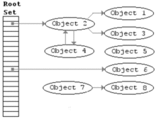
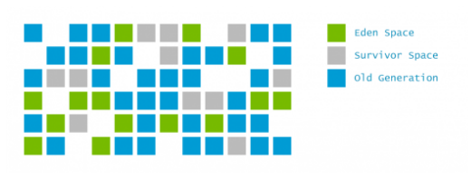

## 1 JVM Memory Model

### JVM内存模型和结构

Java虚拟机定义了在程序执行期间使用的各种run-time data areas 。 其中一些数据区域是在Java虚拟机启动时创建的，仅在Java虚拟机退出时才被销毁。 其他数据区域是每个线程的。 在创建线程时创建每个线程的数据区域，并在线程退出时销毁每个数据区域。


### 堆区Heap Area

堆区代表运行时数据区，从中为所有类实例和数组分配内存，并在虚拟机启动期间创建。

自动存储管理系统回收对象的堆存储。 堆的大小可以是固定的或动态的（基于系统的配置），并且分配给堆区域的内存不必是连续的。

### 方法区Method Area

方法区域存储每个类的结构，例如运行时常量池； 领域和方法数据； 方法和构造函数的代码，包括用于类，实例和接口初始化的特殊方法。

方法区域是在虚拟机启动时创建的。 尽管从逻辑上讲它是堆的一部分，但是可以或不能将其进行垃圾收集，而我们已经读到堆中的垃圾收集不是可选的； 这是强制性的。 方法区域可以是固定大小的，或者可以根据计算的需要进行扩展，如果不需要更大的方法区域，则可以缩小。 方法区域的内存不必是连续的。

### 堆栈区JVM Stacks
每个JVM线程都有一个与该线程同时创建的私有堆栈。 堆栈存储帧。 框架用于存储数据和部分结果，并执行动态链接，方法的返回值和调度异常。

它保存局部变量和部分结果，并在方法调用和返回中起作用。 因为除了压入和弹出帧外，从不直接操纵此堆栈，所以可以对帧进行堆分配。 与堆类似，此堆栈的内存不必是连续的。

该规范允许堆栈的大小可以是固定的，也可以是动态的。 如果具有固定大小，则在创建该堆栈时可以独立选择每个堆栈的大小。

### 原生堆栈Native method stacks
本机方法堆栈称为C堆栈； 它支持本机方法（用Java编程语言以外的其他语言编写的方法），通常在创建每个线程时为每个线程分配。 无法加载本机方法并且自身不依赖于常规堆栈的Java虚拟机实现不需要提供本机方法堆栈。

本机方法堆栈的大小可以是固定的，也可以是动态的。


### PC registers
每个JVM线程都有其自己的程序计数器（pc）寄存器。 在任何时候，每个JVM线程都在执行单个方法的代码，即该线程的当前方法。

由于Java应用程序可以包含一些本机代码（例如，使用本机库），因此本机和非本机方法有两种不同的方式。 如果该方法不是本机的（即Java代码），则PC寄存器包含当前正在执行的JVM指令的地址。 如果该方法是本地方法，则未定义JVM的PC寄存器的值。

Java虚拟机的pc寄存器足够宽，可以在特定平台上保存返回地址或本机指针。


## 2 Java 内存管理Memory management

### GC概念

Java中的Memory management是垃圾收集器的职责。 

* allocating memory
* 确保所有引用的对象都保留在内存中，并且
* 恢复由执行代码中的引用无法访问的对象使用的内存。


在应用程序运行时，应用程序会创建许多对象，每个对象都有其生命周期。 在内存中，被其他对象引用的对象被称为live objects 。 不再由任何活动对象引用的对象被视为dead objects ，并称为garbage 。 查找和释放（也称为回收）这些对象使用的空间的过程称为garbage collection 。


垃圾回收解决了许多但不是全部的内存分配问题。 例如，我们可以无限期地创建对象并继续引用它们，直到没有更多可用内存为止（ Out of memory error ）。 垃圾收集是一项复杂的任务，需要花费时间和资源。 它在通常由称为堆的大型内存池分配的空间上运行。

垃圾收集的时间取决于垃圾收集器。 通常，整个堆或堆的一部分会在堆满或达到占用率的百分比时收集。

### 引用计数机制Reference counting mechanism

非常古老的GC机制。 在引用计数技术中，每个对象都有从其他对象和堆栈指向该对象的指针数。 每次引用新对象时，计数器都会增加一。 同样，当任何对象丢失其引用时，计数器将减一。 当count达到'0'时，垃圾回收器可以取消分配对象。


引用计数算法的主要advantage是分配给新对象时每次内存写入工作量少。 但是，它在data cycles方面存在非常critical problem 。 这意味着当第一个对象被第二个对象引用，第二个对象被第一个对象（ cyclic references ） cyclic references ，计数永远不会为零，因此它们永远不会被垃圾回收。

### 标记清除机制Mark and sweep mechanism



标记清除算法是第一个开发的able to reclaim cyclic data structures垃圾收集算法。 在这种算法中，GC将首先将某些对象标识为默认可达对象，这些对象通常是堆栈中的全局变量和局部变量。 有所谓的活动对象。

在下一步中，算法开始从这些活动对象中跟踪对象，并将它们也标记为活动对象。 继续执行此过程，直到检查所有对象并将其标记为活动。 完全跟踪后未标记为活动的对象被视为死对象。

使用标记扫描时，未引用的对象不会立即被回收。 取而代之的是，允许垃圾收集累积，直到所有可用内存都用完为止。 发生这种情况时，该程序的执行会暂时暂停（这称为stop the world ），而标记清除算法会收集所有垃圾。 一旦回收了所有未引用的对象，就可以恢复程序的正常执行。

除了暂停应用程序一段时间外，该技术还需要经常对内存地址空间de-fragmentation整理，这是另一项开销。


### 停止copy机制Stop and copy GC
像“标记和清除”一样，该算法还取决于识别活动对象并对其进行标记。 区别在于它处​​理活动对象的方式。

停止和复制技术将整个堆设计为两个semi-spaces 。 一次只有一个半空间处于活动状态，而为新创建的对象分配的内存仅发生在单个半空间中，而另一个保持平静。

GC运行时，它将开始标记当前半空间中的活动对象，完成后，它将所有活动对象复制到其他半空间中。 当前半空间中的所有其余对象都被视为已死，并已被垃圾回收。

与以前的方法一样，它具有一些advantages例如仅接触活动对象。 另外，不需要分段，因为在切换半memory contraction会完成memory contraction 。

这种方法的主要disadvantages是需要将所需的内存大小增加一倍，因为在给定的时间点仅使用一半的内存。 除此之外，它还需要在切换半空间时停止世界。


### 世代停止复制机制Generational stop and copy


将内存划分为三个半空间。 这些半空间在这里称为世代。 因此，此技术中的内存分为三代： young generation ， old generation和permanent generation 。

大多数对象最初是在年轻一代中分配的。 老一代包含的对象在许多年轻一代集合中幸存下来，还有一些大型对象可以直接在老一代中分配。 永久生成包含JVM认为便于垃圾回收器管理的对象，例如描述类和方法的对象，以及类和方法本身。

当年轻一代填满时，将执行该一代的年轻一代垃圾收集（有时称为minor collection垃圾minor collection ）。 当旧的或永久的一代填满时，通常会完成所谓的完整垃圾回收（有时称为major collection垃圾major collection ）。 即，收集了所有的世代。

通常，首先使用专门为该代设计的垃圾收集算法来收集年轻代，因为它通常是识别年轻代中最有效的垃圾算法。 幸存于GC跟踪中的对象被推入更早的年代。 出于明显的原因，较老的一代被收集的频率较低，即它们在那里是因为时间更长。 除上述情况外，如果发生碎片/压缩，则每一代都将单独压缩。

该技术的主要advantages是可以在较年轻的一代中早期回收死对象，而无需每次都扫描整个内存以识别死对象。 较早的对象已经经历了一些GC周期，因此假定它们在系统中的存在时间更长，因此无需频繁扫描它们（不是每次都完美的情况，但大多数情况下应该如此）。

Disadvantages还是一样，即需要对存储区进行碎片整理，并且需要在GC运行全扫描时停止整个环境（应用程序）


## 3 垃圾回收的策略

### mark and sweep标记清除算法

它是初始且非常基本的算法，分为两个阶段运行：

* Marking live objects –找出所有仍然存在的对象。
* Removing unreachable objects -摆脱所有其他东西-所谓的已死和未使用的对象。

第一阶段介绍：
1. mark live objects。首先，GC将某些特定对象定义为“ Garbage Collection Roots 。 例如，当前执行方法的局部变量和输入参数，活动线程，已加载类的静态字段和JNI引用。 现在，GC遍历了内存中的整个对象图，从这些根开始，然后是从根到其他对象的引用。 GC访问的每个对象都被标记为活动对象。


第二阶段介绍
1. mark-sweep。Normal deletion 普通删除将未引用的对象删除以释放空间并保留引用的对象和指针。 内存分配器（某种哈希表）保存对可分配新对象的可用空间块的引用。它通常被称为mark-sweep算法。


1. mark-sweep-compact 。Deletion with compacting仅删除未使用的对象效率不高，因为可用内存块分散在整个存储区域中，并且如果创建的对象足够大且找不到足够大的内存块，则会导致OutOfMemoryError 。为了解决此问题，删除未引用的对象后，将对其余的引用对象进行压缩。 这里的压缩指的是将参考对象一起移动的过程。 这使得新的内存分配变得更加容易和快捷。它通常被称为mark-sweep-compact算法。


4. mark-copy 。Deletion with copying –与标记和补偿方法非常相似，因为它们也会重新放置所有活动对象。 重要的区别是重定位的目标是不同的存储区域。它通常被称为mark-copy算法。


### Concurrent mark sweep (CMS) 

CMS垃圾回收实质上是一种升级的标记和清除方法。 它using multiple threads扫描堆内存。 对其进行了修改，以利用更快的系统并增强了性能。它尝试通过与应用程序线程concurrently执行大多数垃圾回收工作来最大程度地减少由于垃圾回收导致的​​暂停。 它在年轻一代中使用并行的世界停止mark-copy算法，而在老一代中使用大多数并发的mark-sweep算法。
```java
-XX:+UseConcMarkSweepGC
```


### Serial garbage collection

该算法对年轻一代使用mark-copy ，对老一代使用mark-copy mark-sweep-compact 。 它在单个线程上工作。 执行时，它将冻结所有其他线程，直到垃圾回收操作结束。由于串行垃圾回收具有线程冻结特性，因此仅适用于非常小的程序。要使用串行GC，请使用以下JVM参数：
```java
-XX:+UseSerialGC
```

### Parallel garbage collection

与串行GC相似，它在年轻一代中使用mark-copy ，在旧一代中使用mark-sweep-compact 。 多个并发线程用于标记和复制/压缩阶段。 您可以使用-XX:ParallelGCThreads=N选项配置线程数。如果您的主要目标是通过有效利用现有系统资源来提高吞吐量，那么Parallel Garbage Collector将适用于多核计算机。 使用这种方法，可以大大减少GC循环时间。
```java
-XX:+UseParallelGC 
```

### G1 garbage collection

G1（垃圾优先）垃圾收集器已在Java 7中提供，旨在长期替代CMS收集器。 G1收集器是并行的，并发的，渐进压缩的低暂停垃圾收集器。此方法涉及将内存堆分段为多个小区域（通常为2048）。 每个区域都被标记为年轻一代（进一步划分为伊甸园地区或幸存者地区）或老一代。 这样，GC可以避免立即收集整个堆，而可以逐步解决问题。 这意味着一次只考虑区域的一个子集。
   1. G1跟踪每个区域包含的实时数据量。 此信息用于确定包含最多垃圾的区域。 因此它们是首先收集的。 
   2. 这就是为什么它是名称garbage-first集合。与其他算法一样，不幸的是，压缩操作是使用Stop the World方法进行的。 但是根据其设计目标，您可以为其设置特定的性能目标。 您可以配置暂停持续时间，例如在任何给定的秒内不超过10毫秒。 垃圾优先GC将尽最大可能（但不能确定，由于OS级线程管理，这很难实时实现）来尽力实现该目标。


```java
-XX:+UseG1GC

-XX:G1HeapRegionSize=16m based on the minimum Java heap size.
-XX:MaxGCPauseMillis=200
-XX:G1ReservePercent=5
-XX:GCPauseIntervalMillis=200
```

### 总结
* 对象生命周期分为三个阶段，即对象创建，对象使用和对象销毁。
* mark-sweep ， mark-sweep-compact和mark-copy机制如何工作。
* 不同的单线程和并发GC算法。
* 直到Java 8，并行GC才是默认算法。
* 从Java 9开始，将G1设置为默认GC算法。
