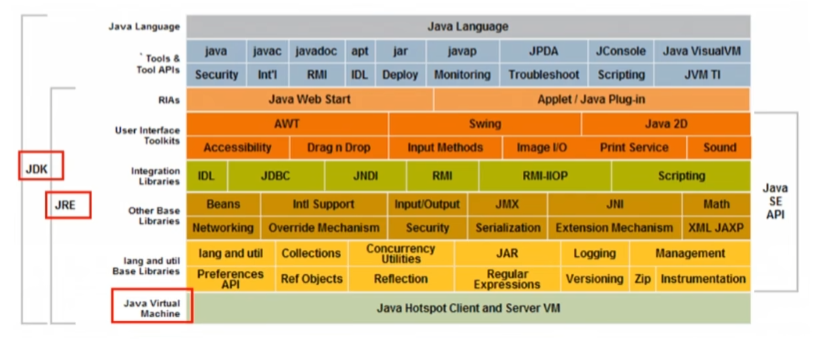
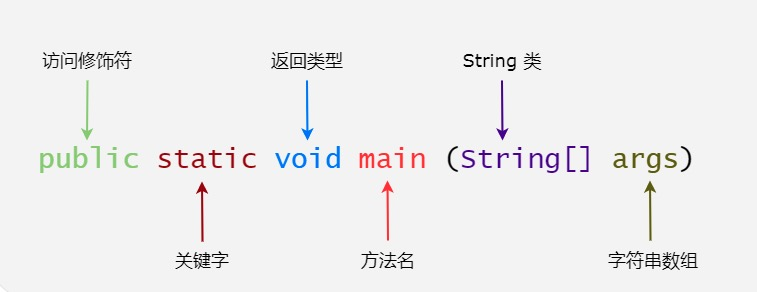

# Java 基础
<!-- GFM-TOC -->
- [Java 基础](#java-基础)
  - [0 引言](#0-引言)
    - [Java特性和优势](#java特性和优势)
    - [JDK、JRE和JVM](#jdkjre和jvm)
    - [编译和解释](#编译和解释)
    - [Java 各版本的新特性](#java-各版本的新特性)
    - [Java 与 C++ 的区别](#java-与-c-的区别)
    - [第一个Java程序](#第一个java程序)
    - [位、字节、字符、字长](#位字节字符字长)
  - [1 注释、标识符和关键字](#1-注释标识符和关键字)
    - [注释](#注释)
    - [标识符](#标识符)
    - [关键字](#关键字)
  - [2 数据类型](#2-数据类型)
    - [基本类型](#基本类型)
    - [引用类型](#引用类型)
    - [包装类型](#包装类型)
    - [字面值和转义字符](#字面值和转义字符)
  - [3 基本类型转换](#3-基本类型转换)
    - [转换规则](#转换规则)
    - [float 与 double](#float-与-double)
    - [隐式类型转换](#隐式类型转换)
    - [显示类型转换](#显示类型转换)
  - [4 变量常量](#4-变量常量)
    - [变量](#变量)
    - [变量作用域](#变量作用域)
    - [变量初始化](#变量初始化)
    - [常量](#常量)
    - [变量的命名规则](#变量的命名规则)
  - [5 运算符](#5-运算符)
    - [算术运算符](#算术运算符)
    - [关系运算符](#关系运算符)
    - [位运算符](#位运算符)
    - [逻辑运算符](#逻辑运算符)
    - [赋值运算符](#赋值运算符)
    - [条件运算符（?:）](#条件运算符)
    - [instanceof 运算符](#instanceof-运算符)
    - [运算符优先级](#运算符优先级)
  - [6 包机制和JavaDoc](#6-包机制和javadoc)
    - [包机制](#包机制)
    - [JavaDoc](#javadoc)
<!-- GFM-TOC -->

## 0 引言

### Java特性和优势

> write once run anywhere

1. 面向对象
2. 可移植性
3. 高性能（即时编译和预编译）
4. 分布式
5. 动态性
6. 多线程
7. 安全性、健壮性（没有指针和内存的管理、垃圾回收机制）

### JDK、JRE和JVM




- JRE：Java Runtime Environment，Java 运行环境的简称，为 Java 的运行提供了所需的环境。它是一个 JVM 程序，主要包括了 JVM 的标准实现和一些 Java 基本类库。
- JDK：Java Development Kit，Java 开发工具包，提供了 Java 的开发及运行环境。JDK 是 Java 开发的核心，集成了 JRE 以及一些其它的工具，比如编译 Java 源码的编译器 javac 等。

### 编译和解释

Java既需要编译也需要解释执行。
1. Java编译器，将源代码转换成虚拟机能够识别的字节码。
2. Java解释器，编译器识别字节码，转换为机器能够识别的机器码。


### Java 各版本的新特性

**New highlights in Java SE 8**  

1. Lambda Expressions
2. Pipelines and Streams
3. Date and Time API
4. Default Methods
5. Type Annotations
6. Nashhorn JavaScript Engine
7. Concurrent Accumulators
8. Parallel operations
9. PermGen Error Removed

**New highlights in Java SE 7**  

1. Strings in Switch Statement
2. Type Inference for Generic Instance Creation
3. Multiple Exception Handling
4. Support for Dynamic Languages
5. Try with Resources
6. Java nio Package
7. Binary Literals, Underscore in literals
8. Diamond Syntax

- [Difference between Java 1.8 and Java 1.7?](http://www.selfgrowth.com/articles/difference-between-java-18-and-java-17)
- [Java 8 特性](http://www.importnew.com/19345.html)

### Java 与 C++ 的区别

- Java 是纯粹的面向对象语言，所有的对象都继承自 java.lang.Object，C++ 为了兼容 C 即支持面向对象也支持面向过程。
- Java 通过虚拟机从而实现跨平台特性，但是 C++ 依赖于特定的平台。
- Java 没有指针，它的引用可以理解为安全指针，而 C++ 具有和 C 一样的指针。
- Java 支持自动垃圾回收，而 C++ 需要手动回收。
- Java 不支持多重继承，只能通过实现多个接口来达到相同目的，而 C++ 支持多重继承。
- Java 不支持操作符重载，虽然可以对两个 String 对象执行加法运算，但是这是语言内置支持的操作，不属于操作符重载，而 C++ 可以。
- Java 的 goto 是保留字，但是不可用，C++ 可以使用 goto。

[What are the main differences between Java and C++?](http://cs-fundamentals.com/tech-interview/java/differences-between-java-and-cpp.php)

### 第一个Java程序




### 位、字节、字符、字长

1. 位，bit
2. 字节，8,16位
3. 字符，计算机中使用的字母、数字和符号
4. 字、字长，操作系统的寻址空间。

## 1 注释、标识符和关键字

### 注释
```java
//单行注释

/*
多行注释
*/
```

``` java
/**
 * Java Doc 中的祖师格式
 * /
```

### 标识符
标识变量、方法、类和对象的名字。
* 所有的标识符都应该以字母（A-Z 或者 a-z）,美元符（$）、或者下划线（_）开始
* 首字符之后可以是字母（A-Z 或者 a-z）,美元符（$）、下划线（_）或数字的任何字符组合
* 关键字不能用作标识符
* 标识符是大小写敏感的

### 关键字

| abstract | assert       | boolean  | break      |
|----------|--------------|----------|------------|
| byte     | case         | catch    | char       |
| class    | const        | continue | default    |
| do       | double       | else     | enum       |
| extends  | final        | finally  | float      |
| for      | goto         | if       | implements |
| import   | instanceof   | int      | interface  |
| long     | native       | new      | package    |
| private  | protected    | public   | return     |
| short    | static       | strictfp | super      |
| switch   | synchronized | this     | throw      |
| throws   | transient    | try      | void       |
| volatile | while        |


## 2 数据类型
强类型语言，所有变量必须先定义后使用。可以分为
1. 基本类型
2. 引用类型
3. 基本类型对应的引用类型，称为包装类型
### 基本类型
- 整数类型
  - byte/8
  - short/16
  - int/32
  - long/64
- 浮点数类型
  - float/32
  - double/64
- 字符类型
  - char/16
- 布尔类型
  - boolean/1

boolean 只有两个值：true、false，可以使用 1 bit 来存储，但是具体大小没有明确规定。JVM 会在编译时期将 boolean 类型的数据转换为 int，使用 1 来表示 true，0 表示 false。JVM 支持 boolean 数组，但是是通过读写 byte 数组来实现的。


> float和double的比较问题
> * java里的相等判断是检查类型的。float和double之间无法直接判断是否相等。
> * float和double采用科学技术发进行存储，对较大的值有很高的舍入误差。无法直接判断相等。
> * 银行业务中数据应该使用BigDeceimal来表示钱，防止舍入误差的影响。

> 字符和数值类型可以相互转换
> * 所有字符类型可以强制转换为数字， 本质上也是一种数字。
> * 默认使用unicode编码，占用两个字节。
> `char c = '\u0061'`表示字母a。


> 布尔类型
> ```
> boolean flag = true;
> if(flag == true){}
> if(flag){}
> //代码精简
> ```

> 整数类型
> 0b二进制
> 0八进制 
> 0十六进制
### 引用类型
由基本数据类型按照某种方式组合出来的类型。

1. 类（随机组合变量和方法）
2. 接口（随机组合方法）
3. 数组（顺序排列的变量）

### 包装类型

基本类型都有对应的包装类型，基本类型与其对应的包装类型之间的赋值使用自动装箱与拆箱完成。包装类型是基本类型对应的引用类型。

* byte,Byte
* short,Short
* int,Integer
* long,Long
* float,Float
* double,Double,
* char,Char
* boolean,Boolean

 

```java
Integer x = 2;     // 装箱 调用了 Integer.valueOf(2)
int y = x;         // 拆箱 调用了 X.intValue()
```

- [Autoboxing and Unboxing](https://docs.oracle.com/javase/tutorial/java/data/autoboxing.html)

### 字面值和转义字符
* 不同进制的整数
```java
int i=10;//十进制
int i =0b00101;//二进制
int i=010;//八进制
int i=0x10//十六进制
```

* 不同编码的字符串

```java
"这是一个字符串"//字符串的字面值
"\u0061"//unnicode编码的字符
```

* 不同的转移字符
```
\t 制表位
\n 换行符
\b 退格键
\r 回车
\'
\"
\\
```


## 3 基本类型转换
### 转换规则
运算中不同类型的数据首先转换为同一类型然后进行运算。
* 默认转换规则

```
byte/short/char->int->long->float->double
```
* 自动类型转换，隐式类型转换，由低到高会自动进行类型转换
* 强制类型转换，从高到低需要进行强制类型转换

> 注意事项
> * 不能对布尔值进行转换
> * 不能把对象转换为不相关的类型
> * 转换的时候会存在内存溢出或者精度问题

### float 与 double

Java 不能隐式执行向下转型，因为这会使得精度降低。

1.1 字面量属于 double 类型，不能直接将 1.1 直接赋值给 float 变量，因为这是向下转型。

```java
// float f = 1.1;
```

1.1f 字面量才是 float 类型。

```java
float f = 1.1f;
```

### 隐式类型转换

因为字面量 1 是 int 类型，它比 short 类型精度要高，因此不能隐式地将 int 类型向下转型为 short 类型。

```java
short s1 = 1;
// s1 = s1 + 1;
```

但是使用 += 或者 ++ 运算符会执行隐式类型转换。

```java
s1 += 1;
s1++;
```

上面的语句相当于将 s1 + 1 的计算结果进行了向下转型：

```java
s1 = (short) (s1 + 1);
```

### 显示类型转换


[StackOverflow : Why don't Java's +=, -=, *=, /= compound assignment operators require casting?](https://stackoverflow.com/questions/8710619/why-dont-javas-compound-assignment-operators-require-casting)

## 4 变量常量

### 变量
可以变化的量。
1. Java是一种强类型语言，每个变量都必须声明其类型。
2. Java变量是程序中最基本的存储单元，其元素包括变量名，变量类型和作用域。

```
数据类型 变量名 = 变量值;
type varName [=value] [{,varName[=value]}];
```

> 不建议在一行中定义多个值。提高程序的可读性。


### 变量作用域

1. 类变量，static修饰的变量
2. 实例变量，从属于对象的变量
3. 局部变量，方法中的变量
```java
public class Variable{
  static int a =0;//类变量
  String str = "helloworld";//实例变量

  public void method(){
    int i = 0;//局部变量
  }
}
```

变量的范围是程序中该变量可以被引用的部分。

1. 方法内定义的变量被称为局部变量。局部变量的作用范围从声明开始，直到包含它的块结束。
2. 局部变量必须声明才可以使用。
3. 方法的参数范围涵盖整个方法。参数实际上是一个局部变量。
4. for循环的初始化部分声明的变量，其作用范围在整个循环。循环体内声明的变量其适用范围是从它声明到循环体结束。它包含如下所示的变量声明：
### 变量初始化
实例变量初始化规则
1. 如果没有初始化函数默认初始化Wie0
2. 布尔值默认是false
3. 引用变量的默认初始值都是null


### 常量

1. 初始化后不能改变的值。
2. 特殊的变量，值被设定后不能进行改变。
3. 使用final声明常量。

### 变量的命名规则

1. 见名知意
2. 类成员变量、局部变量，首字母小写驼峰命名helloWrold
3. 常量，大写字母+下划线HELLO_WORLD
4. 类名，HelloWorld
5. 方法名，首字母小写+驼峰命名 helloWorld()

## 5 运算符

### 算术运算符
| 操作符 | 描述               | 例子                  |
|-----|------------------|---------------------|
| +   | 加法-相加运算符两侧的值     | A+B等于30             |
| -   | 减法-左操作数减去右操作数    | A–B等于-10            |
| *   | 乘法-相乘操作符两侧的值     | A*B等于200            |
| /   | 除法-左操作数除以右操作数    | B/A等于2              |
| ％   | 取余-左操作数除以右操作数的余数 | B%A等于0              |
| ++  | 自增:操作数的值增加1      | B++或++B等于21（区别详见下文） |
| --  | 自减:操作数的值减少1      | B--或--B等于19（区别详见下文） |

1. 前缀自增自减法(++a,--a): 先进行自增或者自减运算，再进行表达式运算。
2. 后缀自增自减法(a++,a--): 先进行表达式运算，再进行自增或者自减运算


### 关系运算符

|   运算符        |   描述                               |   例子             |
|--------------|------------------------------------|------------------|
|   ==         |   检查如果两个操作数的值是否相等，如果相等则条件为真。       |   （A == B）为假。    |
|   !=         |   检查如果两个操作数的值是否相等，如果值不相等则条件为真。     |   (A != B) 为真。   |
|   &gt;&nbsp; |   检查左操作数的值是否大于右操作数的值，如果是那么条件为真。    |   （A&gt; B）为假。   |
|   &lt;&nbsp; |   检查左操作数的值是否小于右操作数的值，如果是那么条件为真。    |   （A &lt;B）为真。   |
|   &gt;=      |   检查左操作数的值是否大于或等于右操作数的值，如果是那么条件为真。 |   （A&gt; = B）为假。 |
|   &lt;=      |   检查左操作数的值是否小于或等于右操作数的值，如果是那么条件为真。 |   （A &lt;= B）为真。 |

1. 基本类型的值可以直接使用关系运算符判断大小和相等。
2. 引用类型（类的对象、类的实例）的变量，需要通过重写equals方法来判断两个变量是否相等。引用类型的等于判断，是判断两个对象的地址是否相等。
### 位运算符
Java定义了位运算符，应用于整数类型(int)，长整型(long)，短整型(short)，字符型(char)，和字节型(byte)等类型。

|  操作符                |  描述                                        |  例子                            |
|---------------------|--------------------------------------------|--------------------------------|
|  ＆                  |  如果相对应位都是1，则结果为1，否则为0                      |  （A＆B），得到12，即0000 1100         |
|  |                  |  如果相对应位都是 0，则结果为 0，否则为 1                   |  （A | B）得到61，即 0011 1101       |
|  ^                  |  如果相对应位值相同，则结果为0，否则为1                      |  （A ^ B）得到49，即 0011 0001       |
|  〜                  |  按位取反运算符翻转操作数的每一位，即0变成1，1变成0。              |  （〜A）得到-61，即1100 0011          |
|  &lt;&lt;&nbsp;     |  按位左移运算符。左操作数按位左移右操作数指定的位数。                |  A &lt;&lt; 2得到240，即 1111 0000 |
|  &gt;&gt;&nbsp;     |  按位右移运算符。左操作数按位右移右操作数指定的位数。                |  A &gt;&gt; 2得到15即 1111        |
|  &gt;&gt;&gt;&nbsp; |  按位右移补零操作符。左操作数的值按右操作数指定的位数右移，移动得到的空位以零填充。 |  A&gt;&gt;&gt;2得到15即0000 1111  |


* 运算效率极高，可以用来实现高级的乘法、加法和指数运算。

### 逻辑运算符
| 操作符        | 描述                                               | 例子                 |
|------------|--------------------------------------------------|--------------------|
| &amp;&amp; | 称为逻辑与运算符。当且仅当两个操作数都为真，条件才为真。                     | （A&amp;&amp;B）为假。  |
| 
`||`         | 称为逻辑或操作符。如果任何两个操作数任何一个为真，条件为真。                   | （A`||`B）为真。          |
| ！          | 称为逻辑非运算符。用来反转操作数的逻辑状态。如果条件为true，则逻辑非运算符将得到false。 | ！（A&amp;&amp;B）为真。 |

* 短路运算。当使用与逻辑运算符时，在两个操作数都为true时，结果才为true，但是当得到第一个操作为false时，其结果就必定是false，这时候就不会再判断第二个操作了。


### 赋值运算符

| 操作符        | 描述                             | 例子                                |
|------------|--------------------------------|-----------------------------------|
| =          | 简单的赋值运算符，将右操作数的值赋给左侧操作数        | C = A + B将把A + B得到的值赋给C           |
| + =        | 加和赋值操作符，它把左操作数和右操作数相加赋值给左操作数   | C + = A等价于C = C + A               |
| - =        | 减和赋值操作符，它把左操作数和右操作数相减赋值给左操作数   | C - = A等价于C = C - A               |
| * =        | 乘和赋值操作符，它把左操作数和右操作数相乘赋值给左操作数   | C * = A等价于C = C * A               |
| / =        | 除和赋值操作符，它把左操作数和右操作数相除赋值给左操作数   | C / = A，C 与 A 同类型时等价于 C = C / A   |
| （％）=       | 取模和赋值操作符，它把左操作数和右操作数取模后赋值给左操作数 | C％= A等价于C = C％A                   |
| &lt;&lt; = | 左移位赋值运算符                       | C &lt;&lt; = 2等价于C = C &lt;&lt; 2 |
| &gt;&gt; = | 右移位赋值运算符                       | C &gt;&gt; = 2等价于C = C &gt;&gt; 2 |
| ＆=         | 按位与赋值运算符                       | C＆= 2等价于C = C＆2                   |
| ^ =        | 按位异或赋值操作符                      | C ^ = 2等价于C = C ^ 2               |
| | =        | 按位或赋值操作符                       | C | = 2等价于C = C | 2               |


```java

// java 变量相加，字符串后边都会转换为字符串拼接，字符串前边的执行变量的运算
int a=10,b=20;
System.out.println(""+a+b);
// 1020
System.out.println(a+b+"");
//30
```
### 条件运算符（?:）
条件运算符也被称为三元运算符。该运算符有3个操作数，并且需要判断布尔表达式的值。该运算符的主要是决定哪个值应该赋值给变量。


### instanceof 运算符
该运算符用于操作对象实例，检查该对象是否是一个特定类型（类类型或接口类型）。


### 运算符优先级

| 类别       | 操作符                                                 | 关联性  |
|----------|-----------------------------------------------------|------|
| 后缀       | () [] . (点操作符)                                      | 左到右  |
| 一元       | expr++  expr--                                      | 从左到右 |
| 一元       | ++expr --expr + - ～ ！                               | 从右到左 |
| 乘性&nbsp; | * /％                                                | 左到右  |
| 加性&nbsp; | + -                                                 | 左到右  |
| 移位&nbsp; | &gt;&gt; &gt;&gt;&gt; &nbsp;&lt;&lt;&nbsp;          | 左到右  |
| 关系&nbsp; | &gt;  &gt;=  &lt;  &lt;=&nbsp;                      | 左到右  |
| 相等&nbsp; | ==&nbsp; !=                                         | 左到右  |
| 按位与      | ＆                                                   | 左到右  |
| 按位异或     | ^                                                   | 左到右  |
| 按位或      | `|`                                                  | 左到右  |
| 逻辑与      | &amp;&amp;                                          | 左到右  |
| 逻辑或      | `| |`                                              | 左到右  |
| 条件       | ？：                                                  | 从右到左 |
| 赋值       | = + = - = * = / =％= &gt;&gt; = &lt;&lt; =＆= ^ = | = | 从右到左 |
| 逗号       | ，                                                   | 左到右  |

## 6 包机制和JavaDoc


### 包机制

1. 包是一种文件夹。利用公司域名倒置作为包名package
2. 包是默认的作用域。当前类会自动导入当前包作用域中的类和变量。
3. 通过导入包中的类，可以使用其他包中的类。import


### JavaDoc

```java
/**
 * @author
 * @version 1.0
 * @since 1.
 */
public class Doc{
  String name;

  /**
   * @param
   * @return
   * @throws
   */
  public void get(){

  }
}
```
