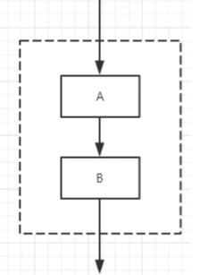

## 1 顺序结构
1. java的基本结构

## 2 选择结构
### if单选结构
```
public class Test {
 
   public static void main(String args[]){
      int x = 10;
 
      if( x < 20 ){
         System.out.print("这是 if 语句");
      }
   }
}
```
### if-else结构
```
public class Test {
 
   public static void main(String args[]){
      int x = 30;
 
      if( x < 20 ){
         System.out.print("这是 if 语句");
      }else{
         System.out.print("这是 else 语句");
      }
   }
}
```

### if-else嵌套

```java
public class Test {
 
   public static void main(String args[]){
      int x = 30;
      int y = 10;
 
      if( x == 30 ){
         if( y == 10 ){
             System.out.print("X = 30 and Y = 10");
          }
       }
    }
}
```
### switch


1. switch 语句中的变量类型可以是： byte、short、int 或者 char。
2. 从 Java SE 7 开始，switch 支持字符串 String 类型了，同时 case 标签必须为字符串常量或字面量。模式使用String的hashCode作为匹配方法。
3. switch 不支持 long、float、double，是因为 switch 的设计初衷是对那些只有少数几个值的类型进行等值判断，如果值过于复杂，那么还是用 if 比较合适。

4. case穿透。如果case后没有break语句，则case条件成立后，会执行后续的所有代码，不会进行后续的判断。


```java
switch(expression){
    case value :
       //语句
       break; //可选
    case value :
       //语句
       break; //可选
    //你可以有任意数量的case语句
    default : //可选
       //语句
}

String s = "a";
switch (s) {
    case "a":
        System.out.println("aaa");
        break;
    case "b":
        System.out.println("bbb");
        break;
}
```

## 3 循环结构

### while

```java
public class Test {
   public static void main(String[] args) {
      int x = 10;
      while( x < 20 ) {
         System.out.print("value of x : " + x );
         x++;
         System.out.print("\n");
      }
   }
}
```

### do…while 循环
对于 while 语句而言，如果不满足条件，则不能进入循环。但有时候我们需要即使不满足条件，也至少执行一次。

do…while 循环和 while 循环相似，不同的是，do…while **循环至少会执行一次**。

```java
public class Test {
   public static void main(String[] args){
      int x = 10;
 
      do{
         System.out.print("value of x : " + x );
         x++;
         System.out.print("\n");
      }while( x < 20 );
   }
}
```


### for循环
虽然所有循环结构都可以用 while 或者 do...while表示，但 Java 提供了另一种语句 —— for 循环，使一些循环结构变得更加简单。

for循环执行的次数是在执行前就确定的。语法格式如下：
```java
for(初始化; 布尔表达式; 更新) {
    //代码语句
}

public class Test {
   public static void main(String[] args) {
 
      for(int x = 10; x < 20; x = x+1) {
         System.out.print("value of x : " + x );
         System.out.print("\n");
      }
   }
}
```


### 增强 for 循环
用来遍历序列和集合。
* 声明语句：声明新的局部变量，该变量的类型必须和数组元素的类型匹配。其作用域限定在循环语句块，其值与此时数组元素的值相等。

* 表达式：表达式是要访问的数组名，或者是返回值为数组的方法。
```java
for(声明语句 : 表达式)
{
   //代码句子
}

public class Test {
   public static void main(String[] args){
      int [] numbers = {10, 20, 30, 40, 50};
 
      for(int x : numbers ){
         System.out.print( x );
         System.out.print(",");
      }
      System.out.print("\n");
      String [] names ={"James", "Larry", "Tom", "Lacy"};
      for( String name : names ) {
         System.out.print( name );
         System.out.print(",");
      }
   }
}
```
## 4 break&continue

### break 关键字
break 主要用在循环语句或者 switch 语句中，用来跳出整个语句块。

break 跳出最里层的循环，并且继续执行该循环下面的语句。

```java
public class Test {
   public static void main(String[] args) {
      int [] numbers = {10, 20, 30, 40, 50};
 
      for(int x : numbers ) {
         // x 等于 30 时跳出循环
         if( x == 30 ) {
            break;
         }
         System.out.print( x );
         System.out.print("\n");
      }
   }
}
```

### continue 关键字
continue 适用于任何循环控制结构中。作用是让程序立刻跳转到下一次循环的迭代。

在 for 循环中，continue 语句使程序立即跳转到更新语句。

在 while 或者 do…while 循环中，程序立即跳转到布尔表达式的判断语句。

```java
public class Test {
   public static void main(String[] args) {
      int [] numbers = {10, 20, 30, 40, 50};
 
      for(int x : numbers ) {
         if( x == 30 ) {
        continue;
         }
         System.out.print( x );
         System.out.print("\n");
      }
   }
}
```
## 5 输入输出对象
