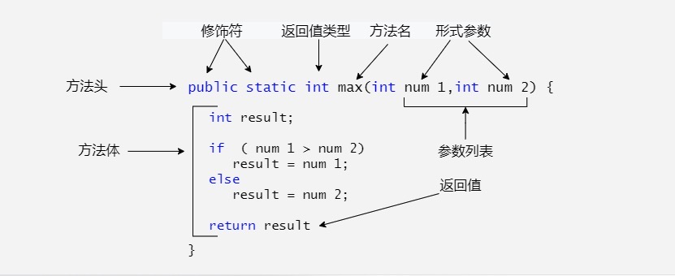

## 1 概述

### 方法定义
Java方法是语句的集合，在一起执行一个功能。
* 方法是解决一类问题的步骤的有序组合。
* 方法包含于类或对象中
* 方法在程序中被创建，在其他地方被引用。

### 方法优点

1. 程序变得简短清晰
2. 有利于程序的维护
3. 提高程序开发的效率
4. 提到了代码的重用性。

### 使用规则
1. 命名，首字母小写，驼峰命名法。
2. 原子性，一个方法值完成一个功能


## 2 方法实现

### 方法定义

```java
修饰符 返回值类型 方法名(参数类型 参数名){
    ...
    方法体
    ...
    return 返回值;
}
```

* 修饰符：修饰符，这是可选的，告诉编译器如何调用该方法。定义了该方法的访问类型。
* 返回值类型 ：方法可能会返回值。returnValueType 是方法返回值的数据类型。有些方法执行所需的操作，但没有返回值。在这种情况下，returnValueType 是关键字void。
* 方法名：是方法的实际名称。方法名和参数表共同构成方法签名。
* 参数类型：参数像是一个占位符。当方法被调用时，传递值给参数。这个值被称为实参或变量。参数列表是指方法的参数类型、顺序和参数的个数。参数是可选的，方法可以不包含任何参数。包括参数类型和参数名。
* 方法体：方法体包含具体的语句，定义该方法的功能。


### 方法调用

* 当程序调用一个方法时，程序的控制权交给了被调用的方法。当被调用方法的返回语句执行或者到达方法体闭括号时候交还控制权给程序。

* 当方法返回一个值的时候，方法调用通常被当做一个值。

```java
public class TestMax {
   /** 主方法 */
   public static void main(String[] args) {
      int i = 5;
      int j = 2;
      int k = max(i, j);
      System.out.println( i + " 和 " + j + " 比较，最大值是：" + k);
   }
 
   /** 返回两个整数变量较大的值 */
   public static int max(int num1, int num2) {
      int result;
      if (num1 > num2)
         result = num1;
      else
         result = num2;
 
      return result; 
   }
}
```

### void关键字

void修饰的方法，没有返回值。只能作为单独的语句执行。

```java
public class TestVoidMethod {
  public static void main(String[] args) {
    printGrade(78.5);
  }
 
  public static void printGrade(double score) {
    if (score >= 90.0) {
       System.out.println('A');
    }
    else if (score >= 80.0) {
       System.out.println('B');
    }
    else if (score >= 70.0) {
       System.out.println('C');
    }
    else if (score >= 60.0) {
       System.out.println('D');
    }
    else {
       System.out.println('F');
    }
  }
}
```
### 参数传递

Java 的参数是以值传递的形式传入方法中，而不是引用传递。

以下代码中 Dog dog 的 dog 是一个指针，存储的是对象的地址。在将一个参数传入一个方法时，本质上是将对象的地址以值的方式传递到形参中。

```java
public class Dog {

    String name;

    Dog(String name) {
        this.name = name;
    }

    String getName() {
        return this.name;
    }

    void setName(String name) {
        this.name = name;
    }

    String getObjectAddress() {
        return super.toString();
    }
}
```

在方法中改变对象的字段值会改变原对象该字段值，因为引用的是同一个对象。

```java
class PassByValueExample {
    public static void main(String[] args) {
        Dog dog = new Dog("A");
        func(dog);
        System.out.println(dog.getName());          // B
    }

    private static void func(Dog dog) {
        dog.setName("B");
    }
}
```

但是在方法中将变量引用了其它对象，那么此时方法里和方法外的两个变量指向了不同的对象，在一个指针改变其所指向对象的内容对另一个指针所指向的对象没有影响。

```java
public class PassByValueExample {
    public static void main(String[] args) {
        Dog dog = new Dog("A");
        System.out.println(dog.getObjectAddress()); // Dog@4554617c
        func(dog);
        System.out.println(dog.getObjectAddress()); // Dog@4554617c
        System.out.println(dog.getName());          // A
    }

    private static void func(Dog dog) {
        System.out.println(dog.getObjectAddress()); // Dog@4554617c
        dog = new Dog("B");
        System.out.println(dog.getObjectAddress()); // Dog@74a14482
        System.out.println(dog.getName());          // B
    }
}
```

## 3 高级用法

### 构造方法
当一个对象被创建时候，构造方法用来初始化该对象。构造方法和它所在类的名字相同，但构造方法没有返回值。

通常会使用构造方法给一个类的实例变量赋初值，或者执行其它必要的步骤来创建一个完整的对象。

不管你是否自定义构造方法，所有的类都有构造方法， Java 自动提供了一个默认构造方法，默认构造方法的访问修饰符和类的访问修饰符相同(类为 public，构造函数也为 public；类改为 protected，构造函数也改为 protected)。一旦你定义了自己的构造方法，默认构造方法就会失效。

```java

// 一个简单的构造函数
class MyClass {
  int x;
 
  // 以下是构造函数
  MyClass() {
    x = 10;
  }
}
```

### finalize()方法
Java 允许定义这样的方法，它在对象被垃圾收集器析构(回收)之前调用，这个方法叫做 finalize( )，它用来清除回收对象。

例如，你可以使用 finalize() 来确保一个对象打开的文件被关闭了。

在 finalize() 方法里，你必须指定在对象销毁时候要执行的操作。

```java
finalize() 一般格式是：

protected void finalize()
{
   // 在这里终结代码
}
```
关键字 protected 是一个限定符，它确保 finalize() 方法不会被该类以外的代码调用。

当然，Java 的内存回收可以由 JVM 来自动完成。如果你手动使用，则可以使用上面的方法。

```java
public class FinalizationDemo {  
  public static void main(String[] args) {  
    Cake c1 = new Cake(1);  
    Cake c2 = new Cake(2);  
    Cake c3 = new Cake(3);  
      
    c2 = c3 = null;  
    System.gc(); //调用Java垃圾收集器
  }  
}  
 
class Cake extends Object {  
  private int id;  
  public Cake(int id) {  
    this.id = id;  
    System.out.println("Cake Object " + id + "is created");  
  }  
    
  protected void finalize() throws java.lang.Throwable {  
    super.finalize();  
    System.out.println("Cake Object " + id + "is disposed");  
  }  
}
```


### 方法重载

多个重名函数，具有不同的参数。类的两个方法拥有相同的名字，但是有不同的参数列表。Java编译器根据方法签名判断哪个方法应该被调用。方法签名由方法名称和参数列表共同决定。

```java
public static double max(int num1, int num2) {
  if (num1 > num2)
    return num1;
  else
    return num2;
}
public static double max(double num1, double num2) {
  if (num1 > num2)
    return num1;
  else
    return num2;
}
```
* 隐式类型转换与方法重载？谁优先？
* 默认参数与方法重载？谁优先？
### 可变参数
Java支持传递同类型的可变参数给一个方法。

方法的可变参数的声明如下所示：

typeName... parameterName
在方法声明中，在指定参数类型后加一个省略号(...) 。

一个方法中只能指定一个可变参数，它必须是方法的最后一个参数。任何普通的参数必须在它之前声明。


```java
VarargsDemo.java 文件代码：
public class VarargsDemo {
    public static void main(String[] args) {
        // 调用可变参数的方法
        printMax(34, 3, 3, 2, 56.5);
        printMax(new double[]{1, 2, 3});
    }
 
    public static void printMax( double... numbers) {
        if (numbers.length == 0) {
            System.out.println("No argument passed");
            return;
        }
 
        double result = numbers[0];
 
        for (int i = 1; i <  numbers.length; i++){
            if (numbers[i] >  result) {
                result = numbers[i];
            }
        }
        System.out.println("The max value is " + result);
    }
}
```


### 命令行传参
命令行参数是在执行程序时候紧跟在程序名字后面的信息。
```java
public class CommandLine {
   public static void main(String[] args){ 
      for(int i=0; i<args.length; i++){
         System.out.println("args[" + i + "]: " + args[i]);
      }
   }
}
$ javac CommandLine.java 
$ java CommandLine this is a command line 200 -100
args[0]: this
args[1]: is
args[2]: a
args[3]: command
args[4]: line
args[5]: 200
args[6]: -100
```