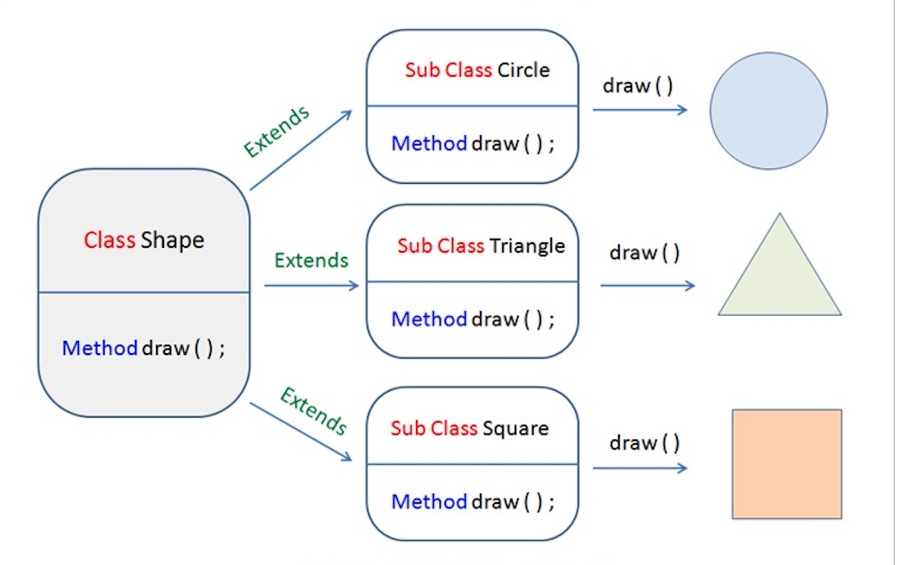
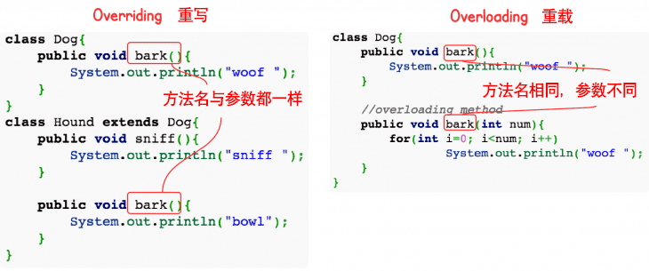

- [面相对象的三大特征](#面相对象的三大特征)
  - [1封装](#1封装)
  - [2 继承](#2-继承)
  - [3 多态](#3-多态)
  - [4 重写、重载、重定义](#4-重写重载重定义)
    - [定义](#定义)
    - [重写的原则](#重写的原则)
    - [与重载的区别](#与重载的区别)
    - [方法访问的优先级](#方法访问的优先级)
# 面相对象的三大特征
## 1封装
高内聚、低耦合。属性私有。

1. 隐藏实现的细节。将抽象性函式接口的实现细节部分包装、隐藏起来的方法。
2. 提高系统的安全性。在getset中对输入数据进行安全检查。封装可以被认为是一个保护屏障，防止该类的代码和数据被外部类定义的代码随机访问。要访问该类的代码和数据，必须通过严格的接口控制。
3. 提供统一的接口
4. 更容易理解与维护。


**实现封装的步骤**

1. 修改属性的可见性来限制对属性的访问（一般限制为private）
2. 对每个值属性提供对外的公共方法访问，也就是创建一对赋取值方法，用于对私有属性的访问。get/set方法

## 2 继承

**继承的定义**
1. 继承就是子类继承父类的特征和行为，使得子类对象（实例）具有父类的实例域和方法，或子类从父类继承方法，使得子类具有父类相同的行为。
2. 继承本质上是一种代码复用的方法。也提高了代码的耦合程度。
3. 所有没有父类的类默认继承Object类。

```java
class 父类 {
}
 
class 子类 extends 父类 {
}
```
**继承的特性**
1. Java不支持多继承。但是能够层级多重继承。
2. 子类拥有父类非 private 的属性、方法。子类可以拥有自己的属性和方法，即子类可以对父类进行扩展。子类可以用自己的方式实现父类的方法。

```java

public class Animal { 
    private String name;   
    private int id; 
    public Animal(String myName, int myid) { 
        //初始化属性值
    } 
    public void eat() {  //吃东西方法的具体实现  } 
    public void sleep() { //睡觉方法的具体实现  } 
} 
 
public class Penguin  extends  Animal{ 
}
```
**继承的构造器**
* 子类是不继承父类的构造器（构造方法或者构造函数）的，它只能调用（隐式或显式）父类的构造器。如果父类的构造器带有参数，则必须在子类的构造器中显式地通过 super 关键字调用父类的构造器并配以适当的参数列表。
* 如果父类构造器没有参数，则在子类的构造器中不需要使用 super 关键字调用父类构造器，系统会自动调用父类的无参构造器。

```java
class SuperClass {
  private int n;
  SuperClass(){
    System.out.println("SuperClass()");
  }
  SuperClass(int n) {
    System.out.println("SuperClass(int n)");
    this.n = n;
  }
}
// SubClass 类继承
class SubClass extends SuperClass{
  private int n;
  
  SubClass(){ // 自动调用父类的无参数构造器
    System.out.println("SubClass");
  }  
  
  public SubClass(int n){ 
    super(300);  // 调用父类中带有参数的构造器
    System.out.println("SubClass(int n):"+n);
    this.n = n;
  }
}
// SubClass2 类继承
class SubClass2 extends SuperClass{
  private int n;
  
  SubClass2(){
    super(300);  // 调用父类中带有参数的构造器
    System.out.println("SubClass2");
  }  
  
  public SubClass2(int n){ // 自动调用父类的无参数构造器
    System.out.println("SubClass2(int n):"+n);
    this.n = n;
  }
}
public class TestSuperSub{
  public static void main (String args[]){
    System.out.println("------SubClass 类继承------");
    SubClass sc1 = new SubClass();
    SubClass sc2 = new SubClass(100); 
    System.out.println("------SubClass2 类继承------");
    SubClass2 sc3 = new SubClass2();
    SubClass2 sc4 = new SubClass2(200); 
  }
}
```
## 3 多态

**多态的定义**
多态是同一个行为具有多个不同表现形式或形态的能力。多态就是同一个接口，使用不同的实例而执行不同操作。
1. 消除类型之间的耦合关系
2. 可替换性
3. 可扩充性
4. 接口性
5. 灵活性
6. 简化性

**多态的条件**

* 继承
* 重写
* 父类引用指向子类对象：Parent p = new Child();



**多态的说明**
* 多态是方法的多态，属性没有多态。
* 被private/static/final定义的方法不能被重写。final类型的方法重写编译器会报错。static方法只能被同名函数重定义。

**类型转换**
* 向上转型，父类变量指向子类对象。向上转型是自动发生的
* 向下转型，父类变量转为子类变量。向下转型需要强制类型转换。
```java
class Shape {
    void draw() {}
}
 
class Circle extends Shape {
    void draw() {
        System.out.println("Circle.draw()");
    }
}
 
class Square extends Shape {
    void draw() {
        System.out.println("Square.draw()");
    }
}
 
class Triangle extends Shape {
    void draw() {
        System.out.println("Triangle.draw()");
    }
}
```

**多态的原理**
在C++中只有声明了虚函数，程序在执行过程中才会从虚函数表中查找并执行子类的方法。但是在Java中所有的函数默认都是虚函数。只要被重写，在执行过程中，就一定会调用具体对象的方法。变量的类型不重要，重要的是对象的类型。
* 如果 Java 中不希望某个函数具有虚函数特性，可以加上 final 关键字变成非虚函数。
* 哪个类的实例对象，就调用哪个对象的方法。与变量的类型不是强相关的。

```java
public class Test {
    public static void main(String[] args) {
      show(new Cat());  // 以 Cat 对象调用 show 方法
      show(new Dog());  // 以 Dog 对象调用 show 方法
                
      Animal a = new Cat();  // 向上转型  
      a.eat();               // 调用的是 Cat 的 eat
      Cat c = (Cat)a;        // 向下转型  
      c.work();        // 调用的是 Cat 的 work
  }  
            
    public static void show(Animal a)  {
      a.eat();  
        // 类型判断
        if (a instanceof Cat)  {  // 猫做的事情 
            Cat c = (Cat)a;  
            c.work();  
        } else if (a instanceof Dog) { // 狗做的事情 
            Dog c = (Dog)a;  
            c.work();  
        }  
    }  
}
 
abstract class Animal {  
    abstract void eat();  
}  
  
class Cat extends Animal {  
    public void eat() {  
        System.out.println("吃鱼");  
    }  
    public void work() {  
        System.out.println("抓老鼠");  
    }  
}  
  
class Dog extends Animal {  
    public void eat() {  
        System.out.println("吃骨头");  
    }  
    public void work() {  
        System.out.println("看家");  
    }  
}
```

**多态实现方法**

1. 重载、重写、重定义（命名作用域屏蔽）
2. 接口实现
3. 抽象类和抽象方法


## 4 重写、重载、重定义
### 定义
重写是子类对父类的允许访问的方法的实现过程进行重新编写, 返回值和形参都不能改变。即外壳不变，核心重写！

* 子类能够重写父类的方法。当子类对象调用重写的方法时，调用的是子类的方法，而不是父类中被重写的方法。要想调用父类中被重写的方法，则必须使用关键字 super。

* 重写的好处在于子类可以根据需要，定义特定于自己的行为。 也就是说子类能够根据需要实现父类的方法。重写方法不能抛出新的检查异常或者比被重写方法申明更加宽泛的异常。

* 对象的引用类型决定了对象能够访问的方法。对象具体调用的方法，取决于对象的实际类型。（引用类型和实际类型。）


为了满足里式替换原则，重写有以下三个限制：

- 访问权限修饰符范围只能扩大，不能缩小。子类方法的访问权限必须大于等于父类方法；
- 子类方法的返回类型必须是父类方法返回类型或为其子类型。
- 抛出异常的范围只能缩小，不能扩大。子类方法抛出的异常类型必须是父类抛出异常类型或为其子类型。

使用 @Override 注解，可以让编译器帮忙检查是否满足上面的三个限制条件。

```java
class Animal{
   public void move(){
      System.out.println("动物可以移动");
   }
}
 
class Dog extends Animal{
   public void move(){
      System.out.println("狗可以跑和走");
   }
}
 
public class TestDog{
   public static void main(String args[]){
      Animal a = new Animal(); // Animal 对象
      Animal b = new Dog(); // Dog 对象
 
      a.move();// 执行 Animal 类的方法
 
      b.move();//执行 Dog 类的方法
   }
}
```

### 重写的原则
* 参数列表与被重写方法的参数列表必须完全相同。
* 返回类型与被重写方法的返回类型可以不相同，但是必须是父类返回值的派生类
* 访问权限不能比父类中被重写的方法的访问权限更低。例如：如果父类的一个方法被声明为 public，那么在子类中重写该方法就不能声明为 protected。
* 父类的成员方法只能被它的子类重写。声明为 final 的方法不能被重写。声明为 static 的方法不能被重写，但是能够被再次声明。
* 子类和父类在同一个包中，那么子类可以重写父类所有方法，除了声明为 private 和 final 的方法。子类和父类不在同一个包中，那么子类只能够重写父类的声明为 public 和 protected 的非 final 方法。
* 重写的方法能够抛出任何非强制异常，无论被重写的方法是否抛出异常。但是，重写的方法不能抛出新的强制性异常，或者比被重写方法声明的更广泛的强制性异常，反之则可以。
* 构造方法不能被重写。如果不能继承一个类，则不能重写该类的方法。

### 与重载的区别

* 重载(overloading) 是在一个类里面，方法名字相同，而参数不同。返回类型可以相同也可以不同。而重写是在父类和子类之间，发生继承关系后，进行重写，返回值必须具有一致性。
* 每个重载的方法（或者构造函数）都必须有一个独一无二的参数类型列表。每个重写的方法都必须有相同的参数列表。
* 在子类中如果不进行重写，则继承了父类中的方法，即可对父类中的方法进行扩展和重载。
* 方法重载是一个类的多态性表现,而方法重写是子类与父类的一种多态性表现。重载又叫编译时多态。重写又叫运行时多态。




### 方法访问的优先级
在调用一个方法时，先从本类中查找看是否有对应的方法，如果没有再到父类中查看，看是否从父类继承来。否则就要对参数进行转型，转成父类之后看是否有对应的方法。总的来说，方法调用的优先级为：

- this.func(this)
- super.func(this)
- this.func(super)
- super.func(super)
