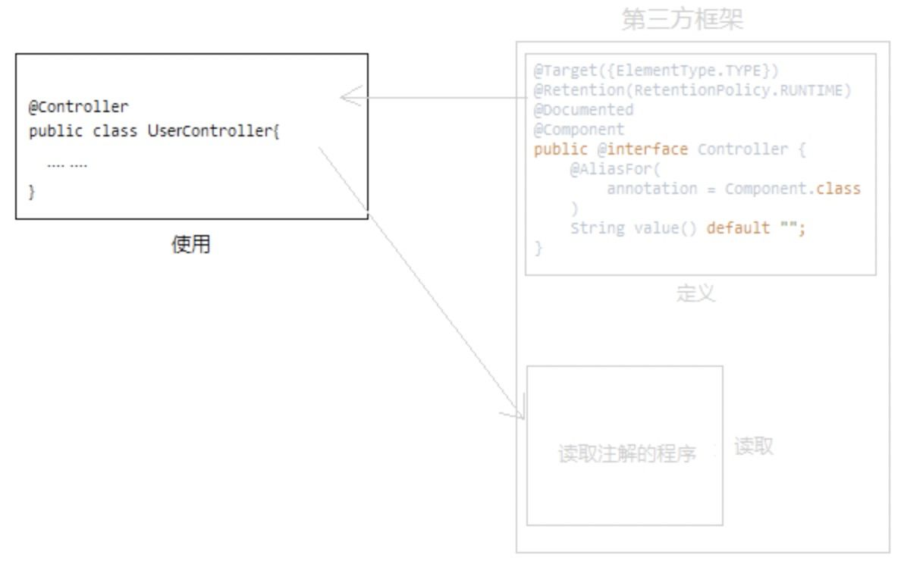

* [Java注解是怎么实现的](https://www.zhihu.com/question/24401191)
* [注解 Annotation 实现原理与自定义注解例子](https://www.cnblogs.com/acm-bingzi/p/javaAnnotation.html)
* [Java注解](https://blog.csdn.net/D1842501760/article/details/124042500)

## 1 注解概述

### 格式

```java
public @interface 注解名称{
    属性列表;
}
```

### 分类
根据其定义者的角色可以分为以下四种种：
1. 元注解：修饰注解的注解
2. 标准注解：JDK内置的注解
3. 框架注解：第三方框架提供的注解
4. 自定义注解：用户自定义的注解


> 还可以根据其出现的位置分为类、方法、变量和形参的注解。也可以其作用范围分为标准注解、元注解、自定义注解。
### 作用

* 出现位置：注解常常出现在类、方法、成员变量、形参位置。
* 注解级别：注解和类、接口、枚举是同一级别的。
1. 如果说注释是写给人看的，那么注解就是写给程序看的。它更像一个标签，贴在一个类、一个方法或者字段上。它的目的是为当前读取该注解的程序提供判断依据及少量附加信息。
   1. 程序只要读到加了@Test的方法，就知道该方法是待测试方法，
   2. @Before注解，程序看到这个注解，就知道该方法要放在@Test方法之前执行。
   3. 有时我们还可以通过注解属性，为将来读取这个注解的程序提供必要的附加信息，比如@RequestMapping("/user/info")提供了Controller某个接口的URL路径。

2. Java 注解是附加在代码中的一些元信息，用于一些工具在编译、运行时进行解析和使用，起到说明、配置的功能。注解不会也不能影响代码的实际逻辑，仅仅起到辅助性的作用。

> java中的注解和自己想像中的作用不太一样。以前一直以为与python中的方法类似，提供一种包装功能、横向扩展功能，在执行该方法前，会额外执行一系列函数，完成逻辑处理。但是现在看来，他只是提供了一种信息的配置方式，注解本身不执行逻辑，而是由能够解析他的对象实现对注解的解析。


### 原理

注解只有被解析之后才会生效，常见的解析方法有两种：
* 编译期间直接扫描：编译器在编译Java代码的时候扫描对于的注解并处理，比如某个方法使用了@Override，编译器在编译的时候就会检测当前的方法是否重写了父类对于的方法。
* 运行期间通过反射处理：这个经常在Spring框架中看到，例如Spring的@Value注解，就是通过反射来进行处理的。
## 2 注解使用
### 注解的实现原理
* 注解代码
```java
public @interface MyAnnotation{

}
```

* 反编译后的代码
```java
pbulic interface MyAnnotation extends Annotation{

}
```

* @interface变成了interface，而且自动继承了Annotation


```java
public @interface MyAnnotation{
    public abstract String getValue();
}
//由于interface默认的方法是public abstract的所以可以写成如下格式。
public @interface MyAnnotation{
    String getValue();
}
```
* getValue()被称为Info注解的属性。可以在使用的时候被赋值。表示给该方法传递参数。

```java
/**
 * @author qiyu
 */
@MyAnnotation(getValue = "annotation on class")
public class Demo {

    @MyAnnotation(getValue = "annotation on field")
    public String name;

    @MyAnnotation(getValue = "annotation on method")
    public void hello() {}

}
```
* 注解中可以指定默认的属性

```java
public @interface MyAnnotation{
    String getValue()default "default value";
}
```


### 元注解

加在注解上的注解。

* @Documented：用于制作文档
* @Target：加在注解上，限定该注解的使用位置。`@Target(ElementType.Field,ElementType.Method)`。它指明了它所修饰的注解使用的范围 如果自定义的注解为含有@Target元注解修饰，那么默认可以是在（除类型参数之外的）任何项之上使用，若有@Target元注解修饰那么根据Value（ElementType枚举常量）的指定的目标进行规定。
* @Retention：注解的保留策略`@Retention(RetentionPolicy.CLASS/RetentionPolicy.RUNTIME/RetentionPolicy.SOURCE)`。分别对应java编译执行过程的三个阶段。源代码阶段.java-->编译后的字节码阶段.class-->JVM运行时阶段.
  * 一般来说，普通开发者使用注解的时机都是运行时，比如反射读取注解（也有类似Lombok这类编译期注解）。既然反射是运行时调用，那就要求注解的信息必须保留到虚拟机将.class文件加载到内存为止。如果你需要反射读取注解，却把保留策略设置为RetentionPolicy.SOURCE、RetentionPolicy.CLASS
* @Inherited：被该元注解修饰的自定义注解再使用后会自动继承，如果使用了该自定义注解去修饰一个class那么这个注解也会作用于该class的子类。就是说如果某个类使用了被@Inherited修饰的注解，则其子类将会自动具有该注释。@Inherited annotation类型是被标注过的class的子类所继承。类并不从它所实现的接口继承annotation，方法并不从它所重载的方法继承annotation。


### 注解的使用步骤

注解的使用包括三个步骤。
1. 定义注解

```java
/**
 * @author qiyu
 */
@Retention(RetentionPolicy.RUNTIME)
public @interface MyAnnotation {
    String getValue() default "no description";
}
```

2. 使用注解

```java
/**
 * @author qiyu
 */
@MyAnnotation(getValue = "annotation on class")
public class Demo {

    @MyAnnotation(getValue = "annotation on field")
    public String name;

    @MyAnnotation(getValue = "annotation on method")
    public void hello() {}

    @MyAnnotation() // 故意不指定getValue
    public void defaultMethod() {}
}
```
3. 读取注解


```java
public class AnnotationTest {
    public static void main(String[] args) throws Exception {
        // 获取类上的注解
        Class<Demo> clazz = Demo.class;
        MyAnnotation annotationOnClass = clazz.getAnnotation(MyAnnotation.class);
        System.out.println(annotationOnClass.getValue());

        // 获取成员变量上的注解
        Field name = clazz.getField("name");
        MyAnnotation annotationOnField = name.getAnnotation(MyAnnotation.class);
        System.out.println(annotationOnField.getValue());

        // 获取hello方法上的注解
        Method hello = clazz.getMethod("hello", (Class<?>[]) null);
        MyAnnotation annotationOnMethod = hello.getAnnotation(MyAnnotation.class);
        System.out.println(annotationOnMethod.getValue());

        // 获取defaultMethod方法上的注解
        Method defaultMethod = clazz.getMethod("defaultMethod", (Class<?>[]) null);
        MyAnnotation annotationOnDefaultMethod = defaultMethod.getAnnotation(MyAnnotation.class);
        System.out.println(annotationOnDefaultMethod.getValue());

    }
}
```

> 注解的读取并不只有反射一种途径.比如@Override，它由编译器读取（你写完代码ctrl+s时就编译了），而编译器只是检查语法错误，此时程序尚未运行。保留策略为SOURCE，仅仅是源码阶段，编译成.class文件后就消失

### 属性的数据类型及特别的属性：value和数组


属性的数据类型

* 八种基本数据类型
* String
* 枚举
* Class
* 注解类型
* 以上类型的一维数组

```java
@Retention(RetentionPolicy.RUNTIME)
public @interface MyAnnotation {
   // 8种基本数据类型
    int intValue();
    long longValue();
    // ...其他类型省略

    // String
    String name();
    // 枚举
    CityEnum cityName();
    // Class类型
    Class<?> clazz();
    // 注解类型
    MyAnnotation2 annotation2();

    // 以上几种类型的数组类型
    int[] intValueArray();
    String[] names();
    // ...其他类型省略
}
@interface MyAnnotation2 {
}

enum CityEnum {
    BEIJING,
    HANGZHOU,
    SHANGHAI;
}


@MyAnnotation(
        // 8种基本类型
        intValue = 1,
        longValue = 0L,

        // String
        name = "annotation on class",
        // 枚举
        cityName = CityEnum.BEIJING,
        // Class
        clazz = Demo.class,
        // 注解
        annotation2 = @MyAnnotation2,
        // 一维数组
        intValueArray = {1, 2},
        names = {"Are", "you", "OK?"}
)
public class Demo {
    // 省略...
}
```

* 如果注解的属性只有一个，且叫value，那么使用该注解时，可以不用指定属性名，因为默认就是给value赋值。
* 数组属性。如果数组的元素只有一个，可以省略花括号{}
* 用常量类为注解属性赋值。如果你希望为注解的属性提供统一的几个可选值，可以使用常量类。

### 总结

* 注解就像标签，是程序判断执行的依据。比如，程序读到@Test就知道这个方法是待测试方法，而@Before的方法要在测试方法之前执行注解需要三要素：定义、使用、读取并执行注解分为自定义注解、JDK内置注解和第三方注解（框架）。
* 自定义注解一般要我们自己定义、使用、并写程序读取，而JDK内置注解和第三方注解我们只要使用，定义和读取都交给它们大多数情况下，三角关系中我们只负责使用注解，无需定义和执行，框架会将注解类和读取注解的程序隐藏起来，除非阅读源码，否则根本看不到。平时见不到定义和读取的过程，光顾着使用注解，久而久之很多人就忘了注解如何起作用了！




## 3 JDK中的标准注解

### @Override

指示方法声明旨在覆盖超类型中的方法声明。如果使用此注解类型对方法进行注解，则编译器需要生成错误消息，除非至少满足以下条件之一：
* 该方法确实覆盖或实现了在超类型中声明的方法。
* 该方法的签名与Object中声明的任何公共方法的签名等效。

所以@Override的作用告诉编译器检查这个方法，保证父类要包含一个被该方法重写的方法，否者就会出错，这样可以帮助程序员避免一些低级错误。

### @Deprecated 
注释的程序元素是不鼓励程序员使用的程序元素，通常是因为它很危险，或者因为存在更好的替代方案。当在非弃用代码中使用或覆盖弃用的程序元素时，编译器会发出警告。


### @SuppressWarnings

指示应在带注释的元素（以及带注释的元素中包含的所有程序元素）中抑制命名的编译器警告。请注意，给定元素中抑制的警告集是所有包含元素中抑制的警告的超集。例如，如果您注释一个类以抑制一个警告并注释一个方法以抑制另一个警告，则两个警告都将在方法中被抑制。
作为风格问题，程序员应该始终在最有效的嵌套元素上使用此注释。如果您想在特定方法中抑制警告，您应该注释该方法而不是它的类。

* Java中的@SuppressWarnings 注解指示被该注解修饰的程序元素（以及该程序元素中的所有子元素）取消显示指定的编译器警告，且会一直作用于该程序元素的所有子元素。

* 如果你对于代码的规范不做要求又对编译器的警告感到烦躁那么你可以使用@SuppressWarnings（仅仅只是取消显示，并没有消除），它可以让你免去这些烦恼，当然编译器报错他是无法帮你取消显示的。


### @SafeVarargs

程序员断言带注释的方法或构造函数的主体不会对其 varargs 参数执行潜在的不安全操作。将此注释应用于方法或构造函数会抑制有关不可具体化的变量 arity (vararg) 类型的未经检查的警告，并抑制有关在调用站点创建参数化数组的未经检查的警告。
除了@Target元注解施加的使用限制外，编译器还需要对该注解类型实施额外的使用限制；如果使用@SafeVarargs注释对方法或构造函数声明进行注释，则这是编译时错误，并且：
声明是一个固定的arity方法或构造函数
声明是一个既不是static也不是final的变量 arity 方法。
鼓励编译器在将此注释类型应用于方法或构造函数声明时发出警告，其中：
变量 arity 参数具有可具体化的元素类型，包括原始类型、 Object和String 。 （对于可具体化的元素类型，此注释类型抑制的未经检查的警告已经不会出现。）
方法或构造函数声明的主体执行潜在的不安全操作，例如对变量 arity 参数数组的元素的赋值会生成未经检查的警告。一些不安全的操作不会触发未经检查的警告。例如，别名在
   @SafeVarargs // 实际上并不安全！
   static void m(List<String>... stringLists) {
     Object[] array = stringLists;
     List<Integer> tmpList = Arrays.asList(42);
     array[0] = tmpList; // 语义上无效，但可以编译
     String s = stringLists[0].get(0); // 哦不，运行时的 ClassCastException！
   }
   
在运行时导致ClassCastException 。
该平台的未来版本可能会要求此类不安全操作出现编译器错误。


### @FunctionalInterface

一种信息性注解类型，用于指示接口类型声明旨在成为 Java 语言规范定义的功能接口。从概念上讲，函数式接口只有一个抽象方法。由于默认方法有一个实现，它们不是抽象的。如果接口声明了一个覆盖java.lang.Object的公共方法之一的抽象方法，这也不会计入接口的抽象方法计数，因为接口的任何实现都将具有来自java.lang.Object或其他地方的实现(接口的实现是类,所有类的父类都是Object)。
请注意，函数式接口的实例可以使用 lambda 表达式、方法引用或构造函数引用来创建。
如果使用此注解类型对类型进行注解，则编译器需要生成错误消息，除非：
* 该类型是接口类型，而不是注解类型、枚举或类。
* 带注解的类型满足功能接口的要求。

但是，无论接口声明中是否存在FunctionalInterface注释，编译器都会将满足功能接口定义的任何接口视为功能接口。

​ 在学习Lambda表达式时，我们了解过函数式接口（接口中只有个一个抽象方法可以存在多个默认方法或多个static方法）。

@FunctionalInterface作用就是用来指定某一个接口必须是函数式接口的，所以@FunctionalInterface只能修饰接口。


## 4 Spring框架下一个注解的实现
> 定义注解、使用注解、实现注解。和定义接口、使用接口、实现接口。与OpenApi中定义服务、使用服务、实现服务。具有相同的含义。


### 登录校验——定义注解
模拟是否需要进行登录校验；如果方法中加上了@LoginRequired注解表示方法需要登录校验，如果没加则不需要。定义一个
```java
@LoginRequired注解
@Target(ElementType.METHOD)
@Retention(RetentionPolicy.RUNTIME)
public@interface LoginRequired {
    
}
```
### 登录校验——使用注解

定义两个简单接口，其中一个添加@LoginRequired注解表示需要登录校验
```java
@RestController
public class UserController {
    @GetMapping("/login1")
    public TransDTO login1(){
        return new TransDTO<>().withMessage("访问login1成功").withCode(HttpStatus.OK.value());
    }
    
    @LoginRequired
    @GetMapping("/login2")
    public TransDTO login2(){
        return new TransDTO<>().withMessage("访问login2成功").withCode(HttpStatus.OK.value());
    }
}
```

### 登录校验——实现注解

自定义拦截器。通过拦截器和反射，实现注解的处理逻辑。
```java
@Configuration
public class MyInterceptor implements HandlerInterceptor {
    @Override
    public boolean preHandle(HttpServletRequest request, HttpServletResponse response, Object handler) throws Exception {
        System.out.println("访问了过滤器！");
        HandlerMethod handlerMethod = (HandlerMethod) handler;
        LoginRequired annotation = handlerMethod.getMethod().getAnnotation(LoginRequired.class);
        if(annotation != null){
            //全局异常处理会进行处理
            throw new BusinessException("访问失败，您没有权限访问！");
        }
        return true;
    }

    @Override
    public void postHandle(HttpServletRequest request, HttpServletResponse response, Object handler, ModelAndView modelAndView) throws         Exception {

    }

    @Override
    public void afterCompletion(HttpServletRequest request, HttpServletResponse response, Object handler, Exception ex) throws Exception     {

    }
}
```

配置拦截路径
```java
@Configuration
public class InterceptorTrainConfigurer implements WebMvcConfigurer {
    @Override
    public void addInterceptors(InterceptorRegistry registry) {
        registry.addInterceptor(new MyInterceptor()).addPathPatterns("/**");
    }
}
```

全局异常处理
```java
@RestControllerAdvice
public class MyExceptionAdvice {
    @ExceptionHandler(Exception.class)
    @ResponseStatus(HttpStatus.OK)
    public TransDTO handleException(HttpServletRequest request,Exception e){
        e.printStackTrace();
        return new TransDTO().withCode(500).withSuccess(false).withMessage(e.getMessage());
    }
}
```

自定义注解的场景有很多，比如登录、权限拦截、日志、以及各种框架。java注解对于性能有较大的影响，但可用于软件的架构设计，实现动态加载，对于分解复杂业务有帮助。

### Spring框架下的另一个实现

