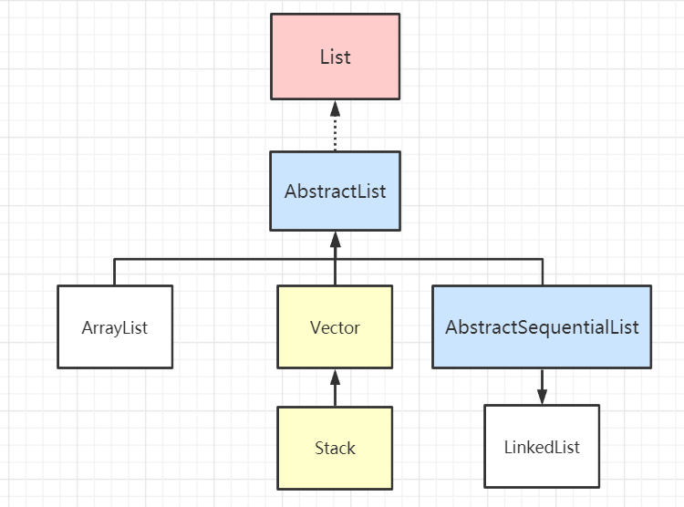
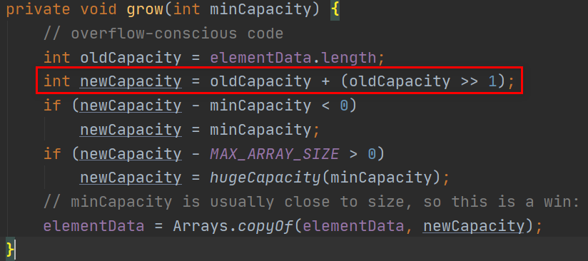

# List 接口

## 1 概述

### 简介
List 接口和 Set 接口齐头并进，是我们日常开发中接触的很多的一种集合类型了。整个 List 集合的组成部分如下图



`List` 接口直接继承 Collection 接口，它定义为可以存储**重复**元素的集合，并且元素按照插入顺序**有序排列**，且可以通过**索引**访问指定位置的元素。常见的实现有：ArrayList、LinkedList、Vector和Stack

### AbstractList  和 AbstractSequentialList

AbstractList 抽象类实现了 List 接口，其内部实现了所有的 List 都需具备的功能，子类可以专注于实现自己具体的操作逻辑。

```java
// 查找元素 o 第一次出现的索引位置
public int indexOf(Object o)
// 查找元素 o 最后一次出现的索引位置
public int lastIndexOf(Object o)
//···
```

AbstractSequentialList 抽象类继承了 AbstractList，在原基础上限制了访问元素的顺序**只能够按照顺序访问**，而**不支持随机访问**，如果需要满足随机访问的特性，则继承 AbstractList。子类 LinkedList 使用链表实现，所以仅能支持**顺序访问**，顾继承了 `AbstractSequentialList`而不是 AbstractList。


## 2 ArrayList

### 概述
ArrayList 以**数组**作为存储结构，它是**线程不安全**的集合；具有**查询快、在数组中间或头部增删慢**的特点，所以它除了线程不安全这一点，其余可以替代`Vector`，而且线程安全的 ArrayList 可以使用 `CopyOnWriteArrayList`代替 Vector。


关于 ArrayList 有几个重要的点需要注意的：

- 具备**随机访问**特点，**访问元素的效率**较高，ArrayList 在**频繁插入、删除**集合元素的场景下效率较`低`。

- 底层数据结构：ArrayList 底层使用数组作为存储结构，具备**查找快、增删慢**的特点

- 线程安全性：ArrayList 是**线程不安全**的集合

- ArrayList **首次扩容**后的长度为 `10`，调用 `add()` 时需要计算容器的最小容量。可以看到如果数组`elementData`为空数组，会将最小容量设置为`10`，之后会将数组长度完成首次扩容到 10。

另外一篇文章
* Ordered – arraylist中的元素保留其排序，默认情况下是其添加到列表的顺序。
* Index based –可以使用索引位置随机访问元素。 索引以'0'开头。
* Dynamic resizing –当需要添加的元素数量超过当前大小时，ArrayList会动态增长。
* Non synchronized –默认情况下，ArrayList不同步。 程序员需要适当地使用synchronized关键字，或者仅使用Vector类。
* Duplicates allowed -我们可以在arraylist中添加重复元素。 不能成组放置。

```Java
// new ArrayList 时的默认空数组
private static final Object[] DEFAULTCAPACITY_EMPTY_ELEMENTDATA = {};
// 默认容量
private static final int DEFAULT_CAPACITY = 10;
// 计算该容器应该满足的最小容量
private static int calculateCapacity(Object[] elementData, int minCapacity) {
    if (elementData == DEFAULTCAPACITY_EMPTY_ELEMENTDATA) {
        return Math.max(DEFAULT_CAPACITY, minCapacity);
    }
    return minCapacity;
}
```

- 集合从**第二次扩容**开始，数组长度将扩容为原来的 `1.5` 倍，即：`newLength = oldLength * 1.5`



### 构造函数

* 没有逐个元素初始化的方法，使用Arrays.asList能够添加对象初始化。
```java
//Empty arraylist
List<String> names = new ArrayList<>(); 
 
//Arraylist initialized with another collection
List<Integer> numbers = new ArrayList<>(Arrays.asList(1,2,3,4,5)); 
```


### 常用方法

* add()添加单个元素
```java
public boolean add(E e) {
    ensureCapacityInternal(size + 1);  // Increments modCount!!
    elementData[size++] = e;
    return true;
}
```
* addAll()方法将给定集合的所有元素添加到arraylist中。 始终使用泛型来确保您仅在给定列表中添加某种类型的元素。

```java
import java.util.ArrayList;
 
public class ArrayListExample 
{
    public static void main(String[] args) 
    {
        ArrayList<String> list1 = new ArrayList<>();    //list 1
         
        list1.add("A");
        list1.add("B");
        list1.add("C");
        list1.add("D");
         
        ArrayList<String> list2 = new ArrayList<>();    //list 2
         
        list2.add("E");
         
        list1.addAll(list2);
         
        System.out.println(list1);      //combined list
    }
}
```
* clear()方法将arraylist clear

```java
import java.util.ArrayList;
 
public class ArrayListExample 
{
    public static void main(String[] args) 
    {
        ArrayList<String> arrayList = new ArrayList<>(); 
         
        arrayList.add("A");
        arrayList.add("B");
        arrayList.add("C");
        arrayList.add("D");
         
        System.out.println(arrayList);   
         
        arrayList.clear();
         
        System.out.println(arrayList);   
    }
}
```

* clone()方法创建arraylist的浅表副本 。
```java
import java.util.ArrayList;
 
public class ArrayListExample 
{
    @SuppressWarnings("unchecked")
    public static void main(String[] args) 
    {
        ArrayList<String> arrayListObject = new ArrayList<>(); 
         
        arrayListObject.add("A");
        arrayListObject.add("B");
        arrayListObject.add("C");
        arrayListObject.add("D");
         
        System.out.println(arrayListObject);   
         
        ArrayList<String> arrayListClone =  (ArrayList<String>) arrayListObject.clone();
         
        System.out.println(arrayListClone);   
    }
}
```
* clone深拷贝。创建集合的深层副本非常容易。 我们需要创建一个新的collection实例，并将给定collection中的所有元素一一复制到克隆的collection中。 请注意，我们将在克隆集合中复制元素的克隆。
```java
ArrayList<Employee> employeeList = new ArrayList<>(); 
ArrayList<Employee> employeeListClone = new ArrayList<>();
 
Iterator<Employee> iterator = employeeList.iterator();
 
while(iterator.hasNext())
{
    //Add the object clones
    employeeListClone.add((Employee) iterator.next().clone());  
}
```
* cantains()数组列表中存储了几个字母。 我们将尝试找出列表中是否包含字母“ A”和“ Z”。
```java
public class ArrayListExample 
{
    public static void main(String[] args) 
    {
        ArrayList<String> list = new ArrayList<>(2);
         
        list.add("A");
        list.add("B");
        list.add("C");
        list.add("D");
         
        System.out.println( list.contains("A") );       //true
         
        System.out.println( list.contains("Z") );       //false
    }
}
```

* indexOf()判断是否存在.返回此列表中指定元素的首次出现的索引。 如果列表不包含元素，它将返回'-1' 。

```java
public class ArrayListExample 
{
    public static void main(String[] args) 
    {
        ArrayList<String> list = new ArrayList<>(2);
         
        list.add("A");
        list.add("B");
        list.add("C");
        list.add("D");
         
        System.out.println( list.indexOf("A") > 0 );       //true
         
        System.out.println( list.indexOf("Z") > 0);       //false
    }
}
```
* lastIndexOf()返回此列表中最后一次出现的指定元素的索引。 如果列表不包含元素，它将返回'-1' 。

```java
public int lastIndexOf(Object object) {
    if (o == null) {
        for (int i = size-1; i >= 0; i--)
            if (elementData[i]==null)
                return i;
    } else {
        for (int i = size-1; i >= 0; i--)
            if (o.equals(elementData[i]))
                return i;
    }
    return -1;
}

```
* get(int index)方法返回列表中指定位置'index'处的元素。
```java
import java.util.ArrayList;
import java.util.Arrays;
 
public class ArrayListExample 
{
    public static void main(String[] args) 
    {
        ArrayList<String> list = new ArrayList<>(Arrays.asList("alex", "brian", "charles", "dough"));
         
        String firstName = list.get(0);         //alex
        String secondName = list.get(1);        //brian
         
        System.out.println(firstName);
        System.out.println(secondName);
    }
}
```

* boolean remove(Object o) –从列表中删除第一次出现的指定元素。 true从列表中删除了任何元素，则返回true ，否则返回false 。对象remove（int index）引发IndexOutOfBoundsException-移除此列表中指定位置的元素。 将所有后续元素向左移动。 返回从列表中移除的元素。 如果参数索引无效，则引发异常。

```java
import java.util.ArrayList;
import java.util.Arrays;
 
public class ArrayListExample 
{
    public static void main(String[] args) throws CloneNotSupportedException 
    {
        ArrayList<String> alphabets = new ArrayList<>(Arrays.asList("A", "B", "C", "D"));
         
        System.out.println(alphabets);
         
        alphabets.remove("C");          //Element is present
         
        System.out.println(alphabets);
         
        alphabets.remove("Z");          //Element is NOT present
         
        System.out.println(alphabets);
    }
}
```
* removeAll()方法遍历arraylist的所有元素。 对于每个元素，它将元素传递给参数集合的contains()方法。如果在参数集合中找到element，它将重新排列索引。 如果未找到element，则将其保留在后备数组中。

```java
import java.util.ArrayList;
import java.util.Arrays;
import java.util.Collections;
 
public class ArrayListExample 
{
    public static void main(String[] args) throws CloneNotSupportedException 
    {
        ArrayList<String> alphabets = new ArrayList<>(Arrays.asList("A", "B", "A", "D", "A"));
         
        System.out.println(alphabets);
         
        alphabets.removeAll(Collections.singleton("A"));
         
        System.out.println(alphabets);
    }
}
```

* removeIf()方法采用Predicate类型的单个参数。 谓词接口是一种功能接口，表示一个参数的条件（布尔值函数）。 它检查给定参数是否满足条件。

```java
import java.util.ArrayList;
import java.util.Arrays;
 
public class ArrayListExample 
{
    public static void main(String[] args) throws CloneNotSupportedException 
    {
        ArrayList<Integer> numbers = new ArrayList<>(Arrays.asList(1,2,3,4,5,6,7,8,9,10));
 
        numbers.removeIf( number -> number%2 == 0 );
         
        System.out.println(numbers);
    }
}

```

* retainAll()方法来保留列表中存在于指定参数集合中的所有元素。

```java
import java.util.ArrayList;
import java.util.Arrays;
import java.util.Collections;
 
public class ArrayListExample 
{
    public static void main(String[] args) throws CloneNotSupportedException 
    {
        ArrayList<String> alphabets = new ArrayList<>(Arrays.asList("A", "B", "A", "D", "A"));
         
        System.out.println(alphabets);
         
        alphabets.retainAll(Collections.singleton("A"));
         
        System.out.println(alphabets);
    }
}
```

* sort()方法使用Arrays.sort()方法对列表中的元素进行比较和排序。sort()方法接受Comparator实现类的实例，该实例必须能够比较arraylist中包含的元素

```java
import java.util.Comparator;
 
public class NameSorter implements Comparator<Employee> 
{
    @Override
    public int compare(Employee o1, Employee o2) {
        return o1.getName().compareToIgnoreCase(o1.getName());
    }
}


import java.time.LocalDate;
import java.time.Month;
import java.util.ArrayList;
 
public class ArrayListExample 
{
    public static void main(String[] args) throws CloneNotSupportedException 
    {
        ArrayList<Employee> employees = new ArrayList<>();
         
        employees.add(new Employee(1l, "Alex", LocalDate.of(2018, Month.APRIL, 21)));
        employees.add(new Employee(4l, "Brian", LocalDate.of(2018, Month.APRIL, 22)));
        employees.add(new Employee(3l, "David", LocalDate.of(2018, Month.APRIL, 25)));
        employees.add(new Employee(5l, "Charles", LocalDate.of(2018, Month.APRIL, 23)));
        employees.add(new Employee(2l, "Edwin", LocalDate.of(2018, Month.APRIL, 24)));
                
        employees.sort(new NameSorter());
        System.out.println(employees);
    }
}

```

* toArray()将arraylist转换为对象数组并遍历数组内容

```java
import java.util.ArrayList;
import java.util.Arrays;
 
public class ArrayListExample 
{
    public static void main(String[] args) 
    {
        ArrayList<String> list = new ArrayList<>(2);
         
        list.add("A");
        list.add("B");
        list.add("C");
        list.add("D");
         
        //Convert to object array
        Object[] array = list.toArray();
         
        System.out.println( Arrays.toString(array) );
 
        //Iterate and convert to desired type
        for(Object o : array) {
            String s = (String) o;
             
            System.out.println(s);
        }
    }
}
// 可以控制转换完成的结果。
import java.util.ArrayList;
import java.util.Arrays;
 
public class ArrayListExample 
{
    public static void main(String[] args) 
    {
        ArrayList<String> list = new ArrayList<>(2);
         
        list.add("A");
        list.add("B");
        list.add("C");
        list.add("D");
         
        //Convert to string array
        String[] array = list.toArray(new String[list.size()]);
         
        System.out.println(Arrays.toString(array));
    }
}
```

* sublist获取子列表

```java
import java.util.ArrayList;
import java.util.Arrays;
 
public class ArrayListExample 
{
    public static void main(String[] args) 
    {
        ArrayList<Integer> list = new ArrayList<>(Arrays.asList(0,1,2,3,4,5,6,7,8,9));
         
        ArrayList<Integer> sublist = new ArrayList<Integer>( list.subList(2, 6) );
         
        System.out.println(sublist);
    }
}
```


### 遍历方法
五种loop ArrayList 

* Java程序使用standard for loop遍历对象的数组列表。(能够控制遍历计数，方便进行排序等算法操作)

```java
ArrayList<String> namesList = new ArrayList<String>(Arrays.asList( "alex", "brian", "charles") );
         
for(int i = 0; i < namesList.size(); i++)
{
    System.out.println(namesList.get(i));
}
```
* 使用foreach loop遍历对象的数组列表。（最方便的遍历。）

```java
ArrayList<String> namesList = new ArrayList<String>(Arrays.asList( "alex", "brian", "charles") );
         
for(String name : namesList)
{
    System.out.println(name);
}
```
* 使用列表迭代器对象迭代对象的数组列表。(能够在遍历的时候删除。)
```java
ArrayList<String> namesList = new ArrayList<String>(Arrays.asList( "alex", "brian", "charles") );
         
ListIterator<String> listItr = namesList.listIterator();
 
while(listItr.hasNext())
{
    System.out.println(listItr.next());
}
```

* while循环。（可能在某些算法中比较方便，除非你想让循环体控制遍历计数）

```java
ArrayList<String> namesList = new ArrayList<String>(Arrays.asList( "alex", "brian", "charles") );
 
int index = 0;          
while (namesList.size() > index) 
{
   System.out.println(namesList.get(index++));
}
```
* 使用Java 8流API遍历对象的数组列表。 使用stream.foreach()方法从arraylist对象创建元素流，并stream.foreach()获取元素。
```java
Iterate arraylist with stream api
ArrayList<String> namesList = new ArrayList<String>(Arrays.asList( "alex", "brian", "charles") );
namesList.forEach(name -> System.out.println(name));
```

* listIterator()方法获得的列表迭代器来迭代arraylist。ListIterator支持在迭代列表时添加和删除列表中的元素。
  * listIterator.add(Element e) –将该元素立即插入将由next()返回的元素之前或将要返回的previous()方法的元素之后。
  * listIterator.remove() –从列表中删除next()或previous()方法返回的最后一个元素。

```java
import java.util.ArrayList;
import java.util.Arrays;
import java.util.ListIterator;
 
public class ArrayListExample 
{
    public static void main(String[] args) throws CloneNotSupportedException 
    {
        ArrayList<String> alphabets = new ArrayList<>(Arrays.asList("A", "B", "C", "D"));
         
        ListIterator<String> listItr = alphabets.listIterator();
         
        System.out.println("===========Forward=========");
         
        while(listItr.hasNext()) {
            System.out.println(listItr.next());
        }
         
        System.out.println("===========Backward=========");
         
        while(listItr.hasPrevious()) {
            System.out.println(listItr.previous());
        }
    }
}
```

## 3 LinkedList

LinkedList 底层采用`双向链表`数据结构存储元素，由于链表的内存地址`非连续`，所以它不具备随机访问的特点，但由于它利用指针连接各个元素，所以插入、删除元素只需要`操作指针`，不需要`移动元素`，故具有**增删快、查询慢**的特点。它也是一个非线程安全的集合。


由于以双向链表作为数据结构，它是**线程不安全**的集合；存储的每个节点称为一个`Node`，下图可以看到 Node 中保存了`next`和`prev`指针，`item`是该节点的值。在插入和删除时，时间复杂度都保持为 `O(1)`


关于 LinkedList，除了它是以链表实现的集合外，还有一些特殊的特性需要注意的。

- 优势：LinkedList 底层没有`扩容机制`，使用`双向链表`存储元素，所以插入和删除元素效率较高，适用于频繁操作元素的场景
- 劣势：LinkedList 不具备`随机访问`的特点，查找某个元素只能从 `head` 或 `tail` 指针一个一个比较，所以**查找中间的元素时效率很低**
- 查找优化：LinkedList 查找某个下标 `index` 的元素时**做了优化**，若 `index > (size / 2)`，则从 `head` 往后查找，否则从 `tail` 开始往前查找，代码如下所示：

```Java
LinkedList.Node<E> node(int index) {
    LinkedList.Node x;
    int i;
    if (index < this.size >> 1) { // 查找的下标处于链表前半部分则从头找
        x = this.first;
        for(i = 0; i < index; ++i) { x = x.next; }
        return x;
    } else { // 查找的下标处于数组的后半部分则从尾开始找
        x = this.last;
        for(i = this.size - 1; i > index; --i) { x = x.prev; }
        return x;
    }
}
```

- 双端队列：使用双端链表实现，并且实现了 `Deque` 接口，使得 LinkedList 可以用作**双端队列**。下图可以看到 Node 是集合中的元素，提供了前驱指针和后继指针，还提供了一系列操作`头结点`和`尾结点`的方法，具有双端队列的特性。


LinkedList 集合最让人树枝的是它的链表结构，但是我们同时也要注意它是一个双端队列型的集合。

```java
Deque<Object> deque = new LinkedList<>();
```

### Vector


`Vector` 在现在已经是一种过时的集合了，包括继承它的 `Stack` 集合也如此，它们被淘汰的原因都是因为**性能**低下。

> JDK 1.0 时代，ArrayList 还没诞生，大家都是使用 Vector 集合，但由于 Vector 的**每个操作**都被 **synchronized** 关键字修饰，即使在线程安全的情况下，仍然**进行无意义的加锁与释放锁**，造成额外的性能开销，做了无用功。

```java
public synchronized boolean add(E e);
public synchronized E get(int index);
```

在 JDK 1.2 时，Collection 家族出现了，它提供了大量**高性能、适用於不同场合**的集合，而 Vector 也是其中一员，但由于 Vector 在每个方法上都加了锁，由于需要兼容许多老的项目，很难在此基础上优化`Vector`了，所以渐渐地也就被历史淘汰了。

现在，在**线程安全**的情况下，不需要选用 Vector 集合，取而代之的是 **ArrayList** 集合；在并发环境下，出现了 `CopyOnWriteArrayList`，Vector 完全被弃用了。

### Stack


`Stack`是一种`后入先出（LIFO）`型的集合容器，如图中所示，`大雄`是最后一个进入容器的，top指针指向大雄，那么弹出元素时，大雄也是第一个被弹出去的。

Stack 继承了 Vector 类，提供了栈顶的压入元素操作（push）和弹出元素操作（pop），以及查看栈顶元素的方法（peek）等等，但由于继承了 Vector，正所谓跟错老大没福报，Stack 也渐渐被淘汰了。

取而代之的是后起之秀 `Deque`接口，其实现有 `ArrayDeque`，该数据结构更加完善、可靠性更好，依靠队列也可以实现`LIFO`的栈操作，所以优先选择 ArrayDeque 实现栈。

```java
Deque<Integer> stack = new ArrayDeque<Integer>();
```

ArrayDeque 的数据结构是：`数组`，并提供**头尾指针下标**对数组元素进行操作。本文也会讲到哦，客官请继续往下看，莫着急！:smile:
	