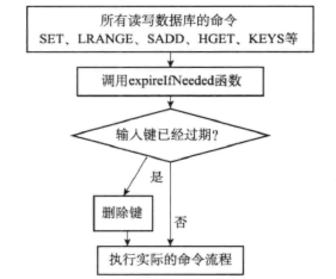

# 生命周期


## 1 数据库键生命周期
### 概述

Redis 可以为每个键设置过期时间，当键过期时，会自动删除该键。

对于散列表这种容器，只能为整个键设置过期时间（整个散列表），而不能为键里面的单个元素设置过期时间。

### 设置键的生存时间或过期时间

`EXPIRE`或`PEXPIRE`命令让客户端可以以秒或者毫秒进度为某个键设置生存时间。经过指定的时间后，服务器会自动删除生存时间为0的键。

`EXPIREAT`或`PEXPIREAT`命令，以秒或毫秒精度为某个键设置过期时间，过期时间是一个UNIX时间戳。

`TTL`和`PTTL`命令可查看某个键的剩余生存时间。

实际上，`EXPIRE`、`PEXPIRE`、`EXPIREAT`三个命令都是使用`PEXPIREAT`来实现的。

### 保存过期时间

redisDb结构的expires字典保存了所有键的过期时间：

- 过期字典的键是一个指针，指向键空间中的某个键对象。
- 过期字典的值是一个`long long`类型的整数，保存了一个UNIX时间戳。

```c
typedef struct redisDb {
  // ...
  dict *expires;
  // ...
} redisDb;
```


`PEXPIREAT`的伪代码定义：

```python
def PEXPIREAT(key, expire_time_in_ms):
    # 如果键不存在于键空间，那么不能设置过期时间
    if key not in redisDb.dict:
        return 0
    # 在过期字典中关联键和过期时间
    redisDb.expires[key] = expire_time_in_ms
    # 设置成功过
    return 1
```

### 移除过期时间

`PERSIST`可以移除一个键的过期时间，它在过期字典中找到给定的键，解除键和值（过期时间）的关联。

```python
def PERSIST(key):
    # 如果键不存在或者没有设置过期时间
    if key not in redisBb.expires:
        return 0
    redisDb.expires.remove(key)
    return 1
```

### 计算并返回剩余生存时间

`TTL`和`PTTL`都是通过计算键的过期时间和当前时间的差来实现的：

```python
def PTTL(key):
    if key not in redisDb.dict:
        return -2
    expire_time_in_ms = redisDb.expires.get(key)
    
    if expire_time_in_ms is None:
        return -1
    
    now_ms = get_current_unix_timestamp_in_ms()
    return expire_time_in_ms - now_ms
```

### 过期键的判定

通过过期字典，程序可通过以下步骤来判定键是否过期：

1. 检查给定键是否存在于过期字典，如果存在，取得其过期时间
2. 检查当前UNIX时间戳是否大于其过期时间

## 2 过期键的删除策略

有三种不同的键删除策略：

| 策略   | 操作                                       | 优点               | 缺点             |
| ---- | ---------------------------------------- | ---------------- | -------------- |
| 定时删除 | 设置键的过期时间的同时，创建一个定时器，让定时器在键的过期时间来临时立即执行删除操作。 | 对内存最友好，保证会尽快释放内存 | 对CPU时间不友好      |
| 惰性删除 | 每次从键空间获取键时，检查其是否过期，过期则删除；否则就返回该键。        | 对CPU时间最友好        | 对内存不友好         |
| 定期删除 | 每隔一段时间，对数据库进行一次检查，删除所有的过期键。              | 上述两种策略的整合和折中     | 难点在于确定删除的时长和频率 |


### 惰性删除的实现

惰性删除的策略由db.c/exipireIfNeeded函数实现，所有读写数据库的Redis命令都会在执行前调用该函数。



### 定期删除的实现

定期删除的策略由redis.c/activeExpireCycle函数实现，每当Redis服务器周期性操作redis.c/serverCron函数执行时，该函数会被调用。它在规定时间内，分多次遍历各个数据库，检查过期时间并删除过期键。

```python
DEFAULT_DB_NUMBERS = 16
DEFAULT_KEY_NUMBERS = 20
current_db = 0

def activeExpireCycle():
    if server.dbnum < DEFAUKT_DB_NUMBERS:
        db_numbers = server.dbnum
    else:
    	db_numbers = DEFAULT_DB_NUMBERS
       
    for i in range(db_numbers):
        if current_db == server.dbnum:
            current_db = 0
           
        redisDb = server.db[current_db]
        current_db += 1
        
        for j in range(DEFAULT_KEY_NUMBERS):
            if redisDb.expires.size() == 0:
                break
                
            key_with_ttl = redisBb.expires.get_random_key()
            if is_expired(key_with_ttl):
                delete_key(key_with_ttl)
                
            if reach_time_limit(): 
                return
        
```

activeExpireCycle的工作模式总结如下：

- 函数运行时，会从一定数量的数据库中取出一定数量的随机键检查并删除。
- 全局变量current\_db记录当前检查的进度，并在下一次调用时接着处理上一次的进度。
- 随着activeExpireCycle的不断执行，所有数据库都会被检查一遍，这是current\_db重置为0，再次开始新一轮动机检查。

## 3 AOF、RDB和复制功能对过期键的处理

### RDB文件生成和载入

执行SAVE或BGSAVE命令时会创建一个新的RDB文件，已过期的键不会保存到RDB中。

在启动服务器时，如果开启了RDB功能，服务器会载入RDB文件：

- 如果服务器以主服务器模式运行，那么载入RDB时，会检查文件中的键，过期键会被忽略。
- 如果服务器以从服务器模式运行，那么载入RDB时，不管键是否过期，一律载入。其后，在主从服务器同步时，从服务器的数据库就会被清空。

### AOF文件写入和重写

服务器以AOF持久化模式运行时，如果某个键已过期，但还没有被删除，那么AOF文件不会因为这个过期键而产生任何影响。但过期键被删除后，程序会向AOF文件追加一条DEL命令，显式记录该键已被删除。

AOF重写过程中，程序会对键进行检查，已过期的键不会被保存到重写后的AOF文件中。

### 复制

当服务器处于复制模式下时，过期键删除动作由主服务器控制，这就保证了一致性：

- 主服务器删除一个过期键后，显式向从服务器发送DEL命令
- 从服务器执行客户端发送的命令时，即使碰到过期键也不会删除，而是像初期未过期的键一样
- 从服务器接到主服务器的DEL命令后，才会删除过期键


## 4 数据淘汰策略
> 与过期键的删除策略不同。数据淘汰策略主要是因为内存占用过高导致，而过期键的删除是由于数据已经过期。


可以设置内存最大使用量，当内存使用量超出时，会施行数据淘汰策略。Redis 具体有 6 种淘汰策略：

| 策略 | 描述 |
| :--: | :--: |
| volatile-lru | 从已设置过期时间的数据集中挑选最近最少使用的数据淘汰 |
| volatile-ttl | 从已设置过期时间的数据集中挑选将要过期的数据淘汰 |
|volatile-random | 从已设置过期时间的数据集中任意选择数据淘汰 |
| allkeys-lru | 从所有数据集中挑选最近最少使用的数据淘汰 |
| allkeys-random | 从所有数据集中任意选择数据进行淘汰 |
| noeviction | 禁止驱逐数据 |

作为内存数据库，出于对性能和内存消耗的考虑，Redis 的淘汰算法实际实现上并非针对所有 key，而是抽样一小部分并且从中选出被淘汰的 key。

使用 Redis 缓存数据时，为了提高缓存命中率，需要保证缓存数据都是热点数据。可以将内存最大使用量设置为热点数据占用的内存量，然后启用 allkeys-lru 淘汰策略，将最近最少使用的数据淘汰。

Redis 4.0 引入了 volatile-lfu 和 allkeys-lfu 淘汰策略，LFU 策略通过统计访问频率，将访问频率最少的键值对淘汰。
