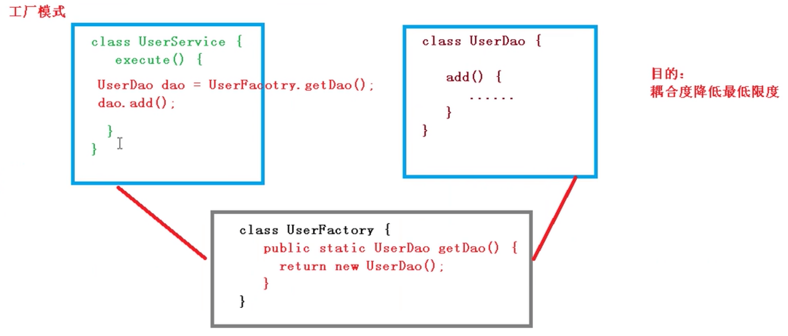
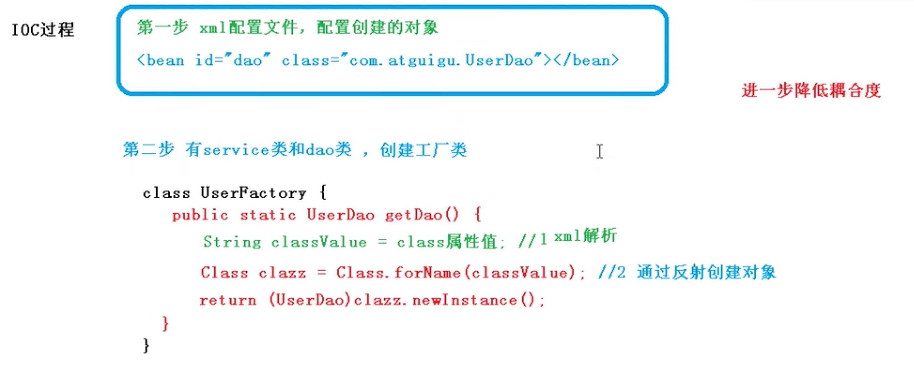
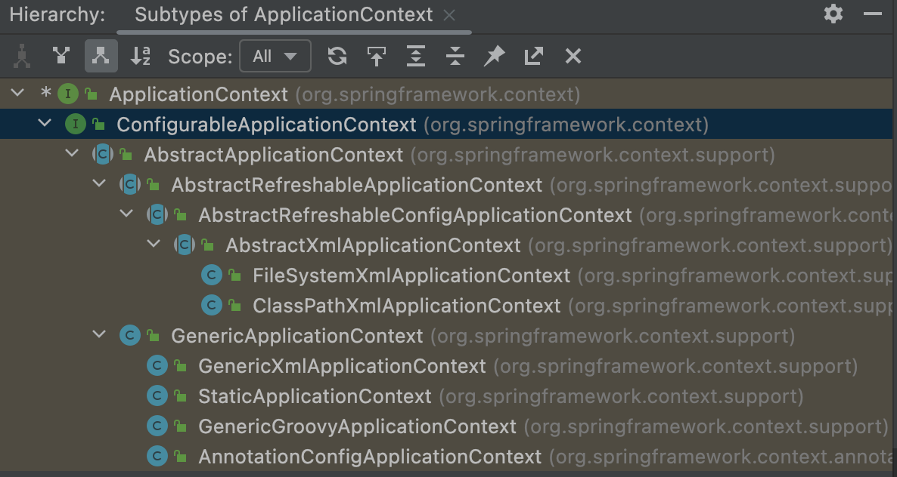

## 1 IOC容器原理
### IOC概念
* 控制反转。把对象创建和对象调用的过程，交给Spring进行管理。
* 使用IOC的目的：降低代码耦合度。


### 底层原理


* xml解析
* 工厂模式
* 反射


1. java对象调用的过程

```java
class UserDao{
    add(){

    }
}
public class UserService{
    public void execute(){
        UserDao dao = new UserDao();
        dao.add();
    }
}
```
2. 使用工厂模式

```java
class UserDao{
    add(){

    }
}
class UserFactory{
    public static UserDao getDao(){
        return new UserDao();
    }
}

class UserService{
    execute(){
        UserDao dao = UserFactory.getDao();
        dao.add();
    }
}
```

3. IOC模式实现。通过xml解析、工厂模式、反射，进一步降低耦合度。
   1. 创建xml配置文件
   2. 创建工厂类，解析xml，使用IOC机制创建对象。
   3. 降低耦合度，不依赖java对象，而是通过配置文件决定具体实例化的对象。根据id查找class.forName(className),加载字节码文件，通过Instance方法，实例化对象。值依赖一个ClassName的字符串。可以随时更改，而不用依赖具体的包名、对象名和对象中的构造方法。



```xml
<bean id="dao" class="com.ykl.UserDao"></bean>
```
```java
class UserDao{
    add(){

    }
}
class UserFactory{
    public static UserDao getDao(){
        String classValue = class属性值;//XML解析
        Class classzz = Class.forName(classValue)//通过反射创建对象。
        return (UserDao)clazz.newInstance();
    }
}

class UserService{
    execute(){
        UserDao dao = UserFactory.getDao();
        dao.add();
    }
}
```
## 2 IOC接口BeanFactory&ApplicationContext

IOC思想是基于IOC容器完成的，IOC容器底层就是对象工厂（工厂通过xml文件解析类名，通过反射机制创建对象实例）。

### 实现方法
Spring提供了IOC容器实现的两种方式。耗时耗资源的操作，尽量在初始化的时候完成，所以ApplicationContext这个接口更常使用。

* BeanFactory：IOC容器基本实现，是Spring内部的使用接口，不提供给开发人员使用。
  * 加载配置文件的时候，不会创建对象。在获取（使用）对象的时候，才去创建对象。
* ApplicationContext。BeanFactory接口的子接口，提供了更多更强大的功能，一般由开发人员进行使用。
  * 加载配置文件的时候就会把配置文件对象进行创建。

### BeanFactory
继承结构如下，有多种子接口和实现方法


### ApplicationContext

继承结构如下


* FileSystemXmlApplicationContext,存储盘下的xml路径
* ClassPathXmlApplicationContext,是src下的类路径

### IOC操作Bean

* Spring创建对象——依赖倒置
* Spring注入属性——依赖注入

主要两种方式
* 基于XML的方式
* 基于注解的方式
## 3 IOCBean管理基于XML方式

### 基于XMl方式创建对象
```xml
<bean id="user" class="com.ykl.User"></bean>
id:对象唯一标识
class:创建对象的类全路径，包类路径
name:对象名称标识
```
* 在Spring给你配置文件中，使用bean标签，标签里添加对应属性。实现对象的创建
* bean中有很多属性
* 创建对象的时候，执行午餐构造函数。


### 基于XML方式注入属性
> DI依赖注入，就是注入属性。

* 原始的属性注入方法


```java
/**
 * Alipay.com Inc.
 * Copyright (c) 2004-2022 All Rights Reserved.
 */
package com.ykl;

/**
 * @author yinkanglong
 * @version : Book, v 0.1 2022-10-08 14:32 yinkanglong Exp $
 */
public class Book  {
    private String name;
    
    //set方法注入
    public void setName(String name) {
        this.name = name;
    }
    
    //有参构造函数注入
    public Book(String name){
        this.name = name;
    }
    
    public Book(){
        
    }

    public static void main(String[] args) {
        //使用set方法注入
        Book book = new Book();
        book.setName("123");
        
        //使用有参构造函数注入
        Book book = new Book("abc");
    }
}
```


* 第一种方法：使用set方法进行注入.
  * 创建属性和属性对应的set方法。
  * 在Spring配置文件配置对象创建和属性注入。
  * 加载配置文件获取指定的对象。

```xml
<?xml version="1.0" encoding="UTF-8"?>
<beans xmlns="http://www.springframework.org/schema/beans"
       xmlns:xsi="http://www.w3.org/2001/XMLSchema-instance"
       xsi:schemaLocation="http://www.springframework.org/schema/beans http://www.springframework.org/schema/beans/spring-beans.xsd">

<!--    配置User bean -->
    <bean id="user" class="com.ykl.User"></bean>

<!--    配置Book对象和属性注入-->
    <bean id="book" class="com.ykl.Book">
<!--        name:类里面属性的名称
            value:向属性注入的值
-->
        <property name="name" value="shuming"></property>
    </bean>
</beans>
```

```java
    @Test
    public void testBook(){

//        在创建对象的过程中就完成了属性的注入
        ApplicationContext context = new ClassPathXmlApplicationContext("bean01.xml");

        Book book = context.getBean("book", Book.class);

        System.out.println(book.getName());

    }
```
* 第二种方法：使用有参构造函数进行注入
  * 创建类和属性，创建对应属性的有参构造方法。
```java
/**
 * Alipay.com Inc.
 * Copyright (c) 2004-2022 All Rights Reserved.
 */
package com.ykl;

/**
 * @author yinkanglong
 * @version : Order, v 0.1 2022-10-08 14:47 yinkanglong Exp $
 */
public class Order {
    private String oname;
    private String address;

    public Order(String oname, String address) {
        this.oname = oname;
        this.address = address;
    }
}
```
  * 通过有参构造方法创建对象进行依赖注入
```xml
    <bean id="order" class="com.ykl.Order">
        <constructor-arg name="oname" value="abc"></constructor-arg>
        <constructor-arg name="address" value="China"></constructor-arg>
    </bean>
constructor-arg
name 名称
value 值
index 参数列表
```
* p名称空间注入方法
  * 用于简化xml的配置方法。在beans里添加p命名空间
  * 在bean标签里添加键值对。
```xml
<beans xmlns:p="http://www.springframework.org/schema/p">

<bean id="book" class="com.ykl.Book" p:name="shuming">
</bean>
```

### xml注入其他类型的属性
* 字面值,空值null
```xml
<property name="address">
<null/>
</property>
```
* 字面值，包含特殊符号
  * 把特殊符号进行转义

```xml
<property name="address" value="&lt&lt南京&gt&gt">
</property>
```
  * 把特殊符号写到CDATA中
```xml
<property name="address">
<value>
<![CDATA[<<南京>>]]>
</value>
</property>
```
* 级联Bean——外部bean注入
  * 创建service和dao类
  * 在配置文件中配置注入操作
  * 测试类，测试是否注入成功

```java

public class UserService {

    public UserDao getUserDao() {
        return userDao;
    }

    public void setUserDao(UserDao userDao) {
        this.userDao = userDao;
    }

    UserDao userDao;


    public void add(){
        System.out.println("service add ...");

        userDao.update();
    }
}
public class UserDaoImpl implements UserDao{

    @Override
    public void update(){
        System.out.println("dao update ...");
    }
}
```
```xml
<?xml version="1.0" encoding="UTF-8"?>
<beans xmlns="http://www.springframework.org/schema/beans"
       xmlns:xsi="http://www.w3.org/2001/XMLSchema-instance"
       xsi:schemaLocation="http://www.springframework.org/schema/beans http://www.springframework.org/schema/beans/spring-beans.xsd">

<!--    配置User bean -->
    <bean id="userService" class="com.ykl.service.UserService">
        <!--
        注入userDao的对象
        name属性值：类里面的属性名称
        ref属性:创建UserDao对象bean标签的id值。
        -->
        <property name="userDao" ref="userDao"></property>

    </bean>

    <bean id="userDao" class="com.ykl.dao.UserDaoImpl"></bean>
</beans>
```
```java
public class Test02 {
    @Test
    public void testAdd(){
//        加载spring的配置文件
        ApplicationContext context = new ClassPathXmlApplicationContext("bean02.xml");

        //        获取配置创建的对象
        UserService user = context.getBean("userService", UserService.class);
        user.add();
    }
}
```
* 级联Bean——内部bean
  * 一对多关系：部门和员工。
  * 在实体类之间表示一对多的关系。
```xml
    <bean id="emp" class="com.ykl.bean.Emp">
        <!--
        普通属性
        -->
        <property name="ename" value="lucy"></property>
        <property name="gender" value="nv"></property>
        <!--
        级联对象的创建方法
        -->
        <property name="dept">
            <bean id="dept" class="com.ykl.bean.Dept">
                <property name="dname" value="security"></property>
            </bean>
        </property>
    </bean>
```
> 数据库3BNF范式的要求：
> 一对多的关系，需要在多的一方添加外键，指向一。
> 多对多的关系，需要拆分出关系类。任意一方和关系类都是一对多的关系。

* 级联赋值
  * 外部bean注入
  * 给外部bean的属性赋值
```
   <bean id="emp" class="com.ykl.bean.Emp">
        <!--
        普通属性
        -->
        <property name="ename" value="lucy"></property>
        <property name="gender" value="nv"></property>
        <!--
        级联赋值-外部bean的方式
        -->
        <property name="dept" ref="dept">
        </property>

        <property name="dept.dname" value="jishubu">
        </property>
    </bean>
    <bean id="dept" class="com.ykl.bean.Dept>
        <property name="dname" value="caiwubu"></property>
    </bean>
```

### xml注入集合属性
* 注入数组类型属性、List集合类型属性、Map集合类型属性
   1. 创建集合类型的属性。
   2. 注入集合类型的属性

```java
/**
 * Alipay.com Inc.
 * Copyright (c) 2004-2022 All Rights Reserved.
 */
package com.ykl.collectiontype;

import java.util.Arrays;
import java.util.List;
import java.util.Map;
import java.util.Set;

/**
 * @author yinkanglong
 * @version : Student, v 0.1 2022-10-08 16:01 yinkanglong Exp $
 */
public class Student {
    private String[] courses;

    private List<String> list;

    private Map<String,String> maps;

    private Set<String> sets;

    public Student() {
    }

    public void setList(List<String> list) {
        this.list = list;
    }

    public void setMaps(Map<String, String> maps) {
        this.maps = maps;
    }

    public void setSets(Set<String> sets) {
        this.sets = sets;
    }

    public void setCourses(String[] courses) {
        this.courses = courses;
    }

    @Override
    public String toString() {
        return "Student{" +
                "courses=" + Arrays.toString(courses) +
                ", list=" + list +
                ", maps=" + maps +
                ", sets=" + sets +
                '}';
    }
}
```
```xml
    <bean id="student" class="com.ykl.collectiontype.Student">
        <property name="courses" >
            <array>
                <value>java</value>
                <value>c</value>
            </array>
        </property>
            
        <property name="list" >
            <list>
                <value>zhangsan</value>
                <value>xiaosan</value>
            </list>
        </property>

        <property name="maps">
            <map>
                <entry key="java" value="java"></entry>
                <entry key="name" value="hel"></entry>
            </map>
        </property>

        <property name="sets">
            <set>
                <value>msyql</value>
                <value>redis</value>
            </set>
        </property>

    </bean>
```
*  XML注入集合中对象类型
```xml
    <bean>
    ......
        <property name="courseList">
            <list>
                <ref bean="course1"></ref>
                <ref bean="course2"></ref>
                <ref bean="course3"></ref>
            </list>
        </property>
    </bean>
<!--    创建多个course对象-->
    <bean id="course1" class="com.ykl.collectiontype.Course">
        <property name="cname" value="c1"></property>
    </bean>
    <bean id="course2" class="com.ykl.collectiontype.Course">
        <property name="cname" value="c2"></property>
    </bean>
    <bean id="course3" class="com.ykl.collectiontype.Course">
        <property name="cname" value="c3"></property>
    </bean>
```
* 使用新的命名空间进行注入
  * 在spring配置文件中引入util命名空间
  * 提取list集合类型的属性注入。
```xml
<?xml version="1.0" encoding="UTF-8"?>
<beans xmlns="http://www.springframework.org/schema/beans"
       xmlns:xsi="http://www.w3.org/2001/XMLSchema-instance"
       xmlns:util="http://www.springframework.org/schema/util"
       xsi:schemaLocation="http://www.springframework.org/schema/beans  http://www.springframework.org/schema/beans/spring-beans.xsd
       http://www.springframework.org/schema/util  http://www.springframework.org/schema/util/spring-util.xsd">

    <util:list id="bookList">
        <value>zhangsan</value>
        <value>xiaosan</value>
    </util:list>
    <bean id="book" class="com.ykl.collectiontype.Book">
        <property name="bookList" ref="bookList">
        </property>
    </bean>

</beans>
```

### 普通bean和工厂bean
* 普通bean：在配置文件中定义的Bean类型就是返回类型
* 工厂bean：在配置文件中定义的Bean类型和返回类型可以不一样。


工厂bean的实现方法
* 创建类，让这个类作为工厂bean。实现接口factoryBean
* 实现接口里面的方法，在实现的方法中定义返回bean类型。


## 4 IOCBean管理基于注解方式


> 包的两种作用
> * 水平分层——层次。位于不同的层次，应该在包的某个字段体现出来。service层、view层、dao层等。
> * 垂直分割——功能。同一个功能在不同层次有不同力度的对应和实现，应该在包类的某个字段体现出来。包括book功能，sell功能等。
> 一个包类路径的命名（功能结构或者说项目架构），应该是水平分层和垂直分割方法的交替。