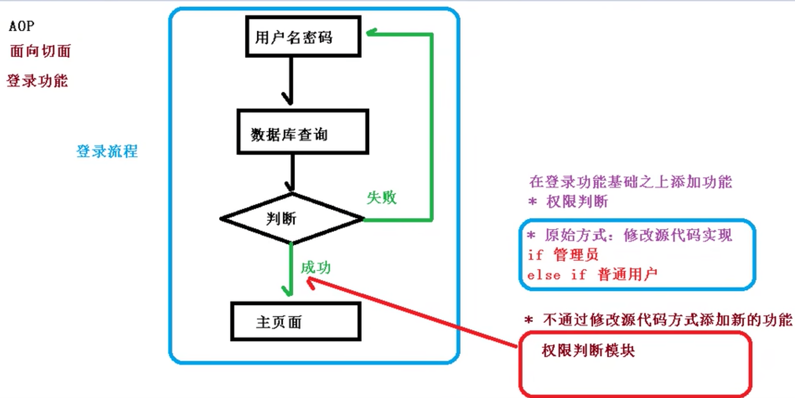
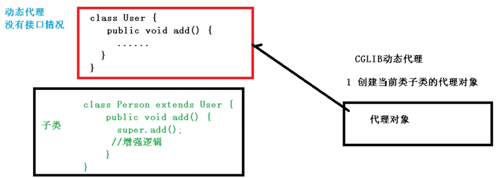
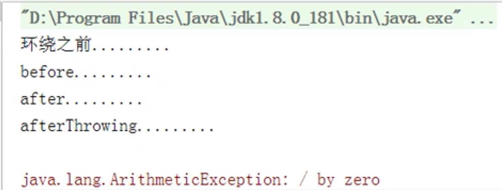

## 1 AOP基本概念

### 概念
面向切面编程Aspect Oriented Programming
* 通过 预编译方式 和 运行期间动态代理 实现程序功能的统一维护的一种技术。
* AOP是OOP（面相对象编程）的延续。是函数式编程的一种衍生泛型。
* 利用AOP可以对业务逻辑的各个部分进行隔离。降低耦合度、提高可用性、提高开发效率 

### 主要功能
将日志记录、性能统计、安全控制、事务处理、异常处理等代码从业务逻辑代码中划分出来。

通俗描述：不通过修改源代码的方法，在主干功能里添加新功能




## 2 AOP底层原理

### 动态代理的原理
AOP使用动态代理实现面向切面编程

* 有接口情况，使用JDK动态代理
  * 设计模式：代理模式。创建接口实现类代理对象，增强类的方法。


* 没有接口情况，使用CGLIB实现动态代理
  * 创建子类继承原来的类。
  * 创建当前类子类的代理对象，增强类中的方法。




### 动态代理的实现

1. JDK 动态代理的实现。使用java.lang.reflect.Proxy，通过反射原理实现动态代理。
   1. 第一个参数：类加载器
   2. 第二个参数：被代理的接口
   3. 第三个参数：增强方法的逻辑，实现接口

```java
static Object	newProxyInstance(ClassLoader loader, 类<?>[] interfaces, InvocationHandler h)
返回指定接口的代理类的实例，该接口将方法调用分派给指定的调用处理程序
```
2. 编写JDK动态代理的代码

```java
package com.ykl.dao;

import java.lang.reflect.InvocationHandler;
import java.lang.reflect.Method;
import java.lang.reflect.Proxy;

/**
 * @author yinkanglong
 * @version : JDKProxy, v 0.1 2022-10-09 14:31 yinkanglong Exp $
 */
public class JDKProxy {
    public static void main(String[] args) {
        Class[] interfaces = {UserDo.class};

//        Proxy.newProxyInstance(JDKProxy.class.getClassLoader(), interfaces, new InvocationHandler() {
//            @Override
//            public Object invoke(Object proxy, Method method, Object[] args) throws Throwable {
//                return null;
//            }
//        });

        UserDoImpl userDo = new UserDoImpl();
        UserDo dao = (UserDo)Proxy.newProxyInstance(JDKProxy.class.getClassLoader(),interfaces,new UserDaoProxy(userDo));
        int result = dao.add(1,2);
        System.out.println("结束");
    }
}
class UserDaoProxy implements InvocationHandler{
    Object object;
    //把被代理的对象，传递进来。通过有参构造进行传递
    public UserDaoProxy(Object object){
        this.object=object;
    }
    @Override
    public Object invoke(Object proxy, Method method, Object[] args) throws Throwable {
        System.out.println("方法之前的执行"+method.getName());

        Object res = method.invoke(object,args);

        System.out.println("方法执行后");

        return res;
    }
}
```


## 3 术语

### 连接点
* 类中可以被增强的方法称为连接点

### 切入点
* 实际被真正增强的方法称为切入点
### 通知（增强）
实际增强的逻辑部分称为通知

通知的多种类型
* 前置通知Before。
* 后置通知AfterReturn。正常返回才有
* 环绕通知Around。通过切入点修改前后
* 异常通知AfterThrowing
* 最终通知After。finally无论出现异常都执行。

### 切面
切面是一个工作。
把通知应用到切入点的过程，就叫做切面。


## 4 AOP操作

### AspectJ
在Spring框架中一般基于AspectJ实现AOP操作

AspectJ不是Spring的组成部分，独立AOP框架，一般把AspectJ和Spring框架一起使用，进行AOP操作。

基于AspectJ实现AOP操作有两种方式
* 基于XML配置文件实现
* 基于注解方式实现

### 在项目中引入相关的依赖


### 切入点表达式
作用：知道要对哪个类、哪个方法进行增强。

语法结构
```java
execution([权限修饰符][返回类型][类全路径名][方法名称]([参数列表]))

对com.ykl.UserDao里的add方法进行增强
execution(* com.ykl.dao.UserDao.add(..)
对类中所有的方法进行增强
execution(* com.ykl.dao.UserDao.*(..)
对包中所有类所有方法进行增强
execution(* com.ykl.dao.*.*(..)
```

## 5 基于AspectJ注解AOP

### 使用步骤
1. 创建类，在类中定义方法
```java
@Component
public class User {
    public void add(){
        System.out.println("User add ...");
    }
}
```
2. 创建增强类（编写增强逻辑）
   1. 在增强类里创建方法，不同的方法代表不同的名字。
```java
@Component
@Aspect
public class UserProxy {

    //前置通知
    public void before(){
        System.out.println("执行前...");
    }
}
```
3. 进行通知的配置
   1. 在spring的配置文件中，开启注解扫描
   2. 使用注解创建User和UserProxy对象
   3. 在增强类上添加注解@Aspect
   4. 在spring配置文件中开启生成代理对象

```xml
<?xml version="1.0" encoding="UTF-8"?>
<beans xmlns="http://www.springframework.org/schema/beans"
       xmlns:xsi="http://www.w3.org/2001/XMLSchema-instance"
       xmlns:context="http://www.springframework.org/schema/context"
       xmlns:aop="http://www.springframework.org/schema/aop"
       xsi:schemaLocation="http://www.springframework.org/schema/beans http://www.springframework.org/schema/beans/spring-beans.xsd
       http://www.springframework.org/schema/context http://www.springframework.org/schema/context/spring-context.xsd
       http://www.springframework.org/schema/aop http://www.springframework.org/schema/aop/spring-aop.xsd">

    <!--开启组件扫描
        1. 如果扫描多个包，多个包之间使用逗号隔开
        2. 扫描包的上层目录-->
    <context:component-scan base-package="com.ykl"></context:component-scan>
    <!--开启aspectJ生成代理对象-->
    <aop:aspectj-autoproxy></aop:aspectj-autoproxy>
</beans>
```

4. 配置不同类型的通知
   1. 在增强类里面，在作为通知的方法上面，添加通知类型的注解。并通过切入点表达式配置。

```java
/**
 * Alipay.com Inc.
 * Copyright (c) 2004-2022 All Rights Reserved.
 */
package com.ykl.aopanno;

import org.aspectj.lang.ProceedingJoinPoint;
import org.aspectj.lang.annotation.*;
import org.springframework.stereotype.Component;

/**
 * @author yinkanglong
 * @version : UserProxy, v 0.1 2022-10-09 15:16 yinkanglong Exp $
 */
@Component
@Aspect
public class UserProxy {

    //前置通知
    @Before(value = "execution(* com.ykl.aopanno.User.add(..))")
    public void before(){
        System.out.println("执行前...");
    }

    //最终通知，有异常也执行
    @After(value = "execution(* com.ykl.aopanno.User.add(..))")
    public void after(){
        System.out.println("after...");
    }

    //抛出异常后不执行
    @AfterReturning(value = "execution(* com.ykl.aopanno.User.add(..))")
    public void afterReturn(){
        System.out.println("afterReturn...");
    }

    @AfterThrowing(value = "execution(* com.ykl.aopanno.User.add(..))")
    public void afterThrow(){
        System.out.println("afterThrow...");
    }

    //通过切入点设置了环绕前后
    @Around(value = "execution(* com.ykl.aopanno.User.add(..))")
    public void around(ProceedingJoinPoint proceedingJoinPoint) throws Throwable{
        System.out.println("环绕之前....");

        proceedingJoinPoint.proceed();

        System.out.println("环绕之后....");
    }

}
```

正常的执行顺序如下


当抛出异常的时候执行顺序如下




### @Pointcut公共切入点抽取
由于很多操作都具有相同的切入点，配置相同。所以可以抽取相同的切入点


```java
@Pointcut(value = "execution(* com.ykl.aopanno.User.add(..))")
public void point(){

}

//前置通知
@Before(value = "point()")
public void before(){
    System.out.println("执行前...");
}
```

### @Order增强类的优先级

有多个增强类对同一个方法进行增强，设置增强类的优先级。

* 在增强类上面添加注解@Order(数字类型的值)，数字类型值越小优先级越高。

```java
@Component
@Aspect
@Order(1)
public class PersonProxy {

}
```

### 完全注解开发

通过配置类代替XML的注解


```
@Configuration
@ComponentScan(basePackages={"com.ykl"})
@EnableAspectJAutoProxy(proxyTargetClass=true)
public class ConfigAop{

}
```

## 6 基于AspectJ配置文件

1. 创建两个类，增强类和被增强类，创建方法
2. 在spring配置文件中创建两个类对象
3. 在spring配置文件中配置切入点

```xml
<?xml version="1.0" encoding="UTF-8"?>
<beans xmlns="http://www.springframework.org/schema/beans"
       xmlns:xsi="http://www.w3.org/2001/XMLSchema-instance"
       xmlns:context="http://www.springframework.org/schema/context"
       xmlns:aop="http://www.springframework.org/schema/aop"
       xsi:schemaLocation="http://www.springframework.org/schema/beans http://www.springframework.org/schema/beans/spring-beans.xsd
       http://www.springframework.org/schema/context http://www.springframework.org/schema/context/spring-context.xsd
       http://www.springframework.org/schema/aop http://www.springframework.org/schema/aop/spring-aop.xsd">


    <!--创建对象-->
    <bean id="book" class="com.ykl.aopxml.Book"></bean>
    <bean id="bookProxy" class="com.ykl.aopxml.BookProxy"></bean>

    <aop:config>
        <!--切入点配置-->
        <aop:pointcut id="p" expression="execution(* com.ykl.aopxml.Book.add(..))"></aop:pointcut>
        <!--切面配置-->
        <aop:aspect ref="bookProxy">
            <aop:before method="before" pointcut-ref="p"></aop:before>
        </aop:aspect>
    </aop:config>

</beans>
```


