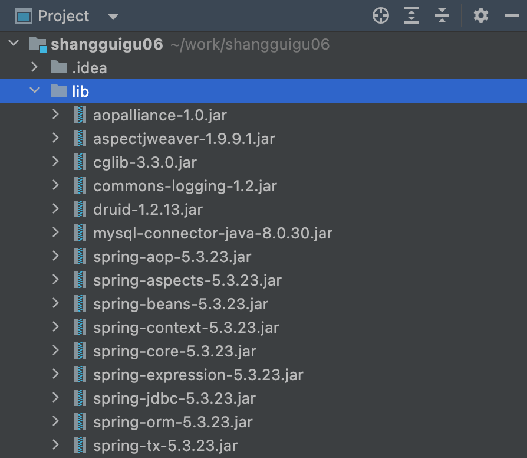

# Data Access

## 简介
### 概述
DataAccess模块主要包括
* JDBC
* ORM
* OXM

JDBCTemplate对JDBC进行封装，很方便的实现对数据库进行操作。

> 自己开发项目也应该这样做。
> 首先进行设计，把接口、实现、属性、方法定义好。遵循从上到下的设计。
> 然后进行开发，根据具体的业务逻辑实现方法的内容。遵循从下到上的开发。
### 准备工作

1. 引入相关的jar包



2. 数据库连接池

```xml

    <bean id="dataSource" class="com.alibaba.druid.pool.DruidDataSource">
        <property name="driverClassName" value="com.mysql.jdbc.Driver"></property>
        <property name="url" value="jdbc:mysql://localhost:3310/user"></property>
        <property name="username" value="root"></property>
        <property name="password" value="123456"></property>
    </bean>
```

3. 配置jdbcTemplate对象，注入dataSource

```
    <!--创建jdbctemplate对象-->
    <bean id="jdbcTemplate" class="org.springframework.jdbc.core.JdbcTemplate">
        <!--注入参数-->
        <property name="dataSource" ref="dataSource"></property>
    </bean>
```


4. 创建Service和dao。在service注入dao，在dao中注入jdbcTemplate

```java
@Repository
public class UserDaoImpl implements UserDao {
    
    @Autowired
    private JdbcTemplate jdbcTemplate;
    
    
    @Override
    public int addUser(User user) {
        System.out.println("add 方法执行了");
        return 1;
    }
}


public class UserService {
    @Autowired
    private UserDao userDao;

    public void addUser(User user){
        userDao.addUser(user);
    }


}
```

### 编写业务逻辑
1. 在dao中进行数据库添加操作。在jdbcTemplate对象里面update方法实现添加操作

```java
    @Override
    public int addUser(User user) {
        String sql = "insert into user values(?,?,?)";
        Object[] args = {user.getUserId(),user.getUsername(),user.getUserStatus()};


        int update = jdbcTemplate.update(sql,args);
        System.out.println(update);
        return update;
    }
```
2. 在service中完成业务逻辑

```java
@Service
public class UserService {
    @Autowired
    private UserDao userDao;

    public void addUser(User user){
        userDao.addUser(user);
    }
}
```

3. 在test中进行测试和验证

```java
    @Test
    public void testJDBC(){
        ApplicationContext context = new ClassPathXmlApplicationContext("bean01.xml");
        UserService userService = context.getBean("userService",UserService.class);
        User user = new User();
        user.setUserId("123");
        user.setUsername("yinkanglong");
        user.setUserStatus("up");
        userService.addUser(user);
    }
```

### 增删查改业务的实现