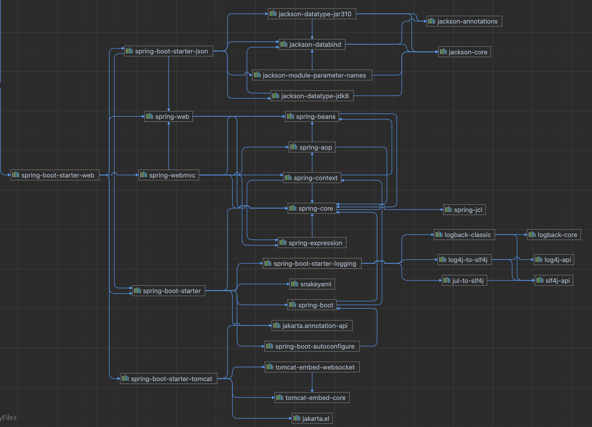

## 1 创建项目

### maven设置
* 配置maven的Aliyun镜像和jdk版本
```xml
<mirrors>
      <mirror>
        <id>nexus-aliyun</id>
        <mirrorOf>central</mirrorOf>
        <name>Nexus aliyun</name>
        <url>http://maven.aliyun.com/nexus/content/groups/public</url>
      </mirror>
  </mirrors>
 
  <profiles>
         <profile>
              <id>jdk-1.8</id>
              <activation>
                <activeByDefault>true</activeByDefault>
                <jdk>1.8</jdk>
              </activation>
              <properties>
                <maven.compiler.source>1.8</maven.compiler.source>
                <maven.compiler.target>1.8</maven.compiler.target>
                <maven.compiler.compilerVersion>1.8</maven.compiler.compilerVersion>
              </properties>
         </profile>
  </profiles>
```


### 创建maven工程

```
mvn archetype:generate
```

### 引入依赖

```
<parent>
    <groupId>org.springframework.boot</groupId>
    <artifactId>spring-boot-starter-parent</artifactId>
    <version>2.3.4.RELEASE</version>
</parent>


<dependencies>
    <dependency>
        <groupId>org.springframework.boot</groupId>
        <artifactId>spring-boot-starter-web</artifactId>
    </dependency>

</dependencies>
```

### 创建主程序

```java
/**
 * 主程序类
 * @SpringBootApplication：这是一个SpringBoot应用
 */
@SpringBootApplication
public class MainApplication {

    public static void main(String[] args) {
        SpringApplication.run(MainApplication.class,args);
    }
}
```


### 编写业务逻辑

```java
@RestController
public class HelloController {


    @RequestMapping("/hello")
    public String handle01(){
        return "Hello, Spring Boot 2!";
    }


}
```


### 测试

直接运行main方法


### 配置

application.properties

```
server.port=8888
```

### 简化部署

```xml
<build>
    <plugins>
        <plugin>
            <groupId>org.springframework.boot</groupId>
            <artifactId>spring-boot-maven-plugin</artifactId>
        </plugin>
    </plugins>
</build>
```


## 2 工程结构

### 推荐工程结构
```
com
  +- example
    +- myproject
      +- Application.java
      |
      +- domain
      |  +- Customer.java
      |  +- CustomerRepository.java
      |
      +- service
      |  +- CustomerService.java
      |
      +- web
      |  +- CustomerController.java
      |
```
* root package：com.example.myproject，所有的类和其他package都在root package之下。
* 应用主类：Application.java，该类直接位于root package下。通常我们会在应用主类中做一些框架配置扫描等配置，我们放在root package下可以帮助程序减少手工配置来加载到我们希望被Spring加载的内容
* com.example.myproject.domain包：用于定义实体映射关系与数据访问相关的接口和实现
* com.example.myproject.service包：用于编写业务逻辑相关的接口与实现
* com.example.myproject.web：用于编写Web层相关的实现，比如：Spring MVC的Controller等

> Spring Boot的应用主类会自动扫描root package以及所有子包下的所有类来进行初始化。


### 非典型结构下的初始化

1. 使用@ComponentScan注解指定具体的加载包

```java
@SpringBootApplication
@ComponentScan(basePackages="com.example")
public class Bootstrap {

    public static void main(String[] args) {
        SpringApplication.run(Bootstrap.class, args);
    }

}
```
2. 使用@Bean注解来初始化。在主类中进行初始化。
```java
@SpringBootApplication
public class Bootstrap {

    public static void main(String[] args) {
        SpringApplication.run(Bootstrap.class, args);
    }

    @Bean
    public CustomerController customerController() {
        return new CustomerController();
    }

}
```


## 3 两大特性——依赖管理 

### 依赖管理的原理
通过父项目进行依赖管理。通过starter进行依赖导入。
```xml
  <parent>
    <groupId>org.springframework.boot</groupId>
    <artifactId>spring-boot-starter-parent</artifactId>
    <version>2.3.4.RELEASE</version>
  </parent>
```

1. mypom.xml
2. parent -- spring-boot-starter-parent
3. parent -- spring-boot-dependencies

1. 几乎声明了所有的版本，查看Spring-boot-dependencies中的版本。可以自定义properties标签，修改版本号。
2. stater场景启动器。自动引入相关的所有依赖。可以自定义场景启动器，所有场景启动器最基本的以来。spring-boot-starter。引入依赖一部分可以不写版本号。引入非版本仲裁的版本号，必须要写。

### spring-boot-starter-web的依赖树
* （spring-boot-starter）-web
  * spring-boot相关的依赖
  * （）+logging依赖
  * （）+jason依赖
  * （）+tomcat依赖
  * web/webmvc相关的依赖

* 新快捷键
```
cmd+B 声明和引用相互跳转
cmd+alt+B 实现和引用相互跳转

cmd+[/ cmd+] 前进后退
cmd+U 父项目
```
* 依赖树


```
[INFO] \- org.springframework.boot:spring-boot-starter-web:jar:2.3.4.RELEASE:compile
[INFO]    +- org.springframework.boot:spring-boot-starter:jar:2.3.4.RELEASE:compile
[INFO]    |  +- org.springframework.boot:spring-boot:jar:2.3.4.RELEASE:compile
[INFO]    |  +- org.springframework.boot:spring-boot-autoconfigure:jar:2.3.4.RELEASE:compile
[INFO]    |  +- org.springframework.boot:spring-boot-starter-logging:jar:2.3.4.RELEASE:compile
[INFO]    |  |  +- ch.qos.logback:logback-classic:jar:1.2.3:compile
[INFO]    |  |  |  +- ch.qos.logback:logback-core:jar:1.2.3:compile
[INFO]    |  |  |  \- org.slf4j:slf4j-api:jar:1.7.30:compile
[INFO]    |  |  +- org.apache.logging.log4j:log4j-to-slf4j:jar:2.13.3:compile
[INFO]    |  |  |  \- org.apache.logging.log4j:log4j-api:jar:2.13.3:compile
[INFO]    |  |  \- org.slf4j:jul-to-slf4j:jar:1.7.30:compile
[INFO]    |  +- jakarta.annotation:jakarta.annotation-api:jar:1.3.5:compile
[INFO]    |  +- org.springframework:spring-core:jar:5.2.9.RELEASE:compile
[INFO]    |  |  \- org.springframework:spring-jcl:jar:5.2.9.RELEASE:compile
[INFO]    |  \- org.yaml:snakeyaml:jar:1.26:compile
[INFO]    +- org.springframework.boot:spring-boot-starter-json:jar:2.3.4.RELEASE:compile
[INFO]    |  +- com.fasterxml.jackson.core:jackson-databind:jar:2.11.2:compile
[INFO]    |  |  +- com.fasterxml.jackson.core:jackson-annotations:jar:2.11.2:compile
[INFO]    |  |  \- com.fasterxml.jackson.core:jackson-core:jar:2.11.2:compile
[INFO]    |  +- com.fasterxml.jackson.datatype:jackson-datatype-jdk8:jar:2.11.2:compile
[INFO]    |  +- com.fasterxml.jackson.datatype:jackson-datatype-jsr310:jar:2.11.2:compile
[INFO]    |  \- com.fasterxml.jackson.module:jackson-module-parameter-names:jar:2.11.2:compile
[INFO]    +- org.springframework.boot:spring-boot-starter-tomcat:jar:2.3.4.RELEASE:compile
[INFO]    |  +- org.apache.tomcat.embed:tomcat-embed-core:jar:9.0.38:compile
[INFO]    |  +- org.glassfish:jakarta.el:jar:3.0.3:compile
[INFO]    |  \- org.apache.tomcat.embed:tomcat-embed-websocket:jar:9.0.38:compile
[INFO]    +- org.springframework:spring-web:jar:5.2.9.RELEASE:compile
[INFO]    |  \- org.springframework:spring-beans:jar:5.2.9.RELEASE:compile
[INFO]    \- org.springframework:spring-webmvc:jar:5.2.9.RELEASE:compile
[INFO]       +- org.springframework:spring-aop:jar:5.2.9.RELEASE:compile
[INFO]       +- org.springframework:spring-context:jar:5.2.9.RELEASE:compile
[INFO]       \- org.springframework:spring-expression:jar:5.2.9.RELEASE:compile
```

## 4 两大特性——自动配置

### 自动配置的体现

1. 自动配好了SpringMVC
   1. 引入了SpringMVC全套组件
   2. 自动配好了SpringMVC常用功能。字符编码问题、多文件上传问题
2. 默认程序结构
   1. 主程序所在包及其所有子包里的文件和组件都能被扫描到。无需配置包扫描
   2. 可以修改SpringbootApplication注解参数中的扫描路径。或者ComponentScan注解。
3. .properties中的文件是绑定到具体的Java类的。这些类会在容器中创建指定的对象。
4. 按需加载所有的自动配置，自动配置都在spring-boot-autoconfigure包中


### @ConfigurationProperties

@ConfigurationProperties是springboot提供读取配置文件的一个注解。

它是实现了BeanPostProcessor接口，在bean被实例化后，会调用后置处理，递归的查找属性，通过反射注入值，对大多数属性而言强制需提供其setter和getter方法。