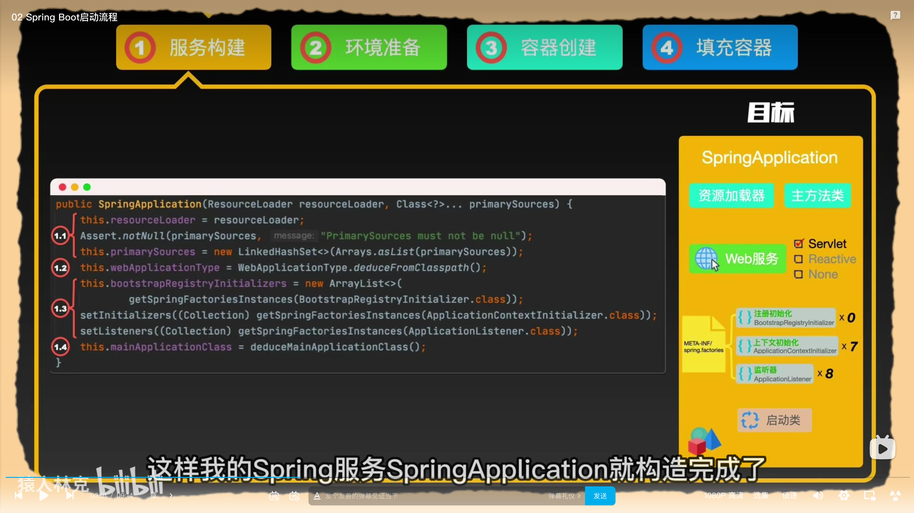
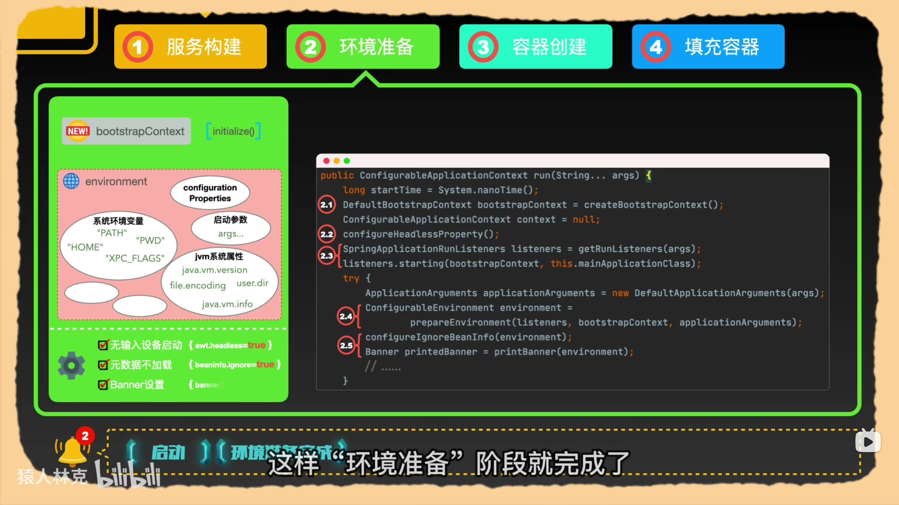
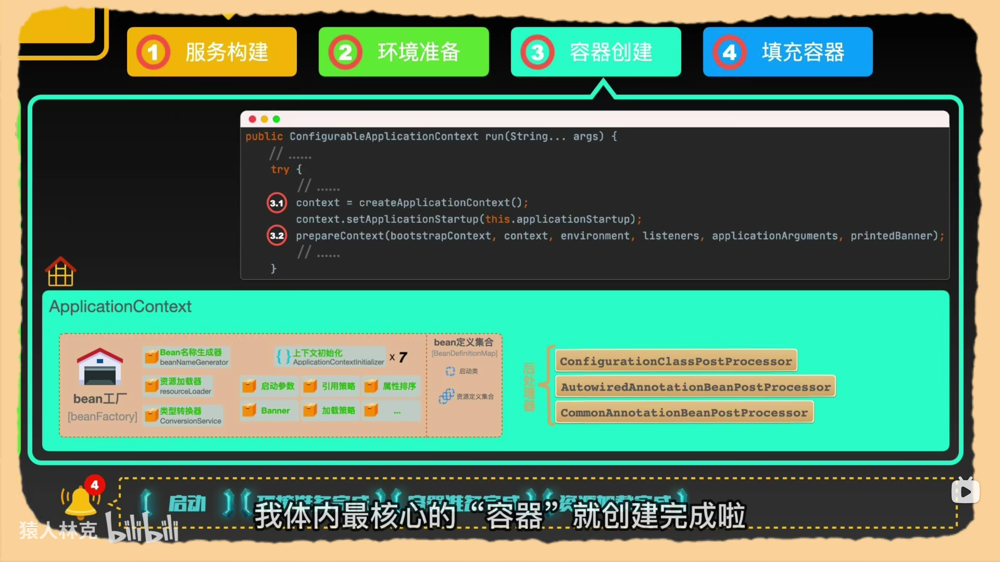

## 1 springboot的启动过程
springcontext.run到底干了什么


SpringApplication.run()到底干了什么

### 服务构建

调用SpringApplication的静态run方法。通过一系列配置创建SpringApplication类。
1. 初始化资源加载器
2. 初始化服务类型
3. 初始化spring.factories中定义的初始化类。包括Initializer和Listener
4. 找到启动类



```java
	/**
	 * Create a new {@link SpringApplication} instance. The application context will load
	 * beans from the specified primary sources (see {@link SpringApplication class-level}
	 * documentation for details). The instance can be customized before calling
	 * {@link #run(String...)}.
	 * @param resourceLoader the resource loader to use
	 * @param primarySources the primary bean sources
	 * @see #run(Class, String[])
	 * @see #setSources(Set)
	 */
	@SuppressWarnings({ "unchecked", "rawtypes" })
	public SpringApplication(ResourceLoader resourceLoader, Class<?>... primarySources) {
		this.resourceLoader = resourceLoader;
		Assert.notNull(primarySources, "PrimarySources must not be null");
		this.primarySources = new LinkedHashSet<>(Arrays.asList(primarySources));
		this.webApplicationType = WebApplicationType.deduceFromClasspath();
		this.bootstrapRegistryInitializers = new ArrayList<>(
				getSpringFactoriesInstances(BootstrapRegistryInitializer.class));
		setInitializers((Collection) getSpringFactoriesInstances(ApplicationContextInitializer.class));
		setListeners((Collection) getSpringFactoriesInstances(ApplicationListener.class));
		this.mainApplicationClass = deduceMainApplicationClass();
	}
```


### 环境准备
调用SpringApplicationContext的run方法。
1. 加载bootstrapContext上下文
2. 获取并注册监听器。
3. 加载环境变量，并发布环境变量加载完成的事件。（通过观察者模式）




```java
	/**
	 * Run the Spring application, creating and refreshing a new
	 * {@link ApplicationContext}.
	 * @param args the application arguments (usually passed from a Java main method)
	 * @return a running {@link ApplicationContext}
	 */
	public ConfigurableApplicationContext run(String... args) {
		long startTime = System.nanoTime();
		DefaultBootstrapContext bootstrapContext = createBootstrapContext();
		ConfigurableApplicationContext context = null;
		configureHeadlessProperty();
		SpringApplicationRunListeners listeners = getRunListeners(args);
		listeners.starting(bootstrapContext, this.mainApplicationClass);
		try {
			ApplicationArguments applicationArguments = new DefaultApplicationArguments(args);
			ConfigurableEnvironment environment = prepareEnvironment(listeners, bootstrapContext, applicationArguments);
			configureIgnoreBeanInfo(environment);
			Banner printedBanner = printBanner(environment);
			context = createApplicationContext();
			context.setApplicationStartup(this.applicationStartup);
			prepareContext(bootstrapContext, context, environment, listeners, applicationArguments, printedBanner);
			refreshContext(context);
			afterRefresh(context, applicationArguments);
			Duration timeTakenToStartup = Duration.ofNanos(System.nanoTime() - startTime);
			if (this.logStartupInfo) {
				new StartupInfoLogger(this.mainApplicationClass).logStarted(getApplicationLog(), timeTakenToStartup);
			}
			listeners.started(context, timeTakenToStartup);
			callRunners(context, applicationArguments);
		}
```

### 容器创建
在run方法中创建容器上下文SpringApplicationContext




1. 默认创建AnnotationConfigServletWebServerApplicationContext。在该类中调用两个注解处理方法。

```java
	public AnnotationConfigServletWebServerApplicationContext() {
		this.reader = new AnnotatedBeanDefinitionReader(this);
		this.scanner = new ClassPathBeanDefinitionScanner(this);
	}
```
2. 构建conttext。加载Initializer，注册启动参数，加载postProcess.

```java
	private void prepareContext(DefaultBootstrapContext bootstrapContext, ConfigurableApplicationContext context,
			ConfigurableEnvironment environment, SpringApplicationRunListeners listeners,
			ApplicationArguments applicationArguments, Banner printedBanner) {
		context.setEnvironment(environment);
		postProcessApplicationContext(context);
		applyInitializers(context);
		listeners.contextPrepared(context);
		bootstrapContext.close(context);
		if (this.logStartupInfo) {
			logStartupInfo(context.getParent() == null);
			logStartupProfileInfo(context);
		}
		// Add boot specific singleton beans
		ConfigurableListableBeanFactory beanFactory = context.getBeanFactory();
		beanFactory.registerSingleton("springApplicationArguments", applicationArguments);
		if (printedBanner != null) {
			beanFactory.registerSingleton("springBootBanner", printedBanner);
		}
		if (beanFactory instanceof AbstractAutowireCapableBeanFactory) {
			((AbstractAutowireCapableBeanFactory) beanFactory).setAllowCircularReferences(this.allowCircularReferences);
			if (beanFactory instanceof DefaultListableBeanFactory) {
				((DefaultListableBeanFactory) beanFactory)
						.setAllowBeanDefinitionOverriding(this.allowBeanDefinitionOverriding);
			}
		}
		if (this.lazyInitialization) {
			context.addBeanFactoryPostProcessor(new LazyInitializationBeanFactoryPostProcessor());
		}
		context.addBeanFactoryPostProcessor(new PropertySourceOrderingBeanFactoryPostProcessor(context));
		// Load the sources
		Set<Object> sources = getAllSources();
		Assert.notEmpty(sources, "Sources must not be empty");
		load(context, sources.toArray(new Object[0]));
	}
```
3. 发布资源监听事件
```java
		listeners.contextLoaded(context);

```

### 填充容器——自动装配


1. refreshContext(conext)
2. 发布启动完成事件，调用自定义实现的runner接口。

## 2 自动配置加载的过程
### 加载过程


* @SpringBootConfiguration，就是一个@Configuration配置类。定义这是一个配置类。
* @ComponentScan指定包扫描
* @EnableAutoConfiguration
  * @AutoConfigurationPackage自动配置包。将该包下的所有配置类导入进去。          
    * @Import(AutoConfigurationPackages.Register.class)利用register，将指定的包下的所有组件注册到容器中。所以默认包路径是Main程序所在的包。
  * @Import(AutoConfigurationImportSelect.class)获取所有导入到容器中的配置类。利用Spring工厂加载器，从spring-boot-autoconfigure./META-INF/spring-factories中加载文件。Springboot一启动就要加载的所有配置类。


### 自动配置总结
* Spring 加载所有的自动配置类
* 每个自动配置类按照条件生效，默认会绑定配置文件指定的值。xxxProperties和属性配置文件进行绑定。
* 生效的配置类给容器中装配很多组件。
* 只要容器中有这些组件，相当于这些功能就有了
* 只要用户配置了，以用户的优先。
  * 定制化，用自己的Bean替换底层的组件
  * 用户去看这个组件获取的配置文件是什么值就去修改什么值。 


### 需要怎么使用

1. 引入场景依赖
   1. 看一下springboot官网的常见的starter场景
2. 查看自动配置了哪些类
   1. 自己分析，引入场景对应的自动配置类，自动配置一般都生效了。
   2. 配置文件中debug=true开启自动配置报告，negative\postive会显示生效和不生效的配置
3. 是否需要修改
   1. 参照文档修改配置项Properties配置绑定。参考官方的配置文档。
   2. 自定义或加入替换组件。通过@Bean替换组件
   3. 额外的自定义器。xxxCustomizer


