# web开发

- [web开发](#web开发)
	- [关键](#关键)
	- [1  静态资源访问](#1--静态资源访问)
		- [静态资源访问](#静态资源访问)
		- [欢迎页和图表](#欢迎页和图表)
		- [自动加载原理](#自动加载原理)
	- [2 请求映射处理](#2-请求映射处理)
		- [请求映射过程](#请求映射过程)
		- [请求映射原理](#请求映射原理)
		- [请求处理的过程（类层侧结构）](#请求处理的过程类层侧结构)
	- [3 请求参数处理](#3-请求参数处理)
		- [注解请求参数](#注解请求参数)
		- [传入ServletAPI](#传入servletapi)
		- [复杂参数](#复杂参数)
		- [自定义对象](#自定义对象)
		- [自定义数据转换器](#自定义数据转换器)
	- [4 响应数据处理](#4-响应数据处理)
		- [响应数据](#响应数据)
		- [自定义数据转换器](#自定义数据转换器-1)
		- [自定义内容协商器](#自定义内容协商器)
	- [5 视图解析与模板引擎](#5-视图解析与模板引擎)
		- [服务端模板渲染](#服务端模板渲染)
		- [视图解析原理](#视图解析原理)


## 关键
spring到处都是这种设计模式，设置多个不同的处理器，然后通过遍历循环找到支持当前类型的处理器，如果存在效率问题，则直接将当前条件对应的处理器缓存下来。这也是spring底层提供的大量扩展点。使用到的地方包括：
* 映射处理器*MappingHandler（找到不同的controller处理请求）
  * 参数解析器*ParamResolver
    * 参数类型转换器*Convertor
  * 返回值处理器*ResultProcessor
    * 返回值消息转换器*MessageConvertor
  * 视图解析器ViewResolver
  * 错误异常处理HandlerExceptionResolvers:异常解析器，捕获并处理异常。
    * 错误视图解析器DefaultErrorViewReslver:如果没有捕获处理异常则自动跳转到错误视图/error

> 特别疑惑这种通过循环遍历的方式查找对应的处理器的方法，是不是存在效率问题呢？

## 1  静态资源访问

### 静态资源访问

1. 默认的路径，类路径下/static /public /resources META_INFO/resources。使用当前项目的根路径/ 
2. 改变默认的静态路远路径：spring.resources.static-locations=classpath:/haha
3. 默认是没有访问前缀，通过配置添加静态资源访问前缀，spring.mvc.static-path-pattern=/static/**
4. webjars支持，将前端依赖以jar的形式导入到项目中，在jar包的资源路径下有对应的前端资源，其路径变为/webjars/** 添加依赖中指定的地址。（前后端分离一般不会使用这个方法）

静态资源访问的原理：
1. 静态资源映射的地址是/**
2. 如果同时存在动态资源和静态资源，则首先访问动态资源

### 欢迎页和图表
1. 欢迎页的默认名称 index.html 放到静态资源路径下，访问根路径会自动跳转
2. 图表的的默认名称 favorite.ico 放到静态资源路径下可以自动加载


### 自动加载原理

> 在使用springboot框架进行开发的时候可以使用这个设计模式，实现Bean配置和属性配置。——SpringMvcAutoConfiguration
> 1. 首先定义一个场景 自动配置列，在某些条件下打开、配置自动加载的顺序
> 2. 通过EnableConfiguration指定绑定的 属性配置文件
> 3. 在内部初始化一系列相关的Bean容器，用来支持该场景的操作。

1. 与Web相关的自动配置类WebMVCAutoConfiguration。
   1. 定义了加载的条件，WebServlet场景，且没有开启全部接管模式。
   2. 定义了配置加载的顺序，在某些Configuration之后进行加载。

```java
@Configuration(proxyBeanMethods = false)
@ConditionalOnWebApplication(type = Type.SERVLET)
@ConditionalOnClass({ Servlet.class, DispatcherServlet.class, WebMvcConfigurer.class })
@ConditionalOnMissingBean(WebMvcConfigurationSupport.class)
@AutoConfigureOrder(Ordered.HIGHEST_PRECEDENCE + 10)
@AutoConfigureAfter({ DispatcherServletAutoConfiguration.class, TaskExecutionAutoConfiguration.class,ValidationAutoConfiguration.class })
public class WebMvcAutoConfiguration {
```

2. 静态内部配置类WebMvcAutoConfigurationAdapter给容器中配置了什么，静态内部类绑定了属性配置文件。加载了两个properties文件。
```java
	@Configuration(proxyBeanMethods = false)
	@Import(EnableWebMvcConfiguration.class)
	@EnableConfigurationProperties({ WebMvcProperties.class, ResourceProperties.class })
	@Order(0)
	public static class WebMvcAutoConfigurationAdapter implements WebMvcConfigurer {
```

3. 加载了相关的属性文件。通过静态内部类的方式降低了类的嵌套深度，定义了多个属性。

```java
@ConfigurationProperties(prefix = "spring.mvc")
public class WebMvcProperties {

@ConfigurationProperties(prefix = "spring.resources", ignoreUnknownFields = false)
public class ResourceProperties {
```

4. 内部自动注入创建了该Bean。
    * resourceProperties spring.resources 相关的配置文件
    * mvcProperties spring.mvc 相关的属性配置
    * beanFactory IOC工厂
    * 其中ObjectProvider用于通过编程的方式实现不唯一的类型注入。也可以直接注入一个List
    * messageConvertersProvider 找到所有的MessageConvertor
    * resourceHandlerRegistrationCustomizerProvider 用户自定义的资源处理器
    * dispatcherServletPath 定义servlet的context的路径 
    * servletRegistrations 给应用添加java web原生的servlet、listener、filter


> 自动装配规则：如果一个SpringBoot配置类只有一个默认的有参构造器，则该构造器的所有参数都会从容器中进行自动装配。相当于添加了@Autowire
```java

		public WebMvcAutoConfigurationAdapter(ResourceProperties resourceProperties, WebMvcProperties mvcProperties,
				ListableBeanFactory beanFactory, ObjectProvider<HttpMessageConverters> messageConvertersProvider,
				ObjectProvider<ResourceHandlerRegistrationCustomizer> resourceHandlerRegistrationCustomizerProvider,
				ObjectProvider<DispatcherServletPath> dispatcherServletPath,
				ObjectProvider<ServletRegistrationBean<?>> servletRegistrations) {
			this.resourceProperties = resourceProperties;
			this.mvcProperties = mvcProperties;
			this.beanFactory = beanFactory;
			this.messageConvertersProvider = messageConvertersProvider;
			this.resourceHandlerRegistrationCustomizer = resourceHandlerRegistrationCustomizerProvider.getIfAvailable();
			this.dispatcherServletPath = dispatcherServletPath;
			this.servletRegistrations = servletRegistrations;
		}
```

5. 在该类中创建了Web场景下所需要的各种组件

```java

    @Override
    public void configureMessageConverters(List<HttpMessageConverter<?>> converters) {
    }

    @Override
    public void configureAsyncSupport(AsyncSupportConfigurer configurer) {

    }

    @Override
    @SuppressWarnings("deprecation")
    public void configurePathMatch(PathMatchConfigurer configurer) {
    }

    private boolean singleDispatcherServlet() {
    }

    @Override
    @SuppressWarnings("deprecation")
    public void configureContentNegotiation(ContentNegotiationConfigurer configurer) {

    }

    @Bean
    @ConditionalOnMissingBean
    public InternalResourceViewResolver defaultViewResolver() {
    }

    @Bean
    @ConditionalOnBean(View.class)
    @ConditionalOnMissingBean
    public BeanNameViewResolver beanNameViewResolver() {
    }

    @Bean
    @ConditionalOnBean(ViewResolver.class)
    @ConditionalOnMissingBean(name = "viewResolver", value = ContentNegotiatingViewResolver.class)
    public ContentNegotiatingViewResolver viewResolver(BeanFactory beanFactory) {
    }

    @Bean
    @ConditionalOnMissingBean
    @ConditionalOnProperty(prefix = "spring.mvc", name = "locale")
    public LocaleResolver localeResolver() {
    }

    @Override
    public MessageCodesResolver getMessageCodesResolver() {
    }

    @Override
    public void addFormatters(FormatterRegistry registry) {
    }

    //resource 静态资源所有的配置
    @Override
    public void addResourceHandlers(ResourceHandlerRegistry registry) {
    }

    private Integer getSeconds(Duration cachePeriod) {
    }

    private void customizeResourceHandlerRegistration(ResourceHandlerRegistration{
    }

    @Bean
    @ConditionalOnMissingBean({ RequestContextListener.class, RequestContextFilter.class })
    @ConditionalOnMissingFilterBean(RequestContextFilter.class)
    public static RequestContextFilter requestContextFilter() {
    }

```
6. 静态资源加载的所有规则。**spring所有的加载项，都可以通过这种代码调试的方法，找到对应的开关或配置**。
   1. addmaping 标识是否开启静态资源。
   2. 配置/webjars/**，添加了所有classpath:/webjars/路径下的静态资源
   3. 配置了/**，添加了所有classpath:/static/ public/下的资源 
```java

    //resource 静态资源所有的配置
    @Override
    public void addResourceHandlers(ResourceHandlerRegistry registry) {
        if (!this.resourceProperties.isAddMappings()) {
            logger.debug("Default resource handling disabled");
            return;
        }
        Duration cachePeriod = this.resourceProperties.getCache().getPeriod();
        CacheControl cacheControl = this.resourceProperties.getCache().getCachecontrol().toHttpCacheControl();
        if (!registry.hasMappingForPattern("/webjars/**")) {
            customizeResourceHandlerRegistration(registry.addResourceHandler("/webjars/**")
                    .addResourceLocations("classpath:/META-INF/resources/webjars/")
                    .setCachePeriod(getSeconds(cachePeriod)).setCacheControl(cacheControl));
        }
        String staticPathPattern = this.mvcProperties.getStaticPathPattern();
        if (!registry.hasMappingForPattern(staticPathPattern)) {
            customizeResourceHandlerRegistration(registry.addResourceHandler(staticPathPattern)
                    .addResourceLocations(getResourceLocations(this.resourceProperties.getStaticLocations()))
                    .setCachePeriod(getSeconds(cachePeriod)).setCacheControl(cacheControl));
        }
    }

```


## 2 请求映射处理

### 请求映射过程

1. @xxxMapping:@RequestMapptin @GetMapping @PostMapping @DeleteMapping @PutMapping
2. 支持rest请求的配置。只有HTML表单需要进行如下操作，如果是xhr则可以直接发送Delete和Pub请求
   1. 表单中添加_method隐藏参数，指定POST请求真正的请求方式
   2. 开启页面表单Rest支持 spring.mvc.hiddenmethod.filter=true


```java
	@Bean
	@ConditionalOnMissingBean(HiddenHttpMethodFilter.class)
	@ConditionalOnProperty(prefix = "spring.mvc.hiddenmethod.filter", name = "enabled", matchIfMissing = false)
	public OrderedHiddenHttpMethodFilter hiddenHttpMethodFilter() {
		return new OrderedHiddenHttpMethodFilter();
	}
```

### 请求映射原理

1. dispatch方法是请求映射的核心类。

```java
	/**
	 * Process the actual dispatching to the handler.
	 * <p>The handler will be obtained by applying the servlet's HandlerMappings in order.
	 * The HandlerAdapter will be obtained by querying the servlet's installed HandlerAdapters
	 * to find the first that supports the handler class.
	 * <p>All HTTP methods are handled by this method. It's up to HandlerAdapters or handlers
	 * themselves to decide which methods are acceptable.
	 * @param request current HTTP request
	 * @param response current HTTP response
	 * @throws Exception in case of any kind of processing failure
	 */
	protected void doDispatch(HttpServletRequest request, HttpServletResponse response) throws Exception {
		HttpServletRequest processedRequest = request;
		HandlerExecutionChain mappedHandler = null;
		boolean multipartRequestParsed = false;

		WebAsyncManager asyncManager = WebAsyncUtils.getAsyncManager(request);

		try {
			ModelAndView mv = null;
			Exception dispatchException = null;

			try {
				processedRequest = checkMultipart(request);
				multipartRequestParsed = (processedRequest != request);

				// Determine handler for the current request.
				mappedHandler = getHandler(processedRequest);
				if (mappedHandler == null) {
					noHandlerFound(processedRequest, response);
					return;
				}

				// Determine handler adapter for the current request.
				HandlerAdapter ha = getHandlerAdapter(mappedHandler.getHandler());

				// Process last-modified header, if supported by the handler.
				String method = request.getMethod();
				boolean isGet = "GET".equals(method);
				if (isGet || "HEAD".equals(method)) {
					long lastModified = ha.getLastModified(request, mappedHandler.getHandler());
					if (new ServletWebRequest(request, response).checkNotModified(lastModified) && isGet) {
						return;
					}
				}

				if (!mappedHandler.applyPreHandle(processedRequest, response)) {
					return;
				}

				// Actually invoke the handler.
				mv = ha.handle(processedRequest, response, mappedHandler.getHandler());

				if (asyncManager.isConcurrentHandlingStarted()) {
					return;
				}

				applyDefaultViewName(processedRequest, mv);
				mappedHandler.applyPostHandle(processedRequest, response, mv);
			}
			catch (Exception ex) {
				dispatchException = ex;
			}
			catch (Throwable err) {
				// As of 4.3, we're processing Errors thrown from handler methods as well,
				// making them available for @ExceptionHandler methods and other scenarios.
				dispatchException = new NestedServletException("Handler dispatch failed", err);
			}
			processDispatchResult(processedRequest, response, mappedHandler, mv, dispatchException);
		}
		catch (Exception ex) {
			triggerAfterCompletion(processedRequest, response, mappedHandler, ex);
		}
		catch (Throwable err) {
			triggerAfterCompletion(processedRequest, response, mappedHandler,
					new NestedServletException("Handler processing failed", err));
		}
		finally {
			if (asyncManager.isConcurrentHandlingStarted()) {
				// Instead of postHandle and afterCompletion
				if (mappedHandler != null) {
					mappedHandler.applyAfterConcurrentHandlingStarted(processedRequest, response);
				}
			}
			else {
				// Clean up any resources used by a multipart request.
				if (multipartRequestParsed) {
					cleanupMultipart(processedRequest);
				}
			}
		}
	}
```
2. 请求映射的原理 List<Map<uri,Handler>> HandlerMappingList;多个不同的HandlerMapping，按照优先级进行匹配。
  * 系统初始化了五个HandlerMapping其中RequestMappingHandlerMapping扫描Requestmapping注解进行请求映射。WelcomePageHandlerMapping 定义了欢迎页的映射。
  * 如果需要自定义的映射请求处理，可以自定义的HandlerMapping进行扩展。
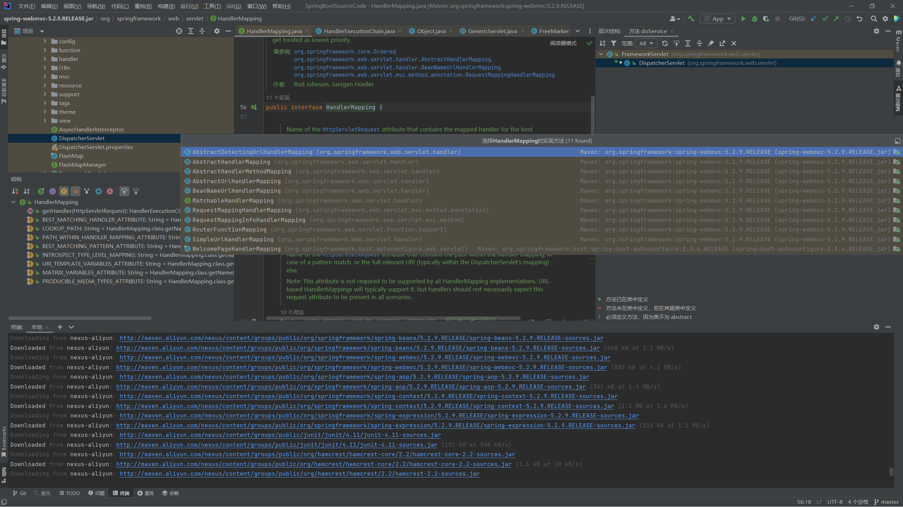

3. RequestMappingHandlerMapping，保存了RequestMapping注解保存的uri和方法的映射。mappingRegistry保存了映射信息。


### 请求处理的过程（类层侧结构）

```plantuml
@startuml

package javax/servlet{

    interface Servlet{
        init()
        getServletConfig()
        getServletInfo()
        destroy()
        service()
    }

    class GenericServlet implements Servlet{
        doGet()
    }
    note right: 实现了默认的空方法

    package http{
        class HttpServlet{
            doGet
            doPost
            doPut
            doDelete
            doHead
            doTrace
        }
        note right : http类型的servlet\n\
        将servlet具体位http的post、get等方法

        GenericServlet <|-- HttpServlet
    }

}


namespace org/springframwork/web/servlet{
    
    class HttpServletBean{

    }
    note right: 配置了环境信息

    HttpServlet <|-- HttpServletBean

    class FrameworkServlet extends HttpServletBean{
        doGet--> processRequest 
        doPost --> processRequest 
        doPut --> processRequest 
        doDelete  --> processRequest 
        processRequest -->doService 
    }

    class DispatcherServlet extends FrameworkServlet{
        doService -->doDispatcher 
        doDispatcher 
    }
}


@enduml
```

## 3 请求参数处理

### 注解请求参数

1. 测试springmvc常用的参数注解 @PathVariable、@RequestHeader、@ModelAttribute、@RequestParam、@MatrixVariable、@CookieValue、@RequestBody

```java
@RestController
public class ParameterTestController {


    //  car/2/owner/zhangsan
    @GetMapping("/car/{id}/owner/{username}")
    public Map<String,Object> getCar(@PathVariable("id") Integer id,
                                     @PathVariable("username") String name,
                                     @PathVariable Map<String,String> pv,
                                     @RequestHeader("User-Agent") String userAgent,
                                     @RequestHeader Map<String,String> header,
                                     @RequestParam("age") Integer age,
                                     @RequestParam("inters") List<String> inters,
                                     @RequestParam Map<String,String> params,
                                     @CookieValue("_ga") String _ga,
                                     @CookieValue("_ga") Cookie cookie){


        Map<String,Object> map = new HashMap<>();

//        map.put("id",id);
//        map.put("name",name);
//        map.put("pv",pv);
//        map.put("userAgent",userAgent);
//        map.put("headers",header);
        map.put("age",age);
        map.put("inters",inters);
        map.put("params",params);
        map.put("_ga",_ga);
        System.out.println(cookie.getName()+"===>"+cookie.getValue());
        return map;
    }


    @PostMapping("/save")
    public Map postMethod(@RequestBody String content){
        Map<String,Object> map = new HashMap<>();
        map.put("content",content);
        return map;
    }


    //1、语法： 请求路径：/cars/sell;low=34;brand=byd,audi,yd
    //2、SpringBoot默认是禁用了矩阵变量的功能
    //      手动开启：原理。对于路径的处理。UrlPathHelper进行解析。
    //              removeSemicolonContent（移除分号内容）支持矩阵变量的
    //3、矩阵变量必须有url路径变量才能被解析
    @GetMapping("/cars/{path}")
    public Map carsSell(@MatrixVariable("low") Integer low,
                        @MatrixVariable("brand") List<String> brand,
                        @PathVariable("path") String path){
        Map<String,Object> map = new HashMap<>();

        map.put("low",low);
        map.put("brand",brand);
        map.put("path",path);
        return map;
    }

    // /boss/1;age=20/2;age=10

    @GetMapping("/boss/{bossId}/{empId}")
    public Map boss(@MatrixVariable(value = "age",pathVar = "bossId") Integer bossAge,
                    @MatrixVariable(value = "age",pathVar = "empId") Integer empAge){
        Map<String,Object> map = new HashMap<>();

        map.put("bossAge",bossAge);
        map.put("empAge",empAge);
        return map;

    }

}
```
2. HandlerMappingAdapter用来对Handler的处理过程进行封装。其中RequestHandlerMapping就是用来封装@RequestMapping的映射的，HandlerFunctionAdapter是用来支持函数映射的。

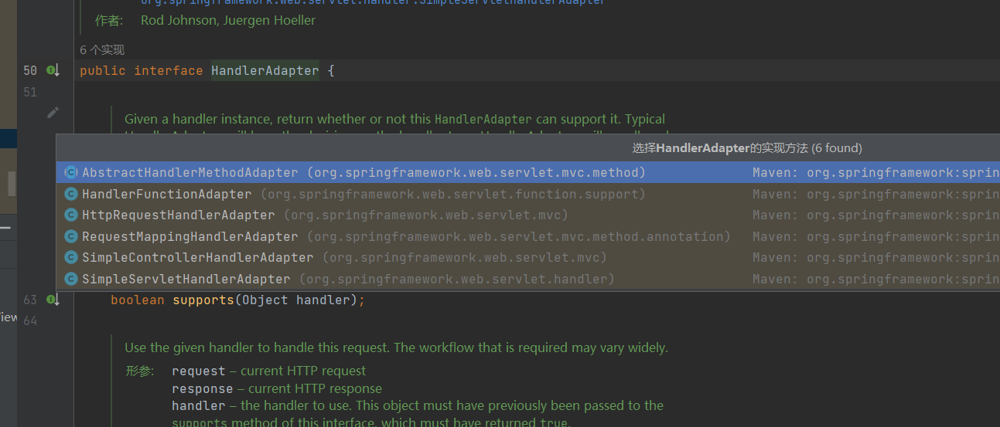

3. 调用adapter的handler方法进行真正的处理逻辑。最终还是调用RequestMappingHandler的handler方法进行处理

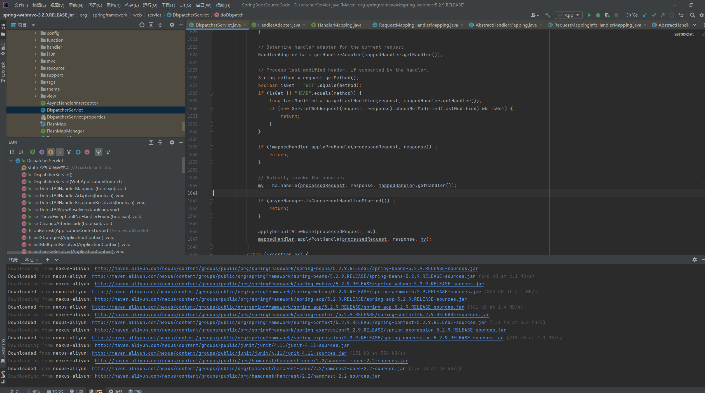
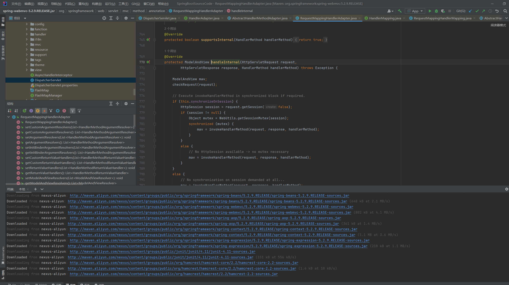

4. 在上述方法中，调用参数解析器进行进行参数解析。可以看到springboot支持的所有的参数解析方法。


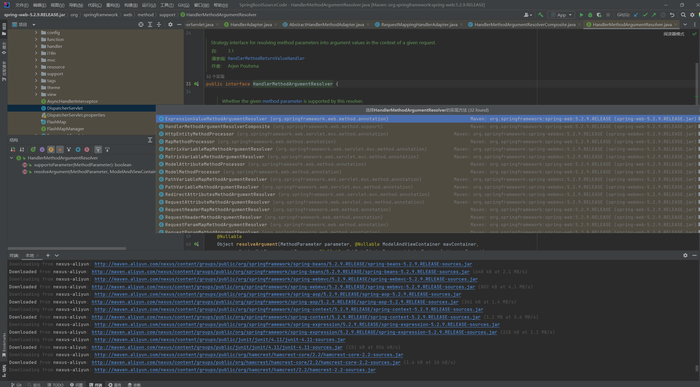

5. 同时方法中也可以看到方法支持的返回值处理器。 spring中很多地方都遵循这种设计模式（策略模式），定义一个共同的接口、给接口定义多种不同的实现、建立条件和实现之间的映射关系，从而可以面向不同的场景和进行灵活的扩展。

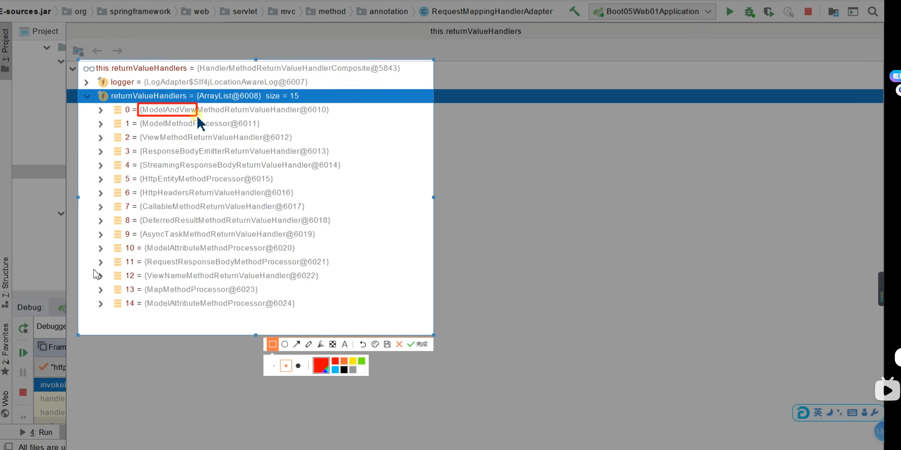

7. 最终通过反射调用具体的方法。在真正的调用之前首先要调用参数解析方法解析参数的值。

```java
--> handler
--> invocableMethod.invokeAndHandle(webRequest, mavContainer);
--> InvocableHandlerMethod.java:Object returnValue = invokeForRequest(webRequest, mavContainer, providedArgs);


	@Nullable
	public Object invokeForRequest(NativeWebRequest request, @Nullable ModelAndViewContainer mavContainer,
			Object... providedArgs) throws Exception {

		Object[] args = getMethodArgumentValues(request, mavContainer, providedArgs);
		if (logger.isTraceEnabled()) {
			logger.trace("Arguments: " + Arrays.toString(args));
		}
		return doInvoke(args);
	}

    protected Object[] getMethodArgumentValues(NativeWebRequest request, @Nullable ModelAndViewContainer mavContainer,
			Object... providedArgs) throws Exception {

		MethodParameter[] parameters = getMethodParameters();
		if (ObjectUtils.isEmpty(parameters)) {
			return EMPTY_ARGS;
		}

		Object[] args = new Object[parameters.length];
		for (int i = 0; i < parameters.length; i++) {
			MethodParameter parameter = parameters[i];
			parameter.initParameterNameDiscovery(this.parameterNameDiscoverer);
			args[i] = findProvidedArgument(parameter, providedArgs);
			if (args[i] != null) {
				continue;
			}
			if (!this.resolvers.supportsParameter(parameter)) {
				throw new IllegalStateException(formatArgumentError(parameter, "No suitable resolver"));
			}
			try {
				args[i] = this.resolvers.resolveArgument(parameter, mavContainer, request, this.dataBinderFactory);
			}
			catch (Exception ex) {
				// Leave stack trace for later, exception may actually be resolved and handled...
				if (logger.isDebugEnabled()) {
					String exMsg = ex.getMessage();
					if (exMsg != null && !exMsg.contains(parameter.getExecutable().toGenericString())) {
						logger.debug(formatArgumentError(parameter, exMsg));
					}
				}
				throw ex;
			}
		}
		return args;
	}
```

8. 解析过程如图所示，遍历所有的参数解析器，找到支持的解析器，为了加快运行病针对这个参数建立缓存。（为什么不在一开始就建立mapping映射呢，而是要在运行中建立映射？一方面为了增加启动速度，避免在启动的时候加载大量无用的数据进来，另一方面有一些映射的建立是动态的过程，需要调用目标模块是否支持的方法，必须在调用后才才能确定映射到具体哪一个解析器。）

```java
	@Nullable
	private HandlerMethodArgumentResolver getArgumentResolver(MethodParameter parameter) {
		HandlerMethodArgumentResolver result = this.argumentResolverCache.get(parameter);
		if (result == null) {
			for (HandlerMethodArgumentResolver resolver : this.argumentResolvers) {
				if (resolver.supportsParameter(parameter)) {
					result = resolver;
					this.argumentResolverCache.put(parameter, result);
					break;
				}
			}
		}
		return result;
	}

```

### 传入ServletAPI

1. 支持的request类型。WebRequest、ServletRequest、MultipartRequest、 HttpSession、javax.servlet.http.PushBuilder、Principal、InputStream、Reader、HttpMethod、Locale、TimeZone、ZoneId

ServletRequestMethodArgumentResolver  以上的部分参数
```java
@Override
	public boolean supportsParameter(MethodParameter parameter) {
		Class<?> paramType = parameter.getParameterType();
		return (WebRequest.class.isAssignableFrom(paramType) ||
				ServletRequest.class.isAssignableFrom(paramType) ||
				MultipartRequest.class.isAssignableFrom(paramType) ||
				HttpSession.class.isAssignableFrom(paramType) ||
				(pushBuilder != null && pushBuilder.isAssignableFrom(paramType)) ||
				Principal.class.isAssignableFrom(paramType) ||
				InputStream.class.isAssignableFrom(paramType) ||
				Reader.class.isAssignableFrom(paramType) ||
				HttpMethod.class == paramType ||
				Locale.class == paramType ||
				TimeZone.class == paramType ||
				ZoneId.class == paramType);
	}
```
2. 与注解同理，都是通过参数解析器，解析不同的请求。

### 复杂参数

1. 支持的复杂参数如下：Map、Model（map、model里面的数据会被放在request的请求域  request.setAttribute）、Errors/BindingResult、RedirectAttributes（ 重定向携带数据）、ServletResponse（response）、SessionStatus、UriComponentsBuilder、ServletUriComponentsBuilder。
   
2. 其中Map/Model都是可以给request域中放数据，与request.setAttribute()类似。可以通过request.getAttribute()从请求域中获取;
   1. map/model 都是调用相同的方法从底层获取到值的，mavContainer.getModel。而且两者获取到的是同一个对象。

3. 当方法处理完成后，所有的数据都会放单modelAndViewContainer中。当返回值是一个字符串的时候，方法不会直接返回给前端，而是一个view的地址！！！并且携带了数据model，完成后续渲染工作。 


### 自定义对象
1. 通过ServletModelAttributeMethodProcessor参数解析器处理自定义了类型的参数。
2. 设计了大量的转换器，将对类型进行转换。主要是为了封装转换器中的 src 和 dsr方法，封装成一个重载的方法，然后方便获取不同类型的转换器。
   1. 当前解析器是否支持解析这种参数
   2. 支持就调用 resolveArgument
3. WebDataBinder binder = binderFactory.createBinder(webRequest, attribute, name);
   1. WebDataBinder :web数据绑定器，将请求参数的值绑定到指定的JavaBean里面
   2. WebDataBinder 利用它里面的 Converters 将请求数据转成指定的数据类型。再次封装到JavaBean中

GenericConversionService：在设置每一个值的时候，找它里面的所有converter那个可以将这个数据类型（request带来参数的字符串）转换到指定的类型（JavaBean -- Integer）
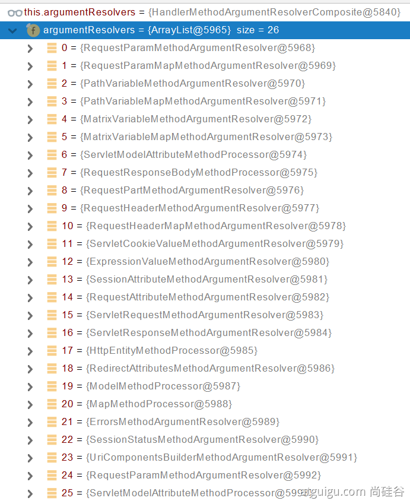

```java
============InvocableHandlerMethod==========================
protected Object[] getMethodArgumentValues(NativeWebRequest request, @Nullable ModelAndViewContainer mavContainer,
			Object... providedArgs) throws Exception {

		MethodParameter[] parameters = getMethodParameters();
		if (ObjectUtils.isEmpty(parameters)) {
			return EMPTY_ARGS;
		}

		Object[] args = new Object[parameters.length];
		for (int i = 0; i < parameters.length; i++) {
			MethodParameter parameter = parameters[i];
			parameter.initParameterNameDiscovery(this.parameterNameDiscoverer);
			args[i] = findProvidedArgument(parameter, providedArgs);
			if (args[i] != null) {
				continue;
			}
			if (!this.resolvers.supportsParameter(parameter)) {
				throw new IllegalStateException(formatArgumentError(parameter, "No suitable resolver"));
			}
			try {
				args[i] = this.resolvers.resolveArgument(parameter, mavContainer, request, this.dataBinderFactory);
			}
			catch (Exception ex) {
				// Leave stack trace for later, exception may actually be resolved and handled...
				if (logger.isDebugEnabled()) {
					String exMsg = ex.getMessage();
					if (exMsg != null && !exMsg.contains(parameter.getExecutable().toGenericString())) {
						logger.debug(formatArgumentError(parameter, exMsg));
					}
				}
				throw ex;
			}
		}
		return args;
	}

	@Nullable
	private HandlerMethodArgumentResolver getArgumentResolver(MethodParameter parameter) {
		HandlerMethodArgumentResolver result = this.argumentResolverCache.get(parameter);
		if (result == null) {
			for (HandlerMethodArgumentResolver resolver : this.argumentResolvers) {
				if (resolver.supportsParameter(parameter)) {
					result = resolver;
					this.argumentResolverCache.put(parameter, result);
					break;
				}
			}
		}
		return result;
	}
```

* 判断是否符合 Convertor的条件

```java
public static boolean isSimpleValueType(Class<?> type) {
		return (Void.class != type && void.class != type &&
				(ClassUtils.isPrimitiveOrWrapper(type) ||
				Enum.class.isAssignableFrom(type) ||
				CharSequence.class.isAssignableFrom(type) ||
				Number.class.isAssignableFrom(type) ||
				Date.class.isAssignableFrom(type) ||
				Temporal.class.isAssignableFrom(type) ||
				URI.class == type ||
				URL.class == type ||
				Locale.class == type ||
				Class.class == type));
	}
```
* 执行自定义类型参数的参数解析
```java
@Override
	@Nullable
	public final Object resolveArgument(MethodParameter parameter, @Nullable ModelAndViewContainer mavContainer,
			NativeWebRequest webRequest, @Nullable WebDataBinderFactory binderFactory) throws Exception {

		Assert.state(mavContainer != null, "ModelAttributeMethodProcessor requires ModelAndViewContainer");
		Assert.state(binderFactory != null, "ModelAttributeMethodProcessor requires WebDataBinderFactory");

		String name = ModelFactory.getNameForParameter(parameter);
		ModelAttribute ann = parameter.getParameterAnnotation(ModelAttribute.class);
		if (ann != null) {
			mavContainer.setBinding(name, ann.binding());
		}

		Object attribute = null;
		BindingResult bindingResult = null;

		if (mavContainer.containsAttribute(name)) {
			attribute = mavContainer.getModel().get(name);
		}
		else {
			// Create attribute instance
			try {
				attribute = createAttribute(name, parameter, binderFactory, webRequest);
			}
			catch (BindException ex) {
				if (isBindExceptionRequired(parameter)) {
					// No BindingResult parameter -> fail with BindException
					throw ex;
				}
				// Otherwise, expose null/empty value and associated BindingResult
				if (parameter.getParameterType() == Optional.class) {
					attribute = Optional.empty();
				}
				bindingResult = ex.getBindingResult();
			}
		}

		if (bindingResult == null) {
			// Bean property binding and validation;
			// skipped in case of binding failure on construction.
			WebDataBinder binder = binderFactory.createBinder(webRequest, attribute, name);
			if (binder.getTarget() != null) {
				if (!mavContainer.isBindingDisabled(name)) {
					bindRequestParameters(binder, webRequest);
				}
				validateIfApplicable(binder, parameter);
				if (binder.getBindingResult().hasErrors() && isBindExceptionRequired(binder, parameter)) {
					throw new BindException(binder.getBindingResult());
				}
			}
			// Value type adaptation, also covering java.util.Optional
			if (!parameter.getParameterType().isInstance(attribute)) {
				attribute = binder.convertIfNecessary(binder.getTarget(), parameter.getParameterType(), parameter);
			}
			bindingResult = binder.getBindingResult();
		}

		// Add resolved attribute and BindingResult at the end of the model
		Map<String, Object> bindingResultModel = bindingResult.getModel();
		mavContainer.removeAttributes(bindingResultModel);
		mavContainer.addAllAttributes(bindingResultModel);

		return attribute;
	}
```


### 自定义数据转换器
* 例如一下是自定义数据转换器的过程。
```java
//1、WebMvcConfigurer定制化SpringMVC的功能
    @Bean
    public WebMvcConfigurer webMvcConfigurer(){
        return new WebMvcConfigurer() {
            @Override
            public void configurePathMatch(PathMatchConfigurer configurer) {
                UrlPathHelper urlPathHelper = new UrlPathHelper();
                // 不移除；后面的内容。矩阵变量功能就可以生效
                urlPathHelper.setRemoveSemicolonContent(false);
                configurer.setUrlPathHelper(urlPathHelper);
            }

            @Override
            public void addFormatters(FormatterRegistry registry) {
                registry.addConverter(new Converter<String, Pet>() {

                    @Override
                    public Pet convert(String source) {
                        // 啊猫,3
                        if(!StringUtils.isEmpty(source)){
                            Pet pet = new Pet();
                            String[] split = source.split(",");
                            pet.setName(split[0]);
                            pet.setAge(Integer.parseInt(split[1]));
                            return pet;
                        }
                        return null;
                    }
                });
            }
        };
    }
```


## 4 响应数据处理

### 响应数据

1. 引入json开发的前端依赖，就会自动将返回值使用jackson工具处理封装。

```java
    <dependency>
      <groupId>org.springframework.boot</groupId>
      <artifactId>spring-boot-starter-json</artifactId>
    </dependency>
```

2. 返回值处理器判断是否支持该返回类型。
   1. 上述返回值处理器支持的返回值类型。

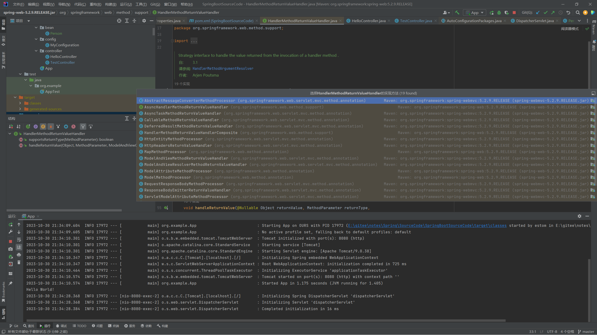
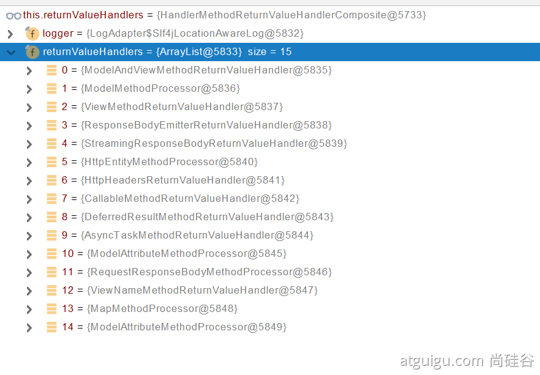

```java
ModelAndView
Model
View
ResponseEntity 
ResponseBodyEmitter
StreamingResponseBody
HttpEntity
HttpHeaders
Callable
DeferredResult
ListenableFuture
CompletionStage
WebAsyncTask
有 @ModelAttribute 且为对象类型的
@ResponseBody 注解 ---> RequestResponseBodyMethodProcessor；
```

4. ResponseBodyProcessor对返回值进行处理，转换为JSON
   1. 浏览器与服务器协商，服务器根据自身提供的类型能力，选择合适的类型。
   2. SpringMVC查找所有的MessageConvertor，找到能够处理数据的转换器。

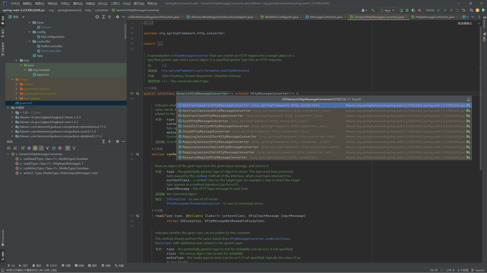


```java
0 - 只支持Byte类型的
1 - String
2 - String
3 - Resource
4 - ResourceRegion
5 - DOMSource.class \ SAXSource.class) \ StAXSource.class \StreamSource.class \Source.class
6 - MultiValueMap
7 - true 
8 - true
9 - 支持注解方式xml处理的。
```

5. jackson2组件能够吧任何对象转换为json
6. 可以开启基于请求参数的内容协商。
   1. spring.contentnegotiation.favor-param=true
   2. ?format=json


### 自定义数据转换器

1. 需要自定义MessageConvertor。在SpringMVCConfigur中进行spring-mvc的自定义。使用mvc默认的扩展点

```java
 @Bean
    public WebMvcConfigurer webMvcConfigurer(){
        return new WebMvcConfigurer() {

            @Override
            public void extendMessageConverters(List<HttpMessageConverter<?>> converters) {

            }
        }
    }
```
2. 学习一种根据类自动加载MessageConvertor的方法。java的灵活之处，也是java莫名其妙不知道在哪里给你添加一段代码的烦人的地方。
```java

WebMvcConfigurationSupport
//判断是否引入相关的依赖（与条件注解@OnConditionClass判断的原理一样，代码格式的判断）
jackson2XmlPresent = ClassUtils.isPresent("com.fasterxml.jackson.dataformat.xml.XmlMapper", classLoader);

//如果存在相关的依赖，则加载对应的类。
		if (jackson2XmlPresent) {
			Jackson2ObjectMapperBuilder builder = Jackson2ObjectMapperBuilder.xml();
			if (this.applicationContext != null) {
				builder.applicationContext(this.applicationContext);
			}
			messageConverters.add(new MappingJackson2XmlHttpMessageConverter(builder.build()));
		}
		else if (jaxb2Present) {
			messageConverters.add(new Jaxb2RootElementHttpMessageConverter());
		}
```

### 自定义内容协商器

1. 使用mvc默认的扩展点。


## 5 视图解析与模板引擎

### 服务端模板渲染

1. 相关的场景启动器

```java
spring-boot-starter-freemarker
spring-boot-starter-groovy-templates
spring-boot-starter-thymeleaf
```

2. thymeleaf自动配置类.
   1. 自动配置好了thymeleaf的模板解析器SpringResourceTemplateResolver
   2. 自动配置了spring的模板引擎。SpringTemplateEngine
   3. 自动配置了Spring视图解析器ThymeleafViewResolverConfiguration

```java
@Configuration(proxyBeanMethods = false)
@EnableConfigurationProperties(ThymeleafProperties.class)
@ConditionalOnClass({ TemplateMode.class, SpringTemplateEngine.class })
@AutoConfigureAfter({ WebMvcAutoConfiguration.class, WebFluxAutoConfiguration.class })
public class ThymeleafAutoConfiguration {
```

3. thymeleaf 说明
   1. 文本值: 'one text' , 'Another one!' ,…数字: 0 , 34 , 3.0 , 12.3 ,…布尔值: true , false
   2. 空值: null
   3. 变量： one，two，.... 变量不能有空格
   4. 字符串拼接: +
   5. 变量替换: |The name is ${name}| 
   6. 运算符: + , - , * , / , %
   7. 运算符:  and , or一元运算: ! , not 
   8. 比较: > , < , >= , <= ( gt , lt , ge , le )等式: == , != ( eq , ne ) 
   9. If-then: (if) ? (then)  If-then-else: (if) ? (then) : (else)   Default: (value) ?: (defaultvalue) 

4. 表单写法
```java
<form action="subscribe.html" th:attr="action=@{/subscribe}">
  <fieldset>
    <input type="text" name="email" />
    <input type="submit" value="Subscribe!" th:attr="value=#{subscribe.submit}"/>
  </fieldset>
</form>
```
5. 链接写法
```java

<input type="submit" value="Subscribe!" th:value="#{subscribe.submit}"/>
<form action="subscribe.html" th:action="@{/subscribe}">
```
6. 循环写法

```java
<tr th:each="prod : ${prods}">
        <td th:text="${prod.name}">Onions</td>
        <td th:text="${prod.price}">2.41</td>
        <td th:text="${prod.inStock}? #{true} : #{false}">yes</td>
</tr>
```
7. 条件写法

```java
<a href="comments.html"
th:href="@{/product/comments(prodId=${prod.id})}"
th:if="${not #lists.isEmpty(prod.comments)}">view</a>  

<div th:switch="${user.role}">
  <p th:case="'admin'">User is an administrator</p>
  <p th:case="#{roles.manager}">User is a manager</p>
  <p th:case="*">User is some other thing</p>
</div>
```
8. 优先级

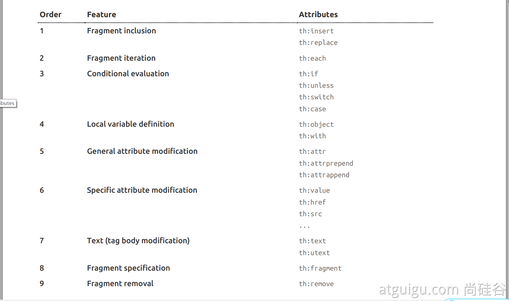

### 视图解析原理

带上 model、request、response调用render方法。

resolverName方法会遍历所有的视图解析器。找到支持的视图解析器。

1. 返回值“redirect:view”会得到RedirectView视图解析器。
2. 返回值“forward:”会在后端进行重定向，而不是前端浏览器。
3. 返回值 result方法。

通过视图解析器能够得到对应的视图对象。

调用视图对象的render方法进行渲染，得到最终结果。

调用sendRedirect方法，servlet的原生的redirect方法。使得前端
