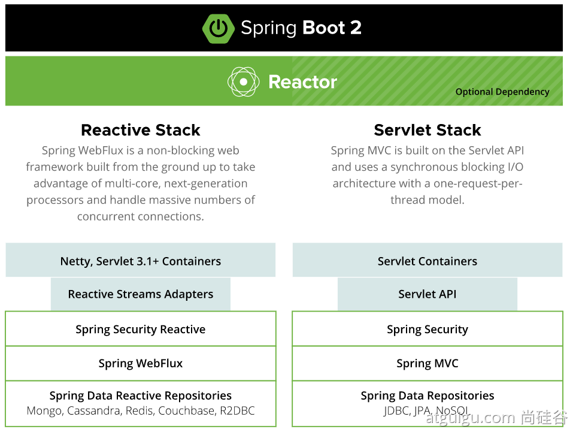

## 1 Spring 能做什么
> [参考文献](https://www.yuque.com/atguigu/springboot/na3pfd)

 
### Spring框架的功能

1. 微服务。实现功能的进一步拆分
2. 响应式。异步、非阻塞的框架
3. 云计算。分布式云开发Spring cloud
4. web开发。Springmvc
5. 无服务开发/事件驱动/批处理业务

### Spring全家桶逻辑关系

1. Spring Data
2. SPring cloud
3. Spring MVC
4. Spring batch
5. Spring session
6. ......

以上都是spring framwork的一部分。spring framwork包含以上部分。
 
spring boot 是高层框架，底层是spring framwork。 可以用来整合Spring的整个技术栈，防止出现配置地狱。 

### Spring boot的优势
1. 创建独立应用。Spring boot 能够快速创建出生产级别的应用。  
2. 内嵌web服务器
3. 创建自动依赖 ，简化构建配置。
4. 无代码生成/无编写XML

### Spring5框架结构

## 2 Spring boot的背景

### 微服务
1. 架构风格
2. 小型服务，灵活拆分
3. 自动部署
4. 去中心化、服务治理

### 分布式要解决的问题
1. 远程调用rpc——http
2. 服务发现——网关和注册中心
3. 负载均衡和任务调度
4. 服务容错——流量控制和熔断
5. 配置管理——配置中心
6. 服务监控
7. 链路追踪
8. 日志管理

### 云原生要解决的问题（部署过程）

1. 服务自愈
2. 弹性伸缩
3. 服务隔离
4. 自动化部署机制
5. 灰度发布，逐渐替代旧版本
6. 流量治理