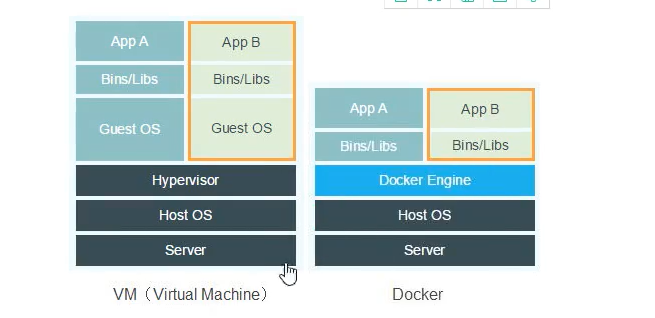
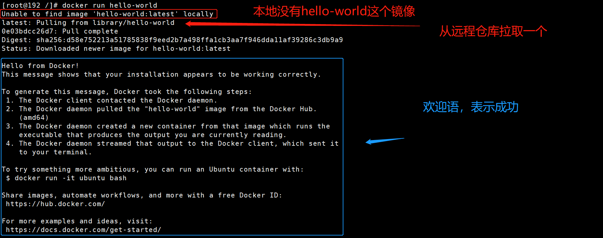

* [shouce]http://shouce.jb51.net/docker_practice/
* [栾一峰](http://www.ruanyifeng.com/blog/2018/02/docker-tutorial.html)
* [菜鸟教程](https://www.runoob.com/docker/ubuntu-docker-install.html)
* [参考文献](http://c.biancheng.net/view/3118.html)

## 1 环境配置的难题
软件开发最大的麻烦事之一，就是环境配置。用户计算机的环境都不相同，你怎么知道自家的软件，能在那些机器跑起来？

用户必须保证两件事：操作系统的设置，各种库和组件的安装。只有它们都正确，软件才能运行。举例来说，安装一个 Python 应用，计算机必须有 Python 引擎，还必须有各种依赖，可能还要配置环境变量。

如果某些老旧的模块与当前环境不兼容，那就麻烦了。开发者常常会说："它在我的机器可以跑了"（It works on my machine），言下之意就是，其他机器很可能跑不了。

环境配置如此麻烦，换一台机器，就要重来一次，旷日费时。很多人想到，能不能从根本上解决问题，软件可以带环境安装？也就是说，安装的时候，把原始环境一模一样地复制过来。

虚拟化技术，**虚拟机和docker两种虚拟化技术**。
* 虚拟机，虚拟出一条硬件，运行一个完整的操作系统，然后在系统上安装运行软件
* 容器，直接运行在宿主机的内核中，容器没有自己的内核，也没有虚拟硬件。轻便很多。
* 每个容器是相互隔离的，每个容器内都有一个属于自己的文件系统

## 2 虚拟机
虚拟机（virtual machine）就是带环境安装的一种解决方案。它可以在一种操作系统里面运行另一种操作系统，比如在 Windows 系统里面运行 Linux 系统。应用程序对此毫无感知，因为虚拟机看上去跟真实系统一模一样，而对于底层系统来说，虚拟机就是一个普通文件，不需要了就删掉，对其他部分毫无影响。

虽然用户可以通过虚拟机还原软件的原始环境。但是，这个方案有几个缺点。

- （1）资源占用多

虚拟机会独占一部分内存和硬盘空间。它运行的时候，其他程序就不能使用这些资源了。哪怕虚拟机里面的应用程序，真正使用的内存只有 1MB，虚拟机依然需要几百 MB 的内存才能运行。

- （2）冗余步骤多

虚拟机是完整的操作系统，一些系统级别的操作步骤，往往无法跳过，比如用户登录。

- （3）启动慢

启动操作系统需要多久，启动虚拟机就需要多久。可能要等几分钟，应用程序才能真正运行。

## 3 Linux 容器
由于虚拟机存在这些缺点，Linux 发展出了另一种虚拟化技术：Linux 容器（Linux Containers，缩写为 LXC）。

Linux 容器不是模拟一个完整的操作系统，而是对进程进行隔离。或者说，在正常进程的外面套了一个保护层。对于容器里面的进程来说，它接触到的各种资源都是虚拟的，从而实现与底层系统的隔离。

由于容器是进程级别的，相比虚拟机有很多优势。

- （1）启动快

容器里面的应用，直接就是底层系统的一个进程，而不是虚拟机内部的进程。所以，启动容器相当于启动本机的一个进程，而不是启动一个操作系统，速度就快很多。

- （2）资源占用少

容器只占用需要的资源，不占用那些没有用到的资源；虚拟机由于是完整的操作系统，不可避免要占用所有资源。另外，多个容器可以共享资源，虚拟机都是独享资源。

- （3）体积小

容器只要包含用到的组件即可，而虚拟机是整个操作系统的打包，所以容器文件比虚拟机文件要小很多。

总之，容器有点像轻量级的虚拟机，能够提供虚拟化的环境，但是成本开销小得多。

## 4 Docker 是什么？
Docker 属于 Linux 容器的一种封装，提供简单易用的容器使用接口。它是目前最流行的 Linux 容器解决方案。

Docker 将应用程序与该程序的依赖，打包在一个文件里面。运行这个文件，就会生成一个虚拟容器。程序在这个虚拟容器里运行，就好像在真实的物理机上运行一样。有了 Docker，就不用担心环境问题。

总体来说，Docker 的接口相当简单，用户可以方便地创建和使用容器，把自己的应用放入容器。容器还可以进行版本管理、复制、分享、修改，就像管理普通的代码一样。

### Docker为什么比VM快？

* Docker有着比虚拟机更少的抽象层
* docker主要用的是宿主机的内核，vm需要Guest OS


## 5 Docker 的用途
Docker 的主要用途，目前有三大类。

（1）提供一次性的环境。比如，本地测试他人的软件、持续集成的时候提供单元测试和构建的环境。DevOps & CI/CD

（2）提供弹性的云服务。因为 Docker 容器可以随开随关，很适合动态扩容和缩容。

（3）组建微服务架构。通过多个容器，一台机器可以跑多个服务，因此在本机就可以模拟出微服务架构。

> * 传统：开发jar，运维部署。
> * 现在：开发jar部署上线，运维负责后续问题处理

## 6 Docker安装
### 通过脚本自动安装

```
curl -sSL https://get.daocloud.io/docker | sh
```

* 在centos上安装

```
# 卸载旧的版本
$ sudo yum remove docker \
                  docker-client \
                  docker-client-latest \
                  docker-common \
                  docker-latest \
                  docker-latest-logrotate \
                  docker-logrotate \
                  docker-engine
# 安装基本的安装包
$ sudo yum install -y yum-utils

# 不要用官网默认这个！
$ sudo yum-config-manager \
    --add-repo \
    https://download.docker.com/linux/centos/docker-ce.repo # 默认是国外的

# 换成下面的
$ sudo yum-config-manager \
    --add-repo \
    https://mirrors.aliyun.com/docker-ce/linux/centos/docker-ce.repo # 阿里云镜像


更像软件包索引
yum makecache fast

安装docker引擎
yum install docker-ce docker-ce-cli containerd.io # docker-ce 社区版 ee 企业版
```

### 启动docker服务

```
sudo service docker start
sudo systemctl start docker
```
### 校验安装是否成功

查看版本
```
docker version 
```

查看信息
```
docker info
```

### 运行docker镜像

运行hello-world容器
```
docker run hello-world
```


查看下载的镜像

docker images


### 加入用户组
```
sudo usermod -aG docker $USER
```


### 切换docker国内源

```
$ vi /etc/docker/daemon.json
{
    "registry-mirrors":[ "https://registry.docker-cn.com" ]
}
$ systemctl restart docker
```