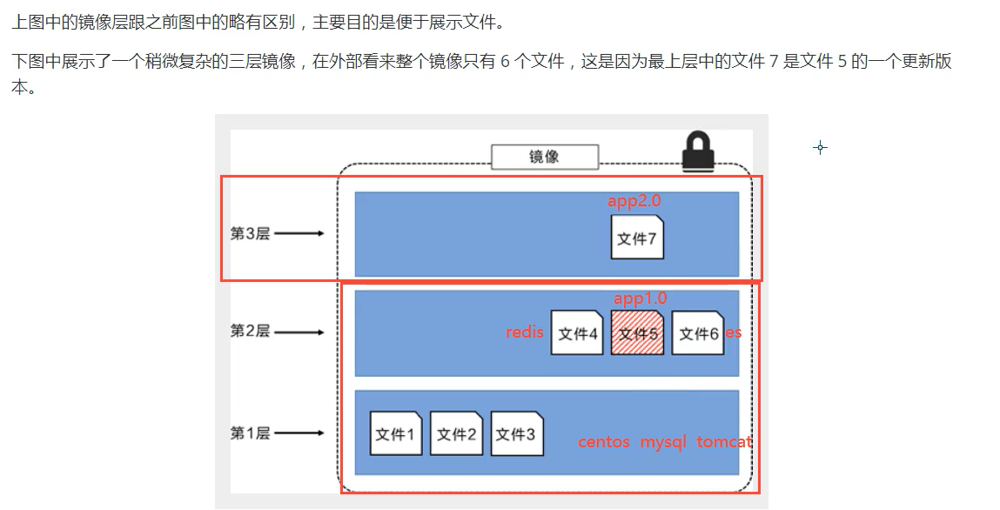

## 1 分层文件系统
### UnionFS 联合文件系统

* bootfs：boot file system
* rootfs：root file system


### 分层文件系统




* Docker镜像都是只读的，当容器启动时，一个新的可写层被加到镜像的顶部，这一层就是我们通常说的容器层，容器层之下的都叫镜像层


## 2 commit提交镜像

```
docker commit # 提交容器成为一个新的副本
docker commit -m="提交的描述信息" -a="作者" 容器id 目标镜像名：[TAG]
```
* 创建新镜像
```
➜  ~ docker commit -a="zhangxiaoyude" -m="add webapps app" 7b8096067457 tomcat02:1.0
sha256:6e0e1ad86723c435bdf26d368472195b7050de1d6b920252d9c93eac26132336
➜  ~ docker images                                                                  
REPOSITORY                                                TAG                                                                          IMAGE ID       CREATED          SIZE
tomcat02                                                  1.0                                                                          6e0e1ad86723   20 seconds ago   478MB
```

* 查看新镜像。发现新的版本，比之前的大了一些，因为里面记录了我们的改动


> 使用 docker commit 命令虽然可以比较直观的帮助理解镜像分层存储的概念，但是实际环境中并不会这样使用。
> 首先，如果仔细观察之前的 docker diff webserver 的结果，你会发现除了真正想要修改的 /usr/share/nginx/html/index.html 文件外，由于命令的执行，还有很多文件被改动或添加了。这还仅仅是最简单的操作，如果是安装软件包、编译构建，那会有大量的无关内容被添加进来，如果不小心清理，将会导致镜像极为臃肿。
> 此外，使用 docker commit 意味着所有对镜像的操作都是黑箱操作，生成的镜像也被称为黑箱镜像，换句话说，就是除了制作镜像的人知道执行过什么命令、怎么生成的镜像，别人根本无从得知。而且，即使是这个制作镜像的人，过一段时间后也无法记清具体在操作的。虽然 docker diff 或许可以告诉得到一些线索，但是远远不到可以确保生成一致镜像的地步。这种黑箱镜像的维护工作是非常痛苦的。