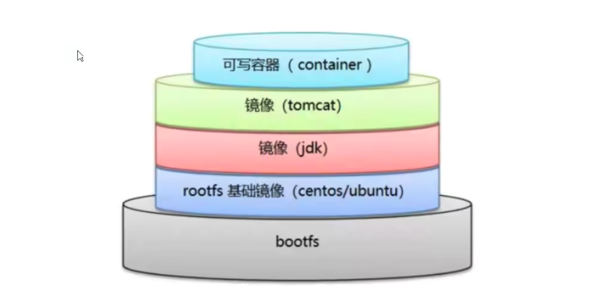
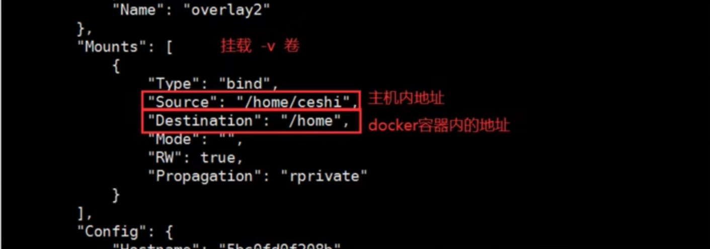

# Dockerfile

## 1 DockerFile

### 构建过程

dockerfile是用来构建docker镜像文件！命令参数脚本

构建步骤
1. dockerfile
2. docker build 构建一个镜像
3. docker run 运行镜像
4. docker push 发布一个镜像

dockerhub官方的镜像，会对应到github上一个仓库中的Dockerfile


### 指令
```
FROM 基础镜像
MAINTAINER 镜像的维护者信息
RUN Docker镜像构建的时候需要的命令
ADD 步骤：tomcat的镜像中，tomcat的压缩包
WORKDIR 镜像的工作目录
VOLUME -v挂载的目录位置
EXPOSE -p暴露端口


CMD 指定这个容器启动的时候运行的命令，只有最后一个会生效，而且可悲替代
ENTRYPOINT 指定这个容器启动的时候运行的命令，可以追加命令
ONBUILD 当构建一个被继承的DockerfileFile，就会影响ONBUILD指令。触发指令
COPY 类似ADD命令，将文件COPY到镜像中。
ENV 构建的时候设置环境变量
```

1. 每个保留关键字指令都是大写字母
2. `#`表示注释
3. 每一个指令都会创建提交一个新的镜像层，并提交

### DockFile的作用


dockerfile是面向开发的，发布项目、做镜像需要编写dockerfile。

* DockerFile：构建文件，定义了一切的步骤、源代码
* DockerImages：通过DockerFile构建生成的镜像，最终发布和运行的产品
* Docker容器：容器就是镜像运行起来，提供服务器

### 实践：创建自己的centos

> docker hub 中99%镜像都是从FROM scratch

1. 编写dockerfile的文件

```
➜  dockerfile git:(master) ✗ cat mydockerfile        
FROM centos
MAINTAINER yinkanglong<yinkanglong.163.com>


ENV MYPATH /usr/local
WORKDIR $MYPATH

RUN yum -y install vim
RUN yum -y install net-tools


EXPOSE 80

CMD echo $MYPATH
CMD echo "----end----"

CMD /bin/bash
```
2. docker builid 运行镜像

```
dockerfile git:(master) ✗ docker build -f mydockerfile -t mycentos:0.1 .
[+] Building 64.0s (8/8) FINISHED                                                                                                
 => [internal] load build definition from mydockerfile                                                                      0.2s
 => => transferring dockerfile: 265B                                                                                        0.1s
 => [internal] load .dockerignore                                                                                           0.1s
 => => transferring context: 2B                                                                                             0.0s
 => [internal] load metadata for docker.io/library/centos:7                                                                 4.5s
 => [1/4] FROM docker.io/library/centos:7@sha256:c73f515d06b0fa07bb18d8202035e739a494ce760aa73129f60f4bf2bd22b407          20.6s
 => => resolve docker.io/library/centos:7@sha256:c73f515d06b0fa07bb18d8202035e739a494ce760aa73129f60f4bf2bd22b407           0.0s
 => => sha256:c73f515d06b0fa07bb18d8202035e739a494ce760aa73129f60f4bf2bd22b407 1.20kB / 1.20kB                              0.0s
 => => sha256:dead07b4d8ed7e29e98de0f4504d87e8880d4347859d839686a31da35a3b532f 529B / 529B                                  0.0s
 => => sha256:eeb6ee3f44bd0b5103bb561b4c16bcb82328cfe5809ab675bb17ab3a16c517c9 2.75kB / 2.75kB                              0.0s
 => => sha256:2d473b07cdd5f0912cd6f1a703352c82b512407db6b05b43f2553732b55df3bc 76.10MB / 76.10MB                           15.0s
 => => extracting sha256:2d473b07cdd5f0912cd6f1a703352c82b512407db6b05b43f2553732b55df3bc                                   5.3s
 => [2/4] WORKDIR /usr/local                                                                                                0.6s
 => [3/4] RUN yum -y install vim                                                                                           21.9s
 => [4/4] RUN yum -y install net-tools                                                                                      9.3s
 => exporting to image                                                                                                      6.1s 
 => => exporting layers                                                                                                     6.1s 
 => => writing image sha256:87b7be8e41c9cc237c733930df0513f40a708fb0944f5ef48e815979e6880ee2                                0.0s 
 => => naming to docker.io/library/mycentos:0.1                                                                             0.0s 
                                                                                                                                 
Use 'docker scan' to run Snyk tests against images to find vulnerabilities and learn how to fix them                             
```
3. 测试运行docker run，验证了 vim和ifconfig命令可行

```
dockerfile git:(master) ✗ docker run -it mycentos:0.1    
[root@f318e4ba01b3 local]# pwd
/usr/local
[root@f318e4ba01b3 local]# ifconfig
eth0: flags=4163<UP,BROADCAST,RUNNING,MULTICAST>  mtu 1500
        inet 172.17.0.2  netmask 255.255.0.0  broadcast 172.17.255.255
        ether 02:42:ac:11:00:02  txqueuelen 0  (Ethernet)
        RX packets 10  bytes 876 (876.0 B)
        RX errors 0  dropped 0  overruns 0  frame 0
        TX packets 0  bytes 0 (0.0 B)
        TX errors 0  dropped 0 overruns 0  carrier 0  collisions 0

lo: flags=73<UP,LOOPBACK,RUNNING>  mtu 65536
        inet 127.0.0.1  netmask 255.0.0.0
        loop  txqueuelen 1000  (Local Loopback)
        RX packets 0  bytes 0 (0.0 B)
        RX errors 0  dropped 0  overruns 0  frame 0
        TX packets 0  bytes 0 (0.0 B)
        TX errors 0  dropped 0 overruns 0  carrier 0  collisions 0

[root@f318e4ba01b3 local]# vim where
[root@f318e4ba01b3 local]# which vim
/usr/bin/vim
```
 
### 实践：CMD和ENTRYPOINT


1. 编写dockerfilefile

```
vim dockerfile-cmd-test
FROM centos
CMD ["ls","-a"]
```
2. 构建镜像
```
docker build -f dockerfile-cmd-test -t cmdtest
```

3. 运行镜像
```
docker run cmdtest
```

4. 测试镜像
```
发现CMD追加命令报错，发现ENTRYPOINT命令追加的命令是可以执行的。
docker run cmtest  -l
```


### 实践：制作tomcat镜像 

> 更加复杂，日后补充

## 2 发布自己的镜像

### 发布自己的镜像到dockerhub

> DockeHub

1. 在https://hub.docker.com创建账号
2. 向服务器提交自己的镜像
3. 登录 docker login -u yinkanglong
4. 推送 docker push yinkanglong/mycentos:01


### 发布自己的镜像到阿里云

1. 登录阿里云
2. 申请仓库地址
3. 登录到阿里云仓库
4. docker push

### 本地发布docker save & docker load

1. 将镜像保存压缩包

2. 将压缩包加载为镜像

## 总结


### 简介

* Docker：将应用和环境打包成一个镜像
* 数据？如果数据在容器中，那么我们容器删除，数据就会丢失。需求：数据持久化。
* 所以：Mysql的数据可以存储在本地。
* 所以：容器间可以有一个数据共享的技术。 Docker容器中产生的数据，同步到本地。
* 这就是：卷技术，目录挂载，将容器内的目录，挂载到Linux上。


**总结：容器的持久化和同步操作**

### 使用

* -v 实现文件映射
```
docker run -it -v 目录映射 -p 端口映射

➜  ~ docker run -it -v /Users/yinkanglong/ceshi:/home centos /bin/bash
```

* 使用docker inspect 查看挂载情况mount
  * 同步的过程，是一种双向绑定的过程。


> 是同步的过程，还是目录挂载到磁盘的同一个位置了？

### 实战：安装Mysql

```
# 获取镜像
docker pull mysql 5.7

# 运行容器，需要做数据挂载
-d 后台运行
-p 端口映射
-v 卷挂载
--name 容器名字
➜  ~ docker run -d -p 3310:3306 -v /Users/yinkanglong/mysql/conf:/etc/mysql/conf.d -v /Users/yinkanglong/mysql/data:/var/lib/mysql -e MYSQL_ROOT_PASSWORD=123456 --name mysql01 mysql:5.7

# 启动之后链接数据库服务器进行测试
➜  data mysql -h 127.0.0.1 -P 3310 -uroot -p123456

# 在本地测试创建数据库，查看映射路径是否可以
create table
```


