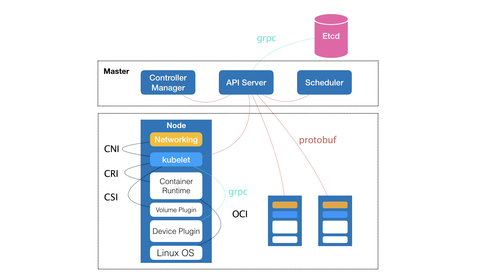
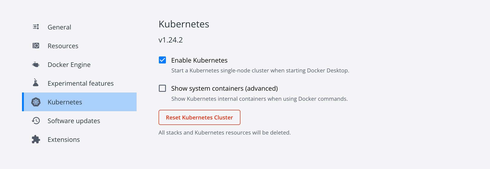

# Kubernetes

## 概述

### 什么是Kubernetes

随着微服务架构被越来越多的公司使用，大部分单体应用正逐步被拆解成小的、独立运行的微服务。微服务的优势这里不做探讨，但是其带来的服务维护问题大大增加，若想要在管理大量微服务的情况下同时还做到以下几点：

- 让资源利用率更高

- 让硬件成本相对更低

Kubernetes是一个可以移植、可扩展的开源平台，使用 声明式的配置 并依据配置信息自动地执行容器化应用程序的管理。在所有的容器编排工具中（类似的还有 docker swarm / mesos等），Kubernetes的生态系统更大、增长更快，有更多的支持、服务和工具可供用户选择。于是就自然而然地就产生了基于容器自动化部署微服务的需求，在容器编排这块的纷争，各大巨头参与，战况惨烈，但最终胜出的是谷歌的Kubernetes[^1]，其提供的特性有：

- **服务发现和负载均衡**
- **存储编排**
- **自动发布和回滚**
- **自愈**
- **密钥及配置管理**

### Kubernetes构成
通过下面架构图可以看到其有上下两部分对应的`Master&Node`节点构成，这两种角色分别对应着**控制节点和计算节点**。



> Master控制节点主要出发点在于如何编排、管理、调度用户提交的作业


Master组件是集群的控制平台（control plane）：
* master 组件负责集群中的全局决策（例如，调度）
* master 组件探测并响应集群事件（例如，当 Deployment 的实际 Pod 副本数未达到 replicas 字段的规定时，启动一个新的 Pod）

Kubernetes Master组件。控制节点主要由以下几个核心组件组成：

  
- apiserver提供了资源操作的唯一入口，并提供认证、授权、访问控制、API注册和发现等机制。提供 Kubernetes API。这是Kubernetes控制平台的前端（front-end），可以水平扩展（通过部署更多的实例以达到性能要求）。kubectl / kubernetes dashboard / kuboard 等Kubernetes管理工具就是通过 kubernetes API 实现对 Kubernetes 集群的管理。
- etcd支持一致性和高可用的名值对存储组件，Kubernetes集群的所有配置信息都存储在 etcd 中。保存了整个集群的状态
- scheduler负责资源的调度，按照预定的调度策略将Pod调度到相应的机器上。此 master 组件监控所有新创建尚未分配到节点上的 Pod，并且自动选择为 Pod 选择一个合适的节点去运行。
- controller manager负责维护集群的状态，比如故障检测、自动扩展、滚动更新等。运行了所有的控制器。逻辑上来说，每一个控制器是一个独立的进程，但是为了降低复杂度，这些控制器都被合并运行在一个进程里。kube-controller-manager 中包含的控制器有：
  - 节点控制器： 负责监听节点停机的事件并作出对应响应
  - 副本控制器： 负责为集群中每一个 副本控制器对象（Replication Controller Object）维护期望的 Pod 副本数
  - 端点（Endpoints）控制器：负责为端点对象（Endpoints Object，连接 Service 和 Pod）赋值
  - Service Account & Token控制器： 负责为新的名称空间创建 default Service Account 以及 API Access Token

Kubernetes Node组件。对于计算节点：

- kubelet负责维护容器的生命周期，同时也负责Volume（CSI）和网络（CNI）的管理。此组件是运行在每一个集群节点上的代理程序。它确保 Pod 中的容器处于运行状态。
- Container runtime负责镜像管理以及Pod和容器的真正运行（CRI）。容器引擎负责运行容器。Kubernetes支持多种容器引擎：Docker、containerd、cri-o 、rktlet以及任何实现了 Kubernetes容器引擎接口 (opens new window)的容器引擎
- kube-proxy负责为Service提供cluster内部的服务发现和负载均衡。是一个网络代理程序，运行在集群中的每一个节点上，是实现 Kubernetes Service 概念的重要部分。
- DNS。所有 Kubernetes 集群都应该有 Cluster DNS。Cluster DNS 是一个 DNS 服务器，是对您已有环境中其他 DNS 服务器的一个补充，存放了 Kubernetes Service 的 DNS 记录。Kubernetes 启动容器时，自动将该 DNS 服务器加入到容器的 DNS 搜索列表中。
- Web UI（Dashboard）。Dashboard (opens new window)是一个Kubernetes集群的 Web 管理界面。用户可以通过该界面管理集群。Kuboard，Kuboard 是一款基于Kubernetes的微服务管理界面
- ContainerResource Monitoring。Container Resource Monitoring (opens new window)将容器的度量指标（metrics）记录在时间序列数据库中，并提供了 UI 界面查看这些数据

### kubernetes发展历史


* 传统部署时代：早期，企业直接将应用程序部署在物理机上。由于物理机上不能为应用程序定义资源使用边界，我们也就很难合理地分配计算资源。例如：如果多个应用程序运行在同一台物理机上，可能发生这样的情况：其中的一个应用程序消耗了大多数的计算资源，导致其他应用程序不能正常运行。应对此问题的一种解决办法是，将每一个应用程序运行在不同的物理机上。然而，这种做法无法大规模实施，因为资源利用率很低，且企业维护更多物理机的成本昂贵。

* 虚拟化部署时代：针对上述问题，虚拟化技术应运而生。用户可以在单台物理机的CPU上运行多个虚拟机（Virtual Machine）。
  * 虚拟化技术使得应用程序被虚拟机相互分隔开，限制了应用程序之间的非法访问，进而提供了一定程度的安全性。
  * 虚拟化技术提高了物理机的资源利用率，可以更容易地安装或更新应用程序，降低了硬件成本，因此可以更好地规模化实施。
  * 每一个虚拟机可以认为是被虚拟化的物理机之上的一台完整的机器，其中运行了一台机器的所有组件，包括虚拟机自身的操作系统。
* 容器化部署时代：容器与虚拟机类似，但是降低了隔离层级，共享了操作系统。因此，容器可以认为是轻量级的。
    * 与虚拟机相似，每个容器拥有自己的文件系统、CPU、内存、进程空间等
    * 运行应用程序所需要的资源都被容器包装，并和底层基础架构解耦
    * 容器化的应用程序可以跨云服务商、跨Linux操作系统发行版进行部署

## 安装

### 单机安装

关于单机安装`k8s`，我使用的相关环境如下（于2022-08-13更新）：

- macOS：Monterey 12.4
- Docker Desktop Vesion：4.11.1
- Kubernetes：v1.24.2

由于镜像的下载涉及到网络原因，因此这里使用了开源项目[k8s-docker-desktop-for-mac](https://github.com/gotok8s/k8s-docker-desktop-for-mac)来解决这个问题，需要注意的是要修改`images`的相关镜像的版本，要和此时`Kubernetes`配对上才行，比如我设置的是：

```txt
k8s.gcr.io/kube-proxy:v1.24.2=gotok8s/kube-proxy:v1.24.2
k8s.gcr.io/kube-controller-manager:v1.24.2=gotok8s/kube-controller-manager:v1.24.2
k8s.gcr.io/kube-scheduler:v1.24.2=gotok8s/kube-scheduler:v1.24.2
k8s.gcr.io/kube-apiserver:v1.24.2=gotok8s/kube-apiserver:v1.24.2
k8s.gcr.io/pause:3.7=gotok8s/pause:3.7
k8s.gcr.io/coredns/coredns:v1.8.6=gotok8s/coredns:v1.8.6
k8s.gcr.io/etcd:3.5.3-0=gotok8s/etcd:3.5.3-0
```

然后执行`./load_images.sh `即可下载k8s依赖的镜像，随后打开`Docker`，进入设置界面，勾选`Enable Kubernetes`即可：


不出意外，界面左下角会出现`Kubernetes running`的提示，这样就安装成功了。

每个人的 `Docker` 版本都有差别，不同版本如何查找各个依赖容器对应的版本呢？参考一下命令：

```shell
KUBERNETES_VERSION=v1.24.2
# Linux 下执行
curl -O -L https://storage.googleapis.com/kubernetes-release/release/${KUBERNETES_VERSION}/bin/linux/amd64/kubeadm
chmod +x kubeadm
./kubeadm config images list --kubernetes-version=${KUBERNETES_VERSION}
```

版本号那里填写你自己的当前版本即可，不出意外可以得到如下输出：

```shell
k8s.gcr.io/kube-apiserver:v1.24.2
k8s.gcr.io/kube-controller-manager:v1.24.2
k8s.gcr.io/kube-scheduler:v1.24.2
k8s.gcr.io/kube-proxy:v1.24.2
k8s.gcr.io/pause:3.7
k8s.gcr.io/etcd:3.5.3-0
k8s.gcr.io/coredns/coredns:v1.8.6
```

查看集群信息：

```shell
kubectl cluster-info
```

输出：

```shell
Kubernetes control plane is running at https://kubernetes.docker.internal:6443
CoreDNS is running at https://kubernetes.docker.internal:6443/api/v1/namespaces/kube-system/services/kube-dns:dns/proxy

To further debug and diagnose cluster problems, use 'kubectl cluster-info dump'.
```

```shell
kubectl get nodes
```

输出：

查看节点信息：

```shell
kubectl get nodes
```

输出：

```shell
NAME             STATUS   ROLES           AGE   VERSION
docker-desktop   Ready    control-plane   11m   v1.24.2
```

单机版本的`k8s`安装成功！接下来介绍集群安装。

### 集群安装

#### 准备

- 准备三台机器，比如（使用的配置是4核8G，IP换成你自己的）：
  - 192.168.5.91：Master：
    - 执行：
      - `hostnamectl set-hostname master` 
      - `echo "127.0.0.1   $(hostname)" >> /etc/hosts`
  - 192.168.5.92：Node01
    - 执行：
      - `hostnamectl set-hostname node01` 
      - `echo "127.0.0.1   $(hostname)" >> /etc/hosts`
  - 192.168.5.93：Node02
    - 执行：
      - `hostnamectl set-hostname node02` 
      - `echo "127.0.0.1   $(hostname)" >> /etc/hosts`

- Kubernetes版本：v1.19.3
- Docker版本：19.03.12

开始前请检查以下事项：

- **CentOS 版本**：>= 7.6
- **CPU**：>=2
- *IP*：互通
- 关闭**swap**：`swapoff -a`

配置国内kubernetes源：

```shell
cat > /etc/yum.repos.d/kubernetes.repo <<EOF
[kubernetes]
name=Kubernetes
baseurl=https://mirrors.aliyun.com/kubernetes/yum/repos/kubernetes-el7-x86_64/
enabled=1
gpgcheck=1
repo_gpgcheck=1
gpgkey=https://mirrors.aliyun.com/kubernetes/yum/doc/yum-key.gpg https://mirrors.aliyun.com/kubernetes/yum/doc/rpm-package-key.gpg
EOF
```

安装相关依赖工具：

```shell
yum install -y kubelet-1.19.3 kubeadm-1.19.3 kubectl-1.19.3
# 设置开机启动
systemctl enable kubelet.service && systemctl start kubelet.service
# 查看状态
systemctl status kubelet.service
```


#### 初始化Master

在主节点（`192.168.5.91`）执行以下命令：

```sh
export MASTER_IP=192.168.5.91
export APISERVER_NAME=apiserver.demo
export POD_SUBNET=10.100.0.1/16
echo "${MASTER_IP}    ${APISERVER_NAME}" >> /etc/hosts
```

新建脚本`init_master.sh`:

```shell
vim init_master.sh
```

添加：

```bash
#!/bin/bash

# 只在 master 节点执行

# 脚本出错时终止执行
set -e

if [ ${#POD_SUBNET} -eq 0 ] || [ ${#APISERVER_NAME} -eq 0 ]; then
  echo -e "\033[31;1m请确保您已经设置了环境变量 POD_SUBNET 和 APISERVER_NAME \033[0m"
  echo 当前POD_SUBNET=$POD_SUBNET
  echo 当前APISERVER_NAME=$APISERVER_NAME
  exit 1
fi


# 查看完整配置选项 https://godoc.org/k8s.io/kubernetes/cmd/kubeadm/app/apis/kubeadm/v1beta2
rm -f ./kubeadm-config.yaml
cat <<EOF > ./kubeadm-config.yaml
apiVersion: kubeadm.k8s.io/v1beta2
kind: ClusterConfiguration
# k8s 版本
kubernetesVersion: v1.19.3
imageRepository: registry.aliyuncs.com/k8sxio
controlPlaneEndpoint: "${APISERVER_NAME}:6443"
networking:
  serviceSubnet: "10.96.0.0/16"
  podSubnet: "${POD_SUBNET}"
  dnsDomain: "cluster.local"
EOF

# kubeadm init
# 根据您服务器网速的情况，您需要等候 3 - 10 分钟
kubeadm config images pull --config=kubeadm-config.yaml
kubeadm init --config=kubeadm-config.yaml --upload-certs

# 配置 kubectl
rm -rf /root/.kube/
mkdir /root/.kube/
cp -i /etc/kubernetes/admin.conf /root/.kube/config

# 安装 calico 网络插件
# 参考文档 https://docs.projectcalico.org/v3.13/getting-started/kubernetes/self-managed-onprem/onpremises
echo "安装calico-3.13.1"
rm -f calico-3.13.1.yaml
wget https://kuboard.cn/install-script/calico/calico-3.13.1.yaml
kubectl apply -f calico-3.13.1.yaml
```

如果出错：

```shell
# issue 01
# [ERROR FileContent--proc-sys-net-bridge-bridge-nf-call-iptables]: /proc/sys/net/bridge/bridge-nf-call-iptables contents are not set to 1
# 所有机器执行
echo 1 > /proc/sys/net/bridge/bridge-nf-call-iptables
echo 1 > /proc/sys/net/bridge/bridge-nf-call-ip6tables
```


检查`master`初始化结果：

```shell
# 直到所有的容器组处于 Running 状态
watch kubectl get pod -n kube-system -o wide
# 查看 master 节点初始化结果
kubectl get nodes -o wide
```

如下图：


#### 获得join命令参数

直接在`master`执行：

```shell
kubeadm token create --print-join-command
```

比如此时输出：

```shell
# 有效期两小时
kubeadm join apiserver.demo:6443 --token vh5hl9.9fccw1mzfsmsp4gh     --discovery-token-ca-cert-hash sha256:6970397fdc6de5020df76de950c9df96349ca119f127551d109430c114b06f40
```

#### 初始化Node

在所有`node`执行：

```shell
export MASTER_IP=192.168.5.91
export APISERVER_NAME=apiserver.demo
echo "${MASTER_IP}    ${APISERVER_NAME}" >> /etc/hosts

# 替换为 master 节点上 kubeadm token create 命令的输出
kubeadm join apiserver.demo:6443 --token vh5hl9.9fccw1mzfsmsp4gh     --discovery-token-ca-cert-hash sha256:6970397fdc6de5020df76de950c9df96349ca119f127551d109430c114b06f40
```

#### 检查初始化结果

在`master`节点执行：

```shell
kubectl get nodes -o wide
```

输出结果如下：


### sealos 快速安装

经过上面的流程，相信你也能体会到集群部署的麻烦，为了简化这个流程，`Github`上诞生了不少优秀的项目来简化安装流程，接下来以[sealos](https://github.com/fanux/sealos)为例进行命令行一键安装。

#### 准备

资源相关以集群安装配置为主，其中集群安装的准备工作也一样做，其他要求如下：

- ssh 可以访问各安装节点
- 各节点主机名不相同，并满足kubernetes的主机名要求。
- 各节点时间同步
- 网卡名称如果是不常见的，建议修改成规范的网卡名称， 如(eth.*|en.*|em.*)
- kubernetes1.20+ 使用containerd作为cri. 不需要用户安装docker/containerd. sealos会安装1.3.9版本containerd。
- kubernetes1.19及以下 使用docker作为cri。 也不需要用户安装docker。 sealos会安装1.19.03版本docker

依赖包：

```shell
yum install socat -y
yum remove docker-ce containerd.io -y
rm /etc/containerd/config.toml
```

#### 安装

选一台服务器，我选择安装`v1.22.0`版本，执行命令即可：

```shell
sealos init --passwd 'pwd' --master 192.168.5.91  --node 192.168.5.92  --node 192.168.5.93 --pkg-url /root/kube1.22.0.tar.gz --version v1.22.0
```

#### 检查初始化结果

在`master`节点执行：

```shell
kubectl get nodes -o wide
```

输出结果如下：


## UI

### Kubernetes Dashboard

[Dashboard](https://github.com/kubernetes/dashboard)可以将容器化应用程序部署到`Kubernetes`集群，对容器化应用程序进行故障排除，以及管理集群资源。

#### 安装

安装命令如下：

```shell
wget https://raw.githubusercontent.com/kubernetes/dashboard/v2.6.1/aio/deploy/recommended.yaml -O dashboard.yaml

kubectl apply -f dashboard.yaml
kubectl -n kubernetes-dashboard get pods -o wide
```

查看是否成功：

```shell
NAME                                        READY   STATUS    RESTARTS   AGE   IP         NODE             NOMINATED NODE   READINESS GATES
dashboard-metrics-scraper-8c47d4b5d-mfb6d   1/1     Running   0          83s   10.1.0.7   docker-desktop   <none>           <none>
kubernetes-dashboard-6c75475678-bdwtn       1/1     Running   0          83s   10.1.0.6   docker-desktop   <none>           <none>
```

如果执行完发现`STATUS`有`ContainerCreating`，可以查看日志找找原因（注意NAME）：

```shell
kubectl describe pod dashboard-metrics-scraper-8c47d4b5d-mfb6d --namespace=kubernetes-dashboard
```

一般都是因为`metrics-scraper:v1.0.8`镜像下载不下来，可以手动执行下载：

```shell
docker pull kubernetesui/metrics-scraper:v1.0.8
```

拉下来之后就妥了，还有一个问题就是选用的服务类型是`ClusterIP`（默认类型，服务只能够在集群内部可以访问），所以我们需要将访问形式改为`NodePort`（通过每个 Node 上的 IP 和静态端口访问）：

```shell
kubectl --namespace=kubernetes-dashboard edit service kubernetes-dashboard
# 将里面的 type: ClusterIP 改为 type: NodePort
```

保存后，执行：

```shell
kubectl --namespace=kubernetes-dashboard get service kubernetes-dashboard
```

终端输出：

```shell
NAME                   TYPE       CLUSTER-IP       EXTERNAL-IP   PORT(S)         AGE
kubernetes-dashboard   NodePort   10.110.197.167   <none>        443:32171/TCP   7m32s
```

#### Token

在浏览器访问[https://0.0.0.0:32171/](https://0.0.0.0:32171/):


看界面需要生成`Token`：

```shell
vim admin-user.yaml
# 输入
apiVersion: v1
kind: ServiceAccount
metadata:
  name: admin-user
  namespace: kubernetes-dashboard
# 保存退出
vim admin-user-role-binding.yaml
# 输入
apiVersion: rbac.authorization.k8s.io/v1
kind: ClusterRoleBinding
metadata:
  name: admin-user
roleRef:
  apiGroup: rbac.authorization.k8s.io
  kind: ClusterRole
  name: cluster-admin
subjects:
- kind: ServiceAccount
  name: admin-user
  namespace: kubernetes-dashboard
# 保存退出

# 执行命令加载配置
kubectl -n kubernetes-dashboard create -f admin-user.yaml
kubectl -n kubernetes-dashboard create -f admin-user-role-binding.yaml

# 若出现已存在
# 执行：kubectl -n kubernetes-dashboard delete -f xxx.yaml 即可
```

获取令牌：

```shell
kubectl -n kubernetes-dashboard create token admin-user
```

复制`token`到刚才的界面登录即可，登录后界面如下：


如果想延长`Token`的有效时间：


然后在`containners->args`加上`--token-ttl=43200`:


通过`kubectl edit deployment kubernetes-dashboard -n kubernetes-dashboard `修改也行。

### KubePi

> KubePi 是一个现代化的 K8s 面板，其允许管理员导入多个 Kubernetes 集群，并且通过权限控制，将不同 Cluster、Namespace 的权限分配给指定用户。

使用`Docker`安装如下：

```shell
docker run --privileged -d --restart always -v "`pwd`:/var/lib/kubepi" --name=kubepi --restart=unless-stopped -p 8080:80 kubeoperator/kubepi-server
```

然后打开[KubePi地址](http://localhost:8080/)，输入用户名@密码`admin@kubepi`登录，登陆成功后设置`k8s`配置（集群列表->导入）：


其中配置获取方式如下：

```shell
cat ~/.kube/config
```

确认后，进入集群就可以开始进行管理：


## 部署镜像

下拉一个你自己想部署的镜像，具体命令如下（主节点执行）：

```shell
# 部署
kubectl run hello --image=xxx/hello --port=5000
# 列出 pod
kubectl get pods
# 创建一个服务对象
# NodePort 在所有节点（虚拟机）上开放一个特定端口，任何发送到该端口的流量都被转发到对应服务
kubectl expose po hello --port=5000 --target-port=5000 --type=NodePort  --name hello-http
# 列出服务
kubectl get services
```

## MINIKUBE

https://minikube.sigs.k8s.io/docs/start/
## 参考

本部分内容有参考如下文章：

- [使用kubeadm安装kubernetes_v1.19.x](https://kuboard.cn/install/install-k8s.html#%E6%A3%80%E6%9F%A5-centos-hostname)
- [Web基础配置篇（十六）: Kubernetes集群的安装使用](https://www.pomit.cn/p/2366402025269761#1010602)
- [Kubernetes架构](https://jimmysong.io/kubernetes-handbook/concepts/)
- [深入剖析Kubernetes](https://time.geekbang.org/column/intro/100015201?code=UhApqgxa4VLIA591OKMTemuH1%2FWyLNNiHZ2CRYYdZzY%3D)：入门篇以及集群搭建部分
- Kubernetes in Action中文版：第1、2章

`k8s`开源安装方案：

- [kubeasz](https://github.com/easzlab/kubeasz)：使用Ansible脚本安装K8S集群，介绍组件交互原理，方便直接，不受国内网络环境影响
- [sealos](https://github.com/fanux/sealos)：一条命令离线安装高可用kubernetes，3min装完，700M，100年证书，生产环境稳如老狗
- [follow-me-install-kubernetes-cluster](https://github.com/opsnull/follow-me-install-kubernetes-cluster)：和我一步步部署 kubernetes 集群

[^1]:k8s项目的基础特性是 Google 公司在容器化基础设施领域多年来实践经验的沉淀与升华，`k8s`和`Swarm&Mesos`的竞争有兴趣可自行查询详细看看。