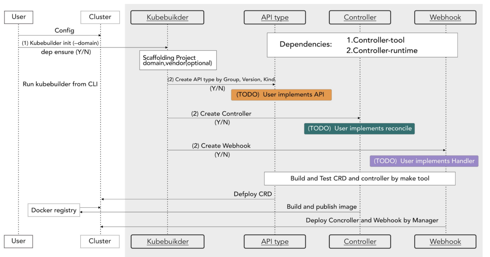

## 1 概述

### 构建阶段


### 工作流程




## 2 使用流程

### 安装kubebuilder


```
brew install kubebuilder
kubebuilder version
```


### 创建工程
1. 初始化一个项目目录
```
mkdir -p $GOPATH/src/ykl.com/customer-controller/

go mod init contollers.happyhacker.io
```
2. 定义crd所属的domain，生成一个工程.定义 crd 所属的 domain，这个指令会帮助你生成一个工程。

```
kubebuilder init --domain estom.com --license apache2 --owner "Estom"
```

创建后的目录结构如下:
* cmd目录下是启动脚本，编译后会在bin目录下生成manage可执行文件
* config目录下是基础工程配置。

```
.
├── Dockerfile
├── Makefile
├── PROJECT
├── README.md
├── cmd
│   └── main.go
├── config
│   ├── default
│   │   ├── kustomization.yaml
│   │   ├── manager_auth_proxy_patch.yaml
│   │   └── manager_config_patch.yaml
│   ├── manager
│   │   ├── kustomization.yaml
│   │   └── manager.yaml
│   ├── prometheus
│   │   ├── kustomization.yaml
│   │   └── monitor.yaml
│   └── rbac
│       ├── auth_proxy_client_clusterrole.yaml
│       ├── auth_proxy_role.yaml
│       ├── auth_proxy_role_binding.yaml
│       ├── auth_proxy_service.yaml
│       ├── kustomization.yaml
│       ├── leader_election_role.yaml
│       ├── leader_election_role_binding.yaml
│       ├── role_binding.yaml
│       └── service_account.yaml
├── go.mod
├── go.sum
└── hack
    └── boilerplate.go.txt
```
3. 创建 crd 在 golang 工程中的结构体，以及其所需的 controller 逻辑

```
kubebuilder create api --group controller --version v1 --kind Application
```
关键文件主要包括以下三个部分。创建后的目录结构如下：
* config/crd 用户自定义资源的定义。
* config/sample controller，Reconcile函数实现了处理逻辑。
* api/ crd和go模型的映射关系
```
├── Dockerfile
├── Makefile
├── PROJECT
├── README.md
├── api
│   └── v1
│       ├── application_types.go
│       ├── groupversion_info.go
│       └── zz_generated.deepcopy.go
├── bin
│   └── controller-gen
├── cmd
│   └── main.go
├── config
│   ├── crd
│   │   ├── kustomization.yaml
│   │   ├── kustomizeconfig.yaml
│   │   └── patches
│   │       ├── cainjection_in_applications.yaml
│   │       └── webhook_in_applications.yaml
│   ├── default
│   │   ├── kustomization.yaml
│   │   ├── manager_auth_proxy_patch.yaml
│   │   └── manager_config_patch.yaml
│   ├── manager
│   │   ├── kustomization.yaml
│   │   └── manager.yaml
│   ├── prometheus
│   │   ├── kustomization.yaml
│   │   └── monitor.yaml
│   ├── rbac
│   │   ├── application_editor_role.yaml
│   │   ├── application_viewer_role.yaml
│   │   ├── auth_proxy_client_clusterrole.yaml
│   │   ├── auth_proxy_role.yaml
│   │   ├── auth_proxy_role_binding.yaml
│   │   ├── auth_proxy_service.yaml
│   │   ├── kustomization.yaml
│   │   ├── leader_election_role.yaml
│   │   ├── leader_election_role_binding.yaml
│   │   ├── role_binding.yaml
│   │   └── service_account.yaml
│   └── samples
│       ├── controller_v1_application.yaml
│       └── kustomization.yaml
├── go.mod
├── go.sum
├── hack
│   └── boilerplate.go.txt
└── internal
    └── controller
        ├── application_controller.go
        └── suite_test.go

15 directories, 38 files

```

### 自定义CRD&Controller

1. 修改types.go文件，添加用户自定义字段，运行make可以生成新的crd
```go
/*
Copyright 2023 Holder.

Licensed under the Apache License, Version 2.0 (the "License");
you may not use this file except in compliance with the License.
You may obtain a copy of the License at

    http://www.apache.org/licenses/LICENSE-2.0

Unless required by applicable law or agreed to in writing, software
distributed under the License is distributed on an "AS IS" BASIS,
WITHOUT WARRANTIES OR CONDITIONS OF ANY KIND, either express or implied.
See the License for the specific language governing permissions and
limitations under the License.
*/

package v1

import (
	metav1 "k8s.io/apimachinery/pkg/apis/meta/v1"
)

// EDIT THIS FILE!  THIS IS SCAFFOLDING FOR YOU TO OWN!
// NOTE: json tags are required.  Any new fields you add must have json tags for the fields to be serialized.

// ApplicationSpec defines the desired state of Application
type ApplicationSpec struct {
	// INSERT ADDITIONAL SPEC FIELDS - desired state of cluster
	// Important: Run "make" to regenerate code after modifying this file

	// Foo is an example field of Application. Edit application_types.go to remove/update
	Foo string `json:"foo,omitempty"`
}

// ApplicationStatus defines the observed state of Application
type ApplicationStatus struct {
	// INSERT ADDITIONAL STATUS FIELD - define observed state of cluster
	// Important: Run "make" to regenerate code after modifying this file
}

//+kubebuilder:object:root=true
//+kubebuilder:subresource:status

// Application is the Schema for the applications API
type Application struct {
	metav1.TypeMeta   `json:",inline"`
	metav1.ObjectMeta `json:"metadata,omitempty"`

	Spec   ApplicationSpec   `json:"spec,omitempty"`
	Status ApplicationStatus `json:"status,omitempty"`
}

//+kubebuilder:object:root=true

// ApplicationList contains a list of Application
type ApplicationList struct {
	metav1.TypeMeta `json:",inline"`
	metav1.ListMeta `json:"metadata,omitempty"`
	Items           []Application `json:"items"`
}

func init() {
	SchemeBuilder.Register(&Application{}, &ApplicationList{})
}

```

2. 修改contoller完善处理逻辑。controller对资源的监听依赖于Informer机制


Informer 已经由kubebuilder和contorller-runtime 实现，监听到的资源的事件（创建、删除、更新、webhock）都会放在 Informer 中。然后这个事件会经过 predict()方法进行过滤，经过interface enqueue进行处理，最终放入 workqueue中。我们创建的 controller 则会依次从workqueue中拿取事件，并调用我们自己实现的 Recontile() 方法进行业务处理。控制器的处理函数，每当集群中有Sample资源的变动（CRUD），都会触发这个函数进行协调


```go
// +kubebuilder:rbac:groups=sample.sample.io,resources=samples,verbs=get;list;watch;create;update;patch;delete
// +kubebuilder:rbac:groups=sample.sample.io,resources=samples/status,verbs=get;update;patch
func (r *PlaybookReconciler) Reconcile(req ctrl.Request) (ctrl.Result, error) {
        _ = context.Background()
        _ = r.Log.WithValues("sample", req.NamespacedName)

        // your logic here

        return ctrl.Result{}, nil
}
```


### 部署crd和controller

部署operator主要包括两个步骤，一个是安装crd、一个是注册controller处理程序。

* 在项目主目录下执行make install，会自动调用 kustomize 创建部署 crd 的yml。执行 make run 则在本地启动 controller 主程序。

```sh
$ make run
/root/go/bin/controller-gen object:headerFile="hack/boilerplate.go.txt" paths="./..."
go fmt ./...
go vet ./...
/root/go/bin/controller-gen "crd:trivialVersions=true" rbac:roleName=manager-role webhook paths="./..." output:crd:artifacts:config=config/crd/bases
go run ./main.go
2020-05-15T10:05:41.839Z	INFO	controller-runtime.metrics	metrics server is starting to listen	{"addr": ":8081"}
2020-05-15T10:05:41.840Z	INFO	setup	starting manager
2020-05-15T10:05:41.840Z	INFO	controller-runtime.manager	starting metrics server	{"path": "/metrics"}
2020-05-15T10:05:41.840Z	INFO	controller-runtime.controller	Starting EventSource	{"controller": "sample", "source": "kind source: /, Kind="}
2020-05-15T10:05:41.940Z	INFO	controller-runtime.controller	Starting Controller	{"controller": "sample"}
2020-05-15T10:05:41.940Z	INFO	controller-runtime.controller	Starting workers	{"controller": "sample", "worker count": 1}
```

* 以deployment 方式部署controller时，可以使用 Dockerfile 构建镜像，使用config/manager/manager.yml 部署。
