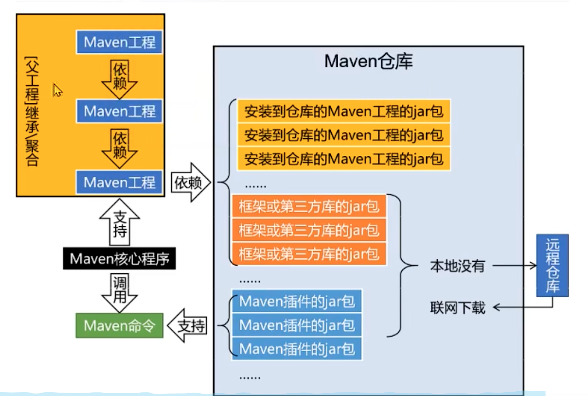

# maven仓库

## 1 仓库简介

仓库是项目中依赖的第三方库。任何一个依赖、插件或者项目构建输出，都可以称之为构件。maven仓库能够帮我们管理构件（比如jar程序）。maven仓库有3中类型，本地、中央、远程。

## 2 本地仓库

第一次运行maven仓库时，创建本地仓库。maven所需要的构建都是直接从本地仓库获取的。如果本地仓库没有，会首先尝试从远程仓库下载值本地仓库，然后使用本地仓库的构件。

默认的本地仓库在%USER_HOME%/.m2/respository。

可以通过settings.xml自定义存储路径：

```
<settings xmlns="http://maven.apache.org/SETTINGS/1.0.0"
   xmlns:xsi="http://www.w3.org/2001/XMLSchema-instance"
   xsi:schemaLocation="http://maven.apache.org/SETTINGS/1.0.0 
   http://maven.apache.org/xsd/settings-1.0.0.xsd">
      <localRepository>C:/MyLocalRepository</localRepository>
</settings>

```

## 3 中央仓库

maven中央仓库是由maven社区提供的仓库，包含了大量常用的库。中央仓库包含了绝大多数流行的java构件。由maven社区管理，不需要配置，通过网络访问。

## 4 远程仓库
编程人员自己定制的仓库，包含了所需要的代码库。远程仓库使用方法。
```
<project xmlns="http://maven.apache.org/POM/4.0.0"
   xmlns:xsi="http://www.w3.org/2001/XMLSchema-instance"
   xsi:schemaLocation="http://maven.apache.org/POM/4.0.0
   http://maven.apache.org/xsd/maven-4.0.0.xsd">
   <modelVersion>4.0.0</modelVersion>
   <groupId>com.companyname.projectgroup</groupId>
   <artifactId>project</artifactId>
   <version>1.0</version>
   <dependencies>
      <dependency>
         <groupId>com.companyname.common-lib</groupId>
         <artifactId>common-lib</artifactId>
         <version>1.0.0</version>
      </dependency>
   <dependencies>
   <repositories>
      <repository>
         <id>companyname.lib1</id>
         <url>http://download.companyname.org/maven2/lib1</url>
      </repository>
      <repository>
         <id>companyname.lib2</id>
         <url>http://download.companyname.org/maven2/lib2</url>
      </repository>
   </repositories>
</project>
```

## 5 maven依赖搜索的顺序

1. 在本地仓库中搜索
2. 在中央仓库中搜索下载
3. 在远程仓库中搜索下载


## 6 中央仓库镜像
修改maven根目录先的conf/setting.xml，添加镜像。
```
<mirrors>
    <mirror>
      <id>alimaven</id>
      <name>aliyun maven</name>
      <url>http://maven.aliyun.com/nexus/content/groups/public/</url>
      <mirrorOf>central</mirrorOf>        
    </mirror>
</mirrors>
```
在工程的pom.xml文件中，添加阿里云作为远程仓库之一。
```
<repositories>  
        <repository>  
            <id>alimaven</id>  
            <name>aliyun maven</name>  
            <url>http://maven.aliyun.com/nexus/content/groups/public/</url>  
            <releases>  
                <enabled>true</enabled>  
            </releases>  
            <snapshots>  
                <enabled>false</enabled>  
            </snapshots>  
        </repository>  
</repositories>
```