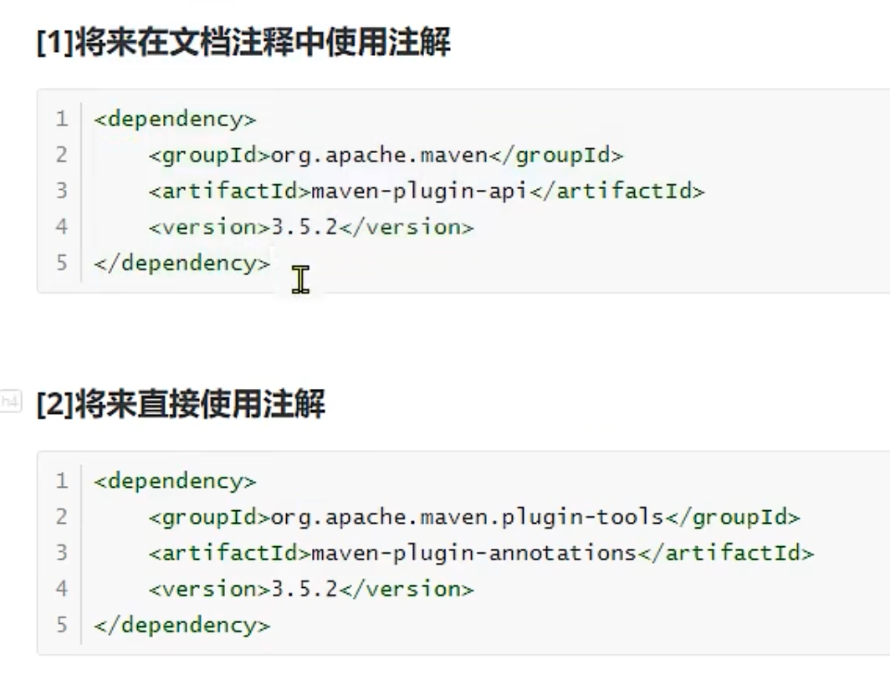
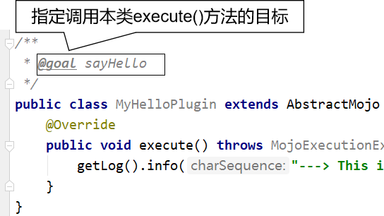
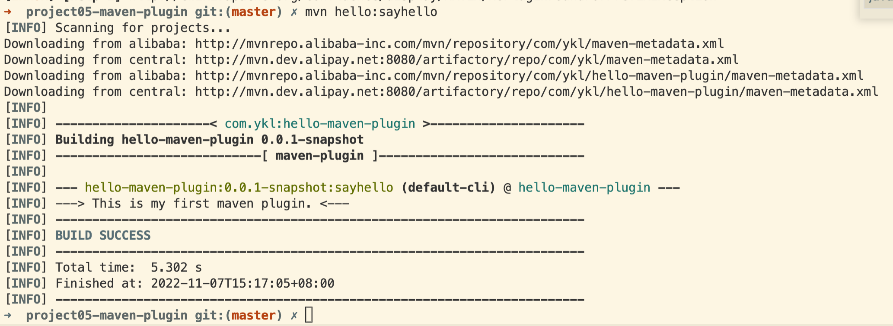
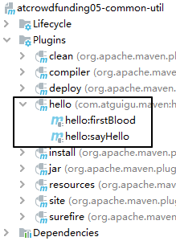
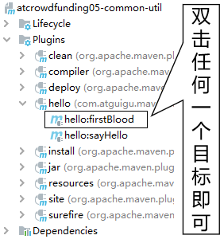
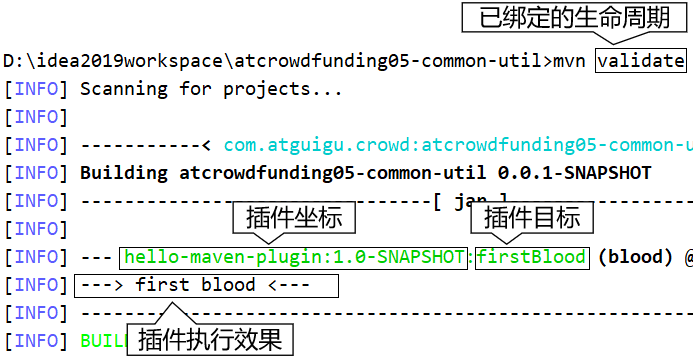
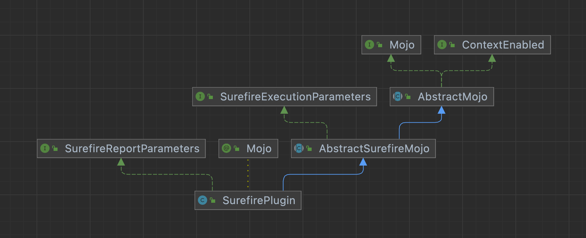
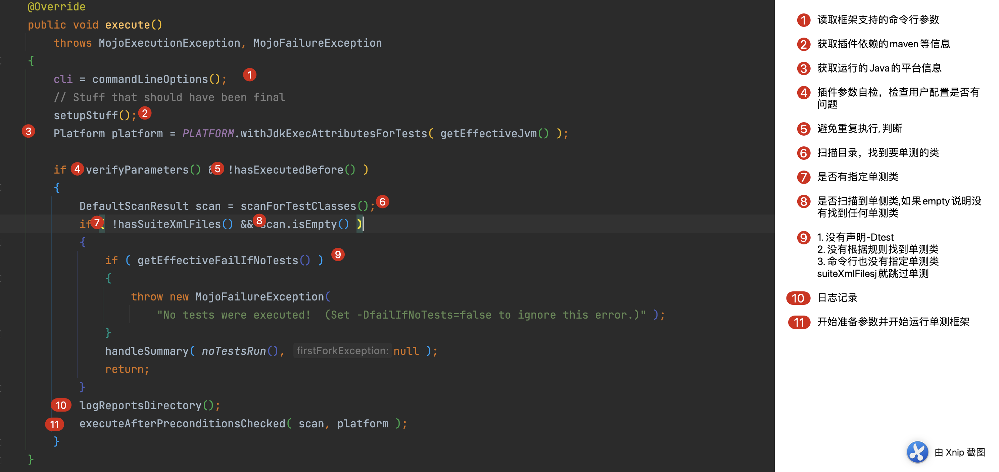

## 1 简介

### 插件概念
maven项目包含三个生命周期，每个生命周期包含多个节点。每个节点都是由maven插件实现。例如maven-clean-plugin

maven实际上是一个依赖插件执行的框架。

插件提供了一个目标的集合。使用以下语法执行
```
mvn [plugin-name]:[goal-name]
mvn compiler:compile
```

### 插件与生命周期
插件可以通过phase标签绑定到指定的生命周期环境。而在执行命令的时候，会执行该生命周期之前的所有生命周期关联的插件。


### 配置额外的插件
在项目的build标签中，添加plugins/plugin标签，然后进行配置。
* plugin的坐标groupId/artifactId/version
* execution 插件的id和绑定的生命周期phase。
* execution 插件的名称和目标goal。
```xml
<project xmlns="http://maven.apache.org/POM/4.0.0"
    xmlns:xsi="http://www.w3.org/2001/XMLSchema-instance"
    xsi:schemaLocation="http://maven.apache.org/POM/4.0.0
    http://maven.apache.org/xsd/maven-4.0.0.xsd">
<modelVersion>4.0.0</modelVersion>
<groupId>com.companyname.projectgroup</groupId>
<artifactId>project</artifactId>
<version>1.0</version>
<build>
<plugins>
   <plugin>
   <groupId>org.apache.maven.plugins</groupId>
   <artifactId>maven-antrun-plugin</artifactId>
   <version>1.1</version>
   <executions>
      <execution>
         <id>id.clean</id>
         <phase>clean</phase>
         <goals>
            <goal>run</goal>
         </goals>
         <configuration>
            <tasks>
               <echo>clean phase</echo>
            </tasks>
         </configuration>
      </execution>     
   </executions>
   </plugin>
</plugins>
</build>
</project>
```


### 常用插件


分为两类
* Build plugins
* Repoting plugins

常用插件列表

* clean	构建之后清理目标文件。删除目标目录。
* compiler	编译 Java 源文件。
* surefile	运行 JUnit 单元测试。创建测试报告。
* jar	从当前工程中构建 JAR 文件。
* war	从当前工程中构建 WAR 文件。
* javadoc	为工程生成 Javadoc。
* antrun	从构建过程的任意一个阶段中运行一个 ant 任务的集合。

## 2 自定义插件

### 创建工程
```shell
➜  maven源码 git:(master) ✗ mvn archetype:generate -DgroupId=com.ykl -DartifactId=project05-maven-plugin -DarchetypeArtifactId=maven-archetype-quickstart -Dversion=0.0.1-snapshot
```
### 打包方式

```
<pakaging>maven-plugin</pakaging>
```

### maven依赖


下面两种方式二选一：

```xml
#[1]将来在文档注释中使用注解
<dependency>
    <groupId>org.apache.maven</groupId>
    <artifactId>maven-plugin-api</artifactId>
    <version>3.5.2</version>
</dependency>
#[2]将来直接使用注解
<dependency>
    <groupId>org.apache.maven.plugin-tools</groupId>
    <artifactId>maven-plugin-annotations</artifactId>
    <version>3.5.2</version>
</dependency>
```
### 创建Mojo类

maven old java object   maven的核心类。每一个 Mojo 都需要实现 org.apache.maven.plugin.Mojo 接口。


```java
public class MyHelloPlugin extends AbstractMojo {
    @Override
    public void execute() throws MojoExecutionException, MojoFailureException {
        getLog().info("---> This is my first maven plugin. <---");
    }
}
```
### 添加注解标识
* 文档注释中用注解：对应的 pom.xml 中的依赖： maven-plugin-api



* 直接在类上标记注解：对应 pom.xml 中的依赖：maven-plugin-annotations
```
// name 属性：指定目标名称
@Mojo(name = "firstBlood")
public class MyPluginOfFistBlood extends AbstractMojo {
    @Override
    public void execute() throws MojoExecutionException, MojoFailureException {
        getLog().info("---> first blood <---");
    }
}
```

### 安装插件
要在后续使用插件，就必须至少将插件安装到本地仓库。

```
mvn clean install
```

### 注册插件。

我们需要将插件坐标中的 groupId 部分注册到 settings.xml 中。再pluginGroups声明插件仓库。

```xml
<pluginGroups>
	<!-- pluginGroup
	 | Specifies a further group identifier to use for plugin lookup.
	<pluginGroup>com.your.plugins</pluginGroup>
	-->
	<pluginGroup>com.ykl</pluginGroup>
</pluginGroups>
```



### 使用插件

Maven 根据插件的 artifactId 来识别插件前缀。例如下面两种情况：
```
#[1]前置匹配
匹配规则：${prefix}-maven-plugin
artifactId：hello-maven-plugin
前缀：hello
#[2]中间匹配
匹配规则：maven-${prefix}-plugin
artifactId：maven-good-plugin
前缀：good
```

**在命令行直接用**

命令：
```
mvn hello:sayHello
```
效果：


**配置到build标签里** 
这里找一个和插件无关的 Maven 工程配置才有说服力。
```
#[1]配置
<build>
	<plugins>
		<plugin>
			<groupId>com.atguigu.maven</groupId>
			<artifactId>hello-maven-plugin</artifactId>
			<version>1.0-SNAPSHOT</version>
			<executions>
				<execution>
                    <id>hello</id>
                    <!-- 指定和目标关联的生命周期阶段 -->
					<phase>clean</phase>
					<goals>
						<goal>sayHello</goal>
					</goals>
				</execution>
                <execution>
                    <id>blood</id>
                    <phase>validate</phase>
                    <goals>
                        <goal>firstBlood</goal>
                    </goals>
                </execution>
			</executions>
		</plugin>
	</plugins>
</build>
```
效果


**图形化界面使用**



**命令行使用**
执行已和插件目标绑定的生命周期：




## 3 help插件:分析依赖


## 4 archetype插件:创建工程

```
mvn archetype:generate -DgroupId=com.ykl -DartifactId=project04-maven-import -DarchetypeArtifactId=maven-archetype-quickstart -Dversion=0.0.1-snapshot
```


## 5 dependcy:依赖管理和分析


* 查看依赖列表

```
mvn dependcy:list
mvn dependcy:tree
```
## 6 spring-boot-maven-plugin

spring-boot-maven-plugin是spring boot提供的maven打包插件。可打直接可运行的jar包或war包。

```xml
<build>
    <plugins>
        <plugin>
            <groupId>org.springframework.boot</groupId>
            <artifactId>spring-boot-maven-plugin</artifactId>
        </plugin>
    </plugins>
</build>
```
插件提供了6个maven goal

* build-info：生成项目的构建信息文件 build-info.properties
* help：用于展示spring-boot-maven-plugin的帮助信息。使用命令行mvn spring-boot:help -Ddetail=true -Dgoal=<goal-name>可展示goal的参数描述信息。
* repackage：可生成可执行的jar包或war包。插件的核心goal。
* run：运行 Spring Boot 应用
* start：在集成测试阶段，控制生命周期
* stop：在集成测试阶段，控制生命周期


## 7 surefire插件

### 简介

如果你执行过mvn test或者执行其他maven命令时跑了测试用例，你就已经用过maven-surefire-plugin了。 maven-surefire-plugin是maven里执行测试用例的插件，不显示配置就会用默认配置。 这个插件的surefire:test命令会默认绑定maven执行的test阶段。

如果你自己声明了，那么可以指定自己的版本，并且可以配置自定义的参数。

### 导入

```xml

<build>
    <pluginManagement>
      <plugins>
        <plugin>
          <groupId>org.apache.maven.plugins</groupId>
          <artifactId>maven-surefire-plugin</artifactId>
          <version>3.0.0-M5</version>
        </plugin>
      </plugins>
    </pluginManagement>
  </build>
```

运行命令mvn test即可使用此插件。

### 源码详解
前面通过学习知道Mojo是运行的核心类,而SurefirePlugin就是Mojo的子类。 由此可知,如果要学习这个 maven-surefire-plugin，入口就是在SurefirePlugin类。







### 常用参数

| 是否常用 | 参数名 | 使用方法 | 解释 |
|---|---|---|---|
| 常用 | skipTests | -D,或者xml配置标签 | 用于跳过单测 |
| 常用 | maven.test.skip.exec | -D,或者xml配置标签 | 用于跳过单测 |
| 常用 | maven.test.skip | -D,或者xml配置标签 | 用于跳过单测 |
| 不常用 | testClassesDirectory | xml配置标签 | 指定测试模块目录编译后目录 |
| 不常用 | maven.test.dependency.excludes | -D,或者xml配置标签 | 要排除的依赖,格式:groupId:artifactId |
| 不常用 | maven.test.additionalClasspath | -D,或者xml配置标签 | 追加classpath |
| 不常用 | project.build.testSourceDirectory | xml配置标签 | 指定测试模块目录源码目录 |
| 不常用 | excludes | xml配置 | 指定规则的类不需要被单测，eg: **/*Test.java |
| 不常用 | surefire.reportNameSuffix | -D,或者xml配置标签 | test报表后缀 |
| 不常用 | maven.test.redirectTestOutputToFile | -D,或者xml配置标签 | 运行的单侧输出重定向到report目录中 |
| 不常用 | failIfNoTests | -D,或者xml配置标签 | 如果没有单测就报错 |
| 不常用 | forkMode | -D,或者xml配置标签 | 运行模式 |
| 不常用 | jvm | -D,或者xml配置标签 | 指定jvm目录,如果不指定会读取系统 |
| 不常用 | argLine | -D,或者xml配置标签 | Jvm运行参数 |
| 不常用 | threadCount | -D,或者xml配置标签 | 线程数 |
| 不常用 | forkCount | -D,或者xml配置标签 | 指定启用多少个vm,1.5C 以数字结尾,数字乘以cpu核心数 |
| 不常用 | reuseForks | -D,或者xml配置标签 | 是否可重新使用forks进程 |
| 不常用 | disableXmlReport | -D,或者xml配置标签 | 禁用xml报告 |
| 不常用 | enableassertions | -D,或者xml配置标签 | 启用断言assert语句 |


forkMode 可设置值有 “never”， “once”， “always” 和 “pertest”。

* pretest： 每一个测试创建一个新进程，为每个测试创建新的JVM是单独测试的最彻底方式，但也是最慢的，不适合hudson上持续回归。
* once：在一个进程中进行所有测试。once为默认设置，在Hudson上持续回归时建议使用默认设置。
* always：在一个进程中并行的运行脚本，Junit4.7以上版本才可以使用，surefire的版本要在2.6以上提供这个功能，