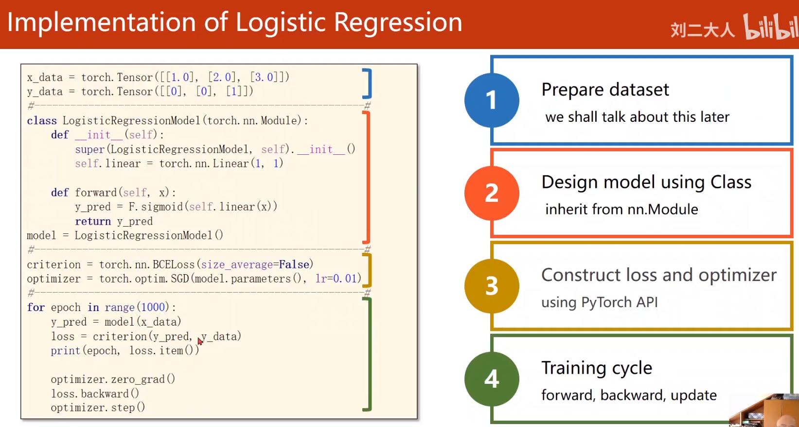
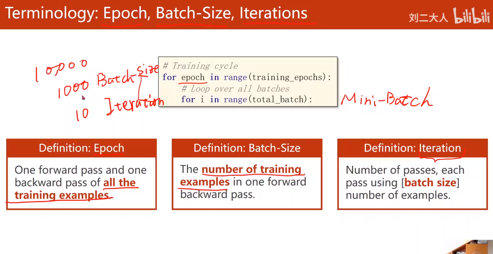

# 学习 PyTorch

> 教程说明
> * 0*是5套特殊的教程，一步步重构。
> * 1*是pysyft相关的文章和教程
> * 2*pytorch的基础教程。包含构建一个完整的神经网络的标准步骤。


## 过程

1. 获取数据集
2. 数据预处理
3. 创建模型
   1. 定义模型：torch.nn.Model.__init__定义具有一些可学习参数（或权重）的神经网络
   2. 定义损失函数、训练算法、验证方法
4. 训练模型
   1. 正向传播：torch.nn.Model.forward通过网络处理输入，进行正向传播
   2. 计算损失：torch.nn.loss输出正确的距离有多远
   3. 反向传播：torch.tensor.backward将梯度传播回网络参数
   4. 更新权重：troch.optim通常使用简单的更新规则来更新网络的权重：weight = weight - learning_rate * gradient
   5. 迭代循环：重复以上步骤直到（精确度满足要求 或者 迭代次数到达上限）
5. 验证模型


## 术语

* 特征`3*32*32`
* 层：卷积层、池化层、全连接层
* 算子：卷积层使用的卷积算子。池化层的赤化算子`3*3`
* 激活函数：卷积层的的每个卷积算子计算完成后输出一个新的特征。激活函数对这个卷积算子处理后的结果进行第二次处理。`1*1`。不改变特征的维度。只添加一个对特征的调整。
* 权重。在深度神经网络中，权重使用来计算z的求和使用的。在卷积神经网络中，


## 标准神经网络

* 现实生活中，channel表示通道的数量。神经网络的计算图，从前向后，有无数的通道。channel就是表示这个通道的数量。channel:某一层输入输出的数量。分别用inchannls和outchannels
* 通道的数量，指某一层的通道的数量，而非相对于某一个神经元来说。同一层的神经元遵循相同的计算方法（使用同一个算子）
* 在普通神经网络中，一个channel表示一条通道（连线），就只能产生一个值。这个值会×权重，作为下一层的激活值。然后调用激活函数，作为下一层的输出值。
* 在卷积神经网络中，channel代表的含义也一样。一个channel表示一条通道（连线），但是这个通道上传递的是高维的特征数据，而非简单的一个数据。如conv2d，传递的可能是`32*32`的特征。第二层使用了inchannel3，outchannel6，卷积算子（卷积核）的大小为3.该层处理的输入特征为3个channel的`32*32`。输出特征是6个channel的`28*28`。表示该层

* 在标准神经网络的构建过程中，可以在前向传播过程中对函数过程进行控制。可以构造任意形状的计算图。每一层的神经元可以不一样。


## 卷积神经网络


* 与之前的卷积过程相比较，卷积神经网络的单层结构多了激活函数和偏移量；而与标准神经网络：

$$Z^{[l]} = W^{[l]}A^{[l-1]}+b$$
$$A^{[l]} = g^{[l]}(Z^{[l]})$$

* 相比，滤波器的数值对应着权重 $W^{[l]}$，卷积运算对应着 $W^{[l]}$与 $A^{[l-1]}$的乘积运算，所选的激活函数变为 ReLU。

* 对于一个 3x3x3 的滤波器，包括偏移量 $b$在内共有 28 个参数。不论输入的图片有多大，用这一个滤波器来提取特征时，参数始终都是 28 个，固定不变。即**选定滤波器组后，参数的数目与输入图片的尺寸无关**。因此，卷积神经网络的参数相较于标准神经网络来说要少得多。这是 CNN 的优点之一。

## 数据规模——普通神经网络

## 数据规模——卷积神经网络

### channel的理解
> 与数据规模相关的量主要包括以下几种。他们共同构成了张量的各个维度。在torch.nn当中的运算，都是以层为单位进行计算的。也就是说，同一层只有一种神经元，多个神经元表示多个channel，同一层的输入输出使用一个张量来表示。

### 数据的规模
对torch.nn来说。一个张量至少应该包括四个维度。batch_size,channesl,height,width。每一个张量表示某一层的所有输入或输出。


* batch_size:张量的第一个维度。表示输入样本的个数。在传播计算和理解过程中，可以假设没有这个维度。但是在实际的运算过程中，第一维表示的batch_size
* channels:表示该层算子的个数、神经元的个数。in_channels表示输入的神经元的个数。out_channels表示输出神经元的个数。
* height
* width[-depth]表示一张图片或者一个条数据的大小。


### 参数的数量
对于每一层的参数的数量的计算如下。也就是说每一个卷积层有两个参数， 一个参数是weight，另一个参数是bias。具体的就是conv2.weight   conv2.bias

```py
>>> conv2 = nn.Conv2d(in_channels=3, out_channels=32, kernel_size=(4,3,2))
>>> for (name, param) in conv2.named_parameters():
>>>    print(name)
weight
bias
>>> print(conv2.weight.shape)
torch.Size([32, 3, 4, 3, 2])
```


## 构成

> 在构建普通神经网络的时候。可以实现不同的控制级别。

* 神经网络的构成主要包括以下几个内容：数据+算子+过程。实现模型的训练。
  * 数据（样本）或者说激活值。
  * 算子。
    * 自己定义的算子，需要自己声明参数并初始化。
    * 使用系统定义的算子，系统会自动添加参数。
  * 过程：前项传播的函数。后向传播的函数。误差计算的函数。梯度下降的函数。





## 收获

1. 从神经科学 过渡到 数学和工程学。已经脱离科学的范畴
2. 分类为什么不能用唯一的数值表示。因为分类的类别之间，没有大小关系、连续关系。如果用y=1,2,3表示类别的话，说明，2与1类别相距更近。
3. pytorch的损失函数。可一选择两个参数:means=True,reduct=True。在minibatch梯度下降的时候可选
4. 矩阵，是线性空间的变换。将n为矩阵映射到m为空间的矩阵是m*n维的矩阵。

