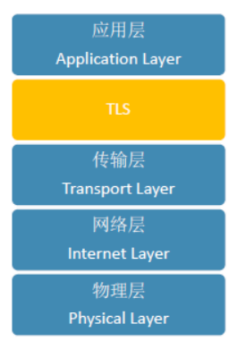
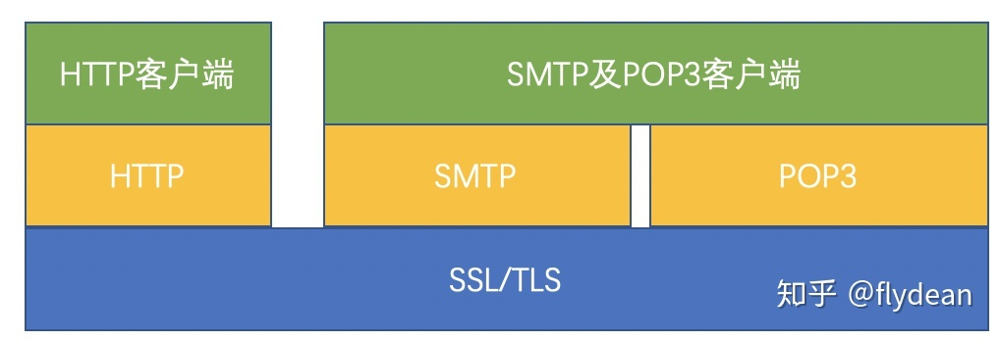
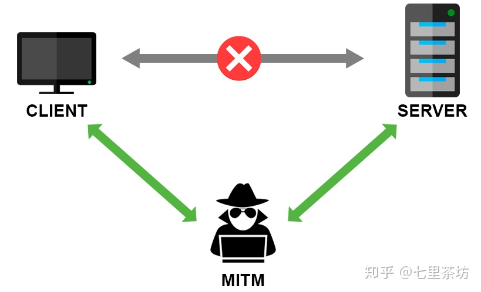

## 1 简介

### 协议简介

SSL/TLS是一种密码通信框架，他是世界上使用最广泛的密码通信方法。SSL/TLS综合运用了密码学中的对称密码，消息认证码，公钥密码，数字签名，伪随机数生成器等，可以说是密码学中的集大成者。
* SSL(Secure Socket Layer)安全套接层，是1994年由Netscape公司设计的一套协议，并与1995年发布了3.0版本。
* TLS(Transport Layer Security)传输层安全是IETF在SSL3.0基础上设计的协议，实际上相当于SSL的后续版本。


### 加密算法

包括秘钥生成、加密、解密三个主要过程。

* 非对称加密算法：RSA，DSA/DSS,Diffie–Hellman
* 对称加密算法：AES，RC4，3DES
* 秘钥生成算法：premaster secret、master secret

### 消息摘要算法
**消息摘要算法**即**HASH算法**，**消息摘要**（Message Digest）简要地描述了一分较长的信息或文件，它可以被看做一分长文件的**数字指纹**。主要分为以下三类

* MD(Message Digest)：消息摘要。生成的消息摘要都是128位的。包括：MD2，MD4，MD5
* SHA(Secure Hash Algorithm)：安全散列。固定长度摘要信息。包括：SHA-1，SHA-2(SHA-224，SHA-256，SHA-384，SHA-512)
* MAC(Message Authentication Code)：消息认证码。HMAC(keyed-Hash Message Authentication Code)：含有密钥的散列函数算法，包含了MD和SHA两个系列的消息摘要算法，HMAC只是在原有的MD和SHA算法的基础上添加了密钥。HMAC运算利用hash算法，以一个消息M和一个密钥K作为输入，生成一个定长的消息摘要作为输出。HMAC算法利用已有的Hash函数，关键问题是如何使用密钥。能够通过MD、SHA确保数据的完整性，通过秘钥确定数据的身份认证（相当于用私钥签名）
  * MD 系列算法有 HmacMD2、HmacMD4 和 HmacMD5 三种算法；
  * SHA 系列算法有 HmacSHA1、HmacSHA224、HmacSHA256、HmacSHA384 和 HmacSHA512 五种算法。


### 协议概念

* TCP
  TCP（Transmission Control Protocol 传输控制协议）是一种面向连接的、可靠的、基于字节流的传输层通信协议，是七层协议中的第四层传输层的协议之一。

* HTTPS
  HTTPS（全称：Hyper Text Transfer Protocol over Secure Socket Layer），是以安全为目标的HTTP通道，简单讲是HTTP的安全版。

* SSL
  SSL(Secure Sockets Layer 安全套接层)是为网络通信提供安全及数据完整性的一种安全协议。当前版本为3.0。它已被广泛地用于Web浏览器与服务器之间的身份认证和加密数据传输。

* TLS
  安全传输层协议（TLS：Transport Layer Security）用于在两个通信应用程序之间提供保密性和数据完整性。该协议由两层组成： TLS 记录协议（TLS Record）和 TLS 握手协议（TLS Handshake），是更新、更安全的SSL版本。

### 协议关系


* HTTPS是应用层的安全协议，TCP是传输层的协议，但是它不安全，因为它是明文传输的，所以SSL的诞生就是给TCP加了一层保险，使HTTPS和TCP之间使用加密传输。而TLS只是SSL的升级版，他们的作用是一样的。
* SSL 凭证安装于伺服器（例如网站服务器）上，但是在浏览器上，使用者仍可看到网站是否受到SSL 的保护。首先，如果SSL 出现在网站上，使用者看到的网址会是以https:// 开头，而不是http:// （多出的一个s 代表「安全」）。按照企业所获得的验证或凭证等级，安全连接会通过挂锁图标或绿色地址栏来显示。
* HTTPS会在网站受到SSL凭证保护时在网址中出现。该凭证的详细资料包括发行机构与网站拥有人的企业名称，可以通过按一下浏览器列上的锁定标记进行检视。
* 应用最广泛的是TLS1.0，接下来是SSL3.0 。但主流浏览器都已经实现了TLS 1.2 的支持。TLS 1.0有时被标示为SSL 3.1，TLS 1.1为SSL 3.2，TLS 1.2为SSL 3.3。TLS和SSL协议理论上属于传输层，在应用层实现，所以我们可以在浏览器中设置是否使用此协议，使用哪一版本的协议。


## 2 应用

SSL/TLS是一个安全通信框架，上面可以承载HTTP协议或者SMTP/POP3协议等。下层基于TCP可靠数据连接实现。



### 主要功能

* 数据完整性：内容传输经过完整性校验
* 数据隐私性：内容经过对称加密，每个连接生成一个唯一的加密密钥
* 身份认证：第三方无法伪造服务端（客户端）身份

数据完整性和隐私性由TLS Record Protocol保证，身份认证由TLS Handshaking Protocols实现。

### 安全性

- 可以使用非对称或公钥、密码术（例如，RSA [RSA]、DSA [DSS] 等）来验证对等方的身份。此身份验证可以是可选的，但通常需要至少其中一位同行。

- 共享机密的协商是安全的：窃听者无法获得协商的机密，并且对于任何经过身份验证的连接，即使攻击者可以将自己置于连接中间，也无法获得该机密。

- 协商可靠：任何攻击者都不能在不被通信双方检测到的情况下修改协商通信。
## 3 架构


TLS主要分为两层
* TLS Record Protocol底层的是TLS记录协议，主要负责使用对称密码（主密钥）对消息进行加密。

* TLS Handshake Protocol上层的是TLS握手协议，主要分为握手协议，密码规格变更协议和应用数据协议4个部分。
  * Handshake protocol握手协议负责在客户端和服务器端商定密码算法和共享密钥，包括证书认证，是4个协议中最最复杂的部分。
  * Change cipher spec protocol密码规格变更协议负责向通信对象传达变更密码方式的信号
  * Alert protocol警告协议负责在发生错误的时候将错误传达给对方
  * Application data protocol应用数据协议负责将TLS承载的应用数据传达给通信对象的协议。


## 4 握手协议——典型过程
握手协议是TLS协议中非常重要的协议，通过客户端和服务器端的交互，和共享一些必要信息，从而生成共享密钥和交互证书。

<!--  -->
<!--  -->


### 步骤1 客户端请求SSL内容

* client hello客户端向服务器端发送一个client hello的消息，包含下面内容：
```
1. 可用版本号：TSL1.0,TSL1.1,TSL1.2
2. 当前时间
3. 客户端随机数。
4. 会话ID
5. 可用的密码套件清单。RSA、AES、MD5
6. 可用的压缩方式清单。
```

### 步骤2 服务器响应SSL内容

* server hello服务器端收到client hello消息后，会向客户端返回一个server hello消息，包含如下内容：

```
1. 使用的版本号。使用的版本号，使用的密码套件，使用的压缩方式。
2. 当前时间
3. 服务器随机数。
4. 会话ID
5. 使用的密码套件
6. 使用的压缩方式
```

* 可选步骤:certificate服务器端发送自己的证书清单。因为证书可能是层级结构的，所以处理服务器自己的证书之外，还需要发送为服务器签名的证书。客户端将会对服务器端的证书进行验证。如果是以匿名的方式通信则不需要证书。
* 可选步骤:ServerKeyExchange。如果第三步的证书信息不足，则可以发送ServerKeyExchange用来构建加密通道。ServerKeyExchange的内容可能包含两种形式：
  * 如果选择的是RSA协议，那么传递的就是RSA构建公钥。
  * 如果选择的是Diff-Hellman密钥交换协议，那么传递的就是密钥交换的参数。
* 可选步骤:CertificateRequest如果是在一个受限访问的环境，比如fabric中，服务器端也需要向客户端索要证书。如果并不需要客户端认证，则不需要此步骤。
* server hello done 服务器端发送server hello done的消息告诉客户端自己的消息结束了。

### 步骤3 客户端交换秘钥证书


* 可选步骤:Certificate。客户端发送客户端证书给服务器。
* ClientKeyExchange还是分两种情况：
  * 如果是公钥或者RSA模式情况下，客户端将根据客户端生成的随机数和服务器端生成的随机数，生成预备主密码，通过该公钥进行加密，返送给服务器端。
  * 如果使用的是Diff-Hellman密钥交换协议，则客户端会发送自己这一方要生成Diff-Hellman密钥而需要公开的值。
* 可选步骤:Certificate Verify客户端向服务器端证明自己是客户端证书的持有者。
* ChangeCipherSpec。密码规格变更协议的消息，表示后面的消息将会以前面协商过的密钥进行加密。
* finished(握手协议结束)客户端告诉服务器端握手协议结束了。


### 步骤4 服务器交换秘钥证书
* ChangeCipherSpec。服务器端告诉客户端自己要切换密码了。
* finished(握手协议结束)服务器端告诉客户端，握手协议结束了。


## 4.1 握手协议——RSA握手协议


## 4.2 握手协议——DH握手协议


## 5 记录协议

TLS记录协议主要负责消息的压缩，加密和认证。当TLS完成握手过程后，客户端和服务端确定了加密，压缩和MAC算法及其参数，数据（Record）会通过指定算法处理。Record首先被加密，然后添加MAC（message authentication code）以保证数据完整性。


* 在发送端：将数据（Record）分段，压缩，增加MAC(Message Authentication Code)和加密。消息首先将会被分段，然后压缩，再计算其消息验证码，然后使用对称密码进行加密，加密使用的是CBC模式，CBC模式的初始向量是通过主密码来生成的。
* 在接收端：将数据（Record）解密，验证MAC，解压并重组得到密文之后会附加类型，版本和长度等其他信息，最终组成最后的报文数据。


## 6 master secret密码计算
1. [明文] 客户端发送随机数client_random
2. [明文] 服务器返回随机数server_random
3. [RSA] 客户端使用证书中的公钥加密premaster secret发送给服务端
4. 服务端使用私钥解密premaster secret
5. 两端分别通过client_random，server_random和premaster secret生成master secret，用于对称加密后续通信内容

一般的主密码计算方法
```
master_secret = PRF(pre_master_secret, "master secret", ClientHello.random + ServerHello.random)[0..47];
```

扩展的主密码计算方法
```
session_hash = Hash(handshake_messages)
master_secret = PRF(pre_master_secret, "extended master secret",session_hash)[0..47];
```


## 7 Cipher suite密码套件

### 典型构成
* key establishment (typically a Diffie-Hellman variant or RSA)密钥协商算法（通常是 Diffie-Hellman 变体或 RSA等非对称加密算法）
* authentication (the certificate type)身份验证算法（证书类型RSA、DSA等签名算法）
* confidentiality (a symmetric cipher)机密性算法（对称加密算法）
* integrity (a hash function)完整性算法（消息摘要函数）

###  “AES128-SHA” 

* RSA for key establishment (implied)
* RSA for authentication (implied)
* 128-bit Advanced Encryption Standard in Cipher Block Chaining (CBC) mode for confidentiality
* 160-bit Secure Hashing Algorithm (SHA) for integrity

### “ECDHE-ECDSA-AES256-GCM-SHA384” 

* Elliptic Curve Diffie-Hellman Ephemeral (ECDHE) key exchange for key establishment 椭圆曲线 Diffie-Hellman Ephemeral ( ECDHE ) 密钥交换
* Elliptic Curve Digital Signature Algorithms (ECDSA) for authentication 身份验证的椭圆曲线数字签名算法 ( ECDSA )
* 256-bit Advanced Encryption Standard in Galois/Counter mode (GCM) for confidentiality
* 384-bit Secure Hashing Algorithm for integrity


## 8 中间人攻击


### 中间人攻击模型



三重握手(Triple Handshake) (CVE-2014-1295)：攻击者（A）分别与客户端（C）和服务器（S）握手，协商出同一个主密钥；之后令客户端（C）和服务器（S）之间重新协商（renegotiation）或继续（resumption）会话来握手。可攻破重新协商，TLS Exporter RFC5705和"tls-unique" RFC5929。

```
C：客户端。 A： 攻击者 S：服务端

C向A发送“ ClientHello”，A将其转发给S。

S向A发送“ ServerHello”，A将其转发给C。

S将包含其证书链的“证书”发送给A。
A用自己的证书链替换它，并将其发送给C。

S向A发送“ ServerHelloDone”，A将其转发给C。

C向A发送“ ClientKeyExchange”，其中包含
“ pre_master_secret”，已使用A的公钥加密。解密
“ pre_master_secret”，使用S的公钥对其重新加密，并且
将其发送给S。

C向A发送“完成”。A计算其“完成”
与S连接并将其发送给S。

S向A发送“完成”。A计算其“完成”
与C的连接，并将其发送给C。
```
通过以上方式，如果使用无“Extended Master Secret”扩展字段的计算方式将发现，从C->A和从A->S之间使用的会话密钥是一样的，这种叫做未知密钥共享（unkown key-share（UKS））攻击。当使用扩展主密钥的计算方式时，因为有session_hash，计算了所有协商消息的hash，如果中间攻击者A对协商消息进行改动，则客户端和服务端计算的hash值则不一样，最后计算出的主密钥也会不同。
