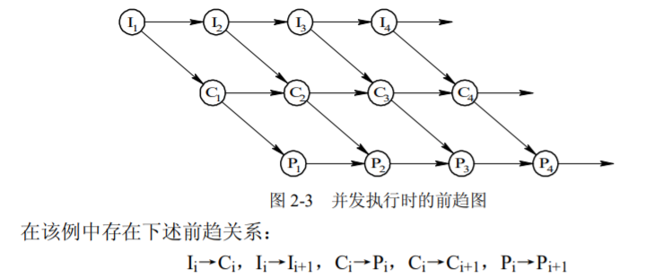
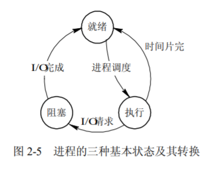
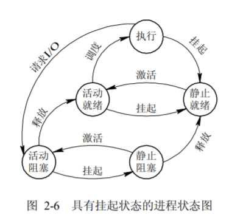
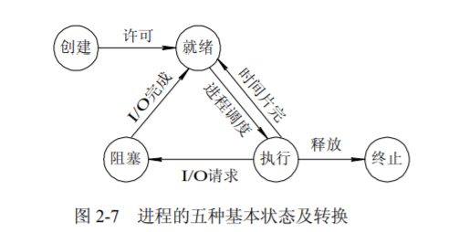
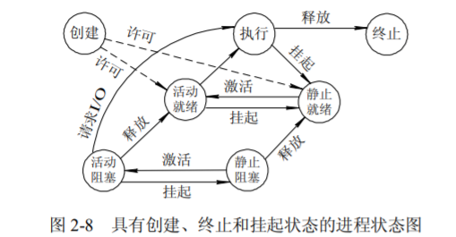
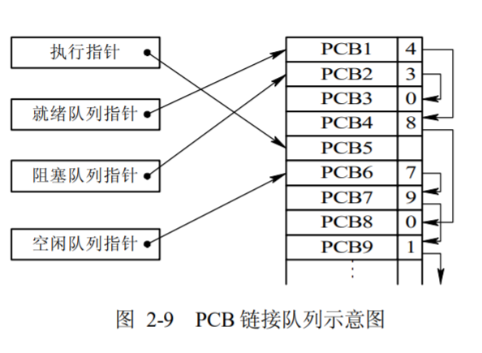
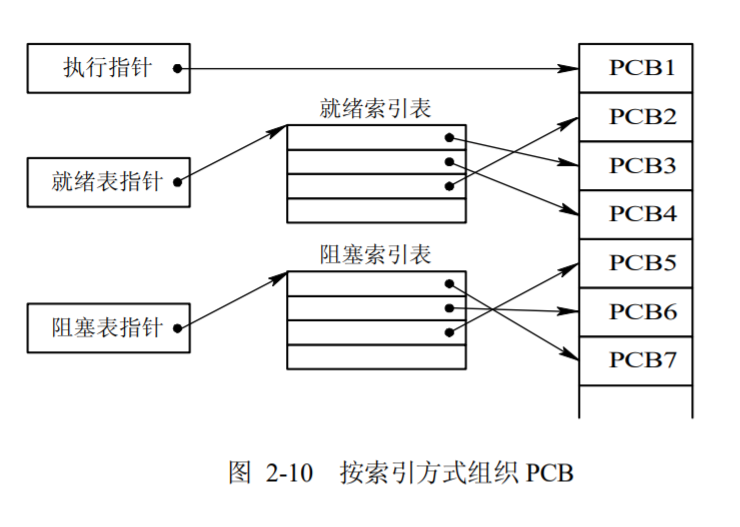

# 2.1 进程的基本概念

> 关系概述
> * 程序不能独立运行。只能作为进程执行。程序是静态的，进程是动态的。
> * 程序有两种执行方式：程序的顺序执行和程序的并发执行。并发执行通过多进程实现。

## 1 程序的顺序执行

### 程序顺序执行时的特征

1. 顺序性。严格按照程序规定的特征执行
2. 封闭性。程序运行时独占全机资源。程序一旦开始，其结果不受外界影响。
3. 可再现性。只要程序运行的环境和初始条件相同，结果相同

## 2 前驱图

### 定义

* 前趋图(Precedence Graph)是一个有向无环图，记为 DAG(Directed Acyclic Graph)，用于描述进程之间执行的前后关系。图中的每个结点可用于描述一个程序段或进程，乃至一条语句；结点间的有向边则用于表示两个结点之间存在的偏序(Partial Order，亦称偏序关系)或前趋关系(Precedence Relation)“→”。


## 3 程序的并发执行

### 定义
* 程序并发执行的前驱图表示
  

### 程序并发执行时的特征

1. 间断性。执行-暂停-执行，间断性活动。
2. 失去封闭性。多个程序共享系统中的各个资源。
3. 不可再现性。其计算结果与并发执行的进程有关。相互影响。

## 4 进程的定义和特征

### 进程的定义
* 操作系统用来实现程序并发执行的实体。
* 作为操作系统**资源分配**和**独立运行**的基本单位。

### 进程的特征

* 结构特征：由程序段、数据段和 PCB 三部分便构成了进程实体。
* 并发性：这是指多个进程实体同存于内存中，且能在一段时间内同时运行。
* 动态性：进程的实质是进程实体的一次执行过程，包含创建、调度、撤销。进程具有一定的生命周期。程序是一组指令的集合，是静态的。
* 独立性：独立性是指进程实体是一个能独立运行、独立分配资源和独立接受调度的基本单位。
* 异步性：这是指进程按各自独立的、 不可预知的速度向前推进，或说进程实体按异步方式运行。


### 进程的构成

1. （OS管理程序的）数据结构PCB
2. （运行程序的）内存代码段Code
3. （运行程序的）内存数据段Data
4. （运行程序的）通用寄存器信息Register
5. （OS控制程序的）程序状态字信息PSW

## 5 进程的状态
### 就绪状态、执行状态、阻塞状态
1. 就绪(Ready)状态：当进程已分配到除 CPU 以外的所有必要资源后，只要再获得 CPU，便可立即执行，进程这时的状态称为就绪状态。就绪队列管理就绪状态的进程。
2. 执行状态：进程已获得 CPU，其程序正在执行。在单处理机系统中，只有一个进程处于执行状态；在多处理机系统中，则有多个进程处于执行状态。
3. 阻塞状态：正在执行的进程由于发生某事件而暂时无法继续执行时，放弃处理机而处于暂停状态，把这种暂停状态称为阻塞状态。

### 3态模型的转换


1. 运行态→等待态：等待资源、I/O、信号
2. 等待态→就绪态：资源满足、I/O结束、信号完成
3. 就绪态→运行态；处理器空闲时选择更高优先权进程抢占
4. 运行态→就绪态：运行时间片刻、有更高优先权进程

### 挂起状态

*  由于终端用户的请求、父进程请求、负荷调节的需要、操作系统的需要。程序需要暂时挂起。不再接受操作系统的调度。


### 5态模型的转换（挂起）

1. 活动就绪→静止就绪。当进程处于未被挂起的就绪状态时，称此为活动就绪状态，表示为 Readya。当用挂起原语 Suspend 将该进程挂起后，该进程便转变为静止就绪状态，表示为 Readys，处于 Readys 状态的进程不再被调度执行。
2. 活动阻塞→静止阻塞。当进程处于未被挂起的阻塞状态时，称它是处于活动阻塞状态，表示为 Blockeda。当用 Suspend 原语将它挂起后，进程便转变为静止阻塞状态，表示为Blockeds。
3. 静止就绪→活动就绪。处于 Readys 状态的进程，若用激活原语 Active 激活后，该进程将转变为 Readya 状态。
4. 静止阻塞→活动阻塞。处于 Blockeds 状态的进程，若用激活原语 Active 激活后，该进程将转变为 Blockeda 状态。

### 创建状态、终止状态

1. 创建状态：创建一个进程一般要通过两个步骤：首先，为一个新进程创建 PCB，并填写必要的管理信息；其次，把该进程转入就绪状态并插入就绪队列之中。
2. 终止状态；进程的终止也要通过两个步骤：首先等待操作系统进行善后处理；然后将其 PCB 清零，并将 PCB 空间返还系统。

### 5态模型的转换（创建、终止）



### 7态模型的转换




## 6 进程控制块

### 进程控制块定义
* PCB（Process Control Block）记录了操作系统所需的、用于描述进程的当前情况以及控制进程运行的全部信息。
* OS用于管理进程物理实体，刻画进程的执行现状，控制进程的执行。


### 进程控制块信息
* 进程标识信息（用于唯一的标识进程）
  1. 系统进程标识符（操作系统分配的进程标识符）
  2. 用户进程标识符（用户自定义的进程名、进程组名）
* 进程状态信息（用于存放该进程运行时的处理器现场信息）
  1. 寄存器内容
     1. 用户可见寄存器内容：数据寄存器、地址寄存器
     2. 控制与状态寄存器内容：程序计数器PC、指令寄存器IR、程序状态字PSW
  2. 核心栈与用户栈指针内容

* 进程控制信息：用于存放与管理、调度进程相关的信息
  1. 进程组成信息：代码/数据地址、外存映像地址
  2. 进程通信信息：消息队列、信号量、锁
  3. 进程权限信息：内存访问权限、处理器特权
  4. 处理器使用信息：占用的处理器、时间片、处理器使用事件/已执行总时间、记账信息
  5. 资源清单信息：正占用的资源、已使用的资源

* 进程调度信息
  1. 进程状态，指明进程的当前状态，作为进程调度和对换时的依据；
  2. 进程优先级，用于描述进程使用处理机的优先级别的一个整数，优先级高的进程应优先获得处理机；
  3. 进程调度所需的其它信息，它们与所采用的进程调度算法有关，比如，进程已等待 CPU 的时间总和、进程已执行的时间总和等；
  4. 事件，指进程由执行状态转变为阻塞状态所等待发生的事件，即阻塞原因。

### 进程控制块的组织方式

1. 链接方式这是把具有同一状态的 PCB，用其中的链接字链接成一个队列。这样，可以形成就绪队列、若干个阻塞队列和空白队列等。


2.  索引方式系统根据所有进程的状态建立几张索引表。例如，就绪索引表、阻塞索引表等。



```C
struct task_struct {
    volatile long state;    /* -1 unrunnable, 0 runnable, >0 stopped */
    void *stack;
    atomic_t usage;
    unsigned int flags; /* per process flags, defined below */
    unsigned int ptrace;

    int lock_depth;     /* BKL lock depth */

#ifdef CONFIG_SMP
#ifdef __ARCH_WANT_UNLOCKED_CTXSW
    int oncpu;
#endif
#endif

    int prio, static_prio, normal_prio;
    unsigned int rt_priority;
    const struct sched_class *sched_class;
    struct sched_entity se;
    struct sched_rt_entity rt;

#ifdef CONFIG_PREEMPT_NOTIFIERS
    /* list of struct preempt_notifier: */
    struct hlist_head preempt_notifiers;
#endif

    /*
     * fpu_counter contains the number of consecutive context switches
     * that the FPU is used. If this is over a threshold, the lazy fpu
     * saving becomes unlazy to save the trap. This is an unsigned char
     * so that after 256 times the counter wraps and the behavior turns
     * lazy again; this to deal with bursty apps that only use FPU for
     * a short time
     */
    unsigned char fpu_counter;
#ifdef CONFIG_BLK_DEV_IO_TRACE
    unsigned int btrace_seq;
#endif

    unsigned int policy;
    cpumask_t cpus_allowed;

#ifdef CONFIG_TREE_PREEMPT_RCU
    int rcu_read_lock_nesting;
    char rcu_read_unlock_special;
    struct rcu_node *rcu_blocked_node;
    struct list_head rcu_node_entry;
#endif /* #ifdef CONFIG_TREE_PREEMPT_RCU */

#if defined(CONFIG_SCHEDSTATS) || defined(CONFIG_TASK_DELAY_ACCT)
    struct sched_info sched_info;
#endif

    struct list_head tasks;
    struct plist_node pushable_tasks;

    struct mm_struct *mm, *active_mm;

/* task state */
    int exit_state;
    int exit_code, exit_signal;
    int pdeath_signal;  /*  The signal sent when the parent dies  */
    unsigned int personality;
    unsigned did_exec:1;
    unsigned in_execve:1;   /* Tell the LSMs that the process is doing an
                 * execve */
    unsigned in_iowait:1;


    /* Revert to default priority/policy when forking */
    unsigned sched_reset_on_fork:1;

    pid_t pid;
    pid_t tgid;

#ifdef CONFIG_CC_STACKPROTECTOR
    /* Canary value for the -fstack-protector gcc feature */
    unsigned long stack_canary;
#endif

    /* 
     * pointers to (original) parent process, youngest child, younger sibling,
     * older sibling, respectively.  (p->father can be replaced with 
     * p->real_parent->pid)
     */
    struct task_struct *real_parent; /* real parent process */
    struct task_struct *parent; /* recipient of SIGCHLD, wait4() reports */
    /*
     * children/sibling forms the list of my natural children
     */
    struct list_head children;  /* list of my children */
    struct list_head sibling;   /* linkage in my parent's children list */
    struct task_struct *group_leader;   /* threadgroup leader */

    /*
     * ptraced is the list of tasks this task is using ptrace on.
     * This includes both natural children and PTRACE_ATTACH targets.
     * p->ptrace_entry is p's link on the p->parent->ptraced list.
     */
    struct list_head ptraced;
    struct list_head ptrace_entry;

    /*
     * This is the tracer handle for the ptrace BTS extension.
     * This field actually belongs to the ptracer task.
     */
    struct bts_context *bts;

    /* PID/PID hash table linkage. */
    struct pid_link pids[PIDTYPE_MAX];
    struct list_head thread_group;

    struct completion *vfork_done;      /* for vfork() */
    int __user *set_child_tid;      /* CLONE_CHILD_SETTID */
    int __user *clear_child_tid;        /* CLONE_CHILD_CLEARTID */

    cputime_t utime, stime, utimescaled, stimescaled;
    cputime_t gtime;
    cputime_t prev_utime, prev_stime;
    unsigned long nvcsw, nivcsw; /* context switch counts */
    struct timespec start_time;         /* monotonic time */
    struct timespec real_start_time;    /* boot based time */
/* mm fault and swap info: this can arguably be seen as either mm-specific or thread-specific */
    unsigned long min_flt, maj_flt;

    struct task_cputime cputime_expires;
    struct list_head cpu_timers[3];

/* process credentials */
    const struct cred *real_cred;   /* objective and real subjective task
                     * credentials (COW) */
    const struct cred *cred;    /* effective (overridable) subjective task
                     * credentials (COW) */
    struct mutex cred_guard_mutex;  /* guard against foreign influences on
                     * credential calculations
                     * (notably. ptrace) */
    struct cred *replacement_session_keyring; /* for KEYCTL_SESSION_TO_PARENT */

    char comm[TASK_COMM_LEN]; /* executable name excluding path
                     - access with [gs]et_task_comm (which lock
                       it with task_lock())
                     - initialized normally by flush_old_exec */
/* file system info */
    int link_count, total_link_count;
#ifdef CONFIG_SYSVIPC
/* ipc stuff */
    struct sysv_sem sysvsem;
#endif
#ifdef CONFIG_DETECT_HUNG_TASK
/* hung task detection */
    unsigned long last_switch_count;
#endif
/* CPU-specific state of this task */
    struct thread_struct thread;
/* filesystem information */
    struct fs_struct *fs;
/* open file information */
    struct files_struct *files;
/* namespaces */
    struct nsproxy *nsproxy;
/* signal handlers */
    struct signal_struct *signal;
    struct sighand_struct *sighand;

    sigset_t blocked, real_blocked;
    sigset_t saved_sigmask; /* restored if set_restore_sigmask() was used */
    struct sigpending pending;

    unsigned long sas_ss_sp;
    size_t sas_ss_size;
    int (*notifier)(void *priv);
    void *notifier_data;
    sigset_t *notifier_mask;
    struct audit_context *audit_context;
#ifdef CONFIG_AUDITSYSCALL
    uid_t loginuid;
    unsigned int sessionid;
#endif
    seccomp_t seccomp;

/* Thread group tracking */
    u32 parent_exec_id;
    u32 self_exec_id;
/* Protection of (de-)allocation: mm, files, fs, tty, keyrings, mems_allowed,
 * mempolicy */
    spinlock_t alloc_lock;

#ifdef CONFIG_GENERIC_HARDIRQS
    /* IRQ handler threads */
    struct irqaction *irqaction;
#endif

    /* Protection of the PI data structures: */
    spinlock_t pi_lock;

#ifdef CONFIG_RT_MUTEXES
    /* PI waiters blocked on a rt_mutex held by this task */
    struct plist_head pi_waiters;
    /* Deadlock detection and priority inheritance handling */
    struct rt_mutex_waiter *pi_blocked_on;
#endif

#ifdef CONFIG_DEBUG_MUTEXES
    /* mutex deadlock detection */
    struct mutex_waiter *blocked_on;
#endif
#ifdef CONFIG_TRACE_IRQFLAGS
    unsigned int irq_events;
    int hardirqs_enabled;
    unsigned long hardirq_enable_ip;
    unsigned int hardirq_enable_event;
    unsigned long hardirq_disable_ip;
    unsigned int hardirq_disable_event;
    int softirqs_enabled;
    unsigned long softirq_disable_ip;
    unsigned int softirq_disable_event;
    unsigned long softirq_enable_ip;
    unsigned int softirq_enable_event;
    int hardirq_context;
    int softirq_context;
#endif
#ifdef CONFIG_LOCKDEP
# define MAX_LOCK_DEPTH 48UL
    u64 curr_chain_key;
    int lockdep_depth;
    unsigned int lockdep_recursion;
    struct held_lock held_locks[MAX_LOCK_DEPTH];
    gfp_t lockdep_reclaim_gfp;
#endif

/* journalling filesystem info */
    void *journal_info;

/* stacked block device info */
    struct bio *bio_list, **bio_tail;

/* VM state */
    struct reclaim_state *reclaim_state;

    struct backing_dev_info *backing_dev_info;

    struct io_context *io_context;

    unsigned long ptrace_message;
    siginfo_t *last_siginfo; /* For ptrace use.  */
    struct task_io_accounting ioac;
#if defined(CONFIG_TASK_XACCT)
    u64 acct_rss_mem1;  /* accumulated rss usage */
    u64 acct_vm_mem1;   /* accumulated virtual memory usage */
    cputime_t acct_timexpd; /* stime + utime since last update */
#endif
#ifdef CONFIG_CPUSETS
    nodemask_t mems_allowed;    /* Protected by alloc_lock */
    int cpuset_mem_spread_rotor;
#endif
#ifdef CONFIG_CGROUPS
    /* Control Group info protected by css_set_lock */
    struct css_set *cgroups;
    /* cg_list protected by css_set_lock and tsk->alloc_lock */
    struct list_head cg_list;
#endif
#ifdef CONFIG_FUTEX
    struct robust_list_head __user *robust_list;
#ifdef CONFIG_COMPAT
    struct compat_robust_list_head __user *compat_robust_list;
#endif
    struct list_head pi_state_list;
    struct futex_pi_state *pi_state_cache;
#endif
#ifdef CONFIG_PERF_EVENTS
    struct perf_event_context *perf_event_ctxp;
    struct mutex perf_event_mutex;
    struct list_head perf_event_list;
#endif
#ifdef CONFIG_NUMA
    struct mempolicy *mempolicy;    /* Protected by alloc_lock */
    short il_next;
#endif
    atomic_t fs_excl;   /* holding fs exclusive resources */
    struct rcu_head rcu;

    /*
     * cache last used pipe for splice
     */
    struct pipe_inode_info *splice_pipe;
#ifdef  CONFIG_TASK_DELAY_ACCT
    struct task_delay_info *delays;
#endif
#ifdef CONFIG_FAULT_INJECTION
    int make_it_fail;
#endif
    struct prop_local_single dirties;
#ifdef CONFIG_LATENCYTOP
    int latency_record_count;
    struct latency_record latency_record[LT_SAVECOUNT];
#endif
    /*
     * time slack values; these are used to round up poll() and
     * select() etc timeout values. These are in nanoseconds.
     */
    unsigned long timer_slack_ns;
    unsigned long default_timer_slack_ns;

    struct list_head    *scm_work_list;
#ifdef CONFIG_FUNCTION_GRAPH_TRACER
    /* Index of current stored adress in ret_stack */
    int curr_ret_stack;
    /* Stack of return addresses for return function tracing */
    struct ftrace_ret_stack *ret_stack;
    /* time stamp for last schedule */
    unsigned long long ftrace_timestamp;
    /*
     * Number of functions that haven't been traced
     * because of depth overrun.
     */
    atomic_t trace_overrun;
    /* Pause for the tracing */
    atomic_t tracing_graph_pause;
#endif
#ifdef CONFIG_TRACING
    /* state flags for use by tracers */
    unsigned long trace;
    /* bitmask of trace recursion */
    unsigned long trace_recursion;
#endif /* CONFIG_TRACING */
    unsigned long stack_start;
};
```