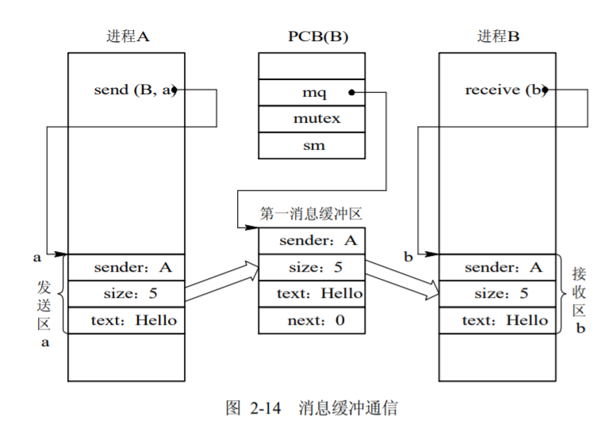
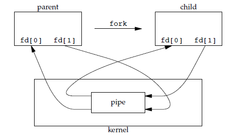
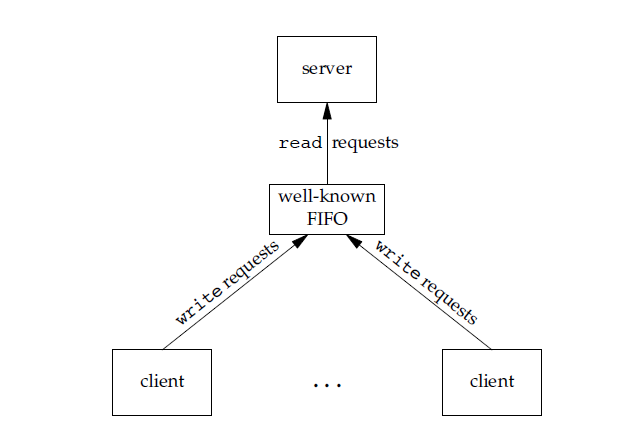

# 2.4 进程通信

## 0 进程通信的定义

### 进程通信和进程同步的区别
* 主要的区别在于：进程同步控制多个进程按一定顺序执行；进程通信，实现进程间信息交换。

* 进程通信是一种手段，而进程同步是一种目的。也可以说，为了能够达到进程同步的目的，需要让进程进行通信，传输一些进程同步所需要的信息。

* 信号量机制既能作为一种同步工具，也能做为一种通信工具。信号量机制作为同步工具是卓有成效的，但作为通信工具，则不够理想，主要表现在下述两方面：
  * 效率低，生产者每次只能向缓冲池投放一个产品(消息)，消费者每次只能从缓冲区中取得一个消息；
  * 通信对用户不透明。


## 1 进程通信的类型

### 进程通信的原理划分

* 低级进程通信机制：由于进程的互斥和同步，需要在进程间交换一定的信息，故不少学者将它们也归为进程通信。只能传递状态和整数值（控制信息）。特点：传送信息量小，效率低，每次通信传递的信息量固定，若传递较多信息则需要进行多次通信。编程复杂：用户直接实现通信的细节，容易出错。

* 高级进程通信机制。提高信号通信的效率，传递大量数据，减轻程序编制的复杂度。
  * 共享内存通信
  * 消息传递通信
  * 共享文件通信


### 进程通信的实现划分
* 基础进程通信机制  
  * 条件变量、信号量、管程
* 共享内存通信机制
  * 通过信号量控制共享内存。
* 消息传递通信机制
  * IPC消息队列
* 管道文件通信机制（文件进程通信机制）
  * PIPE管道
  * FIFO命名管道
* 网络进程通信机制
  * socket


## 2 共享内存通信

### 类型

* **共享存储器系统(Shared-Memory System)** 相互通信的进程共享某些数据结构或共享存储区，进程之间能够通过这些空间进行通信。据此，又可把它们分成以下两种类型：
  * **基于共享数据结构的通信方式**。在这种通信方式中，要求诸进程公用某些数据结构。借以实现诸进程间的信息交换。如在生产者—消费者问题中，就是用有界缓冲区这种数据结构来实现通信的。
  * **基于共享存储区的通信方式**。为了传输大量数据，在存储器中划出了一块共享存储区，诸进程可通过对共享存储区中数据的读或写来实现通信。


## 3 消息传递通信

### 定义

* **消息传递系统(Message passing system)** 是当前应用最为广泛的一种进程间的通信机制。在该机制中，进程间的数据交换是以格式化的消息(message)为单位的；
* 在计算机网络中，又把 message 称为报文。程序员直接利用操作系统提供的一组通信命令(原语)，不仅能实现大量数据的传递，而且还隐藏了通信的实现细节，使通信过程对用户是透明的，从而大大减化了通信程序编制的复杂性，因而获得了广泛的应用。
* 消息传递系统的通信方式属于高级通信方式。又因其实现方式的不同而进一步分成**直接通信方式**和**间接通信方式**两种。

> 有博客说明。消息传递直接通信，包括PIPE、FIFO、IPC三种通信方式。分别是管道通信、命名管道通信、消息队列通信。

### 直接通信方式


* 发送进程利用 OS 所提供的发送命令，直接把消息发送给目标进程。

```
Send(Receiver，message)； 发送一个消息给接收进程；
Receive(Sender，message)； 接收 Sender 发来的消息；
```

### 间接通信方式
* 间接通信方式指进程之间的通信需要通过作为共享数据结构的实体。该实体用来暂存发送进程发送给目标进程的消息；接收进程则从该实体中取出对方发送给自己的消息。

* 中间实体称为信箱。消息在信箱中可以安全地保存，只允许核准的目标用户随时读取。因此，利用信箱通信方式，既可实现实时通信，又可实现非实时通信。
  * 信箱的创建和撤消。进程可利用信箱创建原语来建立一个新信箱。创建者进程应给出信箱名字、信箱属性(公用、私用或共享)；对于共享信箱，还应给出共享者的名字。当进程不再需要读信箱时，可用信箱撤消原语将之撤消。
  * 消息的发送和接收。当进程之间要利用信箱进行通信时，必须使用共享信箱，并利用系统提供的下述通信原语进行通信：
```
 Send(mailbox，message)； 将一个消息发送到指定信箱；
 Receive(mailbox，message)； 从指定信箱中接收一个消息；
```
### 间接通信信箱

* 私用信箱。用户进程可为自己建立一个新信箱，并作为该进程的一部分。信箱的拥有者有权从信箱中读取消息，其他用户则只能将自己构成的消息发送到该信箱中。
* 公用信箱。它由操作系统创建，并提供给系统中的所有核准进程使用。核准进程既可把消息发送到该信箱中，也可从信箱中读取发送给自己的消息。
* 共享信箱它由某进程创建，在创建时或创建后指明它是可共享的，同时须指出共享进程(用户)的名字

### 消息传递系统中实现的若干问题。

1. 通信链路。为使在发送进程和接收进程之间能进行通信，必须在两者之间建立一条通信链路(communication link)。单向通信链路、双向通信链路。点对点通信链路、多点通信链路。
2. 消息的格式.在消息传递系统中所传递的消息，必须具有一定的消息格式。
3. 进程同步方式。在进程之间进行通信时，同样需要有进程同步机制，以使诸进程间能协调通信。不论是发送进程，还是接收进程，在完成消息的发送或接收后，都存在两种可能性，继续或阻塞。
   1. 发送进程阻塞，接收进程阻塞。这种情况主要用于进程之间紧密同步(tightsynchronization)，发送进程和接收进程之间无缓冲时。这两个进程平时都处于阻塞状态，直到有消息传递时。这种同步方式称为汇合(rendezrous)。
   2. 发送进程不阻塞，接收进程阻塞。这是一种应用最广的进程同步方式。平时，发送进程不阻塞，因而它可以尽快地把一个或多个消息发送给多个目标； 而接收进程平时则处于阻塞状态，直到发送进程发来消息时才被唤醒。在服务器上通常都设置了多个服务进程，它们分别用于提供不同的服务，处于阻塞收状态。
   3. 发送进程和接收进程均不阻塞。这也是一种较常见的进程同步形式。平时，发送进程和接收进程都在忙于自己的事情，仅当发生某事件使它无法继续运行时，才把自己阻塞起来等待。在发送进程和接收进程之间联系着一个消息队列时，该消息队列最多能接纳 n 个消息，这样，发送进程便可以连续地向消息队列中发送消息而不必等待；接收进程也可以连续地从消息队列中取得消息，也不必等待。


## 4 消息传递通信机制的实例——IPC消息队列通信

### 实现方式

* 属于消息通信的直接通信方式。


* 消息缓冲队列通信机制中的数据结构：消息缓冲区，在消息缓冲队列通信方式中，主要利用的数据结构是消息缓冲区；PCB 中有关通信的数据项。
* 发送进程在利用发送原语发送消息之前，应先在自己的内存空间设置一发送区。把待发送的消息正文、发送进程标识符、消息长度等信息填入其中，然后调用发送原语，把消息发送给目标(接收)进程。
* 接收原语。接收进程调用接收原语 receive(b)，从自己的消息缓冲队列 mq 中摘下第一个消息缓冲区 i，并将其中的数据复制到以 b 为首址的指定消息接收区内。

### 相比于 FIFO消息队列具有以下优点：

- 消息队列可以独立于读写进程存在，从而避免了 FIFO 中同步管道的打开和关闭时可能产生的困难；
- 避免了 FIFO 的同步阻塞问题，不需要进程自己提供同步方法；
- 读进程可以根据消息类型有选择地接收消息，而不像 FIFO 那样只能默认地接收。


## 5 管道通信机制的实例——PIPE管道通信
### 管道定义

* **“管道”** 是指用于连接一个读进程和一个写进程以实现它们之间通信的一个共享文件，又名 pipe 文件，基于文件的通信机制。向管道(共享文件)提供输入的发送进程(即写进程)，以字符流形式将大量的数据送入管道；而接受管道输出的接收进程(即读进程)，则从管道中接收(读)数据。由于发送进程和接收进程是利用管道进行通信的，故又称为管道通信。
* 有部分博客说。管道通信也属于消息通信中的直接通信的一种。
### 管道实现
* 管道是通过调用 pipe 函数创建的，fd[0] 用于读，fd[1] 用于写。

```c
#include <unistd.h>
int pipe(int fd[2]);
```

* 它具有以下限制：

  - 只支持半双工通信（单向交替传输）；
  - 只能在父子进程或者兄弟进程中使用。




## 6 管道通信机制的实例——FIFO命名管道通信

* 也称为命名管道，去除了管道只能在父子进程中使用的限制。

```c
#include <sys/stat.h>
int mkfifo(const char *path, mode_t mode);
int mkfifoat(int fd, const char *path, mode_t mode);
```

* FIFO 常用于客户-服务器应用程序中，FIFO 用作汇聚点，在客户进程和服务器进程之间传递数据。




## 7 网络通信机制——Socket套接字

* 与其它通信机制不同的是，它可用于不同机器间的进程通信。