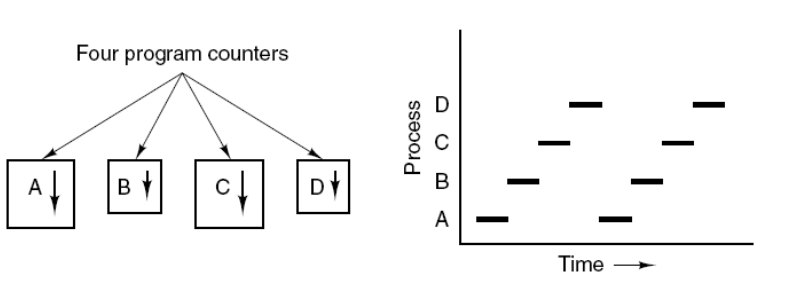
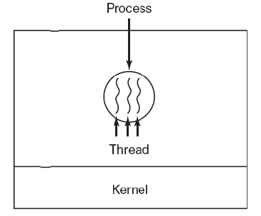

## 1 进程与线程

### 进程

* 进程是**资源分配的基本单位**。进程控制块 (Process Control Block, PCB) 描述进程的基本信息和运行状态，所谓的创建进程和撤销进程，都是指对 PCB 的操作。

* 下图显示了 4 个程序创建了 4 个进程，这 4 个进程可以并发地执行。

### 线程

* 线程是**独立调度的基本单位**。一个进程中可以有多个线程，它们共享进程资源。

* QQ 和浏览器是两个进程，浏览器进程里面有很多线程，例如 HTTP 请求线程、事件响应线程、渲染线程等等，线程的并发执行使得在浏览器中点击一个新链接从而发起 HTTP 请求时，浏览器还可以响应用户的其它事件。

### 区别

1. 调度。线程是独立调度的基本单位，进程是资源分配的基本单位。在同一进程中，线程的切换不会引起进程切换，从一个进程中的线程切换到另一个进程中的线程时，会引起进程切换。
2. 并发性。线程使得操作系统具有更好的并发性，从而能更加有效地提高系统资源的利用率和系统的吞吐量。
3. 拥有资源。进程是资源分配的基本单位，但是线程不拥有资源，线程可以访问隶属进程的资源。
4. 系统开销。由于创建或撤销进程时，系统都要为之分配或回收资源，如内存空间、I/O 设备等，所付出的开销远大于创建或撤销线程时的开销。类似地，在进行进程切换时，涉及当前执行进程 CPU 环境的保存及新调度进程 CPU 环境的设置，而线程切换时只需保存和设置少量寄存器内容，开销很小。
5. 通信方面。线程间可以通过直接读写同一进程中的数据进行通信，但是进程通信需要借助IPC。

## 2 线程属性

### 属性

1. 轻型实体
2. 独立调度和分派的基本单位
3. 可并发执行
4. 共享进程资源

### 状态参数

* 寄存器状态
* 堆栈状态
* 线程运行状态
* 优先级
* 信号屏蔽

### 运行状态
* 执行状态
* 就绪状态
* 阻塞状态
* 创建状态
* 终止状态

## 3 线程的同步和通信

### 互斥锁
### 条件变量
### 信号量

## 4 线程的实现方式
### 内核线程
### 用户线程

