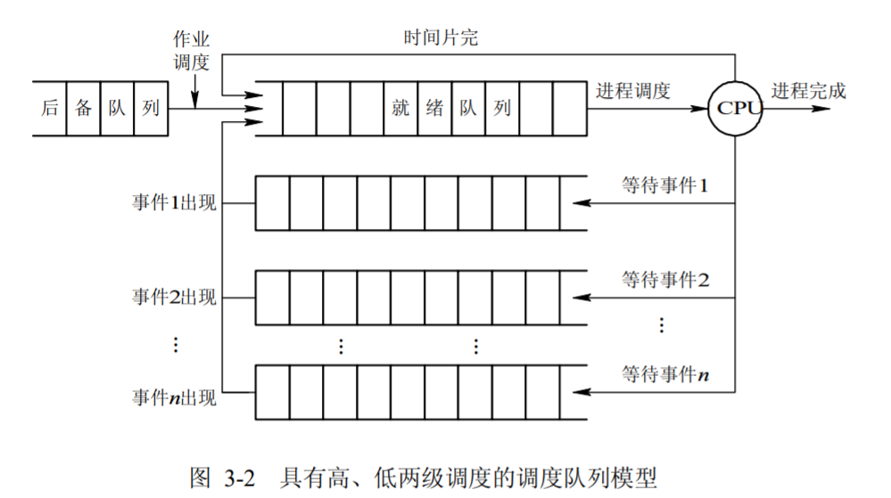
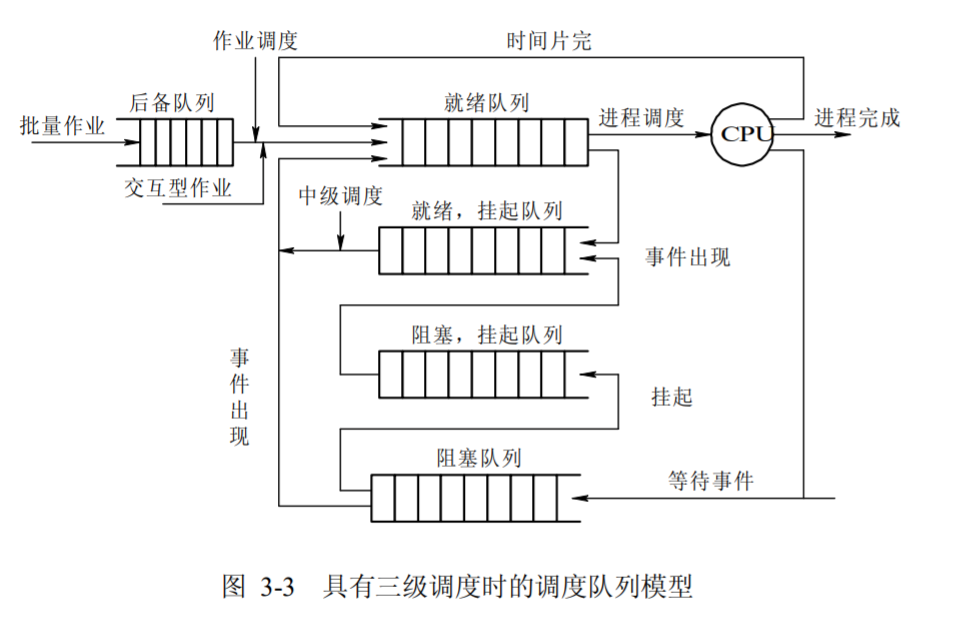
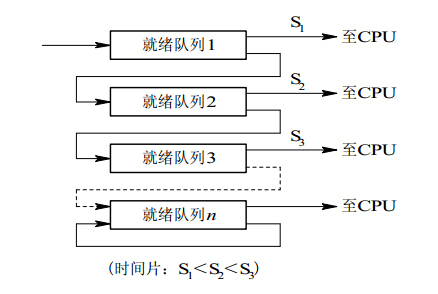
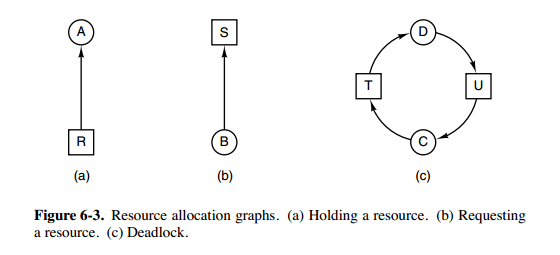
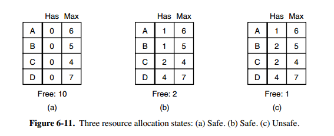
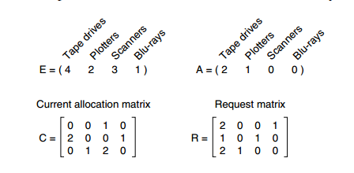

# 处理器

> ## 目录
> 1. 处理机调度的层次
> 2. 调度队列模型和调度准则
> 3. 调度算法
> 4. 实时调度
> 5. 产生死锁
> 6. 预防死锁
> 7. 死锁的检测与解除

## 1 处理器调度的层次
### 高级调度（长程调度，作业调度）

* **主要功能**。是根据某种算法，把外存上处于后备队列中的那些作业调入内存，也就是说，它的调度对象是作业。
* **作业(Job)** 。作业是一个比程序更为广泛的概念，它不仅包含了通常的程序和数据，而且还应配有一份作业说明书，系统根据该说明书来对程序的运行进行控制。在批处理系统中，是以作业为基本单位从外存调入内存的。
* **作业步(Job Step)** 。作业部类似于操作系统命令脚本。在作业运行期间，每个作业都必须经过若干个相对独立，又相互关联的顺序加工步骤才能得到结果，我们把其中的每一个加工步骤称为一个作业步。例如编译执行过程：
  1.  “编译”作业步，通过执行编译程序对源程序进行编译，产生若干个目标程序段；② “连结装配”作业步，将“编译”作业步所产生的若干个目标程序段装配成可执行的目标程序；
  2. “运行”作业步，将可执行的目标程序读入内存并控制其运行。
* **作业控制块 JCB(Job Control Block)** 。为了管理和调度作业，在多道批处理系统中为每个作业设置了一个作业控制块。
* **作业调度**。作业调度的主要功能是根据作业控制块中的信息，审查系统能否满足用户作业的资源需求，以及按照一定的算法，从外存的后备队列中选取某些作业调入内存，并为它们创建进程、分配必要的资源。

### 中级调度（平衡负载调度）：

* **主要功能** 。引起中级调度是为了提高内存利用率和作业吞吐量
* 中级调度决定哪些进程被运行驻留在主存中参与竞争处理器及其他资源，起到短期调整系统负荷的作业
* 中级调度把一些进程换出内存，从而实质进入“挂起”状态，不参与进程调度，以平顺系统的负载

### 低级调度（短程调度，进程调度，处理器调度）

* **主要功能** 通常也把低级调度(Low Level Scheduling) 称为 进程调度或短程调度(ShortTerm Scheduling)，它所调度的对象是进程(或内核级线程)。保存处理机的现场信息、按某种算法选取进程、把处理器分配给进程。
* 基本机制：
  *  **排队器**。为了提高进程调度的效率，应事先将系统中所有的就绪进程按照一定的方式排成一个或多个队列，以便调度程序能最快地找到它。
  *  **分派器(分派程序)**。分派器把由进程调度程序所选定的进程，从就绪队列中取出该进程，然后进行上下文切换，将处理机分配给它。
  *  **上下文切换机制** 。当对处理机进行切换时，会发生两对上下文切换操作。
* 进程调度的方式
  * **非抢占方式(Nonpreemptive Mode)** 。决不会因为时钟中断等原因而抢占正在运行进程的处理机。
  * **抢占方式(Preemptive Mode)**。这种调度方式允许调度程序根据某种原则去暂停某个正在执行的进程，将已分配给该进程的处理机重新分配给另一进程。优先权原则、短作业优先原则、时间片原则。

## 2 调度队列模型和调度准则

### 调度队列模型
1. 仅有低级调度的队列模型
   
2. 有高级调度和低级调度的队列模型
   
3. 同时具有三级调度的队列模型
   

### 调度准则

1. 资源利用率：使得CPU或其他资源的使用率尽可能高且能够并行工作
2. 响应时间：使交互式用户的响应时间尽可能小，或尽快处理实时任务
3. 周转时间：提交给系统开始到执行完成获得结果为止的这段时间间隔称为周转时间，应该使周转时间或平均周转时间尽可能短
4. 吞吐量：单位时间处理的进程数尽可能多
5. 公平性：确保每个用户每个进程获得合理的CPU份额或其他资源份额

## 3.1 作业调度算法

### 先来先服务调度算法FCFS

* 每次调度都是从后备作业队列中选择一个或多个最先进入该队列的作业，将它们调入内存，为它们分配资源、创建进程，然后放入就绪队列。
* FCFS 算法比较有利于长作业(进程)，而不利于短作业(进程)。

### 短作业优先调度算法SJF
* 短作业(进程)优先调度算法 SJ(P)F，是指对短作业或短进程优先调度的算法。短作业优先(SJF)的调度算法是从后备队列中选择一个或若干个估计运行时间最短的作业，将它们调入内存运行。
* SJF 调度算法能有效地降低作业的平均等待时间，提高系统吞吐量。

### 优先级调度算法
* 根据分配给进程的优先数决定运行进程。可以分为以下两种方式：
  1. 抢占式优先数调度算法
  2. 非抢占式优先数调度算法

* 优先数的确定准则
  1. 进程负担任务的紧迫程度
  2. 进程的交互性
  3. 进程使用外设的频度
  4. 进程进入系统的时间长短

* 与进入系统时间相关的优先权
  1. 先来先服务
  2. 短作业/短进程优先
  3. 最短剩余时间优先
  4. 响应比高（作业/进程）优先

### 时间片轮转调度算法

1. 根据各个进程进入就绪队列的时间先后轮流占用CPU一个时间片。
2. 在早期的时间片轮转法中，系统将所有的就绪进程按先来先服务的原则排成一个队列，每次调度时，把 CPU 分配给队首进程，并令其执行一个时间片。

### 分级调度算法（多队列策略，反馈循环队列）

1. 建立多个不同优先级的就绪进程队列
2. 多个就绪进程队列间按照优先数调度
3. 高优先级就绪进程，分配的时间片短
4. 单个就绪进程队列中进程的优先数和时间片相同
5. 分级原则
    1. 一般分级原则
        1. 外设访问，交互性，时间紧迫程度，系统效率，用户立场，……
        2. 现代操作系统的实现模型
            1. 多个高优先级的实时进程队列，如：硬实时、网络、软实时
            2. 多个分时任务的进程队列，根据基准优先数和执行行为调整
            3. 队列数可能多达32-128个

### 彩票调度算法

1. 为进程发放针对系统各种资源（如CPU时间）的彩票；当调度程序需要做出决策时，随机选择一张彩票，持有该彩票的进程将获得系统资源
2. 合作进程之间的彩票交换

## 3.2 进程调度算法

* 不同环境的调度算法目标不同，因此需要针对不同环境来讨论调度算法。

### 批处理系统

* 批处理系统没有太多的用户操作，在该系统中，调度算法目标是保证吞吐量和周转时间（从提交到终止的时间）。

1. 先来先服务 first-come first-serverd（FCFS）

   * 非抢占式的调度算法，按照请求的顺序进行调度。有利于长作业，但不利于短作业，因为短作业必须一直等待前面的长作业执行完毕才能执行，而长作业又需要执行很长时间，造成了短作业等待时间过长。

1. 短作业优先 shortest job first（SJF）

   * 非抢占式的调度算法，按估计运行时间最短的顺序进行调度。长作业有可能会饿死，处于一直等待短作业执行完毕的状态。因为如果一直有短作业到来，那么长作业永远得不到调度。

3. 最短剩余时间优先 shortest remaining time next（SRTN） 

   * 最短作业优先的抢占式版本，按剩余运行时间的顺序进行调度。 当一个新的作业到达时，其整个运行时间与当前进程的剩余时间作比较。如果新的进程需要的时间更少，则挂起当前进程，运行新的进程。否则新的进程等待。

### 交互式系统

* 交互式系统有大量的用户交互操作，在该系统中调度算法的目标是快速地进行响应。

1. 时间片轮转调度算法

   * 将所有就绪进程按 FCFS 的原则排成一个队列，每次调度时，把 CPU 时间分配给队首进程，该进程可以执行一个时间片。当时间片用完时，由计时器发出时钟中断，调度程序便停止该进程的执行，并将它送往就绪队列的末尾，同时继续把 CPU 时间分配给队首的进程。

   * 时间片轮转算法的效率和时间片的大小有很大关系：
     - 因为进程切换都要保存进程的信息并且载入新进程的信息，如果时间片太小，会导致进程切换得太频繁，在进程切换上就会花过多时间。
     - 而如果时间片过长，那么实时性就不能得到保证。
   

2. 优先级调度算法

   * 为每个进程分配一个优先级，按优先级进行调度。
   * 动态优先级：为了防止低优先级的进程永远等不到调度，可以随着时间的推移增加等待进程的优先级。

3. 分级调度算法——多级反馈队列

   * 一个进程需要执行 100 个时间片，如果采用时间片轮转调度算法，那么需要交换 100 次。多级队列是为这种需要连续执行多个时间片的进程考虑，它设置了多个队列，每个队列时间片大小都不同，例如 1,2,4,8,..。进程在第一个队列没执行完，就会被移到下一个队列。这种方式下，之前的进程只需要交换 7 次。
   * 每个队列优先权也不同，最上面的优先权最高。因此只有上一个队列没有进程在排队，才能调度当前队列上的进程。
   * 可以将这种调度算法看成是时间片轮转调度算法和优先级调度算法的结合。
   

## 4 实时调度
 * 实时系统要求一个请求在一个确定时间内得到响应。分为硬实时和软实时，前者必须满足绝对的截止时间，后者可以容忍一定的超时。

### 实现实时调度的基本条件

* 提供必要的信息：就绪时间、开始截止时间、处理时间、资源要求、优先级。
* 系统处理能力强
* 采用抢占式调度算法
* 具有快速切换机制。

### 具体算法

1. 最早截止时间优先 EDF(Earliest Deadline First)算法
2. 最低松弛度优先 LLF(Least Laxity First)算法

## 5 死锁

### 必要条件

- **互斥资源**：每个资源要么已经分配给了一个进程，要么就是可用的。
- **占有等待**：已经得到了某个资源的进程可以再请求新的资源。
- **不可抢占**：已经分配给一个进程的资源不能强制性地被抢占，它只能被占有它的进程显式地释放。
- **循环等待**：有两个或者两个以上的进程组成一条环路，该环路中的每个进程都在等待下一个进程所占有的资源。

### 处理方法

- 预防死锁
- 检测死锁
- 避免死锁
- 解除死锁

## 6 预防死锁

> 在程序运行之前预防发生死锁。

### 破坏互斥条件

* 例如假脱机打印机技术允许若干个进程同时输出，唯一真正请求物理打印机的进程是打印机守护进程。

### 破坏占有和等待条件
* 一种实现方式是规定所有进程在开始执行前请求所需要的全部资源。

### 破坏不可抢占条件

### 破坏环路等待

* 给资源统一编号，进程只能按编号顺序来请求资源。

## 7 死锁避免

> 在程序运行时避免发生死锁。

### 安全状态

* 图 a 的第二列 Has 表示已拥有的资源数，第三列 Max 表示总共需要的资源数，Free 表示还有可以使用的资源数。从图 a 开始出发，先让 B 拥有所需的所有资源（图 b），运行结束后释放 B，此时 Free 变为 5（图 c）；接着以同样的方式运行 C 和 A，使得所有进程都能成功运行，因此可以称图 a 所示的状态时安全的。

* 定义：如果没有死锁发生，并且即使所有进程突然请求对资源的最大需求，也仍然存在某种调度次序能够使得每一个进程运行完毕，则称该状态是安全的。

* 安全状态的检测与死锁的检测类似，因为安全状态必须要求不能发生死锁。下面的银行家算法与死锁检测算法非常类似，可以结合着做参考对比。

### 单个资源的银行家算法

* 一个小城镇的银行家，他向一群客户分别承诺了一定的贷款额度，算法要做的是判断对请求的满足是否会进入不安全状态，如果是，就拒绝请求；否则予以分配。

* 上图 c 为不安全状态，因此算法会拒绝之前的请求，从而避免进入图 c 中的状态。

### 多个资源的银行家算法

* 上图中有五个进程，四个资源。左边的图表示已经分配的资源，右边的图表示还需要分配的资源。最右边的 E、P 以及 A 分别表示：总资源、已分配资源以及可用资源，注意这三个为向量，而不是具体数值，例如 A=(1020)，表示 4 个资源分别还剩下 1/0/2/0。

* 检查一个状态是否安全的算法如下：

  - 查找右边的矩阵是否存在一行小于等于向量 A。如果不存在这样的行，那么系统将会发生死锁，状态是不安全的。
  - 假若找到这样一行，将该进程标记为终止，并将其已分配资源加到 A 中。
  - 重复以上两步，直到所有进程都标记为终止，则状态时安全的。

如果一个状态不是安全的，需要拒绝进入这个状态。

## 8 检测与解除死锁

> 不试图阻止死锁，而是当检测到死锁发生时，采取措施进行恢复。

### 每种类型一个资源的死锁检测

* 上图为资源分配图，其中方框表示资源，圆圈表示进程。资源指向进程表示该资源已经分配给该进程，进程指向资源表示进程请求获取该资源。

* 图 a 可以抽取出环，如图 b，它满足了环路等待条件，因此会发生死锁。

* 每种类型一个资源的死锁检测算法是通过检测有向图是否存在环来实现，从一个节点出发进行深度优先搜索，对访问过的节点进行标记，如果访问了已经标记的节点，就表示有向图存在环，也就是检测到死锁的发生。

### 每种类型多个资源的死锁检测（银行家算法）

* 上图中，有三个进程四个资源，每个数据代表的含义如下：

    - E 向量：资源总量
    - A 向量：资源剩余量
    - C 矩阵：每个进程所拥有的资源数量，每一行都代表一个进程拥有资源的数量
    - R 矩阵：每个进程请求的资源数量

* 进程 P1 和 P2 所请求的资源都得不到满足，只有进程 P3 可以，让 P3 执行，之后释放 P3 拥有的资源，此时 A = (2 2 2 0)。P2 可以执行，执行后释放 P2 拥有的资源，A = (4 2 2 1) 。P1 也可以执行。所有进程都可以顺利执行，没有死锁。

* 算法总结如下：

  1. 每个进程最开始时都不被标记，执行过程有可能被标记。当算法结束时，任何没有被标记的进程都是死锁进程。
  1. 寻找一个没有标记的进程 Pi，它所请求的资源小于等于 A。
  2. 如果找到了这样一个进程，那么将 C 矩阵的第 i 行向量加到 A 中，标记该进程，并转回 1。
  3. 如果没有这样一个进程，算法终止。

### 死锁恢复

- 利用抢占恢复
- 利用回滚恢复
- 通过杀死进程恢复

