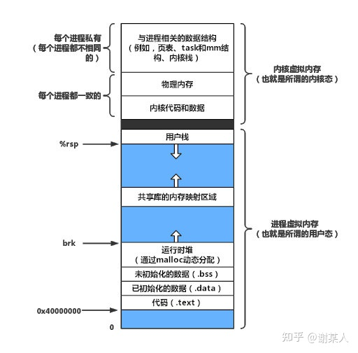
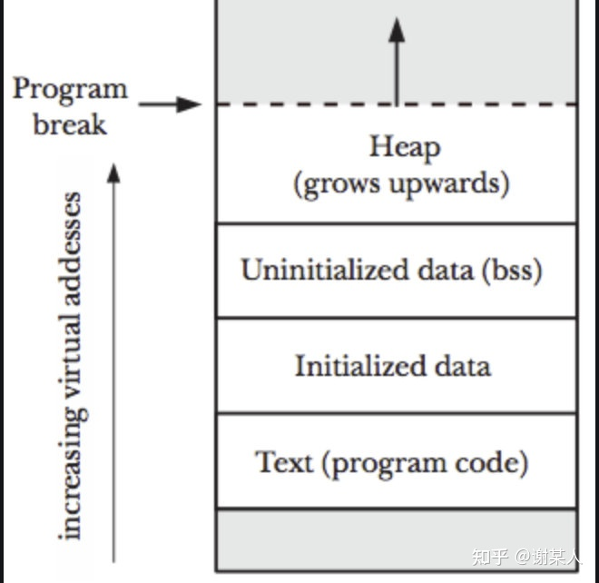

# 动态内存管理
> 参考文献
> * [SLBA的原理和使用](https://blog.csdn.net/qq_26626709/article/details/52742484)
> * [SLBA教程](https://www.cnblogs.com/foundwant/p/4028993.html)
## 1 SLBA分配器

### 概念
在linux内核中伙伴系统用来管理物理内存，其分配的单位是页，但是向用户程序一样，内核也需要动态分配内存，而伙伴系统分配的粒度又太大。

由于内核无法借助标准的C库，因而需要别的手段来实现内核中动态内存的分配管理，linux采用的是slab分配器。

slab分配器不仅可以提供动态内存的管理功能，而且可以作为经常分配并释放的内存的缓存。通过slab缓存，内核能够储备一些对象，供后续使用。需要注意的是slab分配器只管理内核的常规地址空间（准确的说是直接被映射到内核地址空间的那部分内存包括 ZONE_NORMAL和ZONE_DMA ）。


### 优点
采用了slab分配器后，在释放内存时，slab分配器将释放的内存块保存在一个列表中，而不是返回给伙伴系统。在下一次内核申请同样类型的对象时，会使用该列表中的内存开。slab分配器分配的优点：
* 可以提供小块内存的分配支持
* 不必每次申请释放都和伙伴系统打交道，提供了分配释放效率
* 如果在slab缓存的话，其在CPU高速缓存的概率也会较高。
* 伙伴系统的操作队系统的数据和指令高速缓存有影响，slab分配器降低了这种副作用
* 伙伴系统分配的页地址都页的倍数，这对CPU的高速缓存的利用有负面影响，页首地址对齐在页面大小上使得如果每次都将数据存放到从伙伴系统分配的页开始的位置会使得高速缓存的有的行被过度使用，而有的行几乎从不被使用。slab分配器通过着色使得slab对象能够均匀的使用高速缓存，提高高速缓存的利用率

在引入了slab分配器后，内核的内存管理方案如图所示：


### 缺点

slab分配器也不是万能的，它也有缺陷：
* 对于微型嵌入式系统，它显得比较复杂，这是可以使用经过优化的slob分配器，它使用内存块链表，并使用最先适配算法
* 对于具有大量内存的大型系统，仅仅建立slab分配器的数据结构就需要大量内存，这时候可以使用经过优化的slub分配器

### 使用
无论是slab分配器家族的这三个中的那个一，它们提供的接口都是相同的：
* kmalloc、kmalloc_node用于普通内存的分配
* kmem_cache_alloc、kmem_cache_alloc_node用于申请特定类型的内存

* 内核中普通内存的申请使用kmalloc(size,flags),size是申请的大小，flags告诉分配器分配什么样的内存，如何分配等等。
* 内核中普通内存的释放使用kfree(*ptr);释放ptr所指向的内存区。
* 可以通过/proc/slabinfo查看活动的缓存列表。

## 2 SLBA分配器的原理

### 基本原理

slab分配器把对象分组放进高速缓存。每个高速缓存都是同种类型对象的一种“储备”。一个cache管理一组大小固定的内存块（也称为对象实体），每个内存块都可用作一种数据结构。cache中的内存块来自一到多个slab。一个slab来自物理内存管理器的一到多个物理页，该slab被分成一组固定大小的块，被称为slab对象（object），一个slab属于一个cache，其中的对象就是该cache所管理的固定大小的内存块。所以一个cache可以有一到多个slab。下图给出了slab分配器的各个部分及其相互关系：


在基于slab的内核内存管理器中，基本的概念是保存管理型数据的缓存（即slab cache，slab缓存）和保存被管理对象的各个slab。每个缓存都负责一种对象类型，比如kmalloc-128会负责管理65-128字节的内存的kmalloc分配。系统中的所有缓存类型都保存在一个链表slab_caches中。

## 3 虚拟内存
> 参考文献
> * [虚拟内存与动态内存](https://zhuanlan.zhihu.com/p/374477494)
### 组织形式

1. linux虚拟内存形式安装堆栈形式组织，栈位于内存高地址，分为内核栈和用户栈，增长方向从高到低。而堆位于内存的低地址，是程序员进行动态内存分配的空间，增长方向由低到高。堆和栈中间是共享映射空间，用于共享库在内存中的映射，这样每次如果有不同代码调用相同的共享库，就不需要再次向内存中复制一份副本，节省了时间和空间。
2. 栈内存的更高地址用于存放一些全局数据结构
3. 堆内存的更低地址按地址从低到高放置着代码段（.text）、已分配数据段（.data）、未分配数据段（.bss）。你可能还听说过 COMMON 段专门储存未初始化全局变量，真正的.bss存储未初始化的静态变量以及初始化为0的全局和静态变量 [1]，组织形式如下
```
SECTIONS { 
  .text : { *(.text) }
  .data : { *(.data) } 
  .bss :  { *(.bss)  *(COMMON) } 
}
```



​Linux动态内存分配的实现方式是由 mmap, munmap 以及 brk, sbrk 这四个系统函数联合完成的。

### mmap

```
void *mmap(void *addr, size_t length, int prot, int flags,
           int fd, off_t offset);
```

mmap 创建一个新的虚拟内存空间和文件设备之间的映射。


其中 addr 代表分配开始地址，fd是相应文件描述符，len是指文件存储部分映射的长度，offset指的是从文件头开始offset距离开始分配。

```C++
prot包含权限位
PROT_EXEC // 可执行
PROT_READ // 可读
PROT_WRITE // 可写
PROT_NONE // 不可访问
Flags 表示映射对象类型
MAP_ANON // 匿名请求二进制零的
MAP_PRIVATE // 私有的
MAP_SHARED // 共享的
```


### munmap

取消相应地址内存块的映射
```
int munmap(void *addr, size_t length);
```
很好理解取消开始地址为 addr 长度为 length 的内存映射。


### brk与sbrk
​brk, sbrk 用来移动 program break 指向的指针来扩展堆内存，program break 位于堆顶未初始化数据段末尾之后，通过移动 program break 指针来动态控制堆的大小。




```
int brk(void *addr);
```

brk 会在允许的情况下简单的将 program break 设为 addr 地址，来控制堆内存大小。相当于 program break 的绝对移动

```
void *sbrk(intptr_t increment);
```
​sbrk 会在允许的情况下将 program break 指针加 increment 值，返回扩展前的 program break 地址。当increment为正值时，堆被扩展；为0时，返回当前 program break 的指针；为负值时，堆被收缩。相当于 program break 的相对移动


## 4 malloc和alloc的原理

