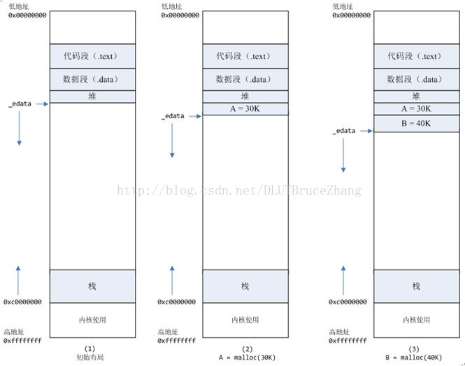
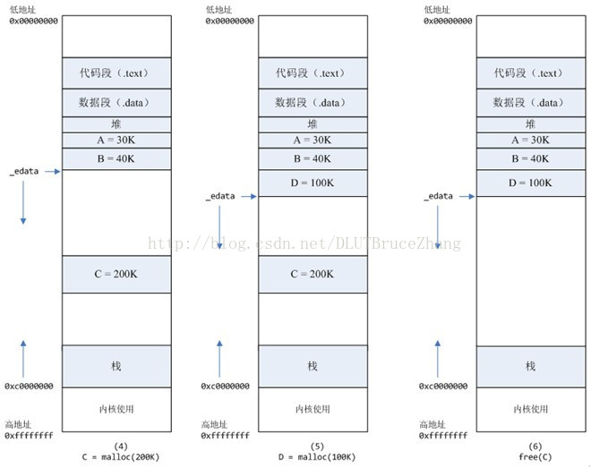
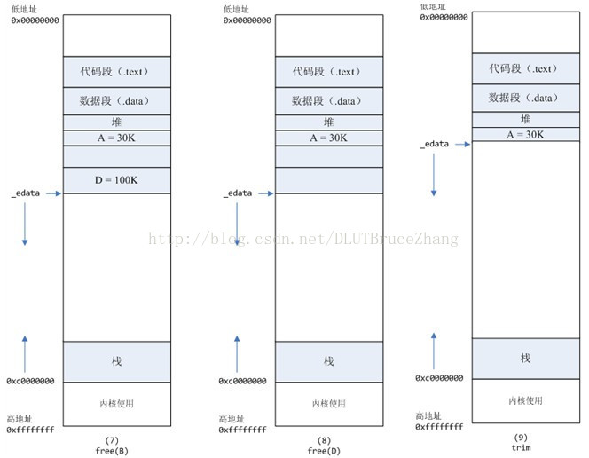

# 动态内存管理
> 参考文献
> * [SLBA的原理和使用](https://blog.csdn.net/qq_26626709/article/details/52742484)
> * [SLBA教程](https://www.cnblogs.com/foundwant/p/4028993.html)
## 1 SLBA分配器

### 概念
在linux内核中伙伴系统用来管理物理内存，其分配的单位是页，但是向用户程序一样，内核也需要动态分配内存，而伙伴系统分配的粒度又太大。

由于内核无法借助标准的C库，因而需要别的手段来实现内核中动态内存的分配管理，linux采用的是slab分配器。

slab分配器不仅可以提供动态内存的管理功能，而且可以作为经常分配并释放的内存的缓存。通过slab缓存，内核能够储备一些对象，供后续使用。需要注意的是slab分配器只管理内核的常规地址空间（准确的说是直接被映射到内核地址空间的那部分内存包括 ZONE_NORMAL和ZONE_DMA ）。


### 优点
采用了slab分配器后，在释放内存时，slab分配器将释放的内存块保存在一个列表中，而不是返回给伙伴系统。在下一次内核申请同样类型的对象时，会使用该列表中的内存开。slab分配器分配的优点：
* 可以提供小块内存的分配支持
* 不必每次申请释放都和伙伴系统打交道，提供了分配释放效率
* 如果在slab缓存的话，其在CPU高速缓存的概率也会较高。
* 伙伴系统的操作队系统的数据和指令高速缓存有影响，slab分配器降低了这种副作用
* 伙伴系统分配的页地址都页的倍数，这对CPU的高速缓存的利用有负面影响，页首地址对齐在页面大小上使得如果每次都将数据存放到从伙伴系统分配的页开始的位置会使得高速缓存的有的行被过度使用，而有的行几乎从不被使用。slab分配器通过着色使得slab对象能够均匀的使用高速缓存，提高高速缓存的利用率

在引入了slab分配器后，内核的内存管理方案如图所示：


### 缺点

slab分配器也不是万能的，它也有缺陷：
* 对于微型嵌入式系统，它显得比较复杂，这是可以使用经过优化的slob分配器，它使用内存块链表，并使用最先适配算法
* 对于具有大量内存的大型系统，仅仅建立slab分配器的数据结构就需要大量内存，这时候可以使用经过优化的slub分配器

### 使用
无论是slab分配器家族的这三个中的那个一，它们提供的接口都是相同的：
* kmalloc、kmalloc_node用于普通内存的分配
* kmem_cache_alloc、kmem_cache_alloc_node用于申请特定类型的内存

* 内核中普通内存的申请使用kmalloc(size,flags),size是申请的大小，flags告诉分配器分配什么样的内存，如何分配等等。
* 内核中普通内存的释放使用kfree(*ptr);释放ptr所指向的内存区。
* 可以通过/proc/slabinfo查看活动的缓存列表。

## 2 SLBA分配器的原理

### 基本原理

slab分配器把对象分组放进高速缓存。每个高速缓存都是同种类型对象的一种“储备”。一个cache管理一组大小固定的内存块（也称为对象实体），每个内存块都可用作一种数据结构。cache中的内存块来自一到多个slab。一个slab来自物理内存管理器的一到多个物理页，该slab被分成一组固定大小的块，被称为slab对象（object），一个slab属于一个cache，其中的对象就是该cache所管理的固定大小的内存块。所以一个cache可以有一到多个slab。下图给出了slab分配器的各个部分及其相互关系：


在基于slab的内核内存管理器中，基本的概念是保存管理型数据的缓存（即slab cache，slab缓存）和保存被管理对象的各个slab。每个缓存都负责一种对象类型，比如kmalloc-128会负责管理65-128字节的内存的kmalloc分配。系统中的所有缓存类型都保存在一个链表slab_caches中。

## 3 虚拟内存
> 参考文献
> * [虚拟内存与动态内存](https://zhuanlan.zhihu.com/p/374477494)
### 组织形式

1. linux虚拟内存形式安装堆栈形式组织，栈位于内存高地址，分为内核栈和用户栈，增长方向从高到低。而堆位于内存的低地址，是程序员进行动态内存分配的空间，增长方向由低到高。堆和栈中间是共享映射空间，用于共享库在内存中的映射，这样每次如果有不同代码调用相同的共享库，就不需要再次向内存中复制一份副本，节省了时间和空间。
2. 栈内存的更高地址用于存放一些全局数据结构
3. 堆内存的更低地址按地址从低到高放置着代码段（.text）、已分配数据段（.data）、未分配数据段（.bss）。你可能还听说过 COMMON 段专门储存未初始化全局变量，真正的.bss存储未初始化的静态变量以及初始化为0的全局和静态变量 [1]，组织形式如下
```
SECTIONS { 
  .text : { *(.text) }
  .data : { *(.data) } 
  .bss :  { *(.bss)  *(COMMON) } 
}
```


​Linux动态内存分配的实现方式是由 mmap与munmap和brk与sbrk 这四个系统函数联合完成的。

这两种方式分配的都是虚拟内存，没有分配物理内存。在第一次访问已分配的虚拟地址空间的时候，发生缺页中断，操作系统负责分配物理内存，然后建立虚拟内存和物理内存之间的映射关系。

### mmap&munmap

```
void *mmap(void *addr, size_t length, int prot, int flags,
           int fd, off_t offset);
```

mmap 创建一个新的虚拟内存空间和文件设备之间的映射。其中，mmap内存映射文件是在堆和栈的中间。


其中 addr 代表分配开始地址，fd是相应文件描述符，len是指文件存储部分映射的长度，offset指的是从文件头开始offset距离开始分配。

```C++
prot包含权限位
PROT_EXEC // 可执行
PROT_READ // 可读
PROT_WRITE // 可写
PROT_NONE // 不可访问
Flags 表示映射对象类型
MAP_ANON // 匿名请求二进制零的
MAP_PRIVATE // 私有的
MAP_SHARED // 共享的
```


取消相应地址内存块的映射
```
int munmap(void *addr, size_t length);
```
很好理解取消开始地址为 addr 长度为 length 的内存映射。


### brk与sbrk
​brk, sbrk 用来移动 program break 指向的指针来扩展堆内存，program break 位于堆顶未初始化数据段末尾之后，通过移动 program break 指针来动态控制堆的大小。


```
int brk(void *addr);
```

brk 会在允许的情况下简单的将 program break 设为 addr 地址，来控制堆内存大小。相当于 program break 的绝对移动

```
void *sbrk(intptr_t increment);
```
​sbrk 会在允许的情况下将 program break 指针加 increment 值，返回扩展前的 program break 地址。当increment为正值时，堆被扩展；为0时，返回当前 program break 的指针；为负值时，堆被收缩。相当于 program break 的相对移动


## 4 malloc和alloc的原理

在标准C库中，提供了malloc/free函数分配释放内存，这两个函数底层是由brk，mmap，munmap这些系统调用实现的

### malloc < 128K
* malloc小于128k的内存，使用brk分配内存，将_edata往高地址推(只分配虚拟空间，不对应物理内存(因此没有初始化)，第一次读/写数据时，引起内核缺页中断，内核才分配对应的物理内存，然后虚拟地址空间建立映射关系)

> 这个图例的高地址和低地址反了



1. 进程启动的时候，其（虚拟）内存空间的初始布局如图1所示。_edata指针（glibc里面定义）指向数据段的最高地址。 
2. 进程调用A=malloc(30K)以后，内存空间如图2：
   1. malloc函数会调用brk系统调用，将_edata指针往高地址推30K，就完成虚拟内存分配。你可能会问：只要把_edata+30K就完成内存分配了？
   2. 事实是这样的，_edata+30K只是完成虚拟地址的分配，A这块内存现在还是没有物理页与之对应的，等到进程第一次读写A这块内存的时候，发生缺页中断，这个时候，内核才分配A这块内存对应的物理页。也就是说，如果用malloc分配了A这块内容，然后从来不访问它，那么，A对应的物理页是不会被分配的。 
3. 进程调用B=malloc(40K)以后，内存空间如图3。


### malloc > 128K

malloc大于128k的内存，使用mmap分配内存，在堆和栈之间找一块空闲内存分配(对应独立内存，而且初始化为0)，如下图：

> 这个图例的高地址和低地址反了。



1. 进程调用C=malloc(200K)以后，内存空间如图4：
   1. 默认情况下，malloc函数分配内存，如果请求内存大于128K（可由M_MMAP_THRESHOLD选项调节），那就不是去推_edata指针了，而是利用mmap系统调用，从堆和栈的中间分配一块虚拟内存。这样子做主要是因为::
   2. brk分配的内存需要等到高地址内存释放以后才能释放（例如，在B释放之前，A是不可能释放的，这就是内存碎片产生的原因，什么时候紧缩看下面），而mmap分配的内存可以单独释放。 
2. 进程调用D=malloc(100K)以后，内存空间如图5；

### free
进程调用free(C)以后，C对应的虚拟内存和物理内存一起释放。



1. 进程调用free(B)以后，如图7所示：
   1. B对应的虚拟内存和物理内存都没有释放，因为只有一个_edata指针，如果往回推，那么D这块内存怎么办呢？
   2. 当然，B这块内存，是可以重用的，如果这个时候再来一个40K的请求，那么malloc很可能就把B这块内存返回回去了。 
2. 进程调用free(D)以后，如图8所示：B和D连接起来，变成一块140K的空闲内存。
3. 默认情况下：当最高地址空间的空闲内存超过128K（可由M_TRIM_THRESHOLD选项调节）时，执行内存紧缩操作（trim）。在上一个步骤free的时候，发现最高地址空闲内存超过128K，于是内存紧缩，变成图9所示。

### malloc的实现方案
1. malloc 函数的实质是它有一个将可用的内存块连接为一个长长的列表的所谓空闲链表。
2. 调用 malloc()函数时，它沿着连接表寻找一个大到足以满足用户请求所需要的内存块。 然后，将该内存块一分为二（一块的大小与用户申请的大小相等，另一块的大小就是剩下来的字节）。 接下来，将分配给用户的那块内存存储区域传给用户，并将剩下的那块（如果有的话）返回到连接表上。
3. 调用 free 函数时，它将用户释放的内存块连接到空闲链表上。
4. 到最后，空闲链会被切成很多的小内存片段，如果这时用户申请一个大的内存片段， 那么空闲链表上可能没有可以满足用户要求的片段了。于是，malloc（）函数请求延时，并开始在空闲链表上检查各内存片段，对它们进行内存整理，将相邻的小空闲块合并成较大的内存块。


### 总结

brk和mmap：

从操作系统角度来看，进程分配内存有两种方式，分别由两个系统调用完成：brk和mmap（不考虑共享内存）。

1. brk是将数据段(.data)的最高地址指针_edata往高地址推；
2. mmap是在进程的虚拟地址空间中（堆和栈中间，称为文件映射区域的地方）找一块空闲的虚拟内存。这两种方式分配的都是虚拟内存，没有分配物理内存。在第一次访问已分配的虚拟地址空间的时候，发生缺页中断，操作系统负责分配物理内存，然后建立虚拟内存和物理内存之间的映射关系。

在标准C库中，提供了malloc/free函数分配释放内存，这两个函数底层是由brk，mmap，munmap这些系统调用实现的。


