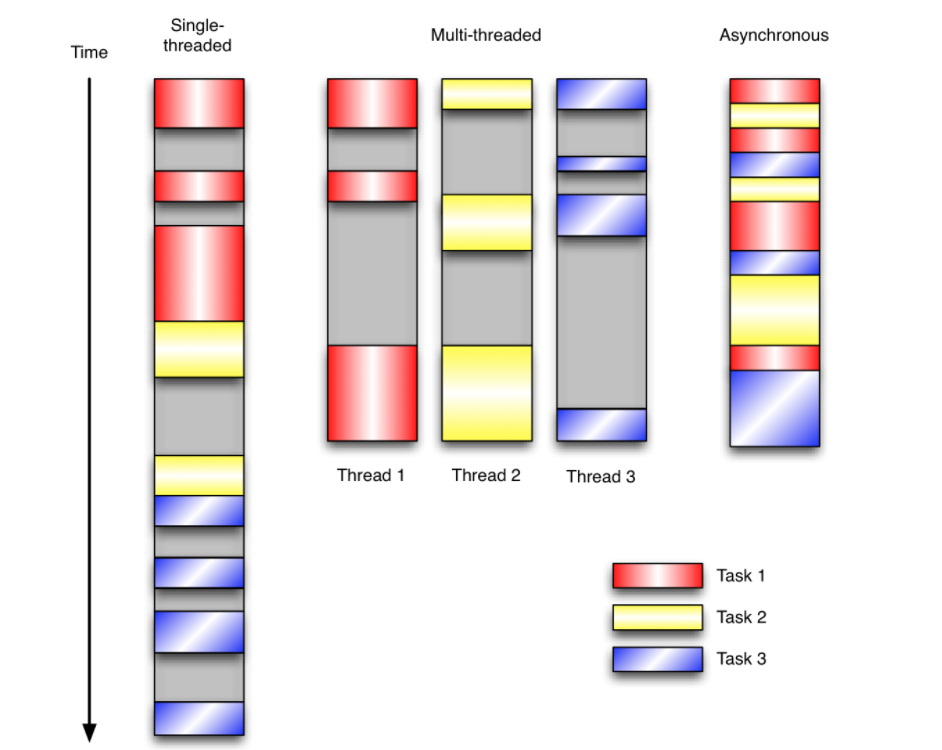
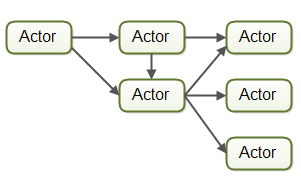
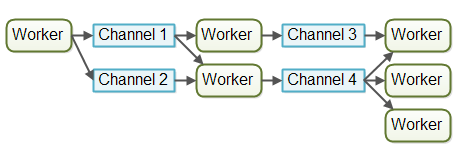

# 并发编程

## 1 并发概述

### 问题重述

1. 什么是并发，
2. 并发编程的应用场景。并发编程与网络编程的关系，并发编程与进程同步、进程通信、设备IO的关系，并发与并行的关系，并发与同步异步的关系
3. 并发编程的核心问题（并发机制、并发同步、并发通信）
4. 并发编程的具体实例（在各种系统和场景下的表现）

### 并发概念
并发和独占对应。

* 在程序设计的角度，希望通过某些机制让计算机可以在一个时间段内，执行多个任务。
* 一个或多个物理 CPU 在多个程序之间多路复用，提高对计算机资源的利用率。
* 任务数多余 CPU 的核数，通过操作系统的任务调度算法，实现多个任务一起执行。
* 有多个线程在执行，计算机只有一个 CPU，不可能真正同时运行多个线程，操作系统只能把 CPU 运行时间划分成若干个时间段，再将时间段分配给各个线程执行，在一个时间段的线程代码运行时，其它线程处于挂起状。

### 并发编程的三大特性

1. 可见性。可见性是指当一个线程修改了共享变量后，其他线程能够立即看见这个修改。
2. 原子性。原子性是指一个操作是不可中断的，要么全部执行成功要么全部执行失败。
3. 有序性。有序性是指程序指令按照预期的顺序执行而非乱序执行，乱序又分为编译器乱序和CPU执行乱序。

### 并发编程与其他领域的关系
* 并发编程与网络编程的关系
  * 并发编程主要是应用在**服务端**。并发编程与网络编程不通过。并发编程主要实现的是服务端如何满足大量并发的请求。而网络编程考虑的是客户端和服务器如何建立通信链接，和通信链接的过程和方式。
  * 网络编程更像是并发编程的一种应用场景。并发编程可以用在单机的任务处理、界面编程上，也可以用在网络编程上。这种理解看上去更合理。
* 并发编程与设备IO、进程同步、进程通信的关系
  * 是基于Linux的以上理论实现了并发的机制、并发的控制、并发的通信。分别对应设备IO、进程同步、进程通信。
* 并发与并行的关系
  * 并发是宏观上的，并行是微观上的同时运行。
* 并发与同步异步的关系
  * 与同步异步没有任何关系。但是并发的实现方案中，用到了同步思想和异步思想。
  * 关于这一个，可能就是造成一系列困惑的原因，网上众说纷纭。有观点认为，同步和异步都是并发的实现方式。有人认为，并发是异步的。真的恶心。可能这几个观念，从中文的角度，就是很那区分。
  * 同步异步是提交任务的方式，同步指同步提交，是串行的，一个任务结束另一个任务才能提交执行；异步指异步提交，多个任务可以并发运行

### 并发编程的体系结构
并发编程与进程同步、进程通信、设备IO有这直接关系。正在在这些理论的基础上实现了服务端的并发编程。

```plantuml
@startuml
object 进程同步
object 进程通信
object 设备IO
object 并发编程
object 网络编程
进程同步 --> 并发编程
进程通信 --> 并发编程
设备IO --> 并发编程
设备IO --> 网络编程

并发编程 --> 并发机制
并发编程 --> 并发控制_并发同步
并发编程 --> 并发通信

并发机制 --> 多进程
并发机制 --> 多线程
并发机制 --> 多协程
并发机制 --> 多路复用_事件驱动

并发控制_并发同步 --> 锁_信号量
并发控制_并发同步 --> MVVC

并发通信 --> 共享内存
并发通信 --> 消息队列IPC
并发通信 --> 管道通信
@enduml

```

### 并发编程中的核心问题

1. 并发机制。如何实现并发。这里简单概述一些常见的方案
   1. 多进程机制
   2. 多线程机制
   3. 多协程机制
   4. 单线程的IO多路复用（基于事件响应机制方案）
2. 并发控制。实现并发任务之间的同步方案，实现资源互斥、操作顺序，解决并发过程中上下文切换和线程不安全等问题。
   1. 锁与信号量
   2. MVVC多版本并发控制
3. 并发通信。并发任务之间的数据交换方案
   1. 共享内存
   2. 管道文件
   3. 消息队列
   4. Socket编程

### 并发编程的具体实例
> 针对每一个具体实例，在其相应的学习和开发模块中，都有对应是说明。这里就不再赘述了，有空的话学习Linux的并发编程和网络编程。C++并发编程

> 针对每个领域、每个系统、每个数据库、每个语言。都要解决并发编程的三个核心问题。包括并发机制、并发控制和并发通信问题。

1. Linux并发编程
2. MySQL的并发方案
3. Redis的并发方案
4. C++并发编程
5. Java并发编程
6. Python并发编程
7. Go并发编程

## 2 并发机制

> 这里所谓的什么机制、什么方法。都是设计模式的一部分。通过某种设计模式，实现并发编程：多线程进程并发、事件驱动模式等。

通常，我们写服务器处理模型的程序时，有以下几种模型：

1. 每收到一个请求，创建一个新的进程，来处理该请求；由于创建新的进程:实现比较简单，但开销比较大，导致服务器性能比较差。
2. 每收到一个请求，创建一个新的线程，来处理该请求；由于要涉及到线程的同步，有可能会面临死锁等问题。
3. 每收到一个请求，放入一个事件列表，让主进程通过非阻塞I/O方式来处理请求。在写应用程序代码时，逻辑比前面两种都复杂。

### 基于多进程、多线程、多协程的并发

基于子程序的并发思路：
1. 在服务器端使用多线程（或多进程）。多线程（或多进程）的目的是让每个连接都拥有独立的线程（或进程），这样任何一个连接的阻塞都不会影响其他的连接。
2. 开启多进程或都线程的方式，在遇到要同时响应成百上千路的连接请求，则无论多线程还是多进程都会严重占据系统资源，降低系统对外界响应效率，而且线程与进程本身也更容易进入假死状态。
3. 很多程序员可能会考虑使用“线程池”或“连接池”。“线程池”旨在减少创建和销毁线程的频率，其维持一定合理数量的线程，并让空闲的线程重新承担新的执行任务。“连接池”维持连接的缓存池，尽量重用已有的连接、减少创建和关闭连接的频率。这两种技术都可以很好的降低系统开销，都被广泛应用很多大型系统，如websphere、tomcat和各种数据库等。
4. “线程池”和“连接池”技术也只是在一定程度上缓解了频繁调用IO接口带来的资源占用。而且，所谓“池”始终有其上限，当请求大大超过上限时，“池”构成的系统对外界的响应并不比没有池的时候效果好多少。所以使用“池”必须考虑其面临的响应规模，并根据响应规模调整“池”的大小。
5. 对应上例中的所面临的可能同时出现的上千甚至上万次的客户端请求，“线程池”或“连接池”或许可以缓解部分压力，但是不能解决所有问题。总之，多线程模型可以方便高效的解决小规模的服务请求，但面对大规模的服务请求，多线程模型也会遇到瓶颈，可以用非阻塞接口来尝试解决这个问题。

**实例**
* 几乎每一种语言都有这种并发方案。java的thread、C++的thread、Python的thread、go的协程、MySQL数据库中的事务并发等。

### 基于IO多路复用、事件驱动IO的并发

基于事件驱动模型的并发思路：
1. 有一个事件（消息）队列；
2. 鼠标按下时，往这个队列中增加一个点击事件（消息）；
3. 有个循环，不断从队列取出事件，根据不同的事件，调用不同的函数，如onClick()、onKeyDown()等；
4. 事件（消息）一般都各自保存各自的处理函数指针，这样，每个消息都有独立的处理函数；

在事件驱动版本的程序中，3个任务交错执行，但仍然在一个单独的线程控制中。当处理I/O或者其他昂贵的操作时，注册一个回调到事件循环中，然后当I/O操作完成时继续执行。回调描述了该如何处理某个事件。事件循环轮询所有的事件，当事件到来时将它们分配给等待处理事件的回调函数。这种方式让程序尽可能的得以执行而不需要用到额外的线程。事件驱动型程序比多线程程序更容易推断出行为，因为程序员不需要关心线程安全问题。

采用流水线并发模型的系统有时候也称为反应器系统或事件驱动系统。系统内的工作者对系统内出现的事件做出反应，这些事件也有可能来自于外部世界或者发自其他工作者。事件可以是传入的HTTP请求，也可以是某个文件成功加载到内存中等。在写这篇文章的时候，已经有很多有趣的反应器/事件驱动平台可以使用了，并且不久的将来会有更多。

Actors 和 channels 是两种比较类似的事件驱动模型。

**Actor**

在Actor模型中每个工作者被称为actor。Actor之间可以直接异步地发送和处理消息。Actor可以被用来实现一个或多个像前文描述的那样的作业处理流水线。下图给出了Actor模型：

actor模型又可以分为reactor和Proactor两种模型。在IO设计模式的文章中有降到。

**channel**

而在Channel模型中，工作者之间不直接进行通信。相反，它们在不同的通道中发布自己的消息（事件）。其他工作者们可以在这些通道上监听消息，发送者无需知道谁在监听。下图给出了Channel模型：

channel模型对于我来说似乎更加灵活。一个工作者无需知道谁在后面的流水线上处理作业。只需知道作业（或消息等）需要转发给哪个通道。通道上的监听者可以随意订阅或者取消订阅，并不会影响向这个通道发送消息的工作者。这使得工作者之间具有松散的耦合。

**实例**
* UI编程都是事件驱动模型，如很多UI平台都会提供onClick()事件。java中的NIO、Python里的asyncIO、nodejs里的单线程并发、Redis数据库中的事件响应机制。

## 3 并发控制

> 不同语言中，锁、信号量、条件变量的实现方案不同。这里不再赘述。在每种语言和场景下单独说明。

### 锁与互斥

### 信号量与同步

### MVVC
在数据库中实现事务同步的方法

## 4 并发通信

> 每种语言单独说明。

### 共享内存

### 管道文件

### 消息队列

### Socket通信
