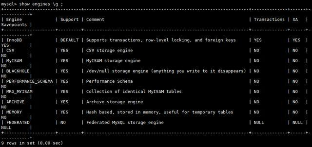
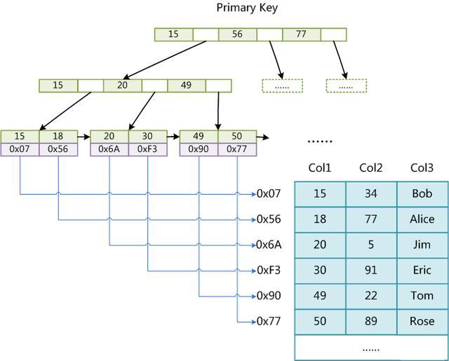

# MySQL存储引擎

## 1 概述
### 存储引擎

1. MySQL中的数据用各种不同的技术存储在文件(或者内存)中。这些技术中的每一种技术都使用不同的存储机制、索引技巧、锁定水平并且最终提供广泛的不同的功能和能力。通过选择不同的技术，你能够获得额外的速度或者功能，从而改善你的应用的整体功能。

2. 例如，如果你在研究大量的临时数据，你也许需要使用内存MySQL存储引擎。内存存储引擎能够在内存中存储所有的表格数据。又或者，你也许需要一个支持事务处理的数据库(以确保事务处理不成功时数据的回退能力)。
3. 这些不同的技术以及配套的相关功能在 MySQL中被称作存储引擎(也称作表类型)。 MySQL默认配置了许多不同的存储引擎，可以预先设置或者在MySQL服务器中启用。你可以选择适用于服务器、数据库和表格的存储引擎，以便在选择如何存储你的信息、如何检索这些信息以及你需要你的数据结合什么性能和功能的时候为你提供最大的灵活性。

### MySQL支持的存储引擎

### 存储引擎对比

| 功  能   | MYISAM | Memory | InnoDB | Archive |
|--------|--------|--------|--------|---------|
| 存储限制   | 256TB  | RAM    | 64TB   | None    |
| 支持事物   | No     | No     | Yes    | No      |
| 支持全文索引 | Yes    | No     | No     | No      |
| 支持数索引  | Yes    | Yes    | Yes    | No      |
| 支持哈希索引 | No     | Yes    | No     | No      |
| 支持数据缓存 | No     | N/A    | Yes    | No      |
| 支持外键   | No     | No     | Yes    | No      |

## 2.1 MyISAM

### 存储引擎的实现
使用这个存储引擎，每个MyISAM在磁盘上存储成三个文件。

1. frm文件：存储表的定义数据
2. MYD文件：存放表具体记录的数据
3. MYI文件：存储索引

frm和MYI可以存放在不同的目录下。MYI文件用来存储索引，但仅保存记录所在页的指针，索引的结构是B+树结构。下面这张图就是MYI文件保存的机制：

从这张图可以发现，这个存储引擎通过MYI的B+树结构来查找记录页，再根据记录页查找记录。并且支持全文索引、B树索引和数据压缩。

### 支持数据的类型

1. 静态固定长度表。这种方式的优点在于存储速度非常快，容易发生缓存，而且表发生损坏后也容易修复。缺点是占空间。这也是默认的存储格式。
2. 动态可变长表。优点是节省空间，但是一旦出错恢复起来比较麻烦。
3. 压缩表。上面说到支持数据压缩，说明肯定也支持这个格式。在数据文件发生错误时候，可以使用check table工具来检查，而且还可以使用repair table工具来恢复。

### 存储引擎的特点
有一个重要的特点那就是不支持事务，但是这也意味着他的存储速度更快，如果你的读写操作允许有错误数据的话，只是追求速度，可以选择这个存储引擎。

MyISAM存储引擎

MyISAM基于ISAM存储引擎，并对其进行扩展。它是在Web、数据仓储和其他应用环境下最常使用的存储引擎之一。MyISAM拥有较高的插入、查询速度，但不支持事物。MyISAM主要特性有：

1. 大文件（达到63位文件长度）在支持大文件的文件系统和操作系统上被支持

2. 当把删除和更新及插入操作混合使用的时候，动态尺寸的行产生更少碎片。这要通过合并相邻被删除的块，以及若下一个块被删除，就扩展到下一块自动完成

3. 每个MyISAM表最大索引数是64，这可以通过重新编译来改变。每个索引最大的列数是16

4. 最大的键长度是1000字节，这也可以通过编译来改变，对于键长度超过250字节的情况，一个超过1024字节的键将被用上

5. BLOB和TEXT列可以被索引

6. NULL被允许在索引的列中，这个值占每个键的0~1个字节

7. 所有数字键值以高字节优先被存储以允许一个更高的索引压缩

8. 每个MyISAM类型的表都有一个AUTO_INCREMENT的内部列，当INSERT和UPDATE操作的时候该列被更新，同时AUTO_INCREMENT列将被刷新。所以说，MyISAM类型表的AUTO_INCREMENT列更新比InnoDB类型的AUTO_INCREMENT更快

9. 可以把数据文件和索引文件放在不同目录

10. 每个字符列可以有不同的字符集

11. 有VARCHAR的表可以固定或动态记录长度

12. VARCHAR和CHAR列可以多达64KB

## 2.2 InnoDB

### 存储引擎的特点
InnoDB是默认的数据库存储引擎，他的主要特点有：
> 对于InnoDB来说，最大的特点在于支持事务。但是这是以损失效率来换取的。
1. 可以通过自动增长列，方法是auto_increment。
2. 支持事务。默认的事务隔离级别为可重复度，通过MVCC（并发版本控制）来实现的。
3. 使用的锁粒度为行级锁，可以支持更高的并发；
4. 支持外键约束；外键约束其实降低了表的查询速度，但是增加了表之间的耦合度。
5. 配合一些热备工具可以支持在线热备份；
6. 在InnoDB中存在着缓冲管理，通过缓冲池，将索引和数据全部缓存起来，加快查询的速度；
7. 对于InnoDB类型的表，其数据的物理组织形式是聚簇表。所有的数据按照主键来组织。数据和索引放在一块，都位于B+数的叶子节点上；

### 存储引擎的实现
当然InnoDB的存储表和索引也有下面两种形式：

1. 使用共享表空间存储：所有的表和索引存放在同一个表空间中。

2. 使用多表空间存储：表结构放在frm文件，数据和索引放在IBD文件中。分区表的话，每个分区对应单独的IBD文件，分区表的定义可以查看我的其他文章。使用分区表的好处在于提升查询效率。

### InnoDB索引和MyISAM索引的区别：

一是主索引的区别，InnoDB的数据文件本身就是索引文件。而MyISAM的索引和数据是分开的。

二是辅助索引的区别：InnoDB的辅助索引data域存储相应记录主键的值而不是地址。而MyISAM的辅助索引和主索引没有多大区别。
### 存储引擎的特点2

> InnoDB是事务型数据库的首选引擎，支持事务安全表（ACID），支持行锁定和外键，上图也看到了，InnoDB是默认的MySQL引擎。InnoDB主要特性有：

1. InnoDB给MySQL提供了具有提交、回滚和崩溃恢复能力的事物安全（ACID兼容）存储引擎。InnoDB锁定在行级并且也在SELECT语句中提供一个类似Oracle的非锁定读。这些功能增加了多用户部署和性能。在SQL查询中，可以自由地将InnoDB类型的表和其他MySQL的表类型混合起来，甚至在同一个查询中也可以混合

2. InnoDB是为处理巨大数据量的最大性能设计。它的CPU效率可能是任何其他基于磁盘的关系型数据库引擎锁不能匹敌的

3. InnoDB存储引擎完全与MySQL服务器整合，InnoDB存储引擎为在主内存中缓存数据和索引而维持它自己的缓冲池。InnoDB将它的表和索引在一个逻辑表空间中，表空间可以包含数个文件（或原始磁盘文件）。这与MyISAM表不同，比如在MyISAM表中每个表被存放在分离的文件中。InnoDB表可以是任何尺寸，即使在文件尺寸被限制为2GB的操作系统上

4. InnoDB支持外键完整性约束，存储表中的数据时，每张表的存储都按主键顺序存放，如果没有显示在表定义时指定主键，InnoDB会为每一行生成一个6字节的ROWID，并以此作为主键

5. InnoDB被用在众多需要高性能的大型数据库站点上。InnoDB不创建目录，使用InnoDB时，MySQL将在MySQL数据目录下创建一个名为ibdata1的10MB大小的自动扩展数据文件，以及两个名为ib_logfile0和ib_logfile1的5MB大小的日志文件

## 2.3 Memory

### 存储引擎的实现
将数据存在内存，为了提高数据的访问速度，每一个表实际上和一个磁盘文件关联。文件是frm。

1. 支持的数据类型有限制，比如：不支持TEXT和BLOB类型，对于字符串类型的数据，只支持固定长度的行，VARCHAR会被自动存储为CHAR类型；
2. 支持的锁粒度为表级锁。所以，在访问量比较大时，表级锁会成为MEMORY存储引擎的瓶颈；
3. 由于数据是存放在内存中，一旦服务器出现故障，数据都会丢失；
4. 查询的时候，如果有用到临时表，而且临时表中有BLOB，TEXT类型的字段，那么这个临时表就会转化为MyISAM类型的表，性能会急剧降低；
5. 默认使用hash索引。
6. 如果一个内部表很大，会转化为磁盘表。

### 存储引擎的特点

MEMORY存储引擎将表中的数据存储到内存中，未查询和引用其他表数据提供快速访问。MEMORY主要特性有：

1. MEMORY表的每个表可以有多达32个索引，每个索引16列，以及500字节的最大键长度

2. MEMORY存储引擎执行HASH和BTREE缩影

3. 可以在一个MEMORY表中有非唯一键值

4. MEMORY表使用一个固定的记录长度格式

5. MEMORY不支持BLOB或TEXT列

6. MEMORY支持AUTO_INCREMENT列和对可包含NULL值的列的索引

7. MEMORY表在所由客户端之间共享（就像其他任何非TEMPORARY表）

8. MEMORY表内存被存储在内存中，内存是MEMORY表和服务器在查询处理时的空闲中，创建的内部表共享

9. 当不再需要MEMORY表的内容时，要释放被MEMORY表使用的内存，应该执行DELETE FROM或TRUNCATE TABLE，或者删除整个表（使用DROP TABLE）

## 2.4 MERGE

1. MERGE存储引擎是一组MyISAM表的组合，这些MyISAM表结构必须完全相同，尽管其使用不如其它引擎突出，但是在某些情况下非常有用。说白了，Merge表就是几个相同MyISAM表的聚合器；Merge表中并没有数据，对Merge类型的表可以进行查询、更新、删除操作，这些操作实际上是对内部的MyISAM表进行操作。Merge存储引擎的使用场景。

2. 对于服务器日志这种信息，一般常用的存储策略是将数据分成很多表，每个名称与特定的时间端相关。例如：可以用12个相同的表来存储服务器日志数据，每个表用对应各个月份的名字来命名。当有必要基于所有12个日志表的数据来生成报表，这意味着需要编写并更新多表查询，以反映这些表中的信息。与其编写这些可能出现错误的查询，不如将这些表合并起来使用一条查询，之后再删除Merge表，而不影响原来的数据，删除Merge表只是删除Merge表的定义，对内部的表没有任何影响。

## 2.5 ARCHIVE

1. Archive是归档的意思，在归档之后很多的高级功能就不再支持了，仅仅支持最基本的插入和查询两种功能。在MySQL 5.5版以前，Archive是不支持索引，但是在MySQL 5.5以后的版本中就开始支持索引了。Archive拥有很好的压缩机制，它使用zlib压缩库，在记录被请求时会实时压缩，所以它经常被用来当做仓库使用。