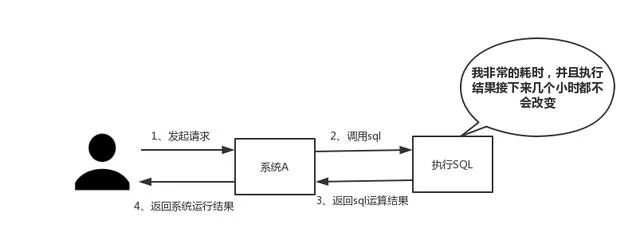
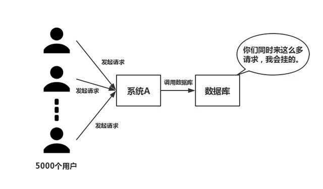

https://zhuanlan.zhihu.com/p/65180667

我们在碰到需要执行耗时特别久，且结果不频繁变动的 SQL，就特别适合将运行结果放入缓存。这样，后面的请求就去缓存中读取，使得请求能够迅速响应。

在大并发的情况下，所有的请求直接访问数据库，数据库会出现连接异常。这个时候，就需要使用 Redis 做一个缓冲操作，让请求先访问到 Redis，而不是直接访问数据库。

1. 使用Redis有哪些好处？

(1) 速度快，因为数据存在内存中，类似于HashMap，HashMap的优势就是查找和操作的时间复杂度都是O(1)
(2) 支持丰富数据类型，支持string，list，set，sorted set，hash
(3) 支持事务，操作都是原子性，所谓的原子性就是对数据的更改要么全部执行，要么全部不执行(4) 丰富的特性：可用于缓存，消息，按key设置过期时间，过期后将会自动删除

2. redis相比memcached有哪些优势？

(1) memcached所有的值均是简单的字符串，redis作为其替代者，支持更为丰富的数据类型
(2) redis的速度比memcached快很多
(3) redis可以持久化其数据
3.redis常见性能问题和解决方案：

(1) Master最好不要做任何持久化工作，如RDB内存快照和AOF日志文件
(2) 如果数据比较重要，某个Slave开启AOF备份数据，策略设置为每秒同步一次
(3) 为了主从复制的速度和连接的稳定性，Master和Slave最好在同一个局域网内
(4) 尽量避免在压力很大的主库上增加从库
(5) 主从复制不要用图状结构，用单向链表结构更为稳定，即：Master <- Slave1 <- Slave2 <- Slave3...

4. MySQL里有2000w数据，redis中只存20w的数据，如何保证redis中的数据都是热点数据
相关知识：redis 内存数据集大小上升到一定大小的时候，就会施行数据淘汰策略。

redis 提供 6种数据淘汰策略：

voltile-lru：从已设置过期时间的数据集（server.db[i].expires）中挑选最近最少使用的数据淘汰
volatile-ttl：从已设置过期时间的数据集（server.db[i].expires）中挑选将要过期的数据淘汰
volatile-random：从已设置过期时间的数据集（server.db[i].expires）中任意选择数据淘汰
allkeys-lru：从数据集（server.db[i].dict）中挑选最近最少使用的数据淘汰
allkeys-random：从数据集（server.db[i].dict）中任意选择数据淘汰
no-enviction（驱逐）：禁止驱逐数据

6. Redis 常见的性能问题都有哪些？如何解决？

1).Master写内存快照，save命令调度rdbSave函数，会阻塞主线程的工作，当快照比较大时对性能影响是非常大的，会间断性暂停服务，所以Master最好不要写内存快照。
2).Master AOF持久化，如果不重写AOF文件，这个持久化方式对性能的影响是最小的，但是AOF文件会不断增大，AOF文件过大会影响Master重启的恢复速度。Master最好不要做任何持久化工作，包括内存快照和AOF日志文件，特别是不要启用内存快照做持久化,如果数据比较关键，某个Slave开启AOF备份数据，策略为每秒同步一次。
3).Master调用BGREWRITEAOF重写AOF文件，AOF在重写的时候会占大量的CPU和内存资源，导致服务load过高，出现短暂服务暂停现象。
4). Redis主从复制的性能问题，为了主从复制的速度和连接的稳定性，Slave和Master最好在同一个局域网内
7, redis 最适合的场景

Redis最适合所有数据in-momory的场景，虽然Redis也提供持久化功能，但实际更多的是一个disk-backed的功能，跟传统意义上的持久化有比较大的差别，那么可能大家就会有疑问，似乎Redis更像一个加强版的Memcached，那么何时使用Memcached,何时使用Redis呢?

如果简单地比较Redis与Memcached的区别，大多数都会得到以下观点：

1 、Redis不仅仅支持简单的k/v类型的数据，同时还提供list，set，zset，hash等数据结构的存储。
2 、Redis支持数据的备份，即master-slave模式的数据备份。
3 、Redis支持数据的持久化，可以将内存中的数据保持在磁盘中，重启的时候可以再次加载进行使用。
（1）、会话缓存（Session Cache）

最常用的一种使用Redis的情景是会话缓存（session cache）。用Redis缓存会话比其他存储（如Memcached）的优势在于：Redis提供持久化。当维护一个不是严格要求一致性的缓存时，如果用户的购物车信息全部丢失，大部分人都会不高兴的，现在，他们还会这样吗？

幸运的是，随着 Redis 这些年的改进，很容易找到怎么恰当的使用Redis来缓存会话的文档。甚至广为人知的商业平台Magento也提供Redis的插件。

（2）、全页缓存（FPC）

除基本的会话token之外，Redis还提供很简便的FPC平台。回到一致性问题，即使重启了Redis实例，因为有磁盘的持久化，用户也不会看到页面加载速度的下降，这是一个极大改进，类似PHP本地FPC。

再次以Magento为例，Magento提供一个插件来使用Redis作为全页缓存后端。

此外，对WordPress的用户来说，Pantheon有一个非常好的插件 wp-redis，这个插件能帮助你以最快速度加载你曾浏览过的页面。

（3）、队列

Reids在内存存储引擎领域的一大优点是提供 list 和 set 操作，这使得Redis能作为一个很好的消息队列平台来使用。Redis作为队列使用的操作，就类似于本地程序语言（如Python）对 list 的 push/pop 操作。

如果你快速的在Google中搜索“Redis queues”，你马上就能找到大量的开源项目，这些项目的目的就是利用Redis创建非常好的后端工具，以满足各种队列需求。例如，Celery有一个后台就是使用Redis作为broker，你可以从这里去查看。

（4）、排行榜/计数器

Redis在内存中对数字进行递增或递减的操作实现的非常好。集合（Set）和有序集合（Sorted Set）也使得我们在执行这些操作的时候变的非常简单，Redis只是正好提供了这两种数据结构。所以，我们要从排序集合中获取到排名最靠前的10个用户–我们称之为“user_scores”，我们只需要像下面一样执行即可：

当然，这是假定你是根据你用户的分数做递增的排序。如果你想返回用户及用户的分数，你需要这样执行：

ZRANGE user_scores 0 10 WITHSCORES

Agora Games就是一个很好的例子，用Ruby实现的，它的排行榜就是使用Redis来存储数据的，你可以在这里看到。

（5）、发布/订阅

最后（但肯定不是最不重要的）是Redis的发布/订阅功能。发布/订阅的使用场景确实非常多。我已看见人们在社交网络连接中使用，还可作为基于发布/订阅的脚本触发器，甚至用Redis的发布/订阅功能来建立聊天系统！（不，这是真的，你可以去核实）。

Redis提供的所有特性中，我感觉这个是喜欢的人最少的一个，虽然它为用户提供如果此多功能。

7.4、缓存预热

缓存预热就是系统上线后，将相关的缓存数据直接加载到缓存系统。这样就可以避免在用户请求的时候，先查询数据库，然后再将数据缓存的问题！用户直接查询事先被预热的缓存数据！

解决方法：
1、直接写个缓存刷新页面，上线时手工操作下
2、数据量不大，可以在项目启动的时候自动进行加载
3、定时刷新缓存

 

7.5、缓存降级
当访问量剧增、服务出现问题（如响应时间慢或不响应）或非核心服务影响到核心流程的性能时，仍然需要保证服务还是可用的，即使是有损服务。系统可以根据一些关键数据进行自动降级，也可以配置开关实现人工降级。

降级的最终目的是保证核心服务可用，即使是有损的。而且有些服务是无法降级的（如加入购物车、结算）。

在进行降级之前要对系统进行梳理，看看系统是不是可以丢卒保帅；从而梳理出哪些必须誓死保护，哪些可降级

 

 

8、Redis 常见性能问题和解决方案？
(1) Master 最好不要做任何持久化工作，如 RDB 内存快照和 AOF 日志文件
(2) 如果数据比较重要，某个 Slave 开启 AOF 备份数据，策略设置为每秒同步一次
(3) 为了主从复制的速度和连接的稳定性， Master 和 Slave 最好在同一个局域网内
(4) 尽量避免在压力很大的主库上增加从库
(5) 主从复制不要用图状结构，用单向链表结构更为稳定，即： Master <- Slave1 <- Slave2 <-Slave3…

 

9、为什么Redis的操作是原子性的，怎么保证原子性的？
对于Redis而言，命令的原子性指的是：一个操作的不可以再分，操作要么执行，要么不执行。
Redis的操作之所以是原子性的，是因为Redis是单线程的。
Redis本身提供的所有API（单个命令）都是原子操作，Redis中的事务其实是要保证批量操作的原子性。

多个命令在并发中也是原子性的吗？
不一定， 举例：1、将get和set改成单命令操作；2、incr

如何解决：使用Redis的事务，或者使用Redis+Lua的方式实现
————————————————
版权声明：本文为CSDN博主「波波的小书房」的原创文章，遵循CC 4.0 BY-SA版权协议，转载请附上原文出处链接及本声明。
原文链接：https://blog.csdn.net/xl_1803/article/details/107901645