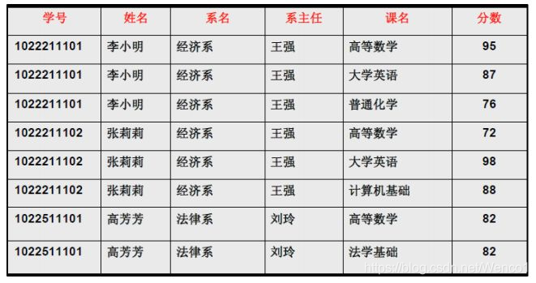

# 1 规范化

## 1 函数依赖

记 A-\>B 表示 A 函数决定 B，也可以说 B 函数依赖于 A。

如果 {A1，A2，... ，An} 是关系的一个或多个属性的集合，该集合函数决定了关系的其它所有属性并且是最小的，那么该集合就称为**键码**。

### 部分函数依赖
* 设X,Y是关系R的两个属性集合，存在X→Y，若X’是X的真子集，存在X’→Y，则称Y部分函数依赖于X。

* 举个例子：学生基本信息表R中（学号，身份证号，姓名）当然学号属性取值是唯一的，在R关系中，（学号，身份证号）->（姓名），（学号）->（姓名），（身份证号）->（姓名）；所以姓名部分函数依赖与（学号，身份证号）；

### 完全函数依赖

* 设X,Y是关系R的两个属性集合，X’是X的真子集，存在X→Y，但对每一个X’都有X’!→Y，则称Y完全函数依赖于X。
* 例子：学生基本信息表R（学号，班级，姓名）假设不同的班级学号有相同的，班级内学号不能相同，在R关系中，（学号，班级）->（姓名），但是（学号）->(姓名)不成立，（班级）->(姓名)不成立，所以姓名完全函数依赖与（学号，班级）；

### 传递函数依赖

* 设X,Y,Z是关系R中互不相同的属性集合，存在X→Y(Y !→X),Y→Z，则称Z传递函数依赖于X。
* 例子：在关系R(学号 ,宿舍, 费用)中，(学号)->(宿舍),宿舍！=学号，(宿舍)->(费用),费用!=宿舍，所以符合传递函数的要求；

## 2 异常

以下的学生课程关系的函数依赖为 {Sno, Cname} -\> {Sname, Sdept, Mname, Grade}，键码为 {Sno, Cname}。也就是说，确定学生和课程之后，就能确定其它信息。

| Sno | Sname | Sdept | Mname | Cname | Grade |
| :---: | :---: | :---: | :---: | :---: |:---:|
| 1 | 学生-1 | 学院-1 | 院长-1 | 课程-1 | 90 |
| 2 | 学生-2 | 学院-2 | 院长-2 | 课程-2 | 80 |
| 2 | 学生-2 | 学院-2 | 院长-2 | 课程-1 | 100 |
| 3 | 学生-3 | 学院-2 | 院长-2 | 课程-2 | 95 |



不符合范式的关系，会产生很多异常，主要有以下四种异常：

- 冗余数据：例如 `学生-2` 出现了两次。
- 修改异常：修改了一个记录中的信息，但是另一个记录中相同的信息却没有被修改。
- 删除异常：删除一个信息，那么也会丢失其它信息。例如删除了 `课程-1` 需要删除第一行和第三行，那么 `学生-1` 的信息就会丢失。
- 插入异常：例如想要插入一个学生的信息，如果这个学生还没选课，那么就无法插入。

## 3 范式

范式理论是为了解决以上提到四种异常。

高级别范式的依赖于低级别的范式，1NF 是最低级别的范式。

### 1. 第一范式 (1NF)

属性不可分。

* 下图不符合第一范式
  
* 符合第一范式的属性
  

### 2. 第二范式 (2NF)

每个非主属性完全函数依赖于键码。

> **分解前** 

| Sno | Sname | Sdept | Mname | Cname | Grade |
| :---: | :---: | :---: | :---: | :---: |:---:|
| 1 | 学生-1 | 学院-1 | 院长-1 | 课程-1 | 90 |
| 2 | 学生-2 | 学院-2 | 院长-2 | 课程-2 | 80 |
| 2 | 学生-2 | 学院-2 | 院长-2 | 课程-1 | 100 |
| 3 | 学生-3 | 学院-2 | 院长-2 | 课程-2 | 95 |

以上学生课程关系中，{Sno, Cname} 为键码，有如下函数依赖：
```
Sno -> Sname, Sdept
Sdept -> Mname
Sno, Cname-> Grade
```
* Grade 完全函数依赖于键码{Sno,Cname}，它没有任何冗余数据，每个学生的每门课都有特定的成绩。
* Sname, Sdept 和 Mname 都部分依赖于键码{Sno,Cname}，当一个学生选修了多门课时，这些数据就会出现多次，造成大量冗余数据。

> **分解后**

关系-1

| Sno | Sname | Sdept | Mname |
| :---: | :---: | :---: | :---: |
| 1 | 学生-1 | 学院-1 | 院长-1 |
| 2 | 学生-2 | 学院-2 | 院长-2 |
| 3 | 学生-3 | 学院-2 | 院长-2 |

有以下函数依赖：

- Sno -\> Sname, Sdept
- Sdept -\> Mname

关系-2

| Sno | Cname | Grade |
| :---: | :---: |:---:|
| 1 | 课程-1 | 90 |
| 2 | 课程-2 | 80 |
| 2 | 课程-1 | 100 |
| 3 | 课程-2 | 95 |

有以下函数依赖：

- Sno, Cname -\>  Grade

### 3. 第三范式 (3NF)

非主属性不传递函数依赖于键码。

上面的 关系-1 中存在以下传递函数依赖：
```
Sno -> Sdept -> Mname
```

> 可以进行以下分解：

关系-11

| Sno | Sname | Sdept |
| :---: | :---: | :---: |
| 1 | 学生-1 | 学院-1 |
| 2 | 学生-2 | 学院-2 |
| 3 | 学生-3 | 学院-2 |

关系-12

| Sdept | Mname |
| :---: | :---: |
| 学院-1 | 院长-1 |
| 学院-2 | 院长-2 |

### BCNF巴斯德范式

巴斯-科德范式即在满足第三范式（3NF）基础上，任何非主属性不能对主键子集依赖（即在3NF基础上，消除主属性对候选码的部分函数依赖和传递函数依赖）。
BC范式既检查非主属性，又检查主属性。当只检查非主属性时，就成了第三范式。满足BC范式的关系都必然满足第三范式。或者还可以换一种说法：若一个关系达到了第三范式，并且它只有一个候选码，或者它的每个候选码都是单属性，则该关系自然达到BC范式。
一般来说，一个数据库设计符合3NF或BCNF就可以了。

### 第4范式（4NF）

* 多值依赖的概念:多值依赖即属性之间的一对多关系，记为K→→A。函数依赖事实上是单值依赖，所以不能表达属性值之间的一对多关系。
  * 平凡的多值依赖：全集U=K+A，一个K可以对应于多个A，即K→→A。此时整个表就是一组一对多关系。
  * 非平凡的多值依赖：全集U=K+A+B，一个K可以对应于多个A，也可以对应于多个B，A与B互相独立，即K→→A，K→→B。整个表有多组一对多关系，且有：“一”部分是相同的属性集合，“多”部分是互相独立的属性集合。

第四范式即在满足巴斯-科德范式（BCNF）的基础上，消除非平凡且非函数依赖的多值依赖(**即把同一表内的多对多关系删除**)。
### 总结

* 1NF： 字段是最小的的单元不可再分
* 2NF：满足1NF,表中的字段必须完全依赖于全部主键而非部分主键 (一般我们都会做到)
* 3NF：满足2NF,非主键外的所有字段必须互不依赖
* 4NF：满足3NF,消除表中的多值依赖