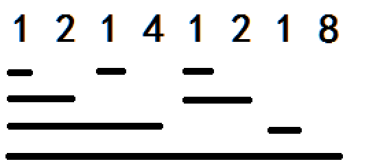
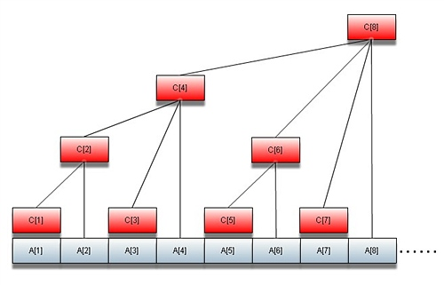

# 树状数组Binary Tree Array


## 1 概念


### lowbit运算
$$
lowbit(x) = x \& ((\sim x)+1)
$$
* 作用：二进制表示中，保留最后的`1`。如`x=10100100`,`lowbit(x)=00000100`

### 树状数组

* 根据lowbit的运算规则构建树状数组。
* 其中数组A第i个位置的值**管理区间**[i-lowbit(i)+1,i]。即去掉二进制最后一位后到当前位置的的区间。

$$
A[i] = \sum_{k=i-lowbit(i)+1}^i A[k]
$$

* 其中数组A第i个位置的值的**被管节点**。即找到所有的之后的$2^i$的点，也包括非$2^i$的点。

$$
i = i + lowbit(i) ,i<max(i)
$$


### 本质理解


* 怎么看每个原始数组的数字管理多少？只要顺着原始数组的数字往下画竖线，碰到的第一根横线所覆盖的范围就是它能管理的范围。
* 怎么看每个原始数组的数字被谁管理？顺着原始数组的数字往下画竖线，碰到的第一根横线之后的所有横先，都是管理该数字的树状数组值。

* 在构建的**树状数组中**$2^i$管理之前所有位置的**原始数组**。即前i项和。
* 通过lowbit()运算，构建的树状数组，本质上是一种**辅助数组**。




## 2 性质

* 任何一个数字管理

$$
(i-lowbit(i),i]
$$
* 任何一个数字被管理

$$
[i,i+lowbit(i)],进行迭代i=i+lowbit(i)
$$

## 3 应用

### 把位置x的元素都加k

* 我们每次执行操作A（把位置x的值+k），只需要把"能管理到x的所有位置"都+k就行
    1. A[i]+k
    2. i=i+lowbit(i)
    3. 重复以上步骤，直到i>max截止

### 求前缀区间的值

> 所有lowbit()对应的值相加。

* 那么对于任意的x，sum(1,x)怎么求呢？我们把最终得到的答案存在ans变量中，执行下面的操作:
  1. sum=0
  2. sum += A[i]
  3. i = i-lowbit(i)
  4. 重复2-3步骤，直到i<0截止


### 求区间的值

* 询问区间[L,R]的和sum(L,R)。我们只需要求出sum(1,R)和sum(1,L-1),然后sum(1,R)-sum(1,L-1)就是sum(L,R).
$$
sum(L,R)=sum(1,R)-sum(1,L)
$$

## 实例1 基本运算

```C++
//求最小幂2^k:
int Lowbit(int t)
{
    return t & ( t ^ ( t - 1 ) );
}

//求前n项和：
int Sum(int end)
{
    int sum = 0;
    while(end > 0)
    {
        sum += in[end];
        end -= Lowbit(end);
    }
    return sum;
}

//对某个元素进行加法操作
void plus(int pos , int num)
{
    while(pos <= n)
    {
          in[pos] += num;
          pos += Lowbit(pos);
    }
}
```

## 实例2 逆序对
